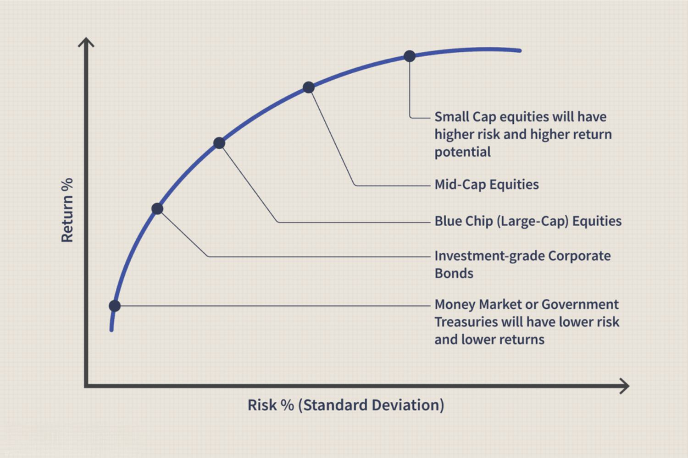

## Table of Contents

## What is a dividend?

A dividend is money that a company pays to its shareholders. It's like a reward for owning part of the company. When a company makes a profit, it can choose to share some of that profit with its shareholders instead of keeping it all for the company.

Dividends are usually paid regularly, like every three months or once a year. The amount you get depends on how many shares you own. If you own more shares, you get more money. Companies that pay dividends often do so because they want to attract investors and show that they are doing well financially.

## What is a stock buyback?

A stock buyback is when a company buys its own shares from the stock market. It's like the company is taking some of its money and using it to buy back pieces of itself. When a company does this, it reduces the number of shares that are available to the public. This can make the remaining shares more valuable because there are fewer of them.

Companies might choose to do a stock buyback for a few reasons. One reason is to show that they believe their stock is a good investment. By buying back their own shares, they're saying they think the stock is worth more than what it's currently selling for. Another reason is to return money to shareholders without paying dividends. When a company buys back its shares, it can increase the value of the shares that investors still own, which is another way of giving money back to them.

## How do dividends work?

Dividends are payments that companies give to people who own their stocks. When a company makes money, it can decide to share some of that money with its shareholders. This sharing happens regularly, like every few months or once a year. The amount of money you get depends on how many shares you own. If you own more shares, you get more money.

To get a dividend, you need to own the stock before a certain date, called the ex-dividend date. If you buy the stock on or after this date, you won't get the next dividend payment. When the company decides to pay a dividend, it announces how much it will be and when it will be paid. Then, the money is sent to the shareholders, usually by depositing it into their brokerage accounts. This way, shareholders get a piece of the company's profits without selling their stocks.

## How do stock buybacks work?

A stock buyback happens when a company uses its money to buy its own shares from the stock market. It's like the company is investing in itself by buying back pieces of its own business. When a company does this, it takes those shares out of the market, so there are fewer shares available for people to buy. This can make the remaining shares more valuable because there are less of them to go around.

Companies might choose to do a stock buyback for a few reasons. One reason is to show that they believe their stock is a good investment. By buying back their own shares, they're telling everyone that they think their stock is worth more than what it's currently selling for. Another reason is to give money back to shareholders without paying dividends. When a company buys back its shares, it can increase the value of the shares that investors still own, which is another way of returning money to them.

## What are the tax implications of dividends versus buybacks?

When you get dividends from a company, you have to pay taxes on them. The tax rate depends on how much money you make and how long you've owned the stock. If you've owned the stock for a long time, the tax rate might be lower. But no matter what, you have to report the dividends on your taxes and pay what you owe. This is different from your regular income tax, so it's good to know the rules.

On the other hand, stock buybacks don't give you money directly, so you don't have to pay taxes right away. If the buyback makes your shares worth more and you sell them later, you might have to pay capital gains tax. This tax is usually lower than the tax on dividends, especially if you've held the stock for over a year. But you only pay this tax when you sell the stock, not when the company buys back its shares. So, buybacks can be a way for companies to return money to shareholders without them having to pay taxes immediately.

## How do dividends affect a company's stock price?

When a company pays dividends, it can affect the stock price in a few ways. One way is that the stock price might go down a little bit right after the dividend is paid. This happens because the company is giving money to its shareholders, so the company has less money overall. But this drop is usually small, and it's often already expected by people who trade stocks.

On the other hand, dividends can also make the stock price go up over time. When a company pays dividends regularly, it shows that the company is doing well and making money. This can make more people want to buy the stock, which can push the price up. Investors often see a company that pays steady dividends as a good investment, so they might be willing to pay more for the stock.

## How do buybacks affect a company's stock price?

When a company does a stock buyback, it usually makes the stock price go up. This happens because the company is buying its own shares from the market, which means there are fewer shares left for people to buy. When there are fewer shares, the price of each share can go up because more people want to buy them than there are shares available. Also, when a company buys back its own stock, it's telling everyone that it thinks its stock is a good investment, which can make more people want to buy it too.

But buybacks can also have other effects on the stock price. If the company spends a lot of money on buybacks and then doesn't have enough money left to grow or run its business well, the stock price might go down later. So, while buybacks can make the stock price go up in the short term, it's important for the company to use its money wisely so that the stock price stays high over time.

## What are the advantages of dividends for investors?

Dividends give investors a regular income without having to sell their stocks. When you own a stock that pays dividends, you get money every few months or once a year. This can be really helpful if you need money to live on, like if you're retired. It's like getting paid for owning the stock, and you can use that money for anything you want.

Dividends also show that a company is doing well. If a company can pay dividends regularly, it means they are making money and want to share it with their shareholders. This can make investors feel more confident about the company, and they might want to keep their stocks or even buy more. Over time, this can make the stock price go up, which is good for investors because their stocks become worth more money.

## What are the advantages of buybacks for investors?

When a company does a stock buyback, it can be good for investors because it often makes the stock price go up. This happens because the company is buying back its own shares, which means there are fewer shares left for people to buy. When there are fewer shares, the price of each share can go up because more people want to buy them than there are shares available. This can make the stocks that investors already own worth more money, which is a good thing.

Also, buybacks can be a sign that the company thinks its stock is a good investment. When a company buys back its own stock, it's telling everyone that they believe their stock is worth more than what it's currently selling for. This can make investors feel more confident about the company and might encourage them to keep their stocks or even buy more. So, buybacks can be a way for companies to show they believe in themselves and their future, which can be reassuring for investors.

## How do companies decide between issuing dividends or buying back shares?

Companies decide between issuing dividends and buying back shares based on their financial goals and the needs of their shareholders. If a company has a lot of cash and wants to share it with shareholders, they might choose to pay dividends. This is good for investors who want a regular income from their stocks without selling them. Dividends can also make the company look stable and financially healthy, which might attract more investors.

On the other hand, if a company thinks its stock is undervalued or wants to increase the value of its shares, it might choose to buy back its own shares. Buybacks can make the stock price go up because there are fewer shares for people to buy. This can be good for investors who want their stocks to be worth more money over time. Companies might also choose buybacks if they want to give money back to shareholders without them having to pay taxes right away, since taxes on stock price increases are usually paid later when the stocks are sold.

Sometimes, a company might use a mix of both dividends and buybacks. This can help them meet different needs of their shareholders. Some investors might like the regular income from dividends, while others might prefer the potential for higher stock prices from buybacks. By using both strategies, a company can keep different types of investors happy and show that it's committed to returning value to them in various ways.

## What impact do dividends and buybacks have on a company's financial health?

When a company pays dividends, it gives money to its shareholders, which can make the company have less cash on hand. This means the company has less money to use for growing its business or paying off debts. If a company pays out too much in dividends, it might not have enough money left to invest in new projects or handle unexpected problems. But if a company can afford to pay dividends and still have enough money for its other needs, it can show that the company is financially healthy and doing well.

When a company buys back its own shares, it uses its cash to buy those shares from the market. This can also reduce the amount of cash the company has, just like dividends. But buybacks can make the stock price go up, which might make the company look more valuable. If a company uses too much money on buybacks and doesn't have enough left for other important things, it could hurt the company's financial health in the long run. But if the company can balance buybacks with its other financial needs, it can be a good way to use extra cash and make shareholders happy.

## Can you provide case studies of companies that have used dividends and buybacks effectively?

One company that has used dividends effectively is Coca-Cola. Coca-Cola has been paying dividends for a long time and has even increased them every year for over 50 years. This shows that Coca-Cola is a stable company that makes a lot of money. Investors like this because they know they will get a regular income from their stocks. Coca-Cola's steady dividends have helped make its stock a popular choice for people who want to invest in a company that will give them money over time without having to sell their stocks.

Another company that has used buybacks effectively is Apple. Apple has spent a lot of money buying back its own shares. This has helped make Apple's stock price go up because there are fewer shares for people to buy. Apple believes its stock is a good investment, and by buying back shares, it shows that to everyone. This has made investors feel more confident about Apple, and many of them have kept their stocks or even bought more. Apple's buybacks have been a big part of why its stock has done so well over the years.

## What is Understanding Stock Repurchase and Share Buyback?

Stock repurchase, commonly referred to as share buyback, is a strategic action undertaken by a corporation where it re-acquires its own shares from the open market. This process leads to a reduction in the total number of outstanding shares, which can potentially increase the value of the remaining shares. The reduction in outstanding shares often results in an increased Earnings Per Share (EPS), as EPS is calculated by dividing net income by the number of outstanding shares. Mathematically, this can be represented as:

$$
\text{EPS} = \frac{\text{Net Income}}{\text{Outstanding Shares}}
$$

By decreasing the denominator, the EPS value increases, assuming net income remains constant, thereby potentially enhancing financial performance indicators and investor appeal.

Stock buybacks differ from dividends in both financial efficiency and tax implications. Dividends are cash disbursements to shareholders, which are generally subject to income tax. On the other hand, buybacks offer a tax-efficient way of returning funds to shareholders, as the capital gains tax incurred on the sale of shares at a profit is typically less than the income tax on dividends. This makes buybacks an attractive option for corporations looking to manage excess cash reserves while mindful of shareholder tax liabilities.

Major corporations like Apple and Microsoft have frequently utilized share buybacks as part of their financial strategies. For instance, Apple has spent significant sums on repurchasing its shares over the past years, which has contributed to its rising stock price and the enhancement of shareholder value. Microsoft has similarly leveraged stock buybacks, supporting its financial stability and signaling confidence in its market valuation.

Buybacks are often interpreted by the market as a signal from management indicating that they perceive the company's stock as undervalued. This perception can lead to a positive re-evaluation by investors, potentially increasing the company's stock price. Additionally, buybacks can improve financial ratios like the Price-to-Earnings (P/E) ratio, presenting a more favorable picture of the company's financial health. 

In conclusion, stock repurchase strategies offer companies an alternative means of distributing capital to shareholders while potentially boosting stock performance and financial metrics. These strategies, when aligned with an organization’s overall financial goals and market conditions, can provide significant benefits to both the company and its investors.

## References & Further Reading

[1]: Friedman, M. (1970). ["The Social Responsibility Of Business Is to Increase Its Profits."](https://www.nytimes.com/1970/09/13/archives/a-friedman-doctrine-the-social-responsibility-of-business-is-to.html) The New York Times.

[2]: Grullon, G., & Michaely, R. (2002). ["Dividends, Share Repurchases, and the Substitution Hypothesis."](https://www.jstor.org/stable/3094520) The Journal of Finance, 57(4), 1649–1684.

[3]: Jagannathan, M., Stephens, C. P., & Weisbach, M. S. (2000). ["Financial Flexibility and the Choice between Dividends and Stock Repurchases."](https://www.sciencedirect.com/science/article/pii/S0304405X00000611) Journal of Financial Economics, 57(3), 355-384.

[4]: Mitchell, D., & Pearl, D. (2020). ["Algorithmic Trading: Pros and Cons."](https://www.taylorfrancis.com/books/mono/10.4324/9780429401923/really-works-special-inclusive-education-david-mitchell-dean-sutherland) Investopedia.

[5]: DeAngelo, H., DeAngelo, L., & Stulz, R. M. (2000). ["Dividend Policy and the Earned/Contributed Capital Mix: A Test of the Lifecycle Theory."](https://www.sciencedirect.com/science/article/pii/S0304405X06000225) Journal of Financial Economics, 81(2), 227-254.