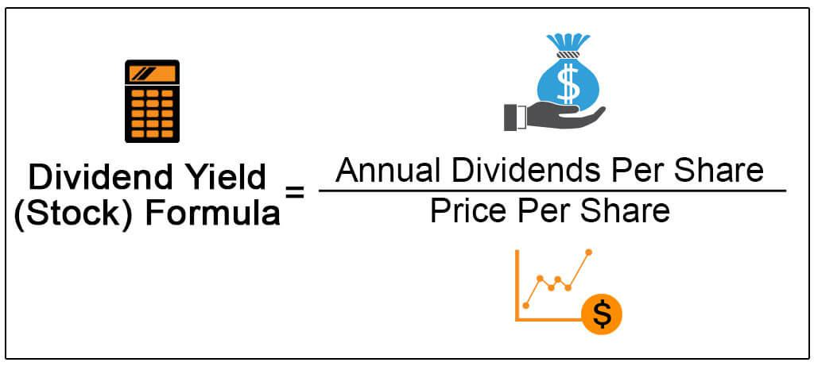

## Table of Contents

## What is dividend yield?

Dividend yield is a way to measure how much a company pays out in dividends each year compared to its stock price. It's like a percentage that shows how much income you get from owning a stock. To find the dividend yield, you take the yearly dividend per share and divide it by the stock's price per share, then multiply by 100 to get a percentage.

This number is important for investors who want to earn money from dividends. A higher dividend yield can mean more income from your investment, but it's not always better. Sometimes, a high yield can mean the company is in trouble, and the stock price has gone down a lot. So, it's good to look at other things too, like how stable the company is and if they can keep paying those dividends in the future.

## How is dividend yield calculated?

Dividend yield is calculated by taking the annual dividend per share and dividing it by the stock's current price per share. After you get that number, you multiply it by 100 to turn it into a percentage. For example, if a company pays a yearly dividend of $2 per share and the stock price is $40, the dividend yield would be ($2 / $40) * 100 = 5%.

This percentage tells you how much income you can expect to earn from the dividends for every dollar you invest in the stock. It's a useful number for investors who want to know how much they'll get back in dividends compared to what they paid for the stock. Keep in mind, though, that the dividend yield can change because stock prices go up and down, and companies might change their dividend payments too.

## Why is dividend yield important for investors?

Dividend yield is important for investors because it shows how much money they can earn from a stock just by holding it. If you own a stock that pays dividends, the dividend yield tells you what percentage of the stock's price you'll get back each year in dividends. This is really helpful for people who want to make money from their investments without selling their stocks. For example, if you're saving for retirement, a high dividend yield can give you a steady income to live on.

But, it's not just about [picking](/wiki/asset-class-picking) the stock with the highest dividend yield. Sometimes, a very high yield can be a warning sign. It might mean the company is having problems and the stock price has dropped a lot, making the yield look high. So, investors need to look at other things too, like how well the company is doing and if they can keep paying those dividends. It's all about finding a balance between getting a good income from dividends and making sure the company is strong and stable.

## What is considered a good dividend yield?

A good dividend yield can be different depending on what you want and what's happening in the market. Usually, people think a dividend yield of around 2% to 6% is pretty good. But if you want more income from your investments, you might look for a higher yield, maybe around 4% to 6%. On the other hand, if you're more interested in a company growing and becoming more valuable, you might be okay with a lower yield, like 2% to 3%.

It's also important to think about what's normal for the industry. Some types of companies, like utilities or real estate investment trusts (REITs), often have higher yields because they're expected to pay out more of their earnings as dividends. So, a good yield in one industry might not be as good in another. Always remember, a very high yield can sometimes be a warning sign that the company might be in trouble, so it's smart to check other things about the company too, not just the yield.

## How does dividend yield differ from dividend rate?

Dividend yield and dividend rate are two different ways to talk about how much money you get from a company's dividends. The dividend rate is just the amount of money a company pays out in dividends for each share of stock every year. It's a simple number, like $2 per share per year. This tells you how much money you'll get, but it doesn't tell you anything about the stock's price.

On the other hand, dividend yield takes the dividend rate and compares it to the stock's current price. It's like a percentage that shows how much income you get from the stock compared to what you paid for it. To find the dividend yield, you divide the yearly dividend by the stock's price and then multiply by 100. So, if a stock costs $40 and pays $2 per year in dividends, the dividend yield is 5%. This helps you see how good the dividend is in relation to the stock's price, which can be really useful when you're deciding which stocks to buy.

## Can dividend yield be too high? What are the risks?

Yes, a dividend yield can be too high, and it can come with risks. When a stock's dividend yield is very high, it might seem like a great deal because you're getting a lot of money back from your investment. But sometimes, a high yield happens because the stock's price has gone down a lot. If the price drops, the yield goes up, even if the dividend payment stays the same. This could mean the company is having problems, and the high yield might not last.

The main risk is that the company might cut or stop paying dividends if it's not doing well. If a company can't keep up its dividend payments, the stock price might drop even more, and you could lose money. It's also important to check why the yield is so high. If it's because the company is in trouble, you might want to be careful. So, while a high dividend yield can look good, it's smart to look at the whole picture and make sure the company is strong before you decide to invest.

## How do taxes affect dividend yield?

Taxes can make the dividend yield you actually get lower. When you get money from dividends, you usually have to pay taxes on it. The amount of tax depends on where you live and what kind of dividends you're getting. In the U.S., for example, there are two kinds of dividends: qualified and non-qualified. Qualified dividends are taxed at a lower rate, like the capital gains tax rate, while non-qualified dividends are taxed at your regular income tax rate. So, if you have to pay a lot in taxes, the actual money you keep from the dividends will be less than the dividend yield you see on paper.

It's important to think about taxes when you're looking at dividend yield. If you're in a high tax bracket, a high dividend yield might not be as good as it looks because you'll lose a lot of it to taxes. Some people might choose to invest in things like tax-advantaged accounts, like IRAs or 401(k)s, where the taxes on dividends can be lower or delayed until you take the money out. This way, you can keep more of the dividend yield for yourself. Always think about how taxes will affect your investment choices and the real income you'll get from dividends.

## What is the relationship between dividend yield and stock price?

Dividend yield and stock price are closely connected. The dividend yield is a percentage that shows how much money you get back from a company's dividends compared to what you paid for the stock. To find it, you take the yearly dividend and divide it by the stock's price. If the stock price goes up, the dividend yield goes down, because you're paying more for the same amount of dividend. If the stock price goes down, the dividend yield goes up, because you're paying less for the same dividend.

But, just because the dividend yield goes up when the stock price drops doesn't always mean it's a good thing. Sometimes, a high dividend yield can be a warning sign that the company is having problems. If the stock price is falling because people think the company is in trouble, the high yield might not last. The company might cut or stop paying dividends if it can't afford to keep them up. So, it's important to look at why the stock price is changing and not just focus on the dividend yield alone.

## How can dividend yield be used in investment strategies?

Dividend yield can be a big help in planning how to invest your money. If you want to get regular money from your investments without selling your stocks, you might look for stocks with a good dividend yield. This can be really important for people saving for retirement or anyone who wants to live off the money their investments make. By picking stocks with a high dividend yield, you can make sure you're getting a good amount of money back each year. But, you need to be careful. A high yield can sometimes mean the company is having problems, so it's important to check if the company is doing well and can keep paying those dividends.

Another way to use dividend yield in your investment strategy is to compare it with other investments. If you're deciding between different stocks or even other types of investments like bonds, looking at the dividend yield can help you see which one gives you the best return on your money. Sometimes, a lower yield might be better if the company is growing and the stock price is going up. So, it's not just about finding the highest yield; it's about finding a balance. You want a good income from dividends, but you also want to make sure the company is strong and stable, so your investment keeps growing over time.

## What are the limitations of using dividend yield as an investment metric?

Using dividend yield to decide where to invest your money has some problems. One big issue is that a high dividend yield might look good, but it can be a warning sign. If the yield is high because the stock price has gone down a lot, it could mean the company is not doing well. If the company is struggling, it might not be able to keep paying those high dividends. So, just looking at the dividend yield without checking the company's health can be risky.

Another problem is that dividend yield doesn't tell you everything about an investment. It only shows how much money you get back from dividends compared to the stock's price. It doesn't say anything about how the stock's price might change in the future or if the company is growing. If you focus only on dividend yield, you might miss out on stocks that could make you more money in other ways, like through stock price growth. So, it's important to look at other things too, like the company's earnings, how it's doing in its industry, and what its future plans are.

## How does dividend yield vary across different sectors?

Dividend yield can be different depending on which type of business, or sector, a company is in. Some sectors, like utilities and real estate investment trusts (REITs), usually have higher dividend yields. This is because these businesses often have to pay out a big part of their money as dividends. For example, REITs have to pay out at least 90% of their taxable income as dividends. So, if you're looking at a utility or a REIT, you might see dividend yields that are higher than in other sectors.

On the other hand, sectors like technology and healthcare often have lower dividend yields. Companies in these sectors might be more focused on growing their business and making their stock price go up, so they might not pay out as much money in dividends. For example, a tech company might use its money to develop new products instead of giving it to shareholders as dividends. So, if you're looking at a tech or healthcare stock, the dividend yield might be lower, but the stock might have more potential to grow in value.

## What historical trends can we observe in dividend yields and what do they indicate?

Over time, we can see that dividend yields have gone up and down. A long time ago, like in the early 1900s, dividend yields were pretty high because companies paid out a lot of their money as dividends. But as time went on, especially after World War II, companies started to keep more money to grow their business instead of paying it out as dividends. This made dividend yields go down. For example, in the 1980s and 1990s, dividend yields were really low because companies were more focused on making their stock prices go up. 

These changes in dividend yields tell us about what was important to companies and investors at different times. When yields were high, it meant that investors cared a lot about getting regular money from their investments. But when yields were low, it showed that investors were more interested in the company's growth and the chance that the stock price would go up. Today, dividend yields can still change a lot, but they usually stay in a certain range, like between 2% and 6%. This shows that investors now look for a balance between getting income from dividends and having their investments grow over time.

## What is Dividend Yield and why is it a key component?

Dividend yield is a financial ratio that measures the amount a company pays in dividends relative to its stock price. It is expressed as a percentage and calculated using the formula:

$$
\text{Dividend Yield} = \left( \frac{\text{Annual Dividends Per Share}}{\text{Price Per Share}} \right) \times 100
$$

This metric is crucial for investors seeking income from their investments, as it provides insight into how much cash flow an investment might generate. A higher dividend yield indicates a greater cash return on investment, making it an attractive choice for income-focused investors.

**High-Yield vs. Low-Yield Dividend Stocks**

High-yield dividend stocks are those with a relatively high dividend yield, often appealing to investors looking for significant income. These stocks can enhance the income potential of an investment portfolio. However, a high yield may also signal potential risks, such as financial instability or declining share prices, suggesting that the company might not sustain its dividend payments in the future.

Conversely, low-yield dividend stocks typically belong to companies with stable and predictable earnings. These companies may opt to reinvest a larger portion of their profits into business growth rather than paying out high dividends. Low-yield stocks might appeal to growth-oriented investors seeking capital appreciation rather than immediate income.

**Advantages and Risks of High-Dividend Yield Investments**

High-dividend yield investments provide several advantages, such as regular income, which can be particularly beneficial for retirees or investors seeking to supplement their income. Additionally, dividends can act as a buffer in volatile markets, providing returns even when stock prices fall.

However, high-dividend yield investments also come with risks. Companies offering high yields might be experiencing financial troubles, leading to unsustainable dividend policies. When a company's stock price falls significantly, the dividend yield artificially inflates, signaling potential distress. Investors must conduct thorough research to ensure that yields are backed by robust financial health and consistent cash flows.

In summary, while dividend yield is a key component influencing stock investment decisions, investors must carefully analyze both the yield and the underlying financial health of dividend-paying companies to make informed decisions. A balanced approach, integrating dividend yield considerations with a comprehensive investment strategy, is essential for optimizing returns while managing risks.

## References & Further Reading

[1]: Graham, B. (1949). ["The Intelligent Investor."](https://en.wikipedia.org/wiki/The_Intelligent_Investor) Harper & Brothers.

[2]: Carlson, C. B. (2010). ["The Little Book of Big Dividends: A Safe Formula for Guaranteed Returns."](https://www.amazon.com/Little-Book-Big-Dividends-Guaranteed/dp/0470567996) Wiley.

[3]: Chan, E. (2009). ["Algorithmic Trading: Winning Strategies and Their Rationale."](https://github.com/ftvision/quant_trading_echan_book) Wiley.

[4]: De Prado, M. L. (2018). ["Advances in Financial Machine Learning."](https://www.amazon.com/Advances-Financial-Machine-Learning-Marcos/dp/1119482089) Wiley.

[5]: Jansen, S. (2020). ["Machine Learning for Algorithmic Trading."](https://github.com/stefan-jansen/machine-learning-for-trading) Packt Publishing.

[6]: ["QuantConnect - Algorithmic Trading Platform."](https://www.quantconnect.com/)

[7]: ["Alpaca - Commission-Free Trading API."](https://alpaca.markets/algotrading) 

[8]: Aronson, D. R. (2007). ["Evidence-Based Technical Analysis: Applying the Scientific Method and Statistical Inference to Trading Signals."](https://onlinelibrary.wiley.com/doi/book/10.1002/9781118268315) Wiley.