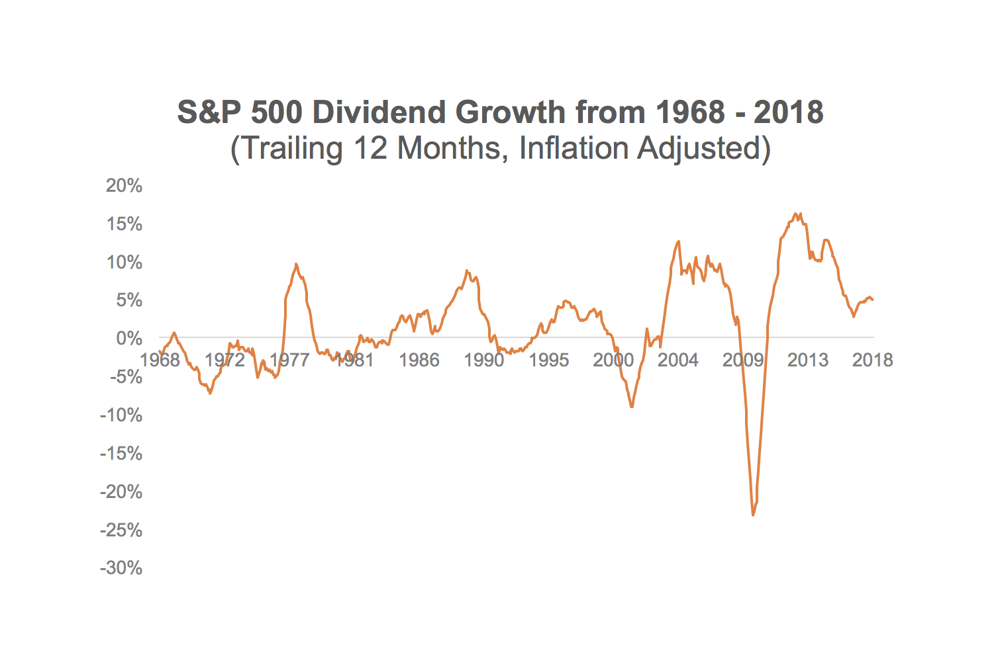

## Table of Contents

## What is a dividend yield?

A dividend yield is a way to measure how much a company pays out in dividends each year compared to its stock price. It's like figuring out how much income you get from an investment. To find the dividend yield, you take the yearly dividend per share and divide it by the price of the stock. Then, you multiply by 100 to get a percentage.

Dividend yield is important for people who want to earn money from their investments without selling the stock. If a company has a high dividend yield, it might mean you get more money back from your investment. But, a high yield can also mean the stock price has gone down a lot, which could be a warning sign. So, it's good to look at other things about the company too, not just the dividend yield.

## How does an economic downturn affect dividend-paying companies?

During an economic downturn, companies that pay dividends can face some tough times. When the economy is not doing well, businesses might see less money coming in because people and other companies are spending less. This can make it hard for a company to keep paying the same amount of dividends. They might need to use their cash to keep the business running instead of giving money to shareholders. If a company decides to cut or stop paying dividends, it can make investors worried and the stock price might go down.

But not all dividend-paying companies are affected the same way. Some companies, like those in industries that people always need, such as utilities or consumer goods, might be more stable. These companies might still be able to pay their dividends even during tough times because people still need their products or services. Investors often look for these kinds of companies during an economic downturn because they want the safety of steady dividends. So, while an economic downturn can make things harder for many companies, some can still manage to keep their dividends going.

## What are the benefits of investing in high dividend yield stocks during an economic downturn?

Investing in high dividend yield stocks during an economic downturn can be a good idea because these stocks can give you a steady income when other parts of the economy are struggling. When companies are doing well, they might pay out more money to shareholders as dividends. If you pick stocks with high dividend yields, you could get more money back from your investment even when the economy is not doing great. This can help you keep some money coming in, which can be really helpful during tough times.

Another benefit is that high dividend yield stocks can be less risky than other investments during an economic downturn. When the stock market goes down, people often look for safe places to put their money. Companies that can keep paying high dividends might be seen as more stable and reliable. This can make their stock prices stay up better than others. So, by investing in these stocks, you might protect your money better and not lose as much if the market keeps going down.

## What are the risks associated with dividend yield strategies in a recession?

During a recession, investing in high dividend yield stocks can be risky. One big risk is that companies might cut their dividends. When the economy is bad, businesses might not make as much money. They need to save cash to keep running, so they might lower or stop paying dividends. If this happens, the stock price can go down a lot, and you could lose money.

Another risk is that high dividend yields can be a warning sign. Sometimes, a high yield happens because the stock price has fallen a lot. This might mean the company is in trouble. If you invest in a stock just because it has a high yield, you might be buying into a company that is not doing well. It's important to check if the company is strong enough to keep paying those dividends during tough times.

Also, focusing too much on dividend yield can make you miss other important things. You might not look at how the company is doing overall or if the industry is going to face big problems. In a recession, it's smart to look at the whole picture, not just the dividend. If you don't, you could end up with stocks that lose value even if they pay dividends for a while.

## How can investors identify companies likely to maintain or increase dividends during tough economic times?

Investors can find companies that might keep or even raise their dividends during tough times by looking at how much money the company makes compared to what it owes. If a company has a lot more money coming in than it needs to pay its bills, it is more likely to keep paying dividends. These companies are often in industries like utilities or consumer goods, where people still need their products even when the economy is bad. Also, companies with a long history of paying dividends, even during past recessions, are good to consider because they have shown they can handle tough times.

Another way to find these companies is to check their cash flow. If a company has strong cash flow, it means it has enough money to pay dividends. Investors should also look at the company's payout ratio, which is the percentage of earnings paid out as dividends. A lower payout ratio means the company is not using all its earnings for dividends, so it has a cushion if earnings drop. By focusing on these factors, investors can pick companies that are more likely to keep paying dividends even when the economy is struggling.

## What role do dividend reinvestment plans (DRIPs) play during economic downturns?

Dividend reinvestment plans, or DRIPs, can be really helpful during economic downturns. When you use a DRIP, you take the money you get from dividends and use it to buy more shares of the same company. This can be good because even if the stock price goes down during a recession, you can buy more shares with your dividends. Over time, this can help you own more of the company without spending extra money.

Using DRIPs during tough times can also help you grow your investment in the long run. When the economy gets better, the stock price might go up again. If you have been buying more shares with your dividends, you will have more shares to benefit from the price increase. This way, DRIPs can help you make the most of your investment even when the economy is not doing well.

## How should an investor adjust their dividend yield strategy when entering an economic downturn?

When an economic downturn is coming, investors should be careful with their dividend yield strategy. It's a good idea to look at companies that are in strong industries, like utilities or consumer goods, because these companies are more likely to keep paying dividends. Also, check if the company has a lot of cash and a low payout ratio. This means they are not using all their money to pay dividends, so they can still afford to do it even if things get tough. Don't just focus on the high dividend yield, because sometimes a high yield can mean the company is in trouble and the stock price has dropped a lot.

Using a dividend reinvestment plan, or DRIP, can be smart during a downturn. With a DRIP, you use the money from dividends to buy more shares of the company. This can help you own more of the company without spending extra money. Even if the stock price goes down, you can buy more shares at a lower price. When the economy gets better, and the stock price goes up, you will have more shares to benefit from the increase. So, adjusting your strategy to focus on strong companies and using DRIPs can help you make the most of your investment during tough times.

## Can you explain the concept of dividend sustainability and its importance during economic downturns?

Dividend sustainability means how likely a company is to keep paying its dividends over time, especially during tough economic times. It's important for investors to know this because they want to make sure the money they get from dividends keeps coming, even when the economy is not doing well. To figure out if a company's dividends are sustainable, investors look at things like how much money the company makes, how much debt it has, and how much of its earnings it pays out as dividends. If a company has a lot of money coming in and not too much debt, it's more likely to keep paying dividends.

During an economic downturn, dividend sustainability becomes even more important. When the economy is bad, companies might make less money, and they might need to use their cash to keep the business going instead of paying dividends. If a company can't keep paying its dividends, its stock price might go down, and investors could lose money. By choosing companies with sustainable dividends, investors can feel safer about their investments. These companies are usually in industries that people always need, like utilities or consumer goods, and they have a history of paying dividends even during past tough times.

## What are some advanced metrics to evaluate the safety of dividends in a volatile market?

To figure out if a company's dividends are safe in a volatile market, one important thing to look at is the payout ratio. This is the percentage of the company's earnings that it pays out as dividends. If the payout ratio is low, it means the company is not using all its earnings to pay dividends, so it has a cushion if things get tough. A payout ratio under 60% is usually seen as safe. Another thing to check is the company's free cash flow. Free cash flow is the money a company has left after paying for everything it needs to run. If a company has a lot of free cash flow, it can keep paying dividends even if the economy is not doing well.

Another useful metric is the dividend coverage ratio. This shows how many times a company's earnings can cover its dividend payments. A higher ratio means the company can easily pay its dividends. You can find this by dividing the company's earnings per share by its dividends per share. A ratio of 2 or higher is usually good. Also, it's smart to look at the company's debt-to-equity ratio. This tells you how much debt the company has compared to what it owns. A lower debt-to-equity ratio means the company is not too risky, and it's more likely to keep paying dividends even in a volatile market.

## How do sector-specific factors influence dividend yield strategies during economic downturns?

During an economic downturn, the sector a company is in can really affect its ability to keep paying dividends. Some sectors, like utilities and consumer goods, are more stable because people always need electricity, water, and basic products like food and soap. Companies in these sectors usually have steady cash flow, so they can keep paying dividends even when the economy is bad. On the other hand, sectors like travel, hospitality, and luxury goods can be hit hard during a downturn. People cut back on vacations and expensive items, so companies in these sectors might have to lower or stop their dividends to save money.

Investors should pay attention to these sector-specific factors when choosing stocks for their dividend yield strategy. If you want to keep getting money from dividends during tough times, it's smart to pick companies in stable sectors. These companies are more likely to keep their dividends going, which can help you feel safer about your investment. But if you invest in companies from sectors that are struggling, you might see your dividends cut, and the stock price could go down a lot. So, understanding how different sectors react to economic downturns can help you make better choices for your dividend yield strategy.

## What are the historical performances of dividend yield strategies during past economic downturns?

During past economic downturns, dividend yield strategies have had mixed results. In the Great Recession of 2007-2009, many companies cut their dividends because they were making less money and needed to save cash. This made it hard for investors who were relying on dividend income. But some companies, especially those in stable sectors like utilities and consumer goods, were able to keep paying their dividends. These companies helped investors who had chosen them carefully, showing that [picking](/wiki/asset-class-picking) the right stocks can make a big difference during tough times.

In the economic downturn caused by the COVID-19 pandemic in 2020, dividend yield strategies faced similar challenges. Many companies, especially in sectors like travel and hospitality, had to cut or stop their dividends because people were not spending money on non-essential things. However, companies in sectors that people always need, like healthcare and consumer staples, were more likely to keep their dividends going. Investors who focused on these stable sectors and used dividend reinvestment plans (DRIPs) to buy more shares at lower prices were able to do better during the downturn. This shows that while economic downturns can be tough on dividend strategies, smart choices and a focus on stability can help investors come out ahead.

## How can an investor use options strategies to enhance returns from dividend yield stocks during economic downturns?

Investors can use options strategies to make more money from dividend yield stocks during economic downturns by selling covered calls. This means you own the stock and sell someone else the right to buy it from you at a set price before a certain date. If the stock price stays below that set price, you keep the money from selling the option, which adds to your dividend income. This can help you earn more even when the economy is not doing well. But if the stock price goes above the set price, you might have to sell your stock, which could mean missing out on future gains if the stock keeps going up.

Another way to use options is to buy put options as a way to protect your investment. A put option gives you the right to sell your stock at a set price, which can help if the stock price falls a lot during a downturn. This can make you feel safer about your investment because you know you can sell at a good price no matter what happens to the stock. But remember, buying options costs money, so it can lower your overall returns if the stock price doesn't drop as much as you expect. Using options smartly can help you make the most of your dividend yield stocks during tough economic times.

## Can Dividend Yield Serve as a Shield Against Downturns?

Dividend yield is a critical concept in evaluating the potential cash return on an investment relative to a stock's current price. It is calculated using the formula:

$$
\text{Dividend Yield} = \left( \frac{\text{Annual Dividends per Share}}{\text{Price per Share}} \right) \times 100
$$

This percentage provides investors with an insight into the income generated from their investment, independent of capital gains. High-dividend-yield stocks are often considered a reliable source of income, particularly when markets experience [volatility](/wiki/volatility-trading-strategies). These stocks tend to be issued by well-established companies with stable earnings, thus offering a steady income stream even when market conditions are unfavorable.

High-dividend-yield stocks can serve as a protective mechanism during economic downturns. During such periods, companies with robust financial health that maintain dividend payments offer a level of certainty for investors seeking stability. The regular income from dividends can help mitigate the diminished value of stock holdings, providing a buffer against market fluctuations.

Historical analyses support the proposition that high-dividend stocks often outperform the broader market during downturns. For example, a study by Ned Davis Research demonstrated that from 1972 to 2014, dividends contributed approximately 44% of the total return of the S&P 500 Index. Moreover, during periods of economic stress, companies that consistently paid and increased dividends typically exhibited lower volatility compared to non-dividend-paying stocks.

Additionally, high-dividend-yield stocks have shown a tendency to recover more quickly post-recession. This resilience is attributable to the perceived safety and strong fundamentals of the issuing companies, which continue to attract risk-averse investors. Moreover, reinvesting dividends can compound returns over time, further enhancing the total performance of dividend-yield-focused portfolios.

In summary, the emphasis on dividend yield as a strategy during economic downturns offers investors both immediate income and potential long-term growth. By focusing on dividend stability, investors can navigate economic uncertainties with greater confidence, balancing their portfolios between income-generation and risk mitigation.

## References & Further Reading

[1]: Fama, E. F., & French, K. R. (2015). ["A Five-Factor Asset Pricing Model."](https://www.sciencedirect.com/science/article/pii/S0304405X14002323) Journal of Financial Economics.

[2]: De Prado, M. L. (2018). ["Advances in Financial Machine Learning."](https://www.amazon.com/Advances-Financial-Machine-Learning-Marcos/dp/1119482089) Wiley.

[3]: Aronson, D. R. (2006). ["Evidence-Based Technical Analysis: Applying the Scientific Method and Statistical Inference to Trading Signals."](https://www.amazon.com/Evidence-Based-Technical-Analysis-Scientific-Statistical/dp/0470008741) Wiley.

[4]: Jansen, S. (2020). ["Machine Learning for Algorithmic Trading."](https://github.com/stefan-jansen/machine-learning-for-trading) Packt Publishing.

[5]: Chan, E. P. (2009). ["Quantitative Trading: How to Build Your Own Algorithmic Trading Business."](https://github.com/ftvision/quant_trading_echan_book) Wiley.