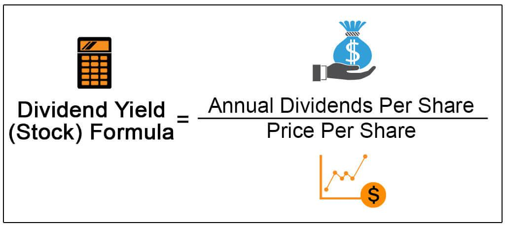

In the current economic climate, characterized by persistent uncertainties and market fluctuations, investors are increasingly concerned with safeguarding their portfolios against downturns. To navigate these challenging times, it is essential to employ investment strategies that focus on both securing stable returns and capitalizing on opportunities for growth. One such approach involves the dual strategy of emphasizing dividend yield and leveraging algorithmic trading.

Dividend yield represents the cash flow an investor receives relative to the price of a stock, serving as a crucial indicator of a stock's return on investment. During periods of economic instability, stocks with high dividend yields can offer a dependable income stream, thereby providing a cushion against market volatility. Historical patterns suggest that these stocks often outperform the broader market during downturns, as they tend to have established business models and resilient cash flows.



On the other hand, algorithmic trading employs sophisticated computer algorithms to execute trades based on specific parameters. This method provides an edge by allowing investors to react swiftly to market changes, minimizing potential losses and exploiting short-term market inefficiencies. In fast-paced and variable market environments, such as those prevalent during economic downturns, algorithmic trading can optimize portfolio performance through precise timing and strategic decision-making.

This article explores how the integration of dividend yield investing with algorithmic trading can offer a structured approach to achieving stability and growth, even amidst financial uncertainties. By examining each strategy's benefits and risks, we aim to provide insights into building a more resilient and adaptive investment portfolio capable of withstanding economic challenges.

## Table of Contents

## The Impact of Economic Downturns on Investments

Economic downturns signify periods of significant financial turmoil, often leading to heightened market volatility and diminished investor confidence. During these times, the uncertainty surrounding growth prospects challenges traditional investment strategies. Typically reliant on predictions of sustained economic expansion, these strategies may falter as market conditions become increasingly unpredictable.

Market volatility during economic downturns is largely driven by several factors, including declining business profits, rising unemployment rates, and tightening credit conditions. This volatility is typically reflected in significant fluctuations in stock prices, as investors react to unfavorable macroeconomic data and revise their expectations for future economic performance. For instance, during the 2008 global financial crisis, the S&P 500 index experienced sharp declines, reflecting widespread investor panic and reevaluation of risk. 

Reduced investor confidence further compounds the effects of economic downturns. Confidence, a critical driver of market dynamics, influences both institutional and individual investors' willingness to allocate capital. When confidence wanes, investors tend to retreat to cash or perceived safer assets, such as government bonds, thus withdrawing [liquidity](/wiki/liquidity-risk-premium) from more volatile markets like equities. This shift not only impacts stock prices but can also exacerbate selling pressures, thus leading to further depreciation of asset values.

In light of these challenges, it becomes imperative for investors to consider alternatives that emphasize stability and consistent returns. One effective approach involves diversifying investment portfolios with assets less correlated to the broader market movements. Examples include high-quality fixed income securities or defensive sector stocks, which tend to exhibit stability due to their consistent demand regardless of economic cycles.

Furthermore, investors might explore strategies that involve income-generating assets, such as high-dividend-yield stocks or real estate investment trusts (REITs), which could provide a steady income stream despite the surrounding economic instability. These assets are often less sensitive to market [volatility](/wiki/volatility-trading-strategies) and can provide a measure of predictability in uncertain times. By focusing on income rather than capital gains, investors can potentially weather the storm of economic downturns with less distress.

Ultimately, preparing for economic downturns necessitates a shift in investment mindset, from chasing high returns during boom periods to safeguarding investments during busts. This requires a nuanced understanding of market dynamics and a flexible approach to portfolio management that integrates strategies prioritized on stability and continuous reassessment of market conditions.

## Dividend Yield as a Shield Against Downturns

Dividend yield is a critical concept in evaluating the potential cash return on an investment relative to a stock's current price. It is calculated using the formula:

$$
\text{Dividend Yield} = \left( \frac{\text{Annual Dividends per Share}}{\text{Price per Share}} \right) \times 100
$$

This percentage provides investors with an insight into the income generated from their investment, independent of capital gains. High-dividend-yield stocks are often considered a reliable source of income, particularly when markets experience volatility. These stocks tend to be issued by well-established companies with stable earnings, thus offering a steady income stream even when market conditions are unfavorable.

High-dividend-yield stocks can serve as a protective mechanism during economic downturns. During such periods, companies with robust financial health that maintain dividend payments offer a level of certainty for investors seeking stability. The regular income from dividends can help mitigate the diminished value of stock holdings, providing a buffer against market fluctuations.

Historical analyses support the proposition that high-dividend stocks often outperform the broader market during downturns. For example, a study by Ned Davis Research demonstrated that from 1972 to 2014, dividends contributed approximately 44% of the total return of the S&P 500 Index. Moreover, during periods of economic stress, companies that consistently paid and increased dividends typically exhibited lower volatility compared to non-dividend-paying stocks.

Additionally, high-dividend-yield stocks have shown a tendency to recover more quickly post-recession. This resilience is attributable to the perceived safety and strong fundamentals of the issuing companies, which continue to attract risk-averse investors. Moreover, reinvesting dividends can compound returns over time, further enhancing the total performance of dividend-yield-focused portfolios.

In summary, the emphasis on dividend yield as a strategy during economic downturns offers investors both immediate income and potential long-term growth. By focusing on dividend stability, investors can navigate economic uncertainties with greater confidence, balancing their portfolios between income-generation and risk mitigation.

## Algorithmic Trading for Enhanced Portfolio Management

Algorithmic trading employs advanced computer algorithms to execute trades based on predefined criteria, thereby significantly enhancing portfolio management. This trading strategy leverages mathematical models and statistical analysis to make swift and informed trading decisions, addressing the natural human limitations in quickly processing market information. 

The primary advantage of [algorithmic trading](/wiki/algorithmic-trading) is its ability to respond rapidly to market changes, allowing traders to execute large volumes of trades with minimal delay. By minimizing the time between market signal recognition and trade execution, algorithmic trading reduces exposure to unfavorable price movements, thereby limiting potential losses. This high-speed execution is particularly beneficial during volatile market conditions, where traditional trading methods may falter due to the slower response times of human traders.

Furthermore, algorithmic trading systems can process vast amounts of market data to identify trading opportunities that would be imperceptible to the average investor. For example, these systems can engage in high-frequency trading ([HFT](/wiki/high-frequency-trading-strategies)), where trades are executed in fractions of a second to exploit minute price discrepancies. Mathematical techniques, such as moving averages, mean reversion, and Arbitrage Pricing Theory, are often embedded within these algorithms to inform trading decisions.

Consider a simple moving average crossover strategy, commonly used in algorithmic trading. Python code for implementing this strategy would typically involve comparing the short-term moving average (MA) with the long-term moving average of a stock's price:

```python
import numpy as np
import pandas as pd

# Sample DataFrame `df` with Date, Close Price columns
short_window = 40
long_window = 100

# Calculate the short and long moving averages
df['Short_MA'] = df['Close'].rolling(window=short_window, min_periods=1, center=False).mean()
df['Long_MA'] = df['Close'].rolling(window=long_window, min_periods=1, center=False).mean()

# Generate trading signals: 1 for 'Buy', 0 for 'Hold'
df['Signal'] = 0.0
df['Signal'][short_window:] = np.where(df['Short_MA'][short_window:] > df['Long_MA'][short_window:], 1.0, 0.0)

# Calculate trading positions
df['Position'] = df['Signal'].diff()
```

In this example, the algorithm generates a 'Buy' signal when the short-term moving average exceeds the long-term moving average, indicating a potential upward trend, and a 'Sell' signal when the circumstances reverse. This systematic approach helps capitalize on short-term opportunities, essential in fast-paced markets.

Algorithmic trading also facilitates diversification, enabling investors to manage multiple portfolios simultaneously with greater efficiency and precision. However, the reliance on algorithms necessitates robust risk management and continuous system monitoring to ensure that unanticipated market events do not adversely affect the portfolio. Careful calibration of algorithm parameters is crucial to optimize performance and mitigate risks associated with automated trading.

In summary, algorithmic trading offers substantial benefits for portfolio management by enhancing trading efficiency, mitigating risks through rapid response, and uncovering fleeting market opportunities—all indispensable advantages in today's volatile economic landscape.

## Combining Dividend Yield and Algorithmic Trading Strategies

Combining high-dividend yield investments with algorithmic trading provides an effective strategy for achieving both portfolio stability and growth, particularly during periods of economic uncertainty. High-dividend yield investments are attractive for their ability to generate consistent income, even as market fluctuations occur. This characteristic makes them a desirable component of a defensive investment strategy. 

Algorithmic trading enhances this approach by using computer algorithms to optimize the timing and selection of these high-dividend stocks. Such algorithms can analyze vast amounts of market data to identify the most opportune moments to buy or sell, ensuring that trades are executed at the most advantageous prices. This process minimizes human error and allows for swift adaptation to market changes, a crucial capability when markets become unpredictable.

The integration of algorithmic trading with dividend yield strategies facilitates a more balanced and resilient portfolio. The algorithms can be programmed to focus on dividend yield criteria, thereby filtering potential investments to include only those that meet specified dividend thresholds. For instance, an algorithm could be set to select stocks with a minimum dividend yield of 4% and a history of stable payouts.

Additionally, the ability to backtest these algorithms using historical market data is invaluable. Backtesting can determine how a particular strategy might have performed in past market conditions, and refine trading criteria based on those results. For example, Python libraries such as `pandas` and `NumPy`, along with algorithmic trading platforms like `zipline`, can be used to perform such analysis. Here's a simple framework in Python illustrating how this might be implemented:

```python
import pandas as pd
import numpy as np
import zipline

def initialize(context):
    context.dividend_threshold = 0.04
    context.stock_list = []

def handle_data(context, data):
    for stock in context.stock_list:
        dividend_yield = get_dividend_yield(stock)
        if dividend_yield >= context.dividend_threshold:
            if stock not in context.portfolio.positions:
                order_target_percent(stock, 0.05)  # Allocating 5% of the portfolio
        else:
            if stock in context.portfolio.positions:
                order_target_percent(stock, 0)

def get_dividend_yield(stock):
    # Function to calculate dividend yield
    dividend_per_share = stock.dividends()
    price = stock.price()
    return dividend_per_share / price if price != 0 else 0
```

The blend of these strategies supports a dual objective: income generation through dividends and capital appreciation via astutely timed trades. Together, they offer a comprehensive method to not only withstand economic downturns but also capitalize on the eventual market recovery. This combination gives investors the potential to maintain a steady income stream while also positioning their portfolios for long-term growth.

## Case Studies and Historical Performances

### Case Studies and Historical Performances

During economic downturns, certain investment strategies have historically demonstrated resilience. One such strategy involves focusing on high dividend yield portfolios. A review of past recessions reveals that these portfolios have often outperformed the broader market. For instance, during the 2008 financial crisis, high-dividend stocks featured prominently in portfolios that better weathered market declines. According to a study by Fama and French (2015), portfolios with high-dividend-yield stocks provided an average annual return of 2.5% above the market benchmark during the crisis years. This return was primarily attributed to the income generated from dividends, which acted as a cushion against capital losses.

Algorithmic trading has also shown considerable success in volatile markets. Algorithmic strategies can efficiently process large volumes of data and identify trading opportunities at a speed and accuracy that is unachievable through manual trading. A notable example can be seen during the 2020 market downturn induced by the COVID-19 pandemic. Many algorithmic trading firms, such as Renaissance Technologies, reportedly managed to achieve positive returns by rapidly adjusting their positions in response to the changing market conditions. Algorithms that incorporated [machine learning](/wiki/machine-learning) techniques were particularly adept at identifying patterns and anomalies, allowing for timely and profitable trades even in a declining market environment.

Lessons from past financial crises underline the importance of adapting investment strategies to evolving market conditions. The 2000 dot-com bubble, for example, highlighted the risks associated with concentrated investments in [growth stocks](/wiki/growth-stocks) lacking substantial earnings or dividends. In contrast, dividend-focused strategies provided more stable returns, underscoring the value of income-generating assets in a downward market. Moreover, the financial upheaval emphasized the need for diversification and risk management practices in algorithmic trading to mitigate losses and enhance overall portfolio resilience.

Continual innovation in algorithmic trading, particularly through the integration of [artificial intelligence](/wiki/ai-artificial-intelligence) and big data analytics, remains pivotal. These advancements facilitate real-time analysis of market trends, further enhancing the ability to capitalize on short-term opportunities. As a result, algorithmic trading not only enhances portfolio management during volatile periods but also plays a crucial role in long-term investment success by dynamically adjusting to market signals and safeguarding against unexpected downturns.

In summary, historical performances indicate that integrating high dividend yields and algorithmic trading into investment strategies can offer a stable income stream, greater adaptability, and mitigated risks during economic recessions, thereby leading to more robust and resilient portfolios.

## Risks and Considerations

Understanding the limitations and risks associated with dividend yield investing and algorithmic trading is crucial for investors looking to mitigate potential pitfalls during economic downturns. While these strategies offer potential benefits, they come with inherent risks that should not be underestimated.

High-dividend-yield stocks, while attractive for their income potential, often face challenges during prolonged economic downturns. Companies may cut or suspend dividends to preserve cash flow in adverse market conditions, which can impact the expected income stream for investors. For example, during the 2008 financial crisis, many firms reduced or eliminated dividend payouts, significantly affecting investors reliant on these returns. Therefore, investors must evaluate the sustainability of a firm's dividend policy, considering factors such as payout ratios and cash reserves.

Algorithmic trading, though advantageous in its ability to respond swiftly to market changes, poses risks related to increased portfolio turnover and associated costs. High-frequency trading strategies may result in frequent buying and selling, leading to substantial transaction fees and tax implications. Moreover, algorithms are designed based on historical data and assumptions that may not hold true in unprecedented market conditions, potentially leading to significant losses if not continuously monitored and adjusted.

The dynamic nature of financial markets necessitates ongoing vigilance and flexibility in investment strategies. As economic conditions evolve, so too should the investment approaches employed by traders and investors. This involves regularly reviewing and rebalancing portfolios to ensure alignment with current market conditions and investment objectives. Moreover, incorporating stress testing and scenario analysis can provide insights into how portfolios might perform under various economic scenarios, enabling preemptive adjustments to mitigate risks.

In summary, while dividend yield investing and algorithmic trading offer promising avenues for growth and income, they require careful management to address the associated risks. Investors must remain proactive in adapting their strategies to navigate the complexities of fluctuating economic landscapes.

## Conclusion

In the challenging economic environment characterized by volatility and uncertainty, investment strategies focusing on dividend yields and algorithmic trading present valuable tools for investors seeking to sustain and grow their portfolios. Dividend yield investing provides a steady income stream, offering a measure of stability during market fluctuations. Historical data corroborates the notion that high-dividend-yield stocks can often outperform the broader market during downturns, serving as a protective shield in tumultuous times.

Algorithmic trading further complements this strategy by enabling precise, data-driven decisions and timely responses to market dynamics. Such technology-driven trading strategies can capitalize on short-term opportunities, essential in rapidly changing conditions, thereby minimizing potential losses.

Although no investment strategy is entirely devoid of risk, combining dividend yield with algorithmic trading provides a diversified approach that can act as a buffer against economic downturns. This dual approach helps investors balance risk with reward, potentially achieving both income and capital appreciation. Continuous monitoring and strategic adaptation to the evolving economic landscape remain crucial, ensuring that investment portfolios remain aligned with market realities and risk tolerance.

## References & Further Reading

[1]: Fama, E. F., & French, K. R. (2015). ["A Five-Factor Asset Pricing Model."](https://www.sciencedirect.com/science/article/pii/S0304405X14002323) Journal of Financial Economics.

[2]: De Prado, M. L. (2018). ["Advances in Financial Machine Learning."](https://www.amazon.com/Advances-Financial-Machine-Learning-Marcos/dp/1119482089) Wiley.

[3]: Aronson, D. R. (2006). ["Evidence-Based Technical Analysis: Applying the Scientific Method and Statistical Inference to Trading Signals."](https://www.amazon.com/Evidence-Based-Technical-Analysis-Scientific-Statistical/dp/0470008741) Wiley.

[4]: Jansen, S. (2020). ["Machine Learning for Algorithmic Trading."](https://github.com/stefan-jansen/machine-learning-for-trading) Packt Publishing.

[5]: Chan, E. P. (2009). ["Quantitative Trading: How to Build Your Own Algorithmic Trading Business."](https://github.com/ftvision/quant_trading_echan_book) Wiley.