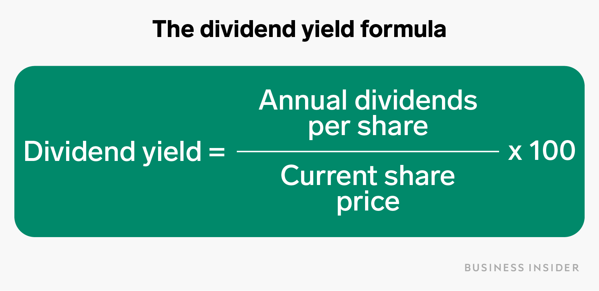

The dynamic world of stock market trading presents a spectrum of opportunities and challenges, particularly when interacting with the nuances of dividend yield and the technological prowess of algorithmic trading. Dividend yield remains a pivotal metric for investors who prioritize consistent income streams, indicating the ratio of a company's annual dividends relative to its stock price. For income-focused investors, understanding and leveraging this metric is essential, as it directly influences the returns purely from dividends—an alluring feature in the pursuit of stable and predictable financial gains. 

On the other hand, the emergence of algorithmic trading has revolutionized the trading landscape by introducing a new level of precision and speed in trade executions. Algorithmic trading employs sophisticated computer algorithms to automate trading decisions and executions, significantly enhancing the ability to process substantial datasets swiftly and to implement complex trading strategies with precision that manual trading cannot achieve.



The synergy between dividend yield and algorithmic trading offers an advanced framework for optimizing investment strategies. By aligning the steady benefits of dividend yields with the high-frequency, data-driven nature of algorithmic trades, investors can potentially maximize returns. This article aims to elucidate how these two elements can be effectively combined to produce robust investment strategies that capitalize on both income stability and market opportunities created by technological advancements. 

Key concepts and strategies will be explored, focusing on how to integrate dividend yield into algorithmic trading frameworks, thereby paving the way for a comprehensive approach to stock market investment that harnesses both consistent income and the benefits of cutting-edge trading technology.

## Table of Contents

## Understanding Dividend Yield

Dividend yield is a vital financial ratio that assists investors in assessing the income they can earn from their investments in stocks purely through dividends. Represented as a percentage, it depicts the annual dividends paid out by a company relative to its stock price. The formula is expressed as:

$$
\text{Dividend Yield} = \left( \frac{\text{Annual Dividends Per Share}}{\text{Price Per Share}} \right) \times 100
$$

Investors typically use dividend yield as a key indicator when making decisions, especially those with an inclination towards income-focused strategies. High dividend yield stocks are attractive for their significant income potential; however, they often [carry](/wiki/carry-trading) elevated risks. These risks may stem from the company's financial instability or unsustainable dividend practices. A high yield could hint at underlying issues, such as a declining stock price, which investors should be wary of when evaluating potential investments.

Conversely, stocks presenting low dividend yields often signify robust financial health and are frequently associated with companies that prefer to reinvest their earnings for growth rather than distribute them as dividends. Such companies typically balance capital retention and shareholder remuneration, reflecting prudent financial management.

The balancing act between risk and reward in dividend yield is paramount for investors. Evaluating dividend sustainability, payout ratios, and the company's overall financial trajectory are essential components of assessing whether a high or low yield stock aligns with an investor's risk tolerance and financial objectives. Understanding these factors enables more informed decision-making, empowering investors to tailor their portfolios to their specific income goals while managing potential downside risks effectively.

 to Algorithmic Trading

Algorithmic trading, commonly referred to as algo trading, utilizes computer-generated algorithms to execute trades with remarkable speed and precision, surpassing human capabilities. These algorithms are designed to analyze numerous market variables such as price, [volume](/wiki/volume-trading-strategy), and time, enabling the execution of trades at optimal moments based on predefined criteria. This technological advancement allows for the execution of trades in milliseconds, a feat unattainable by manual trading methods.

One of the fundamental advantages of [algorithmic trading](/wiki/algorithmic-trading) is its ability to process and evaluate vast datasets rapidly. By leveraging sophisticated mathematical models and statistical analyses, algorithms can make informed trading decisions by identifying market patterns and executing strategies that maximize profits and minimize risks. For instance, in Python, libraries such as pandas and NumPy can be utilized to handle large datasets and perform complex calculations efficiently.

Algorithmic trading facilitates the implementation of a variety of trading strategies that can be complex in nature. Strategies such as [trend following](/wiki/trend-following), [arbitrage](/wiki/arbitrage), [market making](/wiki/market-making), and mean reversion are effectively executed using these algorithms. Trend following strategies exploit market [momentum](/wiki/momentum), while arbitrage strategies seek to capitalize on price differences across markets. Market making provides [liquidity](/wiki/liquidity-risk-premium) by simultaneously placing buy and sell orders, and mean reversion strategies are based on the hypothesis that prices will revert to their mean over time. These strategies are automated through algorithms, enabling the consistent application of rules without the influence of human emotions.

The emergence and evolution of algorithmic trading mark a significant shift towards data-driven and systematic trading methodologies in contemporary markets. It represents an intersection of finance and technology, fostering a more analytical approach to trading. With the capability to adapt to real-time market conditions, algorithms provide traders with a competitive edge, reinforcing the importance of speed, accuracy, and adaptability in today's fast-paced trading environment.

In conclusion, algorithmic trading has revolutionized the market by empowering traders with tools that enhance the efficiency and efficacy of their trading strategies. Through the strategic use of automation and data analysis, algorithmic trading continues to shape the future of trading, offering a systematic approach that aligns with the complexities of modern financial markets.

## Integrating Dividend Yield with Algorithmic Trading

Integrating dividend yield into algorithmic trading strategies is a sophisticated approach designed to enhance investment returns by systematically targeting stocks that generate consistent income. This integration allows algorithms to select stocks with robust dividends, aligning investments with strategic goals focused on income generation and capital growth.

Algorithms can process vast amounts of financial data, analyzing factors such as dividend history, growth potential, and payout ratios to optimize the selection of dividend-paying stocks. For instance, a high dividend yield ($DY$) is calculated as:

$$
DY = \frac{\text{Annual Dividends per Share}}{\text{Price per Share}} \times 100\%
$$

High DY stocks often signal significant income opportunities; however, they may also indicate underlying company issues. Therefore, algorithmic models prioritize balanced portfolios by considering additional metrics such as the consistency of dividend payments and the company's financial health.

A Dividend Yield Reinvestment Strategy involves reinvesting dividends received into additional shares of the same stock or a diversified dividend-yielding stock pool. This strategy, implemented through algorithms, capitalizes on the compounding effect of reinvested dividends to increase the overall return on investment.

Another strategy is the Mean-Reversion Strategy with Dividend Yield, which assumes that stock prices and yields revert to their historical averages over time. An algorithm can execute trades when the current dividend yield significantly deviates from its historical average, indicating a potential price correction. Python scripts, utilizing libraries like pandas and NumPy, can automate this process:

```python
import pandas as pd
import numpy as np

# Example stock data
data = pd.DataFrame({
    'stock_price': [100, 102, 98, 105],
    'dividend': [3, 3, 3, 3]
})

# Calculate Dividend Yield
data['dividend_yield'] = data['dividend'] / data['stock_price'] * 100

# Calculate rolling mean for mean-reversion
data['mean_yield'] = data['dividend_yield'].rolling(window=2).mean()

# Identify deviations for potential trades
data['deviation'] = data['dividend_yield'] - data['mean_yield']

# Display potential trade signals
trade_signals = data[data['deviation'] > 0.5]  # threshold can be adjusted based on strategy
print(trade_signals)
```

By leveraging historical dividend data, growth trends, and payout ratios, these models can guide the construction of portfolios that not only seek to achieve capital appreciation but also sustain an income through dividends. The methodology applied in this integration ensures that investment portfolios are poised to benefit from both systematic trading processes and dividend yields.

## Challenges and Considerations

Integrating dividend yield with algorithmic trading presents several challenges and considerations that investors and developers must address to ensure effective strategy implementation. One of the primary challenges is market [volatility](/wiki/volatility-trading-strategies), which can impact the stability and reliability of algorithmic outcomes. This unpredictability requires robust models capable of adapting to rapid changes in market conditions. Models should incorporate volatility measures, such as the VIX index, known as the "fear gauge," to anticipate and respond to market fluctuations effectively.

Data accuracy emerges as another significant concern. Reliable and high-quality data is crucial for formulating sound investment strategies, particularly when dividend yield is a central focus. Inaccurate dividend data can lead to erroneous analysis and suboptimal decision-making. To counter this, systems must include validation processes, such as cross-referencing multiple data sources and implementing real-time feeds, to ensure data integrity.

Model reliability encompasses both the stability of algorithmic processes and adherence to investment objectives. Continuous model optimization is necessary to account for evolving market dynamics and to enhance prediction capabilities. Techniques such as [machine learning](/wiki/machine-learning) can be employed to refine algorithms, allowing them to learn from past market behaviors and improve their future predictions. Here's an example snippet in Python using a machine learning approach for optimizing investment strategies:

```python
from sklearn.ensemble import RandomForestRegressor
import numpy as np

# Sample dataset: historical dividend yields and stock prices
X_train = np.array([[dividend_yield, stock_price] for dividend_yield, stock_price in zip(dividend_yields, stock_prices)])
y_train = np.array(target_returns)

# Initialize the model
model = RandomForestRegressor(n_estimators=100, random_state=42)

# Fit the model
model.fit(X_train, y_train)

# Use model for predictions
# new_data should be structured similarly to X_train
predicted_returns = model.predict(new_data)
```

Compliance with regulatory standards is imperative for ensuring ethical and lawful practice in algorithmic trading. Investors and developers need to stay updated with changes in regulations across different jurisdictions. This includes implementing protocols for audit trails, maintaining transparency in model operations, and ensuring the protection of sensitive financial data.

Lastly, risk management frameworks must be an integral component of dividend yield algorithmic trading strategies. These frameworks help mitigate potential losses and ensure that the strategies remain resilient under various market scenarios. Techniques such as stress testing, Value at Risk (VaR) calculations, and scenario analysis are critical tools for assessing and managing risk.

In summary, the integration of dividend yield into algorithmic trading requires careful consideration of diverse factors like market volatility, data accuracy, model reliability, compliance, and risk management. By addressing these challenges, investors can develop robust and adaptive strategies that optimize income and capital growth.

## Conclusion

The integration of dividend yield with algorithmic trading presents a promising approach for investors seeking to optimize both income and capital appreciation. This combination allows for the construction of a sophisticated investment framework that maximizes financial returns by systematically targeting dividend-generating stocks through precise algorithmic execution.

Refining strategies continually is essential to respond proactively to fluctuating market conditions and personal financial goals. Investors must be vigilant about the cyclical nature of markets and the evolving landscape of financial technologies to ensure their strategies remain effective. By incorporating ongoing analysis and adjustments, portfolios can be aligned with current market dynamics, thus maintaining their robustness in different economic scenarios.

Leveraging the advantages that arise from integrating dividend yield with algorithmic trading allows investors to develop portfolios that harness the speed and precision of algorithmic processes. This method enables efficient stock selection and execution, ensuring that income from dividends is optimized, while also taking advantage of algorithm-oriented opportunities that drive capital growth. Ultimately, this synergistic approach can establish a resilient investment strategy capable of delivering sustained income and appreciation over time.

## References & Further Reading

[1]: ["Advances in Financial Machine Learning"](https://www.amazon.com/Advances-Financial-Machine-Learning-Marcos/dp/1119482089) by Marcos Lopez de Prado

[2]: ["Machine Learning for Algorithmic Trading"](https://github.com/stefan-jansen/machine-learning-for-trading) by Stefan Jansen

[3]: ["Quantitative Trading: How to Build Your Own Algorithmic Trading Business"](https://www.amazon.com/Quantitative-Trading-Build-Algorithmic-Business/dp/1119800064) by Ernest P. Chan

[4]: ["Algorithmic Trading: Winning Strategies and Their Rationale"](https://www.amazon.com/Algorithmic-Trading-Winning-Strategies-Rationale-ebook/dp/B00CY5HC0U) by Ernest P. Chan

[5]: Rendleman, R. J., & Schneider, P. J. (1987). ["Dividend Policy, Dividend Yield, and Expected Stock Returns."](https://www.sciencedirect.com/science/article/pii/0304405X88900207) The Journal of Finance, 42(2), 399-417.

[6]: ["Evidence-Based Technical Analysis: Applying the Scientific Method and Statistical Inference to Trading Signals"](https://www.amazon.com/Evidence-Based-Technical-Analysis-Scientific-Statistical/dp/0470008741) by David Aronson