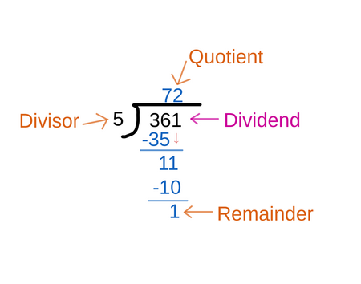

## Table of Contents

## What is a dividend?

A dividend is money that a company pays to its shareholders. It's like a reward for owning part of the company. When a company makes a profit, it can choose to share some of that profit with its shareholders in the form of dividends.

Not all companies pay dividends. Some companies, especially newer ones, might use their profits to grow the business instead of paying dividends. If a company does pay dividends, it usually does so a few times a year. The amount of the dividend can change, depending on how well the company is doing.

## How are dividends paid out to shareholders?

Dividends are paid out to shareholders usually in the form of cash or additional shares of stock. When a company decides to pay a dividend, it sets a date called the "declaration date." This is when the company announces that it will pay a dividend and how much it will be. Shareholders who own the stock on a specific date, known as the "record date," are eligible to receive the dividend.

After the record date, there's a short period before the actual payment, known as the "ex-dividend date." If you buy the stock on or after this date, you won't get the upcoming dividend. The company then sends the dividend payment to the shareholders, usually by direct deposit into their bank accounts or by mailing a check. The payment date is when shareholders actually receive the dividend.

Some companies also offer dividends in the form of additional shares of stock instead of cash. This is called a "stock dividend." Shareholders can choose to receive their dividends this way if the company offers it. Stock dividends increase the number of shares you own, but they don't give you immediate cash.

## What is the difference between a stock dividend and a cash dividend?

A cash dividend is when a company gives money directly to its shareholders. If you own shares in the company, you get a certain amount of money for each share you own. This money can be paid into your bank account or sent to you as a check. It's like getting a little bonus for being a part-owner of the company.

A stock dividend is different because instead of giving you money, the company gives you more shares of its stock. If you own 100 shares and the company gives a 10% stock dividend, you'll get 10 more shares. You don't get any cash right away, but you own more of the company. Over time, these extra shares might become more valuable if the company does well.

Both types of dividends are ways for companies to share their profits with shareholders. Cash dividends give you money you can spend or save right away, while stock dividends give you more ownership in the company, which could be worth more in the future.

## How can one determine if a company pays dividends?

To find out if a company pays dividends, you can look at its financial statements or visit its investor relations website. Most companies that pay dividends will have a section on their website that talks about their dividend policy, including how much they pay and when. You can also check financial news websites or use stock market apps, which often list whether a company pays dividends and how much.

Another way to find out is by looking at the company's history. If a company has been paying dividends regularly in the past, it's likely to continue doing so. You can also ask your broker or financial advisor, as they have access to detailed information about different companies and can tell you if a company pays dividends and what the current rate is.

## What is a dividend yield and how is it calculated?

Dividend yield is a way to measure how much a company pays out in dividends each year compared to its stock price. It tells you what percentage of the stock's price you get back in dividends every year. For example, if a stock costs $100 and pays $5 in dividends each year, the dividend yield is 5%.

To calculate the dividend yield, you take the annual dividend per share and divide it by the stock's current price per share. Then, you multiply the result by 100 to turn it into a percentage. So, if a company pays $2 in dividends per year and its stock price is $50, you would do $2 divided by $50, which equals 0.04. Multiply that by 100, and you get a dividend yield of 4%.

## What are the tax implications of receiving dividends?

When you get dividends, you have to pay taxes on them. In the United States, there are two types of dividends for tax purposes: qualified and non-qualified. Qualified dividends are taxed at a lower rate, similar to long-term capital gains. This rate can be 0%, 15%, or 20%, depending on your income. Non-qualified dividends, on the other hand, are taxed at your regular income tax rate, which can be higher.

To be considered qualified, dividends must meet certain conditions. They need to be paid by a U.S. company or a qualified foreign company, and you must have held the stock for more than 60 days during the 121-day period that begins 60 days before the ex-dividend date. If these conditions aren't met, the dividends are non-qualified and taxed at your regular income tax rate. It's important to keep track of your dividends and their types to correctly report them on your tax return.

## How do dividend reinvestment plans (DRIPs) work?

A dividend reinvestment plan, or DRIP, is a way for shareholders to automatically use their dividend money to buy more shares of the same company. Instead of getting cash dividends, the money is used to buy more stock. This can help your investment grow over time because you end up owning more shares, and those extra shares can earn more dividends in the future.

Many companies offer DRIPs, and they often let you buy the extra shares without paying any fees. Sometimes, you can even buy the shares at a discount. DRIPs are a good choice if you want to keep your money invested and don't need the cash right away. Over time, this can lead to owning a lot more of the company and potentially earning more money from dividends.

## What is the significance of a company's dividend payout ratio?

A company's dividend payout ratio tells you what part of its earnings it gives back to shareholders as dividends. It's like a percentage that shows how much of the company's profit is shared with investors. If a company makes $100 and pays $30 in dividends, the payout ratio is 30%. This ratio helps investors see if a company is good at paying dividends and how much money it keeps for growing the business or other things.

The dividend payout ratio is important because it can tell you about the company's financial health and future plans. A high payout ratio might mean the company is giving most of its earnings back to shareholders, which is good if you want dividends. But it could also mean the company doesn't have much money left to grow or handle tough times. A lower payout ratio might mean the company is keeping more money to invest in new projects or save for the future, which could be good for long-term growth but might mean smaller dividends now.

## How do dividends affect a company's stock price?

When a company announces it will pay a dividend, it can make its stock price go up. This happens because more people want to buy the stock to get the dividend. It's like a reward for owning the stock, so more people want it. But right after the dividend is paid, the stock price usually drops a bit. This is because the value of the dividend is taken out of the company's money, so the stock is worth a little less right after the payment.

Over time, dividends can also affect how people see a company. If a company keeps paying good dividends, people might think it's a stable and good company to invest in. This can make the stock price go up over the long term. But if a company cuts its dividend or stops paying it, people might worry about the company's future, and this can make the stock price go down. So, dividends can have both short-term and long-term effects on a company's stock price.

## What are the advantages and disadvantages of investing in dividend stocks?

Investing in dividend stocks can be a good idea because you get paid regularly just for owning the stock. These payments, called dividends, can give you extra money to spend or save. If you use a dividend reinvestment plan, or DRIP, you can use the dividends to buy more shares without paying fees. This can make your investment grow over time. Also, companies that pay dividends are often stable and have been around for a while, so they can be less risky than newer companies that don't pay dividends.

But there are also some downsides to investing in dividend stocks. One problem is that the stock price might drop right after the dividend is paid. This happens because the value of the dividend is taken out of the company's money, so the stock is worth a little less right after the payment. Another issue is that if a company cuts its dividend or stops paying it, the stock price might go down a lot. This can happen if the company is not doing well financially. So, while dividend stocks can give you regular income, they also come with some risks that you need to think about.

## How can dividend investing contribute to a long-term investment strategy?

Dividend investing can be a key part of a long-term investment strategy because it provides a steady stream of income. When you invest in companies that pay dividends, you get money regularly just for owning their stock. This can help you build wealth over time, especially if you use a dividend reinvestment plan (DRIP). With a DRIP, you can use the dividends to buy more shares without paying fees, which means your investment can grow faster. Over many years, this can add up to a lot more money than if you just kept the dividends in cash.

Another way dividend investing helps with long-term goals is by choosing stable companies. Companies that pay dividends are often well-established and financially strong. They tend to be less risky than newer companies that don't pay dividends. By focusing on these kinds of companies, you can build a more stable investment portfolio. This can help protect your money during tough times and still give you a chance to earn more over the long run. So, dividend investing can be a smart way to grow your wealth slowly and steadily over many years.

## What advanced strategies can be used to maximize returns from dividend investing?

One advanced strategy to maximize returns from dividend investing is called dividend growth investing. This means you pick companies that not only pay dividends but also regularly increase them over time. By focusing on these companies, you can benefit from higher dividend payments in the future. For example, if a company raises its dividend every year, the amount you get will keep going up. This can help your income grow faster than inflation, making your investment more valuable over time. To do this well, you need to look for companies with a strong history of increasing dividends and good financial health, so they can keep raising them.

Another strategy is to use a technique called dividend capture. This involves buying a stock just before the ex-dividend date and then selling it shortly after, to collect the dividend without holding the stock for a long time. This can be tricky because you need to time your trades carefully. If the stock price drops by more than the dividend amount after the ex-dividend date, you might lose money. But if you do it right, you can collect dividends from many different stocks throughout the year, which can add up to a nice extra income. This strategy works best if you have a good understanding of the market and can manage the risks involved.

A third strategy is to diversify your dividend portfolio across different sectors and types of companies. This helps spread out the risk so that if one company or sector has problems, it won't hurt your whole investment. You can also look for companies with high dividend yields, but be careful because a very high yield might mean the company is in trouble. Balancing high-yield stocks with those that have a history of steady dividend growth can give you a good mix of income and growth. By using these strategies together, you can build a strong dividend investment plan that maximizes your returns over the long term.

## What are stock dividends?

Stock dividends refer to distributions of a company's earnings to its shareholders, proffered as gratitude for their investment in the company's equity. These distributions are periodically allocated, usually on a quarterly basis, and represent a share of the company's profits. The decision to declare dividends rests with the company's board of directors and is often a signal of corporate health and profitability.

Fundamentally, dividends provide investors with insight into a company’s financial well-being and future growth. A consistent and increasing dividend payout can suggest robust financial health, stable cash flows, and strong future prospects. Conversely, reduced or inconsistent dividends may hint at underlying financial challenges or reallocations of capital towards growth or debt reduction.

A critical concept in dividend investing is the ex-dividend date, which is the cutoff date to be eligible to receive the declared dividend. If an investor purchases the stock on or after this date, they will not receive the next dividend payment; the seller remains eligible instead. The ex-dividend date is typically set one business day before the record date, the date on which the company reviews its records to determine which shareholders are eligible to receive the dividend. This temporal distinction is essential because the stock price typically drops by approximately the dividend amount on the ex-dividend date due to the dividend payment leaving the company’s balance sheet. Hence, understanding the timeline around ex-dividend and record dates is fundamental in aligning investment strategies for maximizing dividend returns.

Mathematically, the dividend yield can be expressed as:

$$
\text{Dividend Yield} = \frac{\text{Annual Dividends Per Share}}{\text{Price Per Share}}
$$

This metric allows investors to evaluate the income generated relative to the equity price, facilitating comparisons across different stocks or investment opportunities. 

In conclusion, stock dividends serve as a tangible connection between companies and their shareholders, reflecting the company’s financial circumstances and strategic outlook. The declaration, analysis, and timing related to dividend payouts are integral to constructing a profitable and sustainable investment portfolio.

## What are the benefits of dividend investing?

Dividend investing provides investors with the dual benefits of generating a consistent passive income and the potential for capital appreciation over time. The practice involves investing in companies that regularly distribute a portion of their earnings to shareholders in the form of dividends. This income stream can be particularly appealing to investors seeking a steady return, as it is less dependent on the company’s stock performance.

Reinvesting dividends is a powerful strategy that can lead to compounding returns, thereby significantly enhancing long-term investment outcomes. The concept of compounding involves [earning](/wiki/earning-announcement) returns on both the initial principal and the accumulated dividends from previous periods. For example, if an investor receives a dividend payment and reinvests it by purchasing additional shares, those new shares will, in turn, earn dividends in the future. Over time, this reinvestment strategy can result in exponential growth of the investment's overall value. Here is a simple formula to calculate the future value $FV$ of an investment compounded at regular intervals:

$$

FV = P \times \left(1 + \frac{r}{n}\right)^{nt}
$$

where $P$ is the initial principal balance, $r$ is the annual interest rate (or dividend yield in this context), $n$ is the number of times that interest is compounded per year, and $t$ is the number of years the money is invested or borrowed for.

Dividends are also known to offer a layer of financial insulation during volatile market conditions. Many companies strive to maintain or even increase their dividend payouts during economic downturns, reflecting a commitment to return value to their shareholders. This can stabilize cash flow for investors when stock prices are fluctuating, making dividend-paying stocks a more reliable component of a diversified investment portfolio. High-quality companies with strong balance sheets often continue to generate sufficient cash flow to support dividend payments, thus providing investors with financial resilience even in adverse market environments. This characteristic of dividend-paying stocks can be particularly beneficial during times of economic uncertainty, helping to mitigate overall portfolio risk.

In summary, dividend investing is not only useful for generating consistent income but also enhances overall investment returns through reinvestment and compounding. Moreover, during periods of market instability, dividends can provide a measure of security, as many companies focus on preserving or increasing their payouts, thus ensuring continued shareholder value.

## What are effective strategies for maximizing dividend income?

Employing a dividend growth strategy is a popular method for maximizing dividend income. This approach involves investing in stocks with a consistent history of dividend increases. Companies that regularly increase dividends often demonstrate reliable earnings growth and financial health. Over time, these dividend hikes can lead to higher overall returns, as the reinvested dividends compound, thus enhancing the investor's capital appreciation along with the income stream.

Diversification is another critical component in maximizing dividend income. By spreading investments across various sectors and industries, investors can mitigate the risks associated with dividend cuts or eliminations by individual companies. For instance, economic downturns may affect specific sectors differently, while others may remain stable or even flourish, ensuring that the overall dividend income remains steady. This strategy helps in balancing the volatility that may arise from over-reliance on any single industry or company for dividends.

The dividend capture strategy is a tactical approach that leverages timing around the ex-dividend date. Investors buy the stock just before it goes ex-dividend, entitling them to receive the dividend, and then sell it shortly after. The formula for determining eligibility based on the ex-dividend date is crucial for implementing this strategy:

$$
\text{Ex-dividend Date} = \text{Record Date} - \text{Settlement Period}
$$

This technique, however, requires precision and a clear understanding of tax implications and transaction costs, which can otherwise negate potential profits. It is beneficial when used under favorable market conditions or with stocks known for predictable dividend behaviors.

In conclusion, integrating a dividend growth strategy within a diversified portfolio and tactfully employing the dividend capture technique can optimize dividend income effectively. However, each strategy carries its nuances and risks, requiring thorough research and consideration of individual financial goals and market conditions.

## What are the risks and challenges in dividend investing?

Dividend investing, while potentially lucrative, comes with its own set of risks and challenges that investors must navigate to maintain a steady income flow. One significant concern is the risk of dividend cuts. Companies may reduce or eliminate dividend payouts due to adverse financial conditions or poor performance. Investors should continuously monitor the financial health and earnings stability of companies within their portfolio to mitigate this risk. Evaluating a firm's payout ratio, which is the proportion of earnings paid out as dividends, can provide insights into its capacity to sustain dividend payments. A high payout ratio may indicate vulnerability to dividend cuts, especially if earnings decline. The payout ratio can be calculated as:

$$
\text{Payout Ratio} = \left( \frac{\text{Dividends per Share}}{\text{Earnings per Share}} \right) \times 100
$$

Tax implications also pose challenges to dividend investing. Dividend income is generally subject to taxation, and the rate can vary based on the investor's tax bracket and the jurisdiction of the dividend-paying company. Foreign dividends may incur withholding taxes from the country in which the company is based, reducing the net income received by the investor. Tax credits or deductions might be available in some jurisdictions to offset foreign taxes, but these require careful navigation of complex tax laws.

Market volatility is another intrinsic challenge to dividend investing. Stock prices can fluctuate due to macroeconomic conditions, changes in interest rates, or market sentiment. Such volatility can affect the dividend yield, calculated as the annual dividend per share divided by the stock price. While a stock's price may fall, making the yield appear more attractive, this could signal underlying issues within the company. Thus, maintaining a long-term investment outlook and adherence to investment fundamentals are crucial in such volatile markets.

Investors must also address the impacts of inflation, which can erode the purchasing power of dividend income over time. Companies with a strong track record of dividend growth are often better positioned to combat inflation, as increasing dividends can help maintain investment value in real terms.

Utilizing tools such as algorithmic trading can aid in managing these risks through systematic investment strategies. However, such methods require technical expertise and rigorous risk management practices to be effective. Investors should balance technological tools with comprehensive research and [fundamental analysis](/wiki/fundamental-analysis) to navigate the challenges inherent in dividend investing and achieve their financial objectives effectively.

## References & Further Reading

[1]: Graham, B., & Dodd, D. (2009). ["Security Analysis: Sixth Edition, Foreword by Warren Buffett."](https://www.amazon.com/Security-Analysis-Foreword-Buffett-Editions/dp/0071592539) McGraw-Hill Education.

[2]: Bodie, Z., Kane, A., & Marcus, A. J. (2020). ["Investments, 11th Edition."](https://www.mheducation.com/highered/product/investments-bodie-kane/M9781264412662.html) McGraw-Hill Education.

[3]: Marks, H. (2018). ["Mastering the Market Cycle: Getting the Odds on Your Side."](https://www.amazon.com/Mastering-Market-Cycle-Getting-Odds/dp/1328479250) Mariner Books.

[4]: Hirschey, M. (2018). ["Advanced Accounting, Global Edition."](https://www.pearson.com/en-gb/subject-catalog/p/advanced-accounting-global-edition/P200000003670/9781292214627) Pearson.

[5]: Fabozzi, F. J., & Peterson Drake, P. (2009). ["Financial Management and Analysis Workbook: Step-by-Step Exercises and Tests to Help You Master Financial Management and Analysis."](https://onlinelibrary.wiley.com/doi/book/10.1002/9781119203513) Wiley.

[6]: Hull, J. C. (2018). ["Options, Futures, and Other Derivatives, 10th Edition."](https://www.semanticscholar.org/paper/Options%2C-Futures%2C-and-Other-Derivatives-Hull/89bdee500c8623864fc9eb7a471546aa713acc44) Pearson.