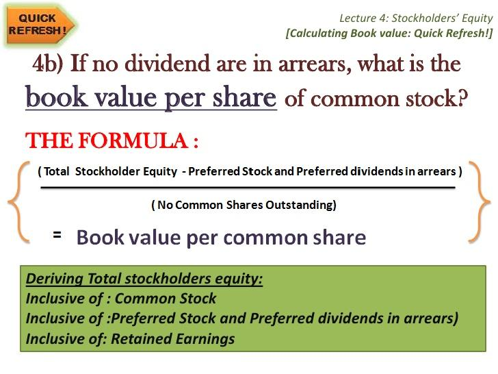

## Table of Contents

## What are dividends?

Dividends are payments that companies give to their shareholders from their profits. When a company makes money, it can choose to share some of that money with the people who own its stocks. This sharing of profits is called a dividend. Shareholders usually receive dividends in the form of cash, but sometimes they can get more shares of the company instead.

Not all companies pay dividends. Some companies, especially newer ones, might decide to use all their profits to grow the business instead of paying dividends. Companies that do pay dividends often do so regularly, like every three months or once a year. This can make dividends a nice extra income for people who own stocks in those companies.

## What are preferred shares?

Preferred shares are a type of stock that gives owners certain advantages over common shareholders. The main advantage is that preferred shareholders get paid dividends before common shareholders. This means if a company decides to share its profits, it has to pay preferred shareholders first. Another advantage is that if the company goes bankrupt and has to sell everything, preferred shareholders get their money back before common shareholders.

However, preferred shares also have some downsides. Usually, preferred shareholders don't get to vote on company decisions like common shareholders do. This means they have less say in how the company is run. Also, while preferred shares can offer a steady income from dividends, the price of these shares might not grow as much as common shares. So, people who buy preferred shares are often looking for a reliable income rather than big gains in the stock's value.

## What does 'dividends in arrears' mean?

Dividends in arrears are unpaid dividends that a company owes to its preferred shareholders. When a company can't pay the dividends it promised to its preferred shareholders, those dividends start to pile up. This happens because preferred shareholders are supposed to get their dividends before common shareholders, and sometimes the company might not have enough money to pay them on time.

These unpaid dividends keep adding up until the company can pay them. The company has to pay these back dividends before it can start paying dividends to common shareholders again. This is important because it shows that the company is trying to take care of its preferred shareholders first, as it promised when it issued the preferred shares.

## How do dividends in arrears affect preferred shareholders?

Dividends in arrears can be a worry for preferred shareholders. When a company can't pay the dividends it promised, it owes those dividends to the preferred shareholders. This means the shareholders don't get the money they were expecting right away. They have to wait until the company can pay them. This can be tough because they might have been counting on that money for their own expenses.

On the bright side, preferred shareholders are at the front of the line when it comes to getting paid. The company has to pay them the missed dividends before it can pay any dividends to common shareholders. This rule gives preferred shareholders a bit more security. They know that even if they have to wait, the company will have to pay them first once it has the money.

## Why do companies issue preferred shares with cumulative dividends?

Companies issue preferred shares with cumulative dividends because it can attract investors who want a steady income. When dividends are cumulative, it means if the company can't pay dividends one year, it has to pay them later. This makes the shares more appealing to people who want to be sure they will get their money eventually, even if the company faces tough times.

This kind of preferred share also helps the company in another way. It shows investors that the company is serious about taking care of its shareholders. By promising to pay any missed dividends in the future, the company can build trust with investors. This trust can make it easier for the company to raise money when it needs to.

## What is the difference between cumulative and non-cumulative preferred shares?

Cumulative preferred shares and non-cumulative preferred shares differ in what happens if the company can't pay dividends on time. With cumulative preferred shares, if the company misses a dividend payment, it has to pay it later. The missed dividends add up, or accumulate, and the company must pay them before it can pay any dividends to common shareholders. This makes cumulative preferred shares more attractive to investors who want to be sure they'll get their money eventually, even if the company hits a rough patch.

On the other hand, non-cumulative preferred shares don't offer this protection. If the company misses a dividend payment, those dividends are gone forever. The shareholders won't get them later. This makes non-cumulative preferred shares riskier for investors, but it can be easier for the company because they don't have to worry about paying back missed dividends. Companies might choose non-cumulative preferred shares if they want more flexibility in how they manage their money.

## How are dividends in arrears reported on a company's financial statements?

Dividends in arrears are not shown directly on a company's main financial statements like the balance sheet or income statement. Instead, they are usually mentioned in the notes to the financial statements. These notes give more details about the numbers in the main statements. Companies have to tell investors about any dividends in arrears because it's important information that can affect how people see the company's financial health.

In the notes, the company will say how much money in dividends it owes to preferred shareholders. This helps investors understand that the company has a promise to pay these dividends before it can pay any dividends to common shareholders. By putting this information in the notes, the company is being open about its financial situation, which can help build trust with investors.

## What are the legal implications for a company failing to pay dividends in arrears?

If a company doesn't pay dividends in arrears, it could face legal problems. When a company issues preferred shares with cumulative dividends, it makes a promise to pay those dividends. If it doesn't keep that promise, preferred shareholders might take the company to court. They could argue that the company broke its contract with them. This could lead to lawsuits and damage the company's reputation.

The legal trouble might not stop there. If the company keeps missing payments, it could be seen as not being able to meet its financial obligations. This could lead to more serious issues, like the company being forced into bankruptcy. In bankruptcy, the company would have to sell off its assets to pay its debts, including the dividends in arrears. So, failing to pay dividends in arrears can lead to big legal headaches for a company.

## How do dividends in arrears impact a company's credit rating?

Dividends in arrears can hurt a company's credit rating. When a company can't pay the dividends it owes to preferred shareholders, it shows that the company might be having money problems. Credit rating agencies look at this and might think the company is riskier. If they think the company is riskier, they might lower its credit rating. A lower credit rating makes it harder for the company to borrow money, and if it does borrow, it might have to pay higher interest rates.

On the other hand, if the company can explain why it missed the dividend payments and show a plan to pay them later, it might not hurt the credit rating as much. For example, if the company missed payments because of a temporary problem but is now doing better, credit rating agencies might be more understanding. But if the company keeps missing payments and can't fix its financial problems, the credit rating will likely go down, making it tougher for the company to get money it needs.

## What strategies can a company use to manage or eliminate dividends in arrears?

A company can manage or eliminate dividends in arrears by first looking at its money situation. If the company is having trouble paying its bills, it might need to cut costs or find other ways to make more money. This could mean selling things it doesn't need, borrowing money, or even selling new shares to raise cash. Once the company has more money, it can start paying the dividends it owes to its preferred shareholders. This helps clear up the dividends in arrears and shows investors that the company is trying to fix its problems.

Another way to deal with dividends in arrears is to talk to the shareholders. The company can explain why it missed the payments and ask for some time to get its finances in order. Sometimes, shareholders might agree to wait longer for their dividends if they believe in the company's future. If the shareholders are willing to wait, the company can use the money it saves to improve its business and pay the dividends later. This can help the company avoid legal trouble and keep its credit rating from dropping too much.

## How do investors assess the risk of dividends in arrears when investing in preferred shares?

Investors look at a few things to figure out if dividends in arrears might be a problem when they think about buying preferred shares. They check the company's money situation by looking at its financial statements. If the company has a lot of debt or isn't making enough profit, it might be hard for them to pay dividends. Investors also read the notes in the financial statements to see if the company already has dividends in arrears. If it does, that's a warning sign that the company might have trouble paying dividends in the future.

Investors also think about the company's history and what it says about paying dividends. If the company has missed payments before but then caught up, that might not be as scary. But if the company keeps missing payments and can't explain why, that's a bigger risk. Investors might decide to ask for a higher return to make up for that risk, or they might choose not to invest in the company at all if they think the risk is too high.

## What are the tax implications for investors receiving dividends in arrears?

When investors get dividends in arrears, they have to pay taxes on that money. The tax they pay depends on where they live and what kind of dividends they are. In many places, dividends are taxed as regular income, which means investors might pay a higher tax rate on them than on other types of investment income like capital gains.

Sometimes, the way dividends in arrears are taxed can be different from regular dividends. For example, if the dividends were supposed to be paid in a different tax year, the investor might need to report them in the year they actually get the money. This can make tax planning a bit trickier, but it's important for investors to know the rules in their area so they can handle their taxes correctly.

## References & Further Reading

[1]: Higgins, K. (2012). ["Preferred Stock: Basics and Features."](https://www.scirp.org/reference/ReferencesPapers?ReferenceID=2225527) Investopedia.

[2]: Fabozzi, F. J. (2011). ["Fixed Income Analysis."](https://www.amazon.com/Fixed-Income-Analysis-Frank-Fabozzi/dp/047005221X) John Wiley & Sons.

[3]: Hasbrouck, J., & Saar, G. (2013). ["Low-latency trading."](https://www.sciencedirect.com/science/article/abs/pii/S1386418113000165) The Review of Financial Studies, 26(9), 2585-2622.

[4]: Menkveld, A. J. (2013). ["High frequency trading and the new market makers."](https://www.sciencedirect.com/science/article/pii/S1386418113000281) The Review of Financial Studies, 26(4), 1051-1073.

[5]: ["Algorithmic Trading: Winning Strategies and Their Rationale"](https://www.amazon.com/Algorithmic-Trading-Winning-Strategies-Rationale-ebook/dp/B00CY5HC0U) by Ernest P. Chan