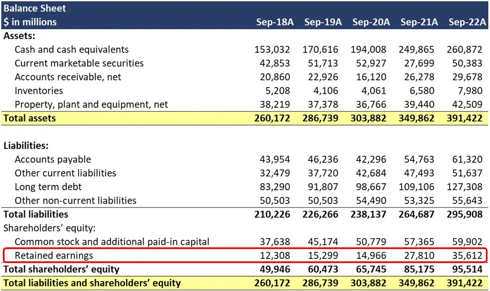

## Table of Contents

## What is a dividend?

A dividend is money that a company pays to its shareholders. It's like a reward for owning part of the company. When a company makes a profit, it can choose to share some of that profit with its shareholders. This payment is usually made every three months, but it can be more or less often.

Not all companies pay dividends. Some companies, especially newer ones, might use their profits to grow the business instead of paying dividends. Companies that do pay dividends often do so because they want to attract investors who are looking for regular income. The amount of the dividend can change, and sometimes a company might decide to stop paying dividends altogether.

## How are dividends recorded on a company's balance sheet?

Dividends are not directly recorded on a company's balance sheet. Instead, they affect the balance sheet indirectly through the retained earnings account, which is part of the equity section. When a company declares a dividend, it creates a liability on the balance sheet called "dividends payable." This shows that the company owes money to its shareholders.

Once the dividends are paid out, the "dividends payable" liability is removed from the balance sheet, and the retained earnings are reduced by the same amount. Retained earnings represent the cumulative profits that the company has kept over time, so paying dividends decreases this account. This way, the balance sheet reflects the company's decision to distribute profits to shareholders rather than keeping them within the company.

## What is the difference between dividends paid and dividends declared?

Dividends declared are when a company says it will pay money to its shareholders. This happens before the money actually goes out. When a company declares dividends, it makes a promise to pay, and this promise shows up on the balance sheet as a "dividends payable" account. This means the company owes money to its shareholders but hasn't given it to them yet.

Dividends paid are when the company actually gives the money to its shareholders. After the company pays the dividends, the "dividends payable" account goes away because the company no longer owes that money. The amount paid also comes out of the company's retained earnings, which is the money the company has kept from its profits over time. So, dividends paid show that the company has followed through on its promise to share profits with shareholders.

## Can you explain the concept of retained earnings in relation to dividends?

Retained earnings are the money a company keeps after it pays all its bills and gives dividends to shareholders. It's like a savings account for the company, where it can store money to use later for things like growing the business or buying new stuff. When a company makes a profit, it can choose to either keep that money as retained earnings or share it with shareholders as dividends.

When a company decides to pay dividends, it takes money out of its retained earnings. This means the amount of retained earnings goes down by the amount of the dividends paid. For example, if a company has $100 in retained earnings and pays $20 in dividends, the retained earnings will then be $80. So, dividends and retained earnings are connected because paying dividends reduces the amount of money the company has saved up in its retained earnings.

## How does paying dividends affect a company's financial statements?

When a company pays dividends, it affects its financial statements in a few important ways. On the balance sheet, dividends create a liability called "dividends payable" when they are declared. This means the company owes money to its shareholders. Once the dividends are actually paid, this liability goes away, and the company's retained earnings, which is part of the equity section, go down by the same amount. So, paying dividends reduces the company's total equity because it's giving money away that it had kept from its profits.

On the statement of cash flows, paying dividends shows up in the financing activities section. This part of the statement tracks money coming in and going out from things like borrowing or paying back loans, and paying dividends. When a company pays dividends, it's using its cash, so this shows as a cash outflow in the financing activities section. This means the company's cash balance goes down because it's giving money to its shareholders.

## What are the different types of dividends and how are they treated on the balance sheet?

There are different types of dividends, like cash dividends, stock dividends, and property dividends. Cash dividends are the most common and are when a company gives money to its shareholders. Stock dividends are when a company gives more shares of its own stock to shareholders instead of money. Property dividends are when a company gives something other than cash or stock, like products or assets, to shareholders.

When a company declares cash dividends, it creates a liability on the balance sheet called "dividends payable." This shows that the company owes money to its shareholders. Once the cash dividends are paid, this liability goes away, and the company's retained earnings, which is part of the equity section, goes down by the same amount. For stock dividends, the company doesn't pay out cash, so there's no "dividends payable" liability. Instead, the company increases the number of shares outstanding and adjusts the retained earnings and common stock accounts. Property dividends are treated similarly to cash dividends, creating a "dividends payable" liability until the assets are distributed, after which the liability is removed and retained earnings are reduced.

Each type of dividend affects the balance sheet differently, but they all involve the company giving something of value to shareholders, which ultimately reduces the company's retained earnings. This reflects the company's choice to share its profits with shareholders rather than keeping them within the company.

## How do companies decide on the amount of dividends to pay?

Companies decide on the amount of dividends to pay by looking at a few important things. First, they check how much profit they made. If they made a lot of money, they might decide to share more of it with shareholders. They also think about how much money they need to keep for the future. If they want to grow the business or buy new things, they might keep more money and pay less in dividends. They also look at what other companies in their industry are doing. If other companies are paying big dividends, they might want to do the same to keep their shareholders happy.

Another thing companies think about is what their shareholders want. Some shareholders like getting regular money from dividends, while others might prefer the company to use the money to grow and make the stock price go up. Companies also have to follow rules about how much they can pay in dividends. For example, they can't pay more than they have made in profit. So, they have to balance all these things to decide on the right amount of dividends to pay.

## What is the impact of dividend policy on a company's stock price?

A company's dividend policy can affect its stock price in a few ways. When a company starts paying dividends or increases them, it can make shareholders happy because they get more money. This can make the stock price go up because more people want to buy the stock. Also, if the company pays steady dividends over time, it can make investors trust the company more, which can also help the stock price. But, if the company pays out too much in dividends and doesn't have enough money left to grow, it might make the stock price go down because investors might worry about the company's future.

On the other hand, if a company cuts its dividends or stops paying them, it can make the stock price go down. This is because shareholders might feel like the company is not doing well if it can't keep paying dividends. They might sell their shares, which can lower the stock price. Also, some investors only buy stocks that pay dividends, so if a company stops paying, these investors might not want to buy the stock anymore. So, the dividend policy is important and can have a big effect on how much people are willing to pay for the company's stock.

## How do dividends affect a company's cash flow statement?

When a company pays dividends, it shows up on the cash flow statement in the financing activities section. This part of the statement tracks money coming in and going out from things like borrowing money, paying back loans, or paying dividends. When a company pays dividends, it's using its cash to give money to shareholders, so this shows as a cash outflow in the financing activities section. This means the company's cash balance goes down because it's giving money away.

Dividends affect the cash flow statement because they represent a use of the company's cash. If a company decides to pay a lot of dividends, it will show a big cash outflow in the financing activities section. This can tell investors and analysts that the company is giving a lot of its profits back to shareholders instead of keeping it for other things like growing the business or paying off debts. So, looking at the cash flow statement can help people understand how the company is managing its money and what it's choosing to do with its profits.

## What are the tax implications of dividends for both the company and the shareholders?

For the company, paying dividends doesn't usually affect its taxes directly because dividends are paid out of after-tax profits. This means the company has already paid taxes on the money it's giving to shareholders. However, there are some exceptions. For example, if a company pays dividends from money it got from certain tax-exempt sources, it might have to pay a special tax on those dividends. Also, if a company gives stock dividends instead of cash, there might be different tax rules to follow.

For shareholders, the tax situation can be a bit more complicated. When shareholders get dividends, they usually have to pay taxes on them. The tax rate depends on whether the dividends are "qualified" or "ordinary." Qualified dividends are taxed at a lower rate, like the capital gains tax rate, which can be 0%, 15%, or 20% depending on the shareholder's income. Ordinary dividends are taxed at the shareholder's regular income tax rate, which can be higher. Shareholders need to report dividends on their tax returns and might have to fill out special forms to figure out how much tax they owe.

## How do analysts use dividend information to assess a company's financial health?

Analysts use dividend information to get a good idea of how well a company is doing. They look at how much money the company is paying out in dividends compared to its profits. If a company is paying out a lot of its profits as dividends, it might mean the company is doing well and has extra money to share with shareholders. But if the company is paying out more than it's making, it could be a sign that the company is not doing so well and might be using its savings to pay dividends. Analysts also look at how steady the dividends are over time. If a company keeps paying the same amount or more, it can show that the company is stable and doing okay.

Another thing analysts look at is how the company's dividend policy compares to other companies in the same industry. If a company is paying more dividends than its competitors, it might mean the company is doing better or has a different strategy. But if it's paying less, it could mean the company needs to keep more money for growth or other things. By looking at all these things, analysts can get a better picture of the company's financial health and decide if it's a good investment.

## What are some advanced strategies companies use regarding dividend payments and how do these affect the balance sheet?

Some companies use a strategy called "dividend reinvestment plans" (DRIPs). With DRIPs, shareholders can choose to take their dividends in more shares of the company's stock instead of cash. This doesn't change the balance sheet much because the company isn't giving away cash. Instead, it just gives out more shares. The retained earnings go down, but so does the cash, so the total equity stays the same. This can help the company keep more cash to use for other things like growing the business.

Another strategy is "special dividends." These are one-time payments that a company might give out when it has extra money, like from selling a big part of the business. Special dividends can create a "dividends payable" account on the balance sheet when they are declared, just like regular dividends. But because they're not expected to happen again, they don't affect the company's regular dividend policy. When the special dividends are paid, the cash goes down, and so do the retained earnings. This can make the balance sheet look different for a short time, but it doesn't change the company's long-term financial plan.

## What are the implications of dividends on financial statements and how can they be understood?

Dividends are distributions made by a corporation to its shareholders, typically derived from the company's profits. They represent a direct method for shareholders to benefit financially from their investments, often serving as an indicator of the corporation’s profitability and its management’s confidence in sustained earnings. While dividends are not recorded in the income statement, they exert significant influences on both the balance sheet and the cash flow statement.

When a dividend is declared, it appears on the balance sheet as a liability under 'dividends payable'. This entry signifies a future cash outflow and reflects the company’s commitment to distribute profits to its shareholders. This liability remains until the dividend is actually paid out, at which point it is removed from the liabilities and a corresponding cash outflow is recorded in the cash flow statement.

The declaration and distribution of dividends also influence the balance sheet's composition by reducing retained earnings, an integral part of shareholder equity. Retained earnings are profits not distributed as dividends and are essential for funding future growth or absorbing potential losses. The formula illustrating this impact is as follows:

$$
\text{Retained Earnings}_{\text{end}} = \text{Retained Earnings}_{\text{begin}} + \text{Net Income} - \text{Dividends Paid}
$$

This equation shows that declared and paid dividends decrease retained earnings, thus affecting the company’s equity. Such modifications in shareholder equity can offer insights into a company's fiscal policies and its focus on returning profit to its shareholders versus reinvesting in the business.

Understanding these financial statement implications is crucial for investors. Dividends serve as a tangible measure of financial reward, and consistent or growing dividends often indicate a financially sound company with solid cash flows. Evaluating how dividends alter the balance sheet helps investors judge a company’s commitment to shareholder returns and gauge its financial stability. The diligent analysis of these factors provides a clearer picture of the company's financial health, thereby aiding investment decisions.

## References & Further Reading

[1]: ["Dividends: Still the Basics"](https://www.cnbc.com/select/what-are-dividends/) by J. Richard Dietrich in Financial Analysts Journal

[2]: Damodaran, A. (2006). ["Damodaran on Valuation: Security Analysis for Investment and Corporate Finance"](https://onlinelibrary.wiley.com/doi/book/10.1002/9781119201786) Wiley Finance.

[3]: Hull, J. C. (2009). ["Options, Futures, and Other Derivatives"](https://www.amazon.com/Options-Futures-Other-Derivatives-9th/dp/0133456315) Pearson.

[4]: Chan, E. P. (2009). ["Quantitative Trading: How to Build Your Own Algorithmic Trading Business"](https://github.com/ftvision/quant_trading_echan_book) Wiley Trading.

[5]: Sharpe, W. F., Alexander, G. J., & Bailey, J. V. (1999). ["Investments"](https://archive.org/details/investments0000shar) Prentice Hall.