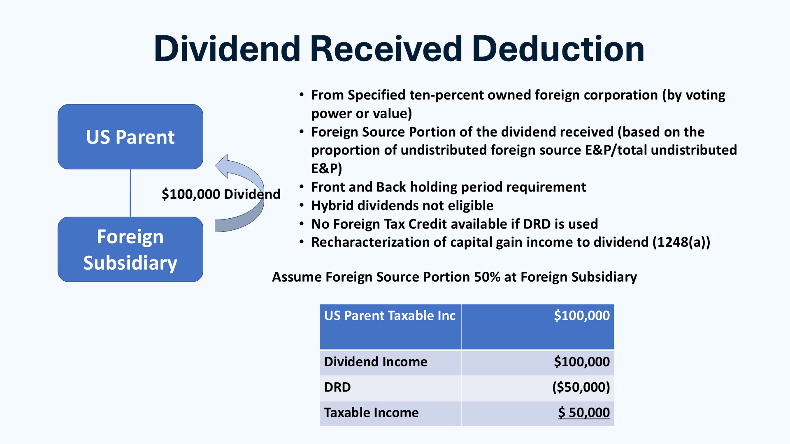

## Table of Contents

## What is a Dividends Received Deduction (DRD)?

The Dividends Received Deduction (DRD) is a tax break that companies in the United States can use. It allows a company to deduct a portion of the dividends it receives from its taxable income. This is meant to help avoid double taxation, where the same earnings are taxed at both the corporate level and again when they are paid out as dividends.

To qualify for the DRD, the dividends must come from a domestic corporation or a qualified foreign corporation. The amount of the deduction can vary, usually between 50% to 100% of the dividends received, depending on the ownership percentage in the company paying the dividends. This can significantly lower the tax burden for companies that hold stocks in other corporations.

## Who is eligible to claim the Dividends Received Deduction?

The Dividends Received Deduction (DRD) is available to companies in the United States that receive dividends from other domestic or qualified foreign corporations. This deduction helps these companies reduce their taxable income by allowing them to deduct a portion of the dividends they receive. The main goal is to prevent the same earnings from being taxed twice, once at the corporate level and again when distributed as dividends.

To be eligible, the receiving company must own stock in the corporation paying the dividends. The amount of the deduction depends on the percentage of ownership the receiving company has in the corporation paying the dividends. For example, if a company owns less than 20% of the stock, it might be able to deduct 50% of the dividends received. If it owns more than 20% but less than 80%, it could deduct 65%. And if it owns 80% or more, it might be able to deduct 100% of the dividends. This system helps larger shareholders benefit more from the deduction.

## How does the Dividends Received Deduction work?

The Dividends Received Deduction (DRD) helps companies in the United States pay less in taxes. It lets a company take a part of the money it gets from dividends off its taxable income. This is important because it stops the same money from being taxed twice - once when the company makes it, and again when it's given out as dividends. The company that gets the dividends must own stock in the company paying them. The amount they can deduct depends on how much of the paying company they own.

For example, if a company owns less than 20% of another company's stock, it can usually deduct 50% of the dividends it receives. If it owns between 20% and 80%, it can deduct 65%. And if it owns 80% or more, it might be able to deduct all of the dividends. This system helps bigger shareholders save more on their taxes. By using the DRD, companies can lower their tax bills and keep more of their money.

## What types of dividends qualify for the DRD?

Dividends that qualify for the Dividends Received Deduction (DRD) come from domestic corporations or certain foreign corporations. A domestic corporation is a company that was created in the United States. A qualified foreign corporation is one that is based in a country that has a tax treaty with the U.S. or if its stock is traded on a major U.S. stock exchange. The dividends must be from stocks the receiving company owns.

The DRD helps companies avoid paying taxes on the same money twice. It lets them take a part of the dividends they get off their taxable income. The amount they can deduct depends on how much of the paying company's stock they own. If they own less than 20%, they can deduct 50% of the dividends. If they own between 20% and 80%, they can deduct 65%. And if they own 80% or more, they can deduct 100% of the dividends. This way, bigger shareholders can save more on their taxes.

## What are the different DRD percentages and how are they applied?

The Dividends Received Deduction (DRD) lets companies in the United States take a part of the money they get from dividends off their taxable income. The amount they can deduct depends on how much of the company paying the dividends they own. If a company owns less than 20% of the other company's stock, they can deduct 50% of the dividends they receive. This means if they get $100 in dividends, they can take $50 off their taxable income.

If a company owns between 20% and 80% of the other company's stock, they can deduct 65% of the dividends. So, if they get $100 in dividends, they can take $65 off their taxable income. If they own 80% or more of the stock, they can deduct 100% of the dividends. This means they can take the whole $100 off their taxable income. This system helps bigger shareholders save more on their taxes.

## How do you calculate the Dividends Received Deduction?

To calculate the Dividends Received Deduction (DRD), you need to know how much of the company paying the dividends you own. The amount you can deduct depends on this ownership percentage. If your company owns less than 20% of the other company's stock, you can deduct 50% of the dividends you receive. For example, if you get $100 in dividends, you can take $50 off your taxable income. If your company owns between 20% and 80% of the stock, you can deduct 65% of the dividends. So, if you get $100 in dividends, you can take $65 off your taxable income.

If your company owns 80% or more of the other company's stock, you can deduct 100% of the dividends. This means if you get $100 in dividends, you can take the whole $100 off your taxable income. This system helps bigger shareholders save more on their taxes. By using the DRD, companies can lower their tax bills and keep more of their money.

## What are the tax implications of claiming the DRD?

When a company claims the Dividends Received Deduction (DRD), it can reduce its taxable income. This means the company pays less in taxes. The amount of the deduction depends on how much of the company paying the dividends the receiving company owns. If it owns less than 20%, it can deduct 50% of the dividends. If it owns between 20% and 80%, it can deduct 65%. And if it owns 80% or more, it can deduct all of the dividends. This helps the company keep more of its money.

The tax savings from the DRD can be important for a company's finances. By lowering its taxable income, the company can have more money to use for other things like growing the business or paying its employees. But, the company needs to make sure it follows all the rules to claim the DRD correctly. If it doesn't, it could face penalties or have to pay more in taxes later.

## Can the DRD be combined with other tax deductions?

Yes, the Dividends Received Deduction (DRD) can be combined with other tax deductions. This means a company can use the DRD along with other ways to lower its taxes. For example, a company might also use deductions for business expenses, like rent or employee salaries, to reduce its taxable income even more. Combining the DRD with other deductions can help the company save a lot on taxes.

But, there are rules to follow when combining deductions. A company needs to make sure it follows all the tax laws. If it doesn't, it could face penalties or have to pay more in taxes later. So, it's important for a company to work with a tax professional to make sure it's using all the deductions correctly and getting the most tax savings possible.

## How has the DRD changed over time due to tax law amendments?

The Dividends Received Deduction (DRD) has seen changes over the years because of updates to tax laws. When it was first made, the DRD was meant to help stop the same money from being taxed twice. Over time, the rules about how much of the dividends a company could deduct have changed. For example, the Tax Reform Act of 1986 made big changes to the DRD. Before that, companies could deduct up to 85% of the dividends they got. After the act, the deduction rates were set at 70%, 80%, or 100%, depending on how much of the company paying the dividends they owned.

More recently, the Tax Cuts and Jobs Act of 2017 made the DRD simpler. It changed the deduction rates to 50%, 65%, or 100%, based on the ownership percentage. This made the DRD easier to understand and use. These changes show how tax laws can be updated to help businesses and make sure the tax system is fair. Companies need to keep up with these changes to make sure they're using the DRD correctly and getting the most tax savings possible.

## What are common mistakes to avoid when claiming the DRD?

One common mistake when claiming the Dividends Received Deduction (DRD) is not checking if the dividends qualify. Only dividends from domestic corporations or certain foreign corporations can be used for the DRD. If a company tries to deduct dividends from other sources, they might face penalties or have to pay more taxes later. It's important to make sure the dividends come from the right kind of company before claiming the deduction.

Another mistake is getting the ownership percentage wrong. The amount a company can deduct depends on how much of the company paying the dividends they own. If they own less than 20%, they can deduct 50% of the dividends. If they own between 20% and 80%, they can deduct 65%. And if they own 80% or more, they can deduct 100%. If a company makes a mistake with these numbers, they might claim the wrong amount and cause tax problems. It's a good idea to double-check the ownership percentage to make sure the deduction is right.

## How does the DRD affect corporate tax strategies?

The Dividends Received Deduction (DRD) can be a big part of how companies plan their taxes. It lets them take some of the money they get from dividends off their taxable income. This can lower the taxes they have to pay. Companies might choose to buy more stocks in other companies because they know they can use the DRD to save on taxes. This can change how they invest their money and make their overall tax plan better.

Using the DRD can also make a company's finances stronger. By paying less in taxes, they can keep more money to use for other things like growing the business or paying employees. But, companies need to be careful to follow all the rules about the DRD. If they make a mistake, they could have to pay more taxes or get fined. So, it's important for them to work with tax experts to make sure they're using the DRD the right way and getting the most out of it.

## What are the international considerations for the DRD in multinational corporations?

For multinational corporations, the Dividends Received Deduction (DRD) can be tricky because it involves rules from different countries. The DRD usually applies to dividends from domestic corporations or certain foreign corporations that have a tax treaty with the U.S. or are traded on a major U.S. stock exchange. So, a multinational company needs to check if the dividends they get from their foreign operations can be used for the DRD. If they can, the company can save on U.S. taxes. But, they also need to think about the tax laws in the countries where they are getting the dividends from. These countries might have their own rules about how dividends are taxed, and this can change how much the company saves with the DRD.

Because of these different tax rules, multinational corporations often need to plan carefully. They might need to set up their business in certain ways to make the most of the DRD and other tax benefits. This can mean choosing where to keep their money or how to structure their investments. Working with tax experts who know about international tax laws can help these companies use the DRD correctly and avoid any tax problems. By doing this, they can lower their overall tax bill and keep more money for their business.

## References & Further Reading

[1]: Roller, M., & Cassin, J. P. (2017). ["U.S. Dividends Received Deduction: Recent Developments and Planning Considerations."](https://pubmed.ncbi.nlm.nih.gov/28787233/) Chapman and Cutler LLP.

[2]: U.S. Department of the Treasury, Internal Revenue Service. ["Publication 542: Corporations."](https://www.irs.gov/publications/p542) Internal Revenue Service.

[3]: Pitluck, A., & Bittker, B. I. (2002). "Federal Income Taxation of Corporations and Shareholders." Wolters Kluwer Legal & Regulatory.

[4]: Anandan, R. (2018). ["The Impact of Algorithmic Trading on Capital Markets."](https://www.semanticscholar.org/paper/Analyzing-the-impact-of-algorithmic-trading-on-A-Damilare-Oyeniyi/cfaa220cded37f824aa2bf5b97f26c9b2aa6cb95) Investopedia.

[5]: Fouche, P. (2011). "Algorithmic and High-Frequency Trading: An Overview." In Algorithmic and High-Frequency Trading. Financial Analysts Journal, CFA Institute.