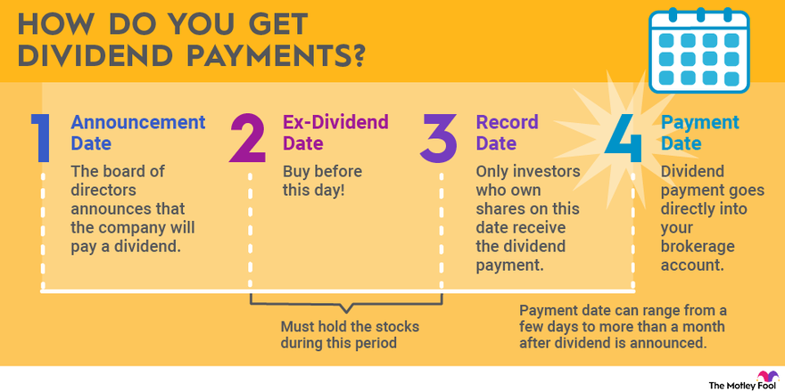

Dividend stocks have long been favored by investors seeking steady income streams in addition to capital appreciation. These stocks, typically issued by established companies with stable earnings, distribute a portion of their profits to shareholders regularly. The attraction lies in their potential to provide a reliable source of income, making them appealing for both income-focused investors and those looking to diversify their investment portfolios.

Algorithmic trading, on the other hand, represents a transformative innovation in financial markets, enabling the execution of trading orders through pre-defined, intricate algorithms. Unlike traditional trading methods reliant on human decision-making, algorithmic trading exploits computational power to analyze market conditions and execute trades at speeds and frequencies beyond human capabilities. By eliminating emotional biases and enhancing efficiency, algorithmic trading has become a cornerstone in modern financial markets.



This article aims to explore the intersection of dividend stock payments and algorithmic trading strategies. It seeks to unveil how the integration of these two domains can potentially revolutionize investment approaches, providing insights into optimizing dividend strategies through algorithms. As traders and investors increasingly turn towards scientific and technological methodologies to enhance their decision-making processes, the intersection of dividend investing and algorithmic trading emerges as a particularly promising area.

The structure of the article is designed to provide a comprehensive understanding of both dividend stocks and algorithmic trading. It progresses from defining dividend stocks and their benefits to an exploration of algorithmic trading concepts. We will then examine how these two can be harmoniously integrated, followed by an analysis of the payment processes specific to dividend stocks within algorithmic frameworks. Subsequent sections will address the inherent challenges and considerations of such integration, culminating in a conclusion that encapsulates the insights provided and anticipates future innovations.

In summary, we aim to illuminate the potential for technology-driven strategies to redefine dividend investing, encouraging readers to view their portfolios through a dual lens of income generation and algorithmic precision.

## Table of Contents

## Understanding Dividend Stocks

Dividend stocks are shares of companies that distribute a portion of their earnings to shareholders in the form of regular payments, known as dividends. These stocks serve as an essential aspect of the investment landscape, appealing to investors seeking a consistent income stream in addition to potential capital appreciation. Typically, companies that pay dividends are well-established with a history of stable earnings and financial health.

**Benefits of Investing in Dividend Stocks**

1. **Income Generation**: Dividend stocks provide investors with a regular income, making them particularly attractive to retirees and individuals seeking passive income. The dividend payments can either be taken as cash or reinvested to purchase additional shares, compounding the investment over time.

2. **Portfolio Diversification**: Including dividend stocks in an investment portfolio can reduce overall risk. These stocks often belong to less volatile sectors, providing stability during market downturns. Diversifying with dividend stocks can help balance the more aggressive growth-focused investments in a portfolio.

**Criteria for Selecting High-Quality Dividend Stocks**

Investors look at several key metrics when selecting dividend stocks:

- **Dividend Yield**: This is a ratio that indicates how much a company pays in dividends each year relative to its stock price. A higher yield can be attractive but may also indicate underlying financial distress. It is calculated as:
$$
  \text{Dividend Yield} = \frac{\text{Annual Dividends per Share}}{\text{Price per Share}}

$$

- **Payout Ratio**: This ratio shows the proportion of earnings a company pays out as dividends. A moderate payout ratio suggests that the company retains sufficient earnings to fuel growth while rewarding shareholders. The formula is:
$$
  \text{Payout Ratio} = \frac{\text{Dividends Paid}}{\text{Net Income}}

$$

- **Financial Stability**: Companies with a robust balance sheet and consistent cash flows are more likely to maintain dividend payments. Investors often look at metrics such as debt-to-equity ratio and free cash flow to assess stability.

**Popular Sectors and Industries**

Certain sectors are renowned for offering reliable dividend payments, including:
- **Utilities**: Known for steady demand and regulated pricing, companies in this sector often provide substantial and consistent dividends.
- **Consumer Staples**: Companies that produce essential goods typically exhibit stable earnings, facilitating regular dividend payments.
- **Real Estate Investment Trusts (REITs)**: Legally required to distribute a large portion of income as dividends, REITs are highly favored for income-focused portfolios.

**Role in Long-term Wealth Accumulation**

Dividend stocks play a significant role in the accumulation of long-term wealth due to their ability to compound returns through dividend reinvestment. By continuously reinvesting dividends, investors can purchase more shares, leading to a greater number of dividend payments over time. This compounding effect can significantly enhance total returns, providing a cushion during periods of market [volatility](/wiki/volatility-trading-strategies). 

Dividend investing has historically outperformed pure growth investing over long horizons, thanks to this compounding mechanism and the dependable nature of the income streams they provide. As part of a diversified portfolio, dividend stocks can contribute both income and growth potential, aligning with various investment goals and timeframes.

## Algorithmic Trading: A Brief Overview

Algorithmic trading, often referred to as algo-trading, is a method of executing orders using automated pre-programmed trading instructions. These instructions take into account variables such as time, price, and [volume](/wiki/volume-trading-strategy). Unlike traditional trading, where decisions are made manually by traders, [algorithmic trading](/wiki/algorithmic-trading) relies on computer algorithms to determine the optimal times and conditions for transactions. This minimizes the possibility of human error and allows for rapid execution.

Several types of algorithms are regularly employed in trading. Trend-following algorithms are designed to exploit market [momentum](/wiki/momentum). They aim to identify whether a market is trending upwards or downwards and make trades based on these trends. Mean reversion algorithms, on the other hand, operate on the principle that asset prices will generally revert to their historical mean over time. They identify securities that have deviated significantly from their historical average, placing trades to profit from anticipated corrections.

The advantages of algorithmic trading are manifold. High speed and improved efficiency are among the most significant benefits, as algorithms can process vast amounts of market data nearly instantaneously and execute trades much faster than a human could. This speed enhances the ability to capitalize on short-lived trading opportunities. Algorithms can also reduce emotional bias, which often impacts human traders. By adhering strictly to the set parameters, algorithmic systems help maintain a disciplined trading approach.

The implementation of algorithmic trading strategies requires a robust technological infrastructure. Essential components include access to market data feeds, high-speed internet connection, and powerful computing systems. Moreover, skills in quantitative analysis, programming languages like Python or C++, and an understanding of financial markets are crucial for developing effective trading algorithms. Traders and developers often utilize statistical software and trading platforms that support custom algorithm creation and [backtesting](/wiki/backtesting).

Algorithmic trading can enhance strategies across diverse asset classes. For example, in equities, algorithms can perform high-frequency trading where thousands of trades are conducted in milliseconds to exploit minute price discrepancies. In foreign exchange ([forex](/wiki/forex-system)) markets, algorithms can implement [arbitrage](/wiki/arbitrage) strategies to profit from price differences across different markets. In commodity trading, algorithms might leverage [statistical arbitrage](/wiki/statistical-arbitrage) based on price differentials of related commodities.

In summary, algorithmic trading is a sophisticated trading method that leverages complex algorithms to optimize trading efficiency and decision-making, offering significant advantages over traditional manual trading methods.

## Integrating Dividend Stocks with Algorithmic Trading

Algorithmic trading can significantly enhance dividend stock investing by automating and optimizing strategies that capitalize on dividend-related opportunities. These strategies often revolve around interpreting dividend announcements, capturing dividend yields efficiently, and managing associated risks.

### Strategies for Identifying Dividend Stocks

Algorithmic trading systems inherently analyze vast amounts of data in real-time to identify promising dividend stocks for investment. Event-driven strategies are particularly effective for this purpose, focusing on key times like dividend announcements, ex-dividend dates, and payment dates. These strategies can react quickly to dividend-related news that might impact stock prices, while traditional human trading might lag due to delayed information processing.

For instance, algorithms can be programmed to detect changes in shareholder payouts, signaling potential stock price movements. An event-driven algorithm might execute trades immediately following a dividend increase announcement, anticipating a positive market response.

### Data Inputs and Market Indicators

The core of any algorithmic model is the comprehensive set of data inputs it can access. Regarding dividend stocks, these inputs include historical dividend payout ratios, dividend yield, free cash flow, earnings reports, and financial stability metrics. Technical indicators such as moving averages and relative strength index (RSI) also play a role in refining these strategies by providing insights into stock price trends and momentum.

Additionally, financial news, analyst ratings, and macroeconomic indicators are crucial data inputs. Reliable data feeds and robust data processing frameworks ensure that the algorithms remain effective in dynamic market conditions.

### Case Studies and Examples

An example of successful integration of algorithms in dividend stock trading can be seen in quantitative hedge funds, where sophisticated models leverage [machine learning](/wiki/machine-learning) to predict dividend increases and thus anticipate stock price changes. One prominent case involves the use of natural language processing (NLP) to analyze earnings call transcripts and news articles, extracting sentiments and related cues before executing trades.

Suppose a company’s [earning](/wiki/earning-announcement) call reveals a robust financial outlook suggesting higher future dividends. An NLP algorithm might buy the stock in anticipation of the upcoming dividend announcement, benefiting from the stock appreciation prior to the actual announcement.

### Risk Management Measures

Risk management is central to any successful algorithmic trading strategy, particularly with dividend stocks, where prices can be volatile around dividend-related events. Techniques like stop-loss orders, volatility adjustments, and portfolio diversification are essential tools.

Algorithms can implement stop-loss orders, automatically selling holdings when the stock drops below a predetermined threshold. This limits potential losses if the market reacts negatively to dividend news. Similarly, including volatility-based position sizing helps manage risks by adjusting the scale of investments based on current market conditions, thus preventing overexposure during times of high market turbulence.

Furthermore, backtesting algorithms on historical data helps assess potential risks and refine strategies before deployment in live markets. This step is critical in identifying the models' performance across various market scenarios and stress conditions.

In conclusion, algorithmic trading offers compelling advantages for dividend stock investment strategies, allowing for efficient data analysis, rapid execution, and sophisticated risk management. By integrating event-driven strategies, using diverse data inputs, and incorporating robust risk management techniques, investors can potentially enhance their returns from dividend-paying stocks.

## The Payment Process for Dividend Stocks in Algorithmic Trading

The dividend payment process plays a pivotal role in algorithmic trading strategies that focus on dividend stocks. Understanding the mechanics of this process is crucial for traders aiming to optimize their returns.

### Mechanics of Dividend Payments

The dividend payment process involves several key dates: the record date, the ex-dividend date, and the payment date. Each of these dates holds strategic importance in determining who receives the dividend and how trading algorithms can be optimized for dividend capture.

1. **Record Date:** This is the cutoff date established by a company to determine which shareholders are entitled to receive the upcoming dividend payment. Investors must own the stock before this date to qualify for the dividend.

2. **Ex-Dividend Date:** The ex-dividend date is typically set one business day before the record date. On this date, the stock begins trading without the right to receive the upcoming dividend. This makes it a critical point for algorithmic traders, as buying the stock on or after the ex-dividend date means missing out on the dividend, while selling before means retaining the dividend rights.

3. **Payment Date:** The payment date is when the dividend is actually distributed to shareholders. While this may not directly impact algorithmic strategies, it marks the final step in the dividend distribution process.

### Optimizing Dividend Capture

Algorithmic trading strategies can optimize dividend capture by strategically buying and selling stocks around these key dates. For example, algorithms might be designed to purchase stocks just before the ex-dividend date and sell them shortly after to secure the dividend, a strategy known as "dividend stripping". Here is a basic example of what such an algorithm could look like:

```python
import yfinance as yf  # For more datasets, visit: https://paperswithbacktest.com/datasets
import datetime

def dividend_strategy(stock, start_date, end_date):
    data = yf.download(stock, start=start_date, end=end_date, actions=True)
    div_dates = data[data['Dividends'] > 0].index

    for date in div_dates:
        ex_date = date - datetime.timedelta(days=1)
        if ex_date in data.index:
            # Buy strategy: Purchase before the ex-dividend date
            buy_price = data.loc[ex_date]['Open']

            # Sell strategy: Sell immediately after the dividend is settled
            sell_price = data.loc[date]['Close']

            profit = sell_price - buy_price
            print(f"Dividend strategy profit for {stock} on {date}: ${profit}")

# Example usage
dividend_strategy('AAPL', '2023-01-01', '2023-12-31')
```

### Impact of Dividend Reinvestment Plans (DRIPs)

Dividend Reinvestment Plans (DRIPs) allow investors to reinvest their cash dividends into additional shares or fractional shares of the underlying stock. This can complicate algorithmic strategies because it may affect [liquidity](/wiki/liquidity-risk-premium) and trading volumes, which are critical factors for high-frequency trading algorithms. Algorithms must account for the potential market impacts of reinvestment activities when modeling stock price movements around dividend dates.

### Challenges in Algorithmic Dividend Trading

Developing algorithms focused on dividends comes with challenges such as processing the corporate action data efficiently, handling large volumes of trades around ex-dividend dates, and managing transaction costs which can diminish returns. Regulatory considerations, like changes in dividend taxation or trading rules, also pose risks to algorithmic models.

Moreover, market conditions and volatility can influence the effectiveness of dividend trading strategies. Algorithms need to be flexible to adapt to changing market environments and be robust enough to minimize the impact of adverse price movements.

By understanding and integrating these elements, traders can enhance their strategies to capitalize on dividends while mitigating potential risks associated with algorithmic trading.

## Challenges and Considerations

Combining dividend investing with algorithmic trading presents both opportunities and challenges. One key challenge is the potential for pitfalls and limitations inherent in aligning these two strategies. Algorithmic trading, while efficient and rapid, relies heavily on accurate input data and robust models. In the context of dividend stocks, if the underlying data—such as projected dividend yields or payout ratios—is flawed or inaccurately interpreted by the algorithm, it can lead to suboptimal investment decisions.

Regulatory considerations and compliance pose additional hurdles. Algorithmic trading systems must adhere to complex securities regulations. For instance, they need to ensure compliance with rules regarding market manipulation, fair access, and transparency. The U.S. Securities and Exchange Commission (SEC) and other regulatory bodies worldwide have specific guidelines to prevent market abuse, and failing to adhere to these could result in severe penalties. Firms must implement rigorous compliance checks and controls in their algorithmic trading frameworks to address these regulatory challenges.

Market conditions and volatility are also critical factors. Dividend stocks can be susceptible to market swings, and algorithms must be adept at navigating such volatility. Sudden market fluctuations can influence dividend announcements and stock performance, potentially leading to increased risk if not managed appropriately. Algorithms should incorporate adaptability to adjust to changes in volatility, helping mitigate risks associated with unexpected market movements.

Transaction costs and liquidity are crucial when executing algorithmic trading strategies on dividend stocks. High-frequency trading can incur significant transaction costs, which can erode profits. Moreover, dividend stocks are not always highly liquid, and trading large volumes may affect market prices. Algorithms need to account for these costs and liquidity constraints to ensure that trading strategies remain profitable and effective.

Looking ahead, future trends and innovations could significantly shape the integration of dividends and algorithmic trading. Artificial intelligence (AI) and machine learning are expected to play an increasingly prominent role, enabling more sophisticated pattern recognition and predictive insights. Additionally, the development of quantum computing could revolutionize algorithmic processes, offering unprecedented speed and computational power. These technological advancements promise to enhance the precision and execution capability of algorithmic trading systems focused on dividend stocks.

In summary, while the convergence of dividend investing and algorithmic trading offers considerable potential, it requires careful navigation of its inherent challenges. Addressing regulatory concerns, managing market volatility, accounting for transaction costs, and embracing future technological advancements will be pivotal in harnessing the full potential of this strategic combination.

## Conclusion

In this article, we explored the intricate relationship between dividend stock payments and algorithmic trading, unveiling the possibilities at the intersection of traditional income-generating investments and cutting-edge financial technologies. One of the key takeaways is that integrating algorithmic trading into dividend stock investment strategies offers distinct advantages, such as optimizing timing around dividend events, reducing emotional bias, and improving overall trading efficiency. Algorithmic systems can identify patterns, manage risks, and execute trades with a level of precision and speed difficult to achieve through manual methods.

Investors and traders are encouraged to consider the potential of these technology-driven approaches to bolster their investment portfolios. The use of algorithms allows for dynamic adjustments to market conditions, enabling more responsive and informed decision-making that can enhance returns from dividend-paying stocks.

Looking ahead, the future landscape of dividend investing and algorithmic trading is poised for innovation and growth. As technology continues to evolve, we can expect more sophisticated models that incorporate machine learning and AI to further refine strategy development and execution. Continued advancements in data analytics and computational power will drive new strategies, making it increasingly accessible to a broader range of investors.

However, it remains crucial to weigh both the opportunities and risks associated with this convergence. While algorithmic trading provides new avenues for profit, it also introduces complexities such as model overfitting, data quality issues, and regulatory compliance challenges. Investors should remain mindful of these factors and prioritize thorough research, proper risk management, and alignment with personal investment goals.

By embracing the synergy between dividends and algorithms, investors can potentially unlock enhanced portfolio performance, making the most of this rapidly evolving intersection of finance and technology.

## References & Further Reading

[1]: Bergstra, J., Bardenet, R., Bengio, Y., & Kégl, B. (2011). ["Algorithms for Hyper-Parameter Optimization."](https://proceedings.neurips.cc/paper/2011/file/86e8f7ab32cfd12577bc2619bc635690-Paper.pdf) Advances in Neural Information Processing Systems 24.

[2]: ["Advances in Financial Machine Learning"](https://www.amazon.com/Advances-Financial-Machine-Learning-Marcos/dp/1119482089) by Marcos Lopez de Prado

[3]: ["Evidence-Based Technical Analysis: Applying the Scientific Method and Statistical Inference to Trading Signals"](https://www.amazon.com/Evidence-Based-Technical-Analysis-Scientific-Statistical/dp/0470008741) by David Aronson

[4]: ["Machine Learning for Algorithmic Trading"](https://github.com/PacktPublishing/Machine-Learning-for-Algorithmic-Trading-Second-Edition) by Stefan Jansen

[5]: ["Quantitative Trading: How to Build Your Own Algorithmic Trading Business"](https://www.amazon.com/Quantitative-Trading-Build-Algorithmic-Business/dp/1119800064) by Ernest P. Chan