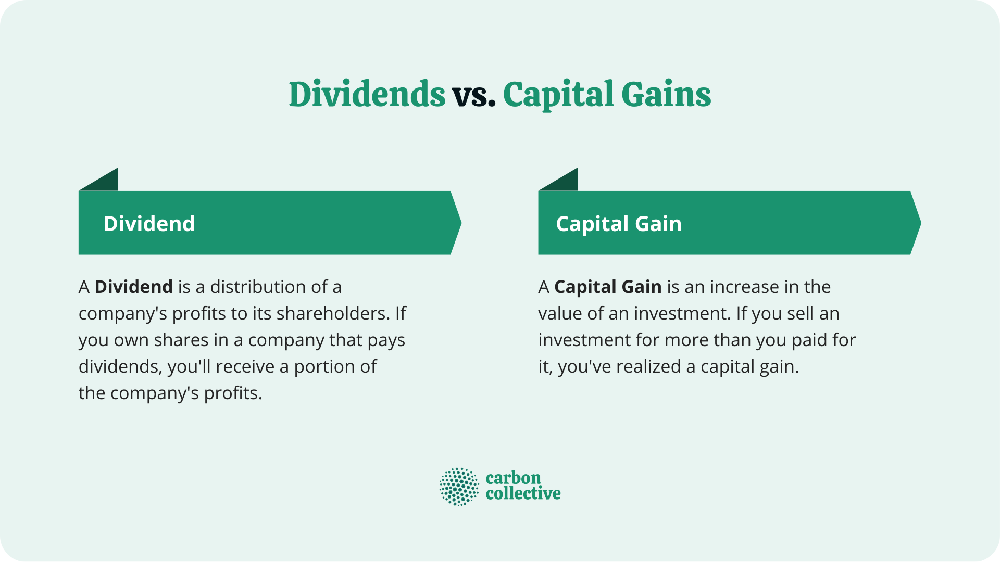

## Table of Contents

## What are dividends?

Dividends are payments that companies give to their shareholders. When a company makes a profit, it can choose to share some of that profit with the people who own its stock. This payment is called a dividend. Shareholders usually get dividends based on how many shares they own. For example, if you own 100 shares and the company pays a dividend of $1 per share, you would get $100.

Not all companies pay dividends. Some companies, especially newer ones, might decide to use their profits to grow the business instead of paying dividends. Companies that do pay dividends often do so regularly, like every three months or once a year. Dividends can be a good way for investors to earn money from their investments without having to sell their shares.

## What are capital gains?

Capital gains are the profits you make when you sell something for more than you paid for it. This can happen with things like stocks, real estate, or even a piece of art. For example, if you bought a stock for $50 and later sold it for $75, your capital gain would be $25. The money you make from these gains can be a big part of investing and can help you grow your wealth over time.

There are two types of capital gains: short-term and long-term. Short-term capital gains happen when you sell something you've owned for a year or less. These gains are usually taxed at a higher rate, similar to your regular income tax. On the other hand, long-term capital gains are from selling things you've held for more than a year. These are often taxed at a lower rate, which can make a big difference in how much money you get to keep. Understanding the difference between these two can help you plan your investments better.

## How do dividends and capital gains differ?

Dividends and capital gains are two ways you can make money from investing, but they work differently. Dividends are payments that companies give to their shareholders out of their profits. If you own shares in a company that pays dividends, you get a little bit of money regularly, like every few months or once a year. It's like getting a small reward for owning the stock without having to sell it.

Capital gains, on the other hand, are the profits you make when you sell something for more than you paid for it. This could be stocks, a house, or even a painting. If you buy a stock for $100 and sell it later for $150, the $50 difference is your capital gain. Unlike dividends, you only get capital gains when you decide to sell your investment, and the amount depends on how much the value has gone up since you bought it.

Both dividends and capital gains can help you make money, but they have different tax rules. Dividends are usually taxed as regular income, while capital gains can be taxed at a lower rate if you hold onto your investment for more than a year. Knowing the difference between these two can help you plan your investments better and understand how you might be taxed on your earnings.

## What are the tax implications of dividends?

Dividends can be taxed, and how much you pay depends on whether they are "qualified" or "non-qualified" dividends. Qualified dividends are usually taxed at a lower rate, similar to long-term capital gains. To be considered qualified, you need to have held the stock for a certain amount of time, usually more than 60 days during the 121-day period that starts 60 days before the ex-dividend date. The tax rate for qualified dividends can be 0%, 15%, or 20%, depending on your income. Non-qualified dividends, on the other hand, are taxed at your regular income tax rate, which can be much higher.

It's important to know the difference between these two types of dividends because it can affect how much money you get to keep. If you're getting dividends from stocks you've held for a while, you might pay less in taxes. But if the dividends are from stocks you've only owned for a short time, you'll likely pay more. Always check with a tax professional to make sure you're handling your taxes correctly, especially if you're getting dividends from different investments.

## What are the tax implications of capital gains?

Capital gains are the profits you make when you sell something for more than you paid for it, like stocks or a house. There are two types of capital gains: short-term and long-term. Short-term capital gains are when you sell something you've owned for a year or less. These gains are taxed at your regular income tax rate, which can be pretty high. If you're in a high tax bracket, you might pay a lot in taxes on your short-term gains.

Long-term capital gains are when you sell something you've held for more than a year. These gains are taxed at a lower rate, which can be 0%, 15%, or 20%, depending on your income. This lower tax rate is why many people try to hold onto their investments for at least a year before selling. It can save them a lot of money on taxes. Always talk to a tax professional to make sure you're handling your capital gains taxes the right way, especially if you're selling different types of investments.

## How do companies decide to pay dividends?

Companies decide to pay dividends based on their profits and what they want to do with their money. If a company makes a lot of money, it can choose to share some of that money with its shareholders. This decision often depends on the company's financial health and its plans for the future. If the company wants to grow and needs money for new projects, it might decide not to pay dividends and use the money to make the business bigger instead.

Another thing that affects the decision to pay dividends is what shareholders want. Some investors like getting regular payments from their investments, so they might prefer companies that pay dividends. Other investors might be okay with not getting dividends if they think the company can use the money to grow and make the stock price go up. Companies try to balance what their shareholders want with their own needs, and that's how they decide whether to pay dividends or not.

## What factors influence capital gains?

Capital gains are influenced by many things. The main thing is how much the price of what you own goes up. If you buy a stock and its price goes up a lot, you could make a big capital gain when you sell it. The economy and the market can also affect capital gains. If the economy is doing well, stock prices might go up, and that can lead to bigger capital gains. But if the economy is not doing well, prices might go down, and you might not make as much money when you sell.

Another thing that influences capital gains is how long you keep your investment. If you hold onto it for more than a year, you might get a better tax rate on your gains. This can make a big difference in how much money you get to keep. Also, news about the company or the industry can change how much people are willing to pay for your investment. If there's good news, the price might go up, and if there's bad news, the price might go down. All these things together decide how much capital gain you might make.

## How can investors benefit from dividends?

Investors can benefit from dividends because they get regular payments from the companies they own shares in. These payments can be a good way to make money without having to sell the shares. If you own a stock that pays dividends, you might get money every few months or once a year. This can help you pay your bills or save more money. Some investors like dividends because it's like getting a steady income from their investments.

Another way dividends help investors is by giving them a chance to buy more shares. If you get a dividend, you can use that money to buy more of the same stock or invest in something else. This can help your investments grow over time. Also, if you reinvest your dividends, you can end up with more shares, which means you might get even bigger dividends in the future. This can make your investments grow even more.

## How can investors benefit from capital gains?

Investors can benefit from capital gains because they can make money when they sell something for more than they paid for it. If you buy a stock and its price goes up, you can sell it later and keep the profit. This can be a big part of growing your money over time. If you invest wisely, you might see your investments go up in value, and when you sell them, you can use that money to buy more investments or spend it on things you need.

Another way investors benefit from capital gains is by holding onto their investments for a long time. If you keep a stock for more than a year before selling it, you might pay less in taxes on your profit. This can make a big difference in how much money you get to keep. By being patient and waiting for the right time to sell, you can make the most out of your capital gains and help your investments grow even more.

## What strategies can be used to maximize dividend income?

To maximize dividend income, investors should focus on buying stocks from companies that have a history of paying high dividends. These companies are often called "dividend aristocrats" because they have increased their dividends for many years in a row. By choosing these stocks, you can get a steady and growing stream of dividend payments. Another good strategy is to reinvest your dividends. When you get a dividend, instead of spending it, you can use it to buy more shares of the same stock. Over time, this can help you own more shares, which means you'll get even bigger dividends in the future.

Another way to boost your dividend income is to diversify your investments. This means buying stocks from different companies and industries. If one company cuts its dividend, you still have other stocks paying you. Also, look for stocks that have a high dividend yield, which is the dividend payment divided by the stock's price. A high yield can mean more income, but be careful because a very high yield might mean the company is in trouble. By using these strategies, you can work towards getting the most out of your dividend income.

## What strategies can be used to maximize capital gains?

To maximize capital gains, one good strategy is to buy low and sell high. This means you should try to buy stocks or other investments when their prices are low and then sell them when the prices go up. You can do this by keeping an eye on the market and looking for good deals. Another part of this strategy is to do your homework. Learn about the companies you're investing in and try to figure out which ones might grow in the future. If you pick the right investments, you can make a lot of money when you sell them.

Another strategy is to hold onto your investments for a long time. If you keep a stock for more than a year before selling it, you might pay less in taxes on your profit. This can make a big difference in how much money you get to keep. Also, holding onto your investments gives them more time to grow in value. If you're patient and wait for the right time to sell, you can make the most out of your capital gains.

## How do market conditions affect the choice between dividends and capital gains?

Market conditions can make a big difference in whether investors choose to focus on dividends or capital gains. When the market is doing well and stock prices are going up, investors might want to go for capital gains. They can buy stocks at a lower price and sell them later for a profit. If the market keeps growing, this can be a good way to make a lot of money. But if the market is not doing so well and stock prices are going down, investors might like dividends more. Dividends give them a steady income, even if the stock price isn't going up. This can help them feel more secure during tough times.

Another thing to think about is how the economy is doing. In a strong economy, companies might be making more money and can pay bigger dividends. This can make dividends look more attractive to investors. But if the economy is weak, companies might cut back on dividends to save money. In this case, investors might turn to capital gains, hoping that the market will recover and they can sell their stocks for a profit later. So, depending on what's happening in the market and the economy, investors might switch between focusing on dividends and capital gains to make the most of their investments.

## What is Dividend Income and How Can it Serve as a Source of Passive Earnings?

Dividend income represents a form of passive earnings that investors receive as a distribution of a company’s profits. Typically paid in cash, dividends are a way for companies to share their success with shareholders, although they may also take the form of additional shares of stock or other property.

Dividends are usually paid on a regular basis, such as quarterly or annually, and they provide a steady income stream for investors. The distribution process involves the company’s board of directors announcing a dividend, setting a record date for eligible shareholders, and subsequently disbursing the dividend on the payment date.

**Types of Dividends: Cash and Stock Dividends**

Dividends are primarily classified into two types: cash dividends and stock dividends. 

- **Cash Dividends**: These are direct cash payments made to shareholders and are the most common form of dividend distribution. Cash dividends provide immediate income to investors but require the company to possess sufficient cash reserves.

- **Stock Dividends**: Instead of cash, stock dividends involve the issuance of additional shares to shareholders. This method allows companies to reward investors without depleting cash reserves, albeit it dilutes the share value.

**Metrics to Assess Dividend Income: Yield and Payout Ratio**

Two key metrics are employed to evaluate the attractiveness and sustainability of a company’s dividend policy: dividend yield and payout ratio.

- **Dividend Yield**: This metric measures the cash return on the investment provided by dividends and is expressed as a percentage. The formula for dividend yield is:
$$
  \text{Dividend Yield} = \left(\frac{\text{Annual Dividends per Share}}{\text{Price per Share}}\right) \times 100\%

$$
  A higher dividend yield indicates a potentially larger income relative to the share price, though it is essential for investors to assess the consistency and growth potential of such dividends.

- **Payout Ratio**: This ratio indicates the proportion of a company’s earnings paid out as dividends to shareholders. It is calculated using the formula:
$$
  \text{Payout Ratio} = \left(\frac{\text{Dividends Paid}}{\text{Net Income}}\right) \times 100\%

$$
  A sustainable payout ratio suggests that a company is maintaining an appropriate balance between rewarding shareholders and re-investing earnings for growth.

**Taxation of Dividend Income and Its Implications for Investors**

Dividend income is subject to taxation, which has significant implications for investors' returns. The tax treatment of dividends depends on whether they are classified as qualified or non-qualified. Qualified dividends typically benefit from lower tax rates, akin to long-term capital gains, whereas non-qualified dividends are taxed at ordinary income rates.

For instance, as of recent tax regulations in the United States, qualified dividends are taxed at rates of 0%, 15%, or 20%, depending on the investor's taxable income [source: IRS]. On the other hand, non-qualified dividends can be taxed at rates up to 37%, the top marginal rate for ordinary income.

Understanding the tax implications of dividend income is crucial for investors seeking to optimize after-tax returns. Tax-efficient strategies, such as holding dividend-paying stocks in tax-advantaged accounts, can help minimize the tax burden and enhance net income.

By integrating these components, investors can make informed decisions about their dividend-focused strategies, aligning their portfolios with broader financial goals and risk tolerances.

## References & Further Reading

[1]: IRS. (n.d.). ["Topic No. 409 Capital Gains and Losses."](https://www.irs.gov/taxtopics/tc409) Retrieved from the Internal Revenue Service website.

[2]: Investopedia. (n.d.). ["Capital Gain."](https://www.investopedia.com/terms/c/capitalgain.asp) Retrieved from Investopedia.

[3]: Lopez de Prado, M. (2018). ["Advances in Financial Machine Learning."](https://www.amazon.com/Advances-Financial-Machine-Learning-Marcos/dp/1119482089) John Wiley & Sons.

[4]: Aronson, D. (2006). ["Evidence-Based Technical Analysis: Applying the Scientific Method and Statistical Inference to Trading Signals."](https://www.amazon.com/Evidence-Based-Technical-Analysis-Scientific-Statistical/dp/0470008741) John Wiley & Sons.

[5]: Chan, E. P. (2008). ["Quantitative Trading: How to Build Your Own Algorithmic Trading Business."](https://github.com/ftvision/quant_trading_echan_book) John Wiley & Sons.

[6]: Jansen, S. (2020). ["Machine Learning for Algorithmic Trading."](https://github.com/stefan-jansen/machine-learning-for-trading) Packt Publishing.