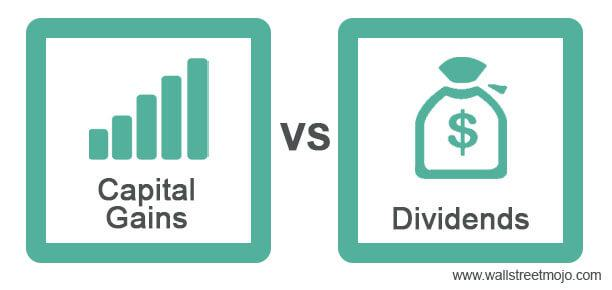

In today's complex financial landscape, understanding various income streams is essential for maximizing investment returns. Among the most significant components of these streams are dividends, capital gains, and algorithmic trading. Each plays a distinct, yet interrelated role in enhancing an investor's portfolio performance.

Dividends serve as a source of passive income for investors, distributed from a company's earnings to its shareholders. This income stream is especially attractive to individuals seeking regular cash flow, as dividends provide consistent returns while mitigating some investment risks. Capital gains, on the other hand, represent the profit realized when an investment is sold at a price higher than its purchase price. Both realized and unrealized capital gains contribute to the overall growth of an investment portfolio and are influenced by market conditions and holding periods.



Algorithmic trading, a modern addition to the investment toolkit, leverages computational algorithms to execute trades at speeds and efficiencies unattainable by human traders. This technique reduces transaction costs and minimizes emotional biases, making it a valuable asset for investors aiming to outperform traditional market strategies.

The synergy between dividends, capital gains, and algorithmic trading is crucial in optimizing investment returns. Dividends provide steady income, capital gains offer growth potential, and algorithmic trading enhances execution efficiency. In an era where financial markets are increasingly influenced by rapid technological advancements and globalization, the integration of these components is more relevant than ever. Investors well-versed in these income streams can better navigate market volatility and leverage opportunities for financial success. 

As education and adaptation continue to drive the evolution of financial strategies, the importance of dividends, capital gains, and algorithmic trading in modern investment cannot be overstated. By strategically incorporating these elements, investors can optimize their portfolios and enhance overall returns in an ever-evolving market landscape.

## Table of Contents

## Capital Gains: A Key Component of Investment Returns

Capital gains are an essential element of investment returns, representing the profit realized from the sale of an asset when its selling price exceeds its initial purchase price. Essentially, capital gains are a measure of the increase in value of an investment over time. Understanding capital gains is crucial for investors as they significantly influence portfolio growth and overall financial performance.

### Realized vs. Unrealized Capital Gains

Capital gains can be categorized into two types: realized and unrealized. Realized capital gains occur when an investor sells an asset and secures a profit. For example, if an investor buys shares of a stock at $50 per share and sells them for $70, the $20 increase per share constitutes a realized capital gain.

Unrealized capital gains, often referred to as "paper gains," arise when the investment's value increases, but the investor has not yet sold the asset. These gains are hypothetical and can fluctuate with market conditions. The distinction between realized and unrealized gains is important because tax obligations typically apply only to realized gains, impacting an investor's net returns.

### Factors Affecting Capital Gains

Several factors influence capital gains, including market trends, economic conditions, and the holding period of investments. Market trends such as economic growth, interest rates, and sector performance can affect an asset's value. For instance, a bullish market trend generally increases stock prices, leading to potential capital gains.

The holding period also plays a critical role. Long-term capital gains, typically involving assets held for more than a year, often benefit from preferential tax treatment compared to short-term gains, which are taxed as ordinary income. This tax difference incentivizes investors to hold onto investments longer to maximize after-tax profits.

### Tax Implications and Optimization Strategies

Taxation is a significant consideration for capital gains. In many jurisdictions, realized capital gains are subject to capital gains taxes, which vary depending on whether the gain is short-term or long-term. Long-term capital gains commonly receive more favorable tax rates, promoting long-term investment strategies.

Investors can employ several strategies to optimize capital gains taxation. One common approach is tax-loss harvesting, where investors sell underperforming assets to offset gains and reduce taxable income. Another strategy involves timing sales to align with lower-income years, minimizing the overall tax burden.

Additionally, reinvesting capital gains in tax-advantaged accounts, such as IRAs or 401(k)s, can defer taxes, allowing investment growth to continue uninhibited by annual tax liabilities.

In summary, capital gains are pivotal to investment success, encompassing both realized and unrealized profits influenced by diverse market and temporal factors. Strategic management of these gains, especially regarding tax optimization, can significantly enhance an investor's net returns. Understanding these elements aids investors in navigating the complexities of capital gains in today’s dynamic financial environment.

References:  
IRS. (n.d.). Topic No. 409 Capital Gains and Losses. Retrieved from [IRS Website](https://www.irs.gov/taxtopics/tc409)  
Investopedia. (n.d.). Capital Gain. Retrieved from [Investopedia](https://www.investopedia.com/terms/c/capitalgain.asp)

## Understanding Investment Income

Investment income represents earnings derived from various financial assets, forming a crucial component of an investor's overall return profile. It typically includes interest, dividends, and any other income that a portfolio may generate. While capital gains signify the profit from the sale of an asset and dividends represent a company's profit distribution to shareholders, investment income encapsulates these alongside other regular returns an investor might earn without selling the underlying asset.

### Sources of Investment Income

Investment income arises from multiple sources:

1. **Interest**: This is income earned from bonds, savings accounts, and other interest-bearing instruments. It is generally predictable and provides a steady cash flow, appealing to conservative investors.

2. **Dividends**: Regular profit distributions by companies to their shareholders. They can be cash or additional shares (stock dividends), fostering a passive income stream.

3. **Rental Income**: Derived from property investments, providing a steady income source albeit with associated management responsibilities.

4. **Royalties**: Income from intellectual property rights or natural resources.

5. **Annuities**: Insurance contracts that pay out a fixed stream of payments, typically used for retirement income. 

### Comparison with Capital Gains and Dividends

While investment income includes dividends and can lead to capital gains, it differs in nature and timing. Capital gains occur when an asset is sold for a price higher than its purchase cost, realized as a lump-sum gain at the point of sale. Conversely, investment income, notably dividends and interest, is typically realized periodically, providing regular income irrespective of asset liquidation.

### Benefits and Challenges

Relying on investment income offers several advantages:

- **Stability**: Regular income streams contribute to financial stability, allowing investors to cover ongoing expenses.
- **Cash Flow Management**: Predictable income flows aid in budgeting and financial planning.
- **Extraction without Liquidation**: Investors can earn returns without selling assets, preserving long-term capital appreciation potential.

However, challenges accompany these benefits:

- **Interest Rate Risk**: Income from bonds and other fixed-income instruments can fluctuate with changes in interest rates, affecting profitability.
- **Inflation Risk**: Fixed income streams may lose purchasing power over time.
- **Dividend Uncertainty**: Companies might cut dividends during economic downturns, impacting expected cash flows.

### Role of Diversification

Diversification plays a pivotal role in stabilizing investment income. By spreading investments across asset classes and geographies, investors mitigate specific risks and enhance potential returns. For instance, a mix of high-dividend stocks, fixed-income securities, and real estate can create a robust income-generating portfolio. Diversification not only cushions the impact of market [volatility](/wiki/volatility-trading-strategies) on income streams but also capitalizes on varied economic cycles and growth opportunities.

```python
# Python example of calculating expected investment income from a diversified portfolio
# Assuming portfolio consists of stocks, bonds, and real estate, each with their own yields

# Portfolio components
stocks = {"yield": 0.03, "allocation": 0.4}  # 3% yield, 40% allocation
bonds = {"yield": 0.05, "allocation": 0.4}   # 5% yield, 40% allocation
real_estate = {"yield": 0.06, "allocation": 0.2}  # 6% yield, 20% allocation

portfolio = [stocks, bonds, real_estate]

# Calculate expected investment income
def calculate_income(portfolio, total_investment):
    return sum(asset["yield"] * asset["allocation"] * total_investment for asset in portfolio)

total_investment = 1000000  # Total investment in dollars
expected_income = calculate_income(portfolio, total_investment)
print(f"Expected Annual Investment Income: ${expected_income:.2f}")
```

In conclusion, understanding and effectively managing investment income is integral to achieving a balanced and potentially profitable investment portfolio. By acknowledging its sources, comparisons, and challenges, and embracing diversification, investors are better equipped to harness stable income even amidst unpredictable market fluctuations.

## Dividend Income: A Source of Passive Earnings

Dividend income represents a form of passive earnings that investors receive as a distribution of a company’s profits. Typically paid in cash, dividends are a way for companies to share their success with shareholders, although they may also take the form of additional shares of stock or other property.

Dividends are usually paid on a regular basis, such as quarterly or annually, and they provide a steady income stream for investors. The distribution process involves the company’s board of directors announcing a dividend, setting a record date for eligible shareholders, and subsequently disbursing the dividend on the payment date.

**Types of Dividends: Cash and Stock Dividends**

Dividends are primarily classified into two types: cash dividends and stock dividends. 

- **Cash Dividends**: These are direct cash payments made to shareholders and are the most common form of dividend distribution. Cash dividends provide immediate income to investors but require the company to possess sufficient cash reserves.

- **Stock Dividends**: Instead of cash, stock dividends involve the issuance of additional shares to shareholders. This method allows companies to reward investors without depleting cash reserves, albeit it dilutes the share value.

**Metrics to Assess Dividend Income: Yield and Payout Ratio**

Two key metrics are employed to evaluate the attractiveness and sustainability of a company’s dividend policy: dividend yield and payout ratio.

- **Dividend Yield**: This metric measures the cash return on the investment provided by dividends and is expressed as a percentage. The formula for dividend yield is:
$$
  \text{Dividend Yield} = \left(\frac{\text{Annual Dividends per Share}}{\text{Price per Share}}\right) \times 100\%

$$
  A higher dividend yield indicates a potentially larger income relative to the share price, though it is essential for investors to assess the consistency and growth potential of such dividends.

- **Payout Ratio**: This ratio indicates the proportion of a company’s earnings paid out as dividends to shareholders. It is calculated using the formula:
$$
  \text{Payout Ratio} = \left(\frac{\text{Dividends Paid}}{\text{Net Income}}\right) \times 100\%

$$
  A sustainable payout ratio suggests that a company is maintaining an appropriate balance between rewarding shareholders and re-investing earnings for growth.

**Taxation of Dividend Income and Its Implications for Investors**

Dividend income is subject to taxation, which has significant implications for investors' returns. The tax treatment of dividends depends on whether they are classified as qualified or non-qualified. Qualified dividends typically benefit from lower tax rates, akin to long-term capital gains, whereas non-qualified dividends are taxed at ordinary income rates.

For instance, as of recent tax regulations in the United States, qualified dividends are taxed at rates of 0%, 15%, or 20%, depending on the investor's taxable income [source: IRS]. On the other hand, non-qualified dividends can be taxed at rates up to 37%, the top marginal rate for ordinary income.

Understanding the tax implications of dividend income is crucial for investors seeking to optimize after-tax returns. Tax-efficient strategies, such as holding dividend-paying stocks in tax-advantaged accounts, can help minimize the tax burden and enhance net income.

By integrating these components, investors can make informed decisions about their dividend-focused strategies, aligning their portfolios with broader financial goals and risk tolerances.

## The Growing Influence of Algorithmic Trading

Algorithmic trading refers to the use of complex algorithms and high-speed computing to automate trading decisions and execute orders with minimal human intervention. In today's financial markets, [algorithmic trading](/wiki/algorithmic-trading) plays a critical role by enabling the processing of large volumes of data and executing trades at a pace and precision beyond human capability.

One of the primary benefits of algorithmic trading is its speed and efficiency. Algorithms can analyze vast datasets in milliseconds and execute trades at optimal prices, capitalizing on market conditions that might only exist momentarily. This rapid execution reduces transaction costs and slippage, increasing potential returns for investors. Efficiency is further enhanced as algorithms can operate tirelessly across multiple markets and time zones, ensuring continuous trading opportunities.

Despite its advantages, algorithmic trading presents several risks. The reliance on technology means that system failures or glitches could result in substantial financial losses. Additionally, algorithms, designed to exploit minimal price differences, can sometimes exacerbate market volatility or create artificial trends. The infamous "flash crash" of 2010, where the Dow Jones Industrial Average plummeted nearly 1,000 points only to recover within minutes, exemplifies the potential negative impact of algorithmic-driven sell-offs. Ensuring robust risk management protocols and real-time monitoring systems is thus critical for mitigating these pitfalls.

Algorithmic trading also influences market [liquidity](/wiki/liquidity-risk-premium) and stability. On one hand, algorithms contribute positively by providing liquidity, as they constantly quote buy and sell prices, thus narrowing bid-ask spreads. On the other hand, during periods of stress, these same algorithms might withdraw from the market, amplifying liquidity shortages and creating instability. The balance between liquidity provisioning and stability reinforcement remains a focal point for regulators and market participants.

Overall, algorithmic trading has revolutionized the financial industry by improving trade execution efficiency and expanding market access to a broader range of participants. However, its integration into the financial ecosystem necessitates continuous oversight to harness its benefits while mitigating associated risks.

## Interplay Between Capital Gains, Investment Income, and Algo Trading

The integration of capital gains, investment income, and algorithmic trading creates a dynamic portfolio strategy that has the potential to optimize returns. Each component plays a distinct yet complementary role in the financial landscape. Capital gains, derived from the appreciation of asset value, provide significant profit potential but are often influenced by market volatility. Investment income, typically earned through dividends and interest, offers a more stable revenue stream, contributing to portfolio stability. Algorithmic trading enhances these elements by enabling precise, data-driven decisions that can adapt to real-time market conditions.

### Strategies to Balance Capital Gains and Investment Income Using Algo Trading

Algorithmic trading can be used to effectively balance capital gains and investment income by implementing automated strategies that optimize asset allocation and timing. For instance, algorithms can be designed to identify market inefficiencies or trends that signal the optimal time to buy or sell assets, maximizing capital gains. Simultaneously, algorithms can manage a diversified portfolio to ensure a steady flow of investment income, adjusting allocations based on interest rates and dividend yield forecasts.

An example of an algorithmic strategy is the use of pairs trading, where the algorithm identifies two correlated assets and executes trades to exploit divergences in their price movements. This strategy not only targets capital gains but also helps in maintaining balance by reinvesting proceeds into income-generating assets. Here's a basic Python example illustrating how such an algorithm might be conceptualized:

```python
import numpy as np

def pairs_trading(data_asset1, data_asset2):
    spread = data_asset1 - data_asset2
    mean = np.mean(spread)
    std_dev = np.std(spread)

    if spread[-1] > mean + std_dev:
        # Sell Asset 1, Buy Asset 2
        return "Sell Asset 1, Buy Asset 2"
    elif spread[-1] < mean - std_dev:
        # Buy Asset 1, Sell Asset 2
        return "Buy Asset 1, Sell Asset 2"
    else:
        return "Hold"
```

### Case Studies/Examples of Successful Integration

One notable example of successful integration is the approach taken by hedge funds that blend quantitative models with traditional investment strategies. These funds use sophisticated algorithmic systems to analyze vast amounts of data, making high-frequency trades that capture fractional differences in prices. By maintaining a diverse portfolio of equities, bonds, and derivatives, they can achieve a blend of capital appreciation and steady income.

For example, Renaissance Technologies, known for its quantitative models, has consistently outperformed traditional investment approaches by leveraging algorithms to identify market trends and anomalies across various asset classes. Their ability to achieve both capital gains and stable returns from investment income serves as a benchmark in the industry.

### Factors Influencing a Balanced Approach to Maximizing Returns

Creating a balanced approach to maximizing returns requires consideration of market conditions, risk tolerance, and diversification. Algorithmic trading can be adapted to navigate varying levels of volatility, tailoring strategies to either capitalize on short-term gains or stabilize income streams. The diversification across asset classes reduces risk, while leveraging algorithms enhances the precision of market entry and [exit](/wiki/exit-strategy) decisions.

Investors should also consider tax implications and transaction costs, as these can significantly impact net returns. Algorithmic strategies should be designed to optimize the tax efficiency of trades by considering the holding period for assets and strategically realizing losses or gains to offset tax liabilities.

In conclusion, the interplay between capital gains, investment income, and algorithmic trading offers a comprehensive framework for optimizing investment portfolios. By leveraging algorithmic strategies, investors can achieve a nuanced balance that maximizes returns while minimizing risk, adapting continuously to the evolving financial environment.

## Conclusion

In conclusion, dividends, capital gains, and algorithmic trading serve as pivotal elements in shaping a robust investment strategy. Dividends provide a reliable source of passive income, contributing to portfolio stability through regular payments to shareholders. Capital gains offer the potential for significant returns, acknowledging the appreciation of asset value over time. Algorithmic trading, with its speed and precision, enhances the efficiency of executing trades, allowing investors to capitalize on market opportunities with minimized human error.

Education and adaptability are crucial in navigating the constantly evolving financial landscape. Investors must remain informed about the latest market trends, regulatory changes, and technological advancements to make sound investment decisions. This continuous learning process is vital for understanding the complex interactions among dividends, capital gains, and algorithmic trading, enabling investors to craft strategies that leverage the strengths of each component.

To optimize portfolios, investors should consider a balanced approach that integrates these components effectively. A well-diversified portfolio might include selecting stocks with a history of paying dividends, investing in assets with strong capital gain potential, and utilizing algorithmic trading systems to improve transaction execution and timing. This approach not only mitigates risks associated with market volatility but also maximizes long-term returns.

Strategic integration of dividends, capital gains, and algorithmic trading forms a comprehensive investment framework that can be tailored to meet individual financial goals. By understanding the unique benefits and challenges of each component, investors can craft a dynamic portfolio strategy that withstands market fluctuations and achieves sustained growth. Ultimately, the synergy between these elements fosters a resilient financial strategy, positioning investors for success in an unpredictable market environment.

## References & Further Reading

[1]: IRS. (n.d.). ["Topic No. 409 Capital Gains and Losses."](https://www.irs.gov/taxtopics/tc409) Retrieved from the Internal Revenue Service website.

[2]: Investopedia. (n.d.). ["Capital Gain."](https://www.investopedia.com/terms/c/capitalgain.asp) Retrieved from Investopedia.

[3]: Lopez de Prado, M. (2018). ["Advances in Financial Machine Learning."](https://www.amazon.com/Advances-Financial-Machine-Learning-Marcos/dp/1119482089) John Wiley & Sons.

[4]: Aronson, D. (2006). ["Evidence-Based Technical Analysis: Applying the Scientific Method and Statistical Inference to Trading Signals."](https://www.amazon.com/Evidence-Based-Technical-Analysis-Scientific-Statistical/dp/0470008741) John Wiley & Sons.

[5]: Chan, E. P. (2008). ["Quantitative Trading: How to Build Your Own Algorithmic Trading Business."](https://github.com/ftvision/quant_trading_echan_book) John Wiley & Sons.

[6]: Jansen, S. (2020). ["Machine Learning for Algorithmic Trading."](https://github.com/stefan-jansen/machine-learning-for-trading) Packt Publishing.