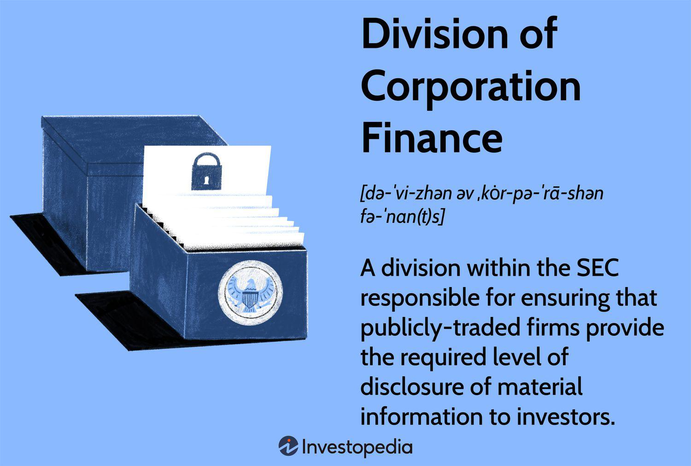

## Table of Contents

## What is the Division of Corporation Finance?

The Division of Corporation Finance is a part of the U.S. Securities and Exchange Commission (SEC). Its main job is to make sure that companies follow the rules when they want to sell stocks or bonds to the public. This means the division reviews the documents that companies send to the SEC to make sure they are honest and clear about their business and finances.

The division also helps to make the rules that companies need to follow when they report their financial information. They work to make sure that investors get the information they need to make smart choices about buying or selling stocks. By doing this, the Division of Corporation Finance helps keep the stock market fair and trustworthy for everyone.

## What are the primary functions of the Division of Corporation Finance?

The Division of Corporation Finance is part of the U.S. Securities and Exchange Commission (SEC). Its main job is to check the documents that companies send when they want to sell stocks or bonds to the public. The division makes sure these documents are honest and clear. This helps investors understand the company's business and finances before they decide to buy or sell stocks.

Another important job of the division is to help make the rules that companies must follow when they report their financial information. These rules are important because they help make sure that the information companies share is accurate and useful. By doing this, the Division of Corporation Finance helps keep the stock market fair and trustworthy for everyone who wants to invest.

## How does the Division of Corporation Finance interact with public companies?

The Division of Corporation Finance works closely with public companies to make sure they follow the rules set by the SEC. When a company wants to sell stocks or bonds to the public, it has to send documents to the SEC. The division reviews these documents to check if they are honest and clear. They look at things like the company's business plan, financial statements, and any risks involved. If the division finds problems or missing information, they will ask the company to fix it before they can sell their stocks or bonds.

Besides checking new documents, the Division of Corporation Finance also helps make the rules that companies need to follow when they report their financial information. They work to make sure these rules are fair and clear so that companies can easily follow them. This helps investors get the information they need to make smart choices about buying or selling stocks. By doing this, the division helps keep the stock market fair and trustworthy for everyone.

## What role does the Division of Corporation Finance play in securities regulation?

The Division of Corporation Finance is a key part of the U.S. Securities and Exchange Commission (SEC) and plays a big role in making sure companies follow the rules when they sell stocks or bonds to the public. They do this by carefully checking the documents that companies send to the SEC. These documents need to be honest and clear so that people who might want to invest can understand the company's business and finances. If the division finds any problems or missing information, they ask the company to fix it before they can go ahead with selling their stocks or bonds.

The division also helps create the rules that companies must follow when they report their financial information. These rules are important because they make sure that the information companies share is accurate and useful for investors. By doing this, the Division of Corporation Finance helps keep the stock market fair and trustworthy. This means that everyone who wants to invest can do so with confidence, knowing that the information they get is reliable.

## How does the Division of Corporation Finance ensure transparency in financial reporting?

The Division of Corporation Finance makes sure that companies are honest and clear when they share their financial information. They do this by carefully checking the documents that companies send to the SEC when they want to sell stocks or bonds to the public. These documents, called disclosure documents, need to show the company's business, finances, and any risks involved. If the division finds any problems or missing information, they will ask the company to fix it. This helps make sure that investors get all the information they need to make smart choices about buying or selling stocks.

The division also helps make the rules that companies have to follow when they report their financial information. These rules are important because they help make sure that the information companies share is accurate and useful. By setting clear rules and checking the documents, the Division of Corporation Finance helps keep the stock market fair and trustworthy. This way, everyone who wants to invest can do so with confidence, knowing that the information they get is reliable and complete.

## What are the key benefits of the Division of Corporation Finance for investors?

The Division of Corporation Finance helps investors by making sure that companies are honest and clear when they want to sell stocks or bonds. When a company wants to do this, they have to send documents to the SEC. The division checks these documents to make sure they tell the truth about the company's business and money. If something is wrong or missing, the division makes the company fix it. This means investors can trust the information they get and make better choices about buying or selling stocks.

The division also helps make the rules that companies need to follow when they report their financial information. These rules are important because they make sure the information companies share is correct and helpful. By doing this, the Division of Corporation Finance keeps the stock market fair and safe for everyone. Investors can feel confident that the information they use to make decisions is reliable and complete.

## How does the Division of Corporation Finance contribute to market integrity?

The Division of Corporation Finance helps keep the stock market honest and fair. They do this by checking the documents that companies send to the SEC when they want to sell stocks or bonds. These documents need to tell the truth about the company's business and money. If the division finds any mistakes or missing information, they ask the company to fix it before they can sell their stocks or bonds. This way, investors get all the right information they need to make good choices about buying or selling stocks.

The division also helps make the rules that companies have to follow when they report their financial information. These rules are important because they make sure the information companies share is correct and useful. By setting clear rules and checking the documents, the Division of Corporation Finance helps make sure the stock market is a safe place for everyone. This means investors can trust the information they get and feel confident when they invest their money.

## What is the process for reviewing disclosures by the Division of Corporation Finance?

When a company wants to sell stocks or bonds to the public, they have to send documents to the SEC. The Division of Corporation Finance checks these documents carefully to make sure they tell the truth about the company's business and money. They look for any mistakes or missing information. If they find something wrong, they will ask the company to fix it before they can sell their stocks or bonds. This helps make sure that investors get all the right information they need to make good choices.

The division also works to make the rules that companies have to follow when they report their financial information. These rules are important because they help make sure the information companies share is correct and useful for investors. By setting clear rules and checking the documents, the Division of Corporation Finance helps keep the stock market fair and safe for everyone. This way, investors can trust the information they get and feel confident when they invest their money.

## How has the role of the Division of Corporation Finance evolved over time?

The Division of Corporation Finance was set up to help make sure that companies tell the truth when they want to sell stocks or bonds to the public. Over time, its role has grown and changed a lot. In the beginning, it was mainly about checking the documents that companies sent to the SEC. They made sure these documents were clear and honest so that investors could understand the company's business and money. But as the stock market got bigger and more complicated, the division had to do more to keep up.

Now, the Division of Corporation Finance does a lot more than just checking documents. They also help make the rules that companies have to follow when they report their financial information. These rules are important because they make sure the information companies share is accurate and useful for investors. The division also works to make sure the stock market stays fair and trustworthy. They do this by keeping an eye on new ways companies might try to trick investors and by updating the rules to fit the changing world of business. This way, they help keep the stock market a safe place for everyone who wants to invest.

## What are some challenges faced by the Division of Corporation Finance in enforcing regulations?

The Division of Corporation Finance faces a lot of challenges when they try to make sure companies follow the rules. One big challenge is keeping up with how fast the business world changes. New types of businesses, like tech companies or companies that use cryptocurrencies, can be hard to understand and regulate. The division has to learn about these new businesses quickly so they can make sure their rules still work and keep the market fair for everyone.

Another challenge is making sure companies tell the truth in their documents. Sometimes, companies might try to hide information or make their business look better than it really is. The division has to be very careful when they check these documents to find any mistakes or lies. It can be hard because companies might use complicated ways to hide the truth, and the division has to stay one step ahead to protect investors.

The division also has to deal with limited resources. They have a lot of work to do, but not always enough people or money to do it all perfectly. This means they have to choose what to focus on and sometimes might miss something important. It's a big job to keep the stock market honest and fair, and the Division of Corporation Finance works hard to do it even with these challenges.

## How does the Division of Corporation Finance collaborate with other regulatory bodies?

The Division of Corporation Finance works with other groups to make sure companies follow the rules when they want to sell stocks or bonds. One way they do this is by working with other parts of the SEC, like the Division of Enforcement. If the Division of Corporation Finance finds a problem with a company's documents, they might ask the Division of Enforcement to look into it more and take action if needed. They also talk with other government groups, like the Financial Industry Regulatory Authority (FINRA), to make sure everyone is working together to keep the stock market fair and safe.

Another way the Division of Corporation Finance works with others is by helping to make rules that fit with what other countries are doing. They talk with groups like the International Organization of Securities Commissions (IOSCO) to make sure the rules in the U.S. match up with rules in other places. This helps make it easier for companies that want to sell stocks or bonds in different countries. By working together, the Division of Corporation Finance helps make sure that investors all over the world can trust the information they get and feel safe when they invest their money.

## What advanced strategies does the Division of Corporation Finance employ to detect financial misstatements?

The Division of Corporation Finance uses special computer programs and data analysis to find mistakes in companies' financial reports. They look at big sets of numbers and information to see if anything looks wrong or different from what they expect. For example, they might use software to check if a company's numbers follow the normal patterns or if there are any big changes that don't make sense. This helps them find problems faster and more accurately than just reading through the documents by hand.

They also work with experts who know a lot about different kinds of businesses. These experts can spot when a company is trying to hide something or make their business look better than it really is. The division might ask these experts to look at specific parts of a company's report that seem strange or risky. By using both technology and expert knowledge, the Division of Corporation Finance can better protect investors and keep the stock market honest and fair.

## References & Further Reading

[1]: Securities and Exchange Commission. ["What We Do."](https://www.sec.gov/about/mission) U.S. Securities and Exchange Commission, 2021.

[2]: ["Advances in Financial Machine Learning"](https://www.amazon.com/Advances-Financial-Machine-Learning-Marcos/dp/1119482089) by Marcos Lopez de Prado

[3]: ["Quantitative Trading: How to Build Your Own Algorithmic Trading Business"](https://github.com/LucindaYa/quant-resources/blob/master/Quantitative%20Trading%20How%20to%20Build%20Your%20Own%20Algorithmic%20Trading%20Business.pdf) by Ernest P. Chan

[4]: ["Algorithmic Trading: Winning Strategies and Their Rationale"](https://www.wiley.com/en-us/Algorithmic+Trading%3A+Winning+Strategies+and+Their+Rationale-p-9781118746912) by Ernest P. Chan

[5]: Sarbanes-Oxley Act of 2002. ["Summary of Key Provisions."](https://www.sarbanes-oxley-101.com/sarbanes-oxley-compliance.htm) The Sarbanes-Oxley Act, 2002.