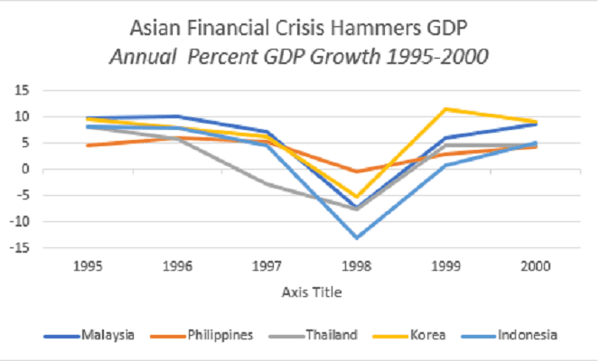

This article explores the complex relationship between South Korea and North Korea, emphasizing both their historical division and the modern economic developments in the region, including the rise of algorithmic trading. The Korean Peninsula's division is rooted in a turbulent history of colonization, war, and geopolitical maneuvering, culminating in the current juxtaposition of two countries with starkly different political ideologies and economic systems. While North Korea remains isolated under a closed, centralized economy, South Korea has burgeoned into a vibrant democratic republic, marked by expansive technological and economic growth.

South Korea's transformation into an economic powerhouse is underscored by its embrace of cutting-edge technological advancements and financial innovation. Among these developments is the rise of algorithmic trading, which exemplifies South Korea's strategies for integrating technology into its financial markets. Algorithmic trading, driven by advanced algorithms and complex computations, has enhanced market efficiency and liquidity, positioning South Korea as a leader in financial innovation.



The disparities between the two Koreas underscore the profound impact of divergent political and economic pathways, reflecting broader implications for stability and development within the region. As both countries continue on their respective trajectories, the story of Korea's historical division and economic evolution remains a pertinent example of how policies and technologies can define national futures.

## Table of Contents

## A Brief History of Korean Division

Korea was a unified nation under the Joseon dynasty for over 500 years, establishing a long-standing cultural and historical legacy. However, the turn of the 20th century marked the beginning of significant external interference in Korean affairs. In 1910, Korea was annexed by Japan, initiating a period of colonial rule that lasted until the end of World War II in 1945. This era was characterized by economic exploitation and cultural suppression, which profoundly impacted Korean society.

With Japan’s defeat in 1945, the Korean Peninsula faced new geopolitical tensions as it found itself at the center of Cold War rivalries. The peninsula was divided along the 38th parallel, with the Soviet Union occupying the north and the United States occupying the south. This division was initially intended to be a temporary measure to facilitate the surrender of Japanese forces, but it quickly transformed into a more permanent split, mainly due to the growing ideological discord between the United States and the Soviet Union.

Efforts to establish a unified Korean government were undermined by mutual distrust and conflicting ideologies, leading to the establishment of two separate governments in 1948. The Democratic People's Republic of Korea (North Korea), under Kim Il-sung, adopted a communist structure with support from the Soviet Union. In contrast, the Republic of Korea (South Korea), led by Syngman Rhee, aligned itself with capitalist and democratic ideals, supported by the United States.

This bifurcation of Korea was further solidified by the Korean War (1950-1953), which began when North Korean forces invaded the South, aiming to unify the peninsula under communist rule. The war ended with an armistice agreement, establishing the Korean Demilitarized Zone (DMZ) along the 38th parallel but leaving the two Koreas technically at war, as no peace treaty was signed. This division, rooted in ideological and political intervention, persists to this day, contributing to the ongoing tension and divergence in economic and social development on the Korean Peninsula.

## Economic Trajectories of North and South Korea

Post-1953, following the Korean War armistice, North and South Korea charted distinct economic courses reflective of their divergent political ideologies. South Korea embraced capitalist policies, transforming into an economic powerhouse over the decades. This transformation, termed the "Miracle on the Han River," saw South Korea rapidly industrialize and urbanize, driven by government-led initiatives, chaebol (large family-owned business conglomerates), and a focus on export-oriented production.

By contrast, North Korea pursued a path of economic isolationism under its authoritarian regime. Adhering to Juche, a self-reliance philosophy, North Korea focused on heavy industry and military spending at the detriment of consumer goods and agricultural development. This approach led to chronic economic stagnation and reliance on limited foreign aid, primarily from China and, intermittently, Russia.

Economically, South Korea's GDP surged from a mere $41 per capita in 1953 to one of the world's largest economies today. According to the World Bank, South Korea's GDP in 2022 exceeded $1.8 trillion, with a per capita income surpassing $30,000. South Korea stands out as a global leader in technology and innovation, housing giants like Samsung, LG, and Hyundai, and is a key player in sectors ranging from electronics to automobiles.

In contrast, North Korea's economy remains constrained by international sanctions due to its nuclear ambitions and systemic inefficiencies. Accurate economic data from North Korea is scarce, but estimates from organizations such as the Bank of Korea suggest a GDP of around $28 billion and a per capita income of approximately $1,300, indicating a significant disparity in prosperity between the two Koreas.

The technological gap further elucidates the economic divergence. South Korea has heavily invested in R&D and innovation, with cutting-edge developments in 5G technology, AI, and green technologies. This commitment has placed South Korea at the forefront of the Fourth Industrial Revolution. Meanwhile, North Korea faces significant technological limitations, primarily focusing on essential needs and military capabilities, lacking the infrastructure for significant technological advancements.

The contrasting economic trajectories of North and South Korea underscore how political and economic policy decisions can profoundly influence national development. While South Korea continues to explore and expand its economic frontiers, North Korea struggles under the weight of its isolationist policies, relying on foreign aid for sustenance and occasional economic relief.

## South Korea's Advancements in Algorithmic Trading

As South Korea's economy evolved, its financial markets witnessed the integration of advanced technologies, notably algorithmic and high-frequency trading ([HFT](/wiki/high-frequency-trading-strategies)). Algorithmic trading utilizes complex algorithms to execute orders based on predefined criteria such as timing, price, and [volume](/wiki/volume-trading-strategy). This mode of trading has become widespread among major financial institutions in South Korea, significantly enhancing the efficiency and [liquidity](/wiki/liquidity-risk-premium) of its markets. 

Algorithmic trading systems can process substantial volumes of data at high speeds, which provides a competitive edge in the dynamic financial environment. For instance, the Korea Exchange (KRX) has seen a rise in trading activities facilitated by algorithms, which handle tasks ranging from [market making](/wiki/market-making) to [arbitrage](/wiki/arbitrage). The automation of such activities allows for quicker decision-making and reduced transaction costs, hence improving market depth and the bid-ask spread.

Despite these advantages, concerns regarding market stability and regulatory challenges persist, particularly with the rise of high-frequency trading. HFT involves executing orders at extremely high speeds, often outpacing human traders. While it contributes to greater liquidity and narrower spreads, it can also lead to volatile markets due to rapid order placements and cancellations. This increased [volatility](/wiki/volatility-trading-strategies) poses risks to market stability and integrity, as seen in events like the "flash crash."

To address these concerns, South Korean financial regulators have implemented enhanced regulatory frameworks. Regulatory bodies such as the Financial Services Commission (FSC) have introduced measures to mitigate potential market disruptions caused by [algorithmic trading](/wiki/algorithmic-trading). These measures include mandatory risk control mechanisms and stricter reporting requirements for trading firms engaged in HFT. For example, liquidity providers must maintain systems to prevent erroneous orders and ensure compliance with established norms to protect market participants, particularly retail investors.

The balance between fostering technological innovation and ensuring market stability is crucial for the sustainable development of South Korean financial markets. By imposing stringent oversight and promoting transparency in trading activities, South Korea aims to maintain a stable and fair trading environment, addressing the dual goals of market efficiency and investor protection.

## Regulatory Challenges and Developments

South Korea’s financial regulators have recognized the risks posed by algorithmic trading and have taken proactive measures to manage these challenges. To mitigate potential market disruptions, South Korea introduced a mandatory registration system for firms engaged in algorithmic trading. This system requires companies to disclose their trading algorithms to the regulatory authorities, ensuring transparency and enabling better oversight of trading activities.

One prominent example that underscores the need for robust regulatory oversight is the case involving Merrill Lynch's Seoul branch. In 2019, the Financial Supervisory Service (FSS) of South Korea imposed a fine on Merrill Lynch for engaging in illegal high-frequency trading practices. This incident revealed vulnerabilities in the market and highlighted the importance of stringent controls to protect retail investors and maintain market integrity.

South Korea’s regulatory framework has evolved to address the complexities of modern financial markets. The FSS, along with other regulatory bodies such as the Korea Exchange, continues to enhance regulations related to algorithmic trading, focusing on risk management and market stability. These efforts include the introduction of circuit breakers and other tools to manage market volatility. Policymakers are also exploring the use of advanced technologies, such as [machine learning](/wiki/machine-learning), to further strengthen their regulatory capabilities.

The coordinated approach of regulatory bodies in South Korea demonstrates a commitment to balancing innovation with the safeguarding of market participants. By requiring disclosure and monitoring of trading algorithms, South Korea aims to prevent potential abuses and maintain the integrity of its financial markets in an era where technology plays an increasingly central role in trading activities.

## The Future of Algorithmic Trading in South Korea

The future of algorithmic trading in South Korea is poised for significant growth, driven by advancements in [artificial intelligence](/wiki/ai-artificial-intelligence) (AI) and computational technologies. These developments are reshaping the dynamics of financial markets, making trading processes more efficient and informed. The integration of AI in algorithmic trading systems allows for sophisticated data analysis, pattern recognition, and decision-making, which enhances the capability of traders to operate in complex market environments.

The proliferation of machine learning models, capable of analyzing vast amounts of data in real-time, is central to this evolution. Models such as recurrent neural networks (RNNs) and [reinforcement learning](/wiki/reinforcement-learning), which can adapt and optimize strategies based on market conditions, are being increasingly adopted. For instance, a reinforcement learning model can autonomously adjust trading strategies to maximize returns while mitigating risks, a desirable feature in volatile markets.

A crucial aspect of this technological advancement is the balance between innovation and regulation. South Korea's regulatory framework around algorithmic trading is continually evolving to ensure that market stability is not compromised by rapid technological changes. Regulations are designed to prevent potential market abuse, such as latency arbitrage or flash crashes, which can occur due to high-speed trading strategies. Therefore, ongoing updates to regulatory policies are necessary to address these challenges and support sustainable market growth.

Python code remains a popular choice for developing and implementing algorithmic trading strategies due to its versatility and the extensive availability of libraries suited for financial analysis. Below is a basic example of a Python snippet using a simple moving average strategy to demonstrate how algorithmic trading approaches can be coded:

```python
import numpy as np
import pandas as pd

# Simulated historical price data
prices = np.random.random(100) * 100

# Calculate simple moving averages
short_window = 20
long_window = 50

signals = pd.DataFrame(index=np.arange(len(prices)))
signals['price'] = prices
signals['short_mavg'] = signals['price'].rolling(window=short_window, min_periods=1).mean()
signals['long_mavg'] = signals['price'].rolling(window=long_window, min_periods=1).mean()

# Generate trading signals
signals['signal'] = 0.0
signals['signal'][short_window:] = np.where(signals['short_mavg'][short_window:] > signals['long_mavg'][short_window:], 1.0, 0.0)

# Create positions based on signals
signals['positions'] = signals['signal'].diff()

print(signals)
```

This code provides a simple illustration of the kind of strategies algorithmic trading systems may employ, adapting to market signals to generate buy/sell decisions.

South Korea's strategies in balancing innovation with regulation can act as a blueprint for other emerging markets as they navigate the integration of AI-driven technologies into their financial systems. By fostering an environment of responsible innovation, South Korea not only enhances its financial market's competitiveness but also ensures its robustness in the face of rapid technological changes. This approach will likely bolster investor confidence and attract further investment into the South Korean financial market, cementing its position as a leader in financial innovation.

## Conclusion

The contrast between the economies of North and South Korea highlights the profound influence of political and economic policy decisions on national development. South Korea has transformed itself through a combination of strategic governance, economic reforms, and a resolute commitment to technological advancement. This transformation is particularly evident in the financial sector, where South Korea has emerged as a global leader through the integration of cutting-edge technologies, exemplified by its pioneering role in algorithmic trading.

The strategic embrace of technology in finance has bolstered South Korea's position on the global economic stage, allowing it to foster an efficient, innovative, and resilient financial environment. The implementation of algorithmic trading systems has optimized financial operations, enhanced market liquidity, and improved trading accuracy. However, these advancements come with challenges, notably the necessity to maintain market stability amidst rapid technological change.

Effective regulatory frameworks will be instrumental in managing these challenges. Legislators and financial regulators must balance fostering innovation with ensuring robust market integrity to preempt potential market abuses and protect investors. Strategic investments in technology infrastructure, alongside adaptive regulatory measures, will be critical in maintaining the delicate equilibrium between progress and stability. Furthermore, South Korea's handling of these dynamics can serve as a blueprint for other nations aiming to integrate sophisticated technological solutions within their financial systems.

Moving forward, strategic foresight and meticulous planning will be vital in leveraging the full potential of algorithmic trading while safeguarding against its inherent risks. Through prudent policy-making and a forward-thinking approach, South Korea can continue to harness technological innovations to cement its standing as a vanguard of financial innovation globally.

## References & Further Reading

[1]: Cumings, B. (2005). ["Korea's Place in the Sun: A Modern History."](https://archive.org/details/KoreasPlaceInTheSunBruceCumings) W.W. Norton & Company.

[2]: Oberdorfer, D., & Carlin, R. L. (2013). ["The Two Koreas: A Contemporary History."](https://www.amazon.com/Two-Koreas-Contemporary-History/dp/0465031234) Basic Books.

[3]: Armstrong, C. (2013). ["The Korean War: A History."](https://www.taylorfrancis.com/books/mono/10.4324/9780203079652/koreas-charles-armstrong) Modern Library Chronicles.

[4]: Lopez de Prado, M. (2018). ["Advances in Financial Machine Learning."](https://www.amazon.com/Advances-Financial-Machine-Learning-Marcos/dp/1119482089) Wiley.

[5]: Park, J.Y., & K.H. Lee (2019). ["Algorithmic Trading, Liquidity, and Volatility in the Korean Stock Market."](https://www.researchgate.net/publication/348355190_Stock_Market_Liquidity_A_Literature_Review) Pacific-Basin Finance Journal.

[6]: Chan, E. P. (2009). ["Quantitative Trading: How to Build Your Own Algorithmic Trading Business."](https://github.com/ftvision/quant_trading_echan_book) Wiley.

[7]: Aronson, D. (2007). ["Evidence-Based Technical Analysis: Applying the Scientific Method and Statistical Inference to Trading Signals."](https://www.amazon.com/Evidence-Based-Technical-Analysis-Scientific-Statistical/dp/0470008741) Wiley.