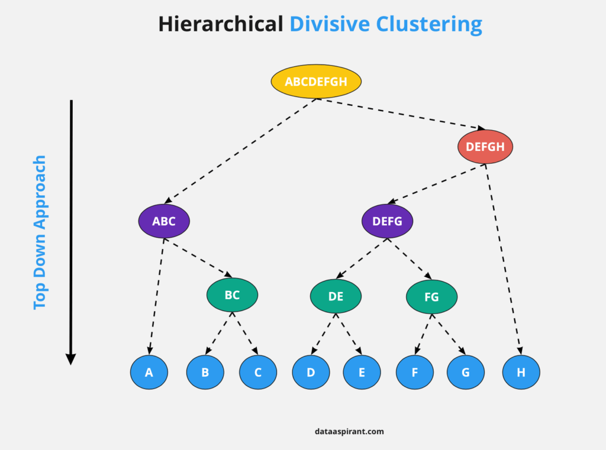

## Table of Contents

## What is divisive clustering in machine learning?

Divisive clustering is a type of hierarchical clustering method used in machine learning. Unlike agglomerative clustering, which starts with all data points as individual clusters and then merges them, divisive clustering begins with all data points in one single cluster and then splits this cluster into smaller and smaller sub-clusters. The process continues until each data point is in its own cluster or until a stopping criterion is met. This method is often visualized using a dendrogram, which is a tree diagram showing the sequence of splits.

The main advantage of divisive clustering is that it can provide a more intuitive understanding of the data structure, as it starts from a broad view and progressively refines it. However, it can be computationally expensive, especially for large datasets, because the number of possible ways to split a cluster increases rapidly as the process continues. Despite this, divisive clustering can be very useful in applications where understanding the hierarchical relationships between data points is important, such as in biology for classifying species or in market research for segmenting customers.

## How does divisive clustering differ from agglomerative clustering?

Divisive clustering and agglomerative clustering are two approaches to hierarchical clustering, but they work in opposite ways. Divisive clustering starts with all the data points in one big group and then keeps splitting this group into smaller groups. It keeps doing this until each data point is in its own group or until it decides to stop. On the other hand, agglomerative clustering begins with each data point as its own group and then starts joining these groups together. It keeps joining groups until all the data points are in one big group or until it decides to stop.

The main difference between the two methods is the direction they take to build the hierarchy. Divisive clustering goes from one big group to many small groups, while agglomerative clustering goes from many small groups to one big group. Both methods can be shown with a tree diagram called a dendrogram, which helps you see how the groups are split or joined at each step. Deciding which method to use can depend on the size of the data and what you want to learn from it. Divisive clustering might be more intuitive because it starts with a broad view and then gets more detailed, but it can be slower for big datasets because there are many ways to split a group.

## What are the basic steps involved in the divisive clustering process?

Divisive clustering starts with all the data points grouped together in one big cluster. The first step is to find a way to split this big cluster into two smaller clusters. This is done by looking at the data and figuring out which split makes the most sense, usually by trying to make the two new clusters as different from each other as possible. Once the first split is made, the process continues with each of the smaller clusters. The algorithm keeps splitting clusters into smaller and smaller groups, always trying to make the new groups as different from each other as possible.

The process of splitting continues until each data point is in its own cluster, or until a stopping rule says to stop. A common stopping rule is when the clusters get too small to be useful, or when the differences between the new clusters are not big enough to justify another split. The whole process can be shown with a tree diagram called a dendrogram, which helps you see how the clusters were split at each step. This way, you can understand how the data is organized from the big picture down to the smallest details.

## Can you explain the concept of a dendrogram in the context of divisive clustering?

A dendrogram is a tree-like diagram that shows how data points are split into smaller and smaller groups in divisive clustering. It starts with one big group at the top of the tree and then shows how this group is split into two smaller groups, and then how those groups are split into even smaller groups, and so on. Each split in the tree represents a decision to divide a cluster into two new clusters, and the height of the split on the diagram can show how different the two new groups are from each other.

By looking at a dendrogram, you can see the whole process of how the data was split step by step. It's like a map that helps you understand the structure of your data, showing which data points are more similar to each other and which are more different. This can be very useful for understanding the relationships between different parts of your data, and for deciding at what point you want to stop splitting the groups to get the most useful clusters.

## What are some common algorithms used for divisive clustering?

One common algorithm for divisive clustering is called DIANA, which stands for Divisive Analysis. DIANA starts with all the data points in one big group. It then looks for the best way to split this group into two smaller groups. It does this by trying to make the two new groups as different from each other as possible. After the first split, DIANA keeps going, splitting each of the smaller groups into even smaller groups until it can't split them anymore or until it decides to stop. This method is good for understanding how data is organized from a big picture down to the smallest details.

Another algorithm used for divisive clustering is called MONA, which stands for Monothetic Analysis. MONA is a bit different because it splits groups based on one variable at a time. It looks at each variable and decides which one will make the best split. Once it picks a variable, it splits the group into two new groups based on that variable. Then, it keeps going, [picking](/wiki/asset-class-picking) new variables and making new splits until it can't split anymore or until it decides to stop. This method can be useful when you want to see how different variables affect the way the data is split.

## How do you determine the optimal number of clusters in divisive clustering?

Determining the optimal number of clusters in divisive clustering can be tricky, but there are a few common ways to do it. One way is to look at the dendrogram, which is a tree diagram that shows how the data is split into smaller and smaller groups. By looking at the dendrogram, you can see how different the new groups are from each other at each split. If the difference between the new groups gets smaller and smaller, it might mean that you should stop splitting and use the current number of groups as the optimal number of clusters.

Another way to find the optimal number of clusters is to use something called the silhouette score. The silhouette score measures how similar a data point is to its own cluster compared to other clusters. If the silhouette score is high, it means the data points are well grouped. You can try different numbers of clusters and see which one gives the highest silhouette score. This can help you decide the best number of clusters for your data.

## What are the advantages of using divisive clustering over other clustering methods?

Divisive clustering has some advantages that make it a good choice for certain tasks. One big advantage is that it starts with a broad view of the data and then breaks it down into smaller, more detailed groups. This can be really helpful if you want to understand how your data is organized from the big picture down to the smallest details. It's like zooming in on a map, where you start with the whole world and then focus on smaller areas. This makes it easier to see the relationships between different parts of your data and can help you make better decisions about how to group your data.

Another advantage of divisive clustering is that it can be more intuitive than other methods. For example, when you look at a dendrogram, which is a tree diagram that shows how the data is split, you can see the whole process of how the data was grouped step by step. This visual representation can make it easier to understand and explain to others how the data is organized. While divisive clustering can be slower for very large datasets because it has to consider many ways to split the groups, it's a good choice when understanding the hierarchy and structure of your data is important.

## What are the limitations or challenges faced when implementing divisive clustering?

One big challenge with divisive clustering is that it can be slow, especially when you have a lot of data. This is because it starts with all the data in one big group and then keeps splitting it into smaller groups. Each time it splits a group, it has to look at all the different ways it could split it to find the best way. This can take a long time, especially if you have a lot of data points. For example, if you have a thousand data points, the number of ways to split them can grow very quickly, making the process take longer and longer.

Another challenge is deciding when to stop splitting the groups. You want to keep splitting until you have the right number of groups, but it's not always easy to know when to stop. If you split too much, you might end up with too many small groups that aren't useful. If you don't split enough, you might miss important details in your data. One way to decide when to stop is to look at a dendrogram, which is a tree diagram that shows how the data is split. By looking at the dendrogram, you can see how different the new groups are from each other and decide when the differences are too small to keep splitting.

## How can divisive clustering be applied in real-world scenarios?

Divisive clustering can be used in many real-world situations, like in biology to classify different species. Imagine you have a big group of animals, and you want to sort them into smaller groups based on how similar they are. You start with all the animals in one big group and then split them into smaller groups, like mammals and birds. Then, you keep splitting those groups into even smaller groups, like different types of mammals or birds. This helps scientists understand how different species are related to each other and can be shown with a tree diagram called a dendrogram.

Another real-world use of divisive clustering is in market research to segment customers. Companies often want to group their customers into different types based on what they buy or how they behave. They start with all their customers in one big group and then split them into smaller groups, like people who buy a lot of one product versus people who buy a little of many products. Then, they keep splitting those groups into even smaller groups, like people who buy at certain times of the year or in certain locations. This helps companies understand their customers better and can help them make better decisions about what to sell and how to sell it.

## What metrics are typically used to evaluate the performance of divisive clustering?

One common metric used to evaluate the performance of divisive clustering is the silhouette score. The silhouette score measures how similar a data point is to its own cluster compared to other clusters. If the silhouette score is high, it means the data points are well grouped and the clustering is good. You can try different numbers of clusters and see which one gives the highest silhouette score. This helps you decide the best number of clusters for your data.

Another metric is the dendrogram, which is a tree diagram that shows how the data is split into smaller and smaller groups. By looking at the dendrogram, you can see how different the new groups are from each other at each split. If the difference between the new groups gets smaller and smaller, it might mean that you should stop splitting and use the current number of groups as the optimal number of clusters. The dendrogram helps you understand the structure of your data and decide when to stop splitting the groups.

## How does divisive clustering handle high-dimensional data?

Divisive clustering can work with high-dimensional data, but it can be harder and take longer. High-dimensional data means you have a lot of different things you're looking at for each data point. When you have a lot of dimensions, it can be hard to see how different the groups are from each other. Divisive clustering starts with all the data in one big group and then keeps splitting it into smaller groups. Each time it splits a group, it has to look at all the different ways it could split it to find the best way. This can take a long time when you have a lot of dimensions because there are so many ways to split the data.

One way to help with high-dimensional data is to use something called dimensionality reduction. This means you try to find a smaller set of dimensions that still show the important parts of your data. By reducing the number of dimensions, you can make divisive clustering faster and easier. For example, you might use a method called Principal Component Analysis (PCA) to find the most important dimensions. After reducing the dimensions, you can use divisive clustering to split the data into groups. This can help you understand the structure of your high-dimensional data better.

## What are some advanced techniques or modifications to improve the efficiency of divisive clustering?

One way to improve the efficiency of divisive clustering is by using a technique called bisecting k-means. Instead of looking at all possible ways to split a cluster, bisecting k-means splits a cluster into two smaller clusters using the k-means algorithm. This can be much faster because k-means is good at finding groups quickly. You start with all the data in one big group and then use k-means to split it into two groups. Then, you pick one of those groups and split it again with k-means. You keep doing this until you have the right number of groups. This way, you can find good groups faster, even with a lot of data.

Another technique is to use a method called pre-clustering to speed up divisive clustering. Pre-clustering means you group the data into a few big groups before you start the divisive clustering process. This can help because you don't have to start with all the data in one big group. Instead, you start with a few smaller groups, which can make the process faster. For example, you might use a fast clustering method like k-means to make the big groups first. Then, you use divisive clustering on each of these big groups to split them into smaller groups. This can help you find good groups faster and make the process easier to handle, especially with a lot of data.

## References & Further Reading

[1]: Kaufman, L., & Rousseeuw, P. J. (2005). ["Finding Groups in Data: An Introduction to Cluster Analysis."](https://onlinelibrary.wiley.com/doi/book/10.1002/9780470316801) Wiley-Interscience.

[2]: Mullner, D. (2013). ["Modern hierarchical, agglomerative clustering algorithms."](https://arxiv.org/abs/1109.2378) Journal of Knowledge and Information Systems, 35, 3, 345–355.

[3]: Rokach, L., & Maimon, O. (2005). ["Clustering Methods."](https://link.springer.com/chapter/10.1007/0-387-25465-X_15) In: The Data Mining and Knowledge Discovery Handbook. Springer, Boston, MA.

[4]: Jain, A. K., & Dubes, R. C. (1988). ["Algorithms for Clustering Data."](https://dl.acm.org/doi/10.5555/42779) Prentice-Hall.

[5]: MacQueen, J. (1967). ["Some Methods for Classification and Analysis of Multivariate Observations."](https://projecteuclid.org/ebooks/berkeley-symposium-on-mathematical-statistics-and-probability/Some-methods-for-classification-and-analysis-of-multivariate-observations/chapter/Some-methods-for-classification-and-analysis-of-multivariate-observations/bsmsp/1200512992) Proceedings of the Fifth Berkeley Symposium on Mathematical Statistics and Probability, Volume 1, 281–297.

[6]: Karypis, G., Han, E. H. S., & Kumar, V. (1999). ["Chameleon: Hierarchical Clustering Using Dynamic Modeling."](https://ieeexplore.ieee.org/document/781637) Computer, 32(8), 68-75.

[7]: Hastie, T., Tibshirani, R., & Friedman, J. (2009). ["The Elements of Statistical Learning: Data Mining, Inference, and Prediction."](https://link.springer.com/book/10.1007/978-0-387-84858-7) Springer Series in Statistics.