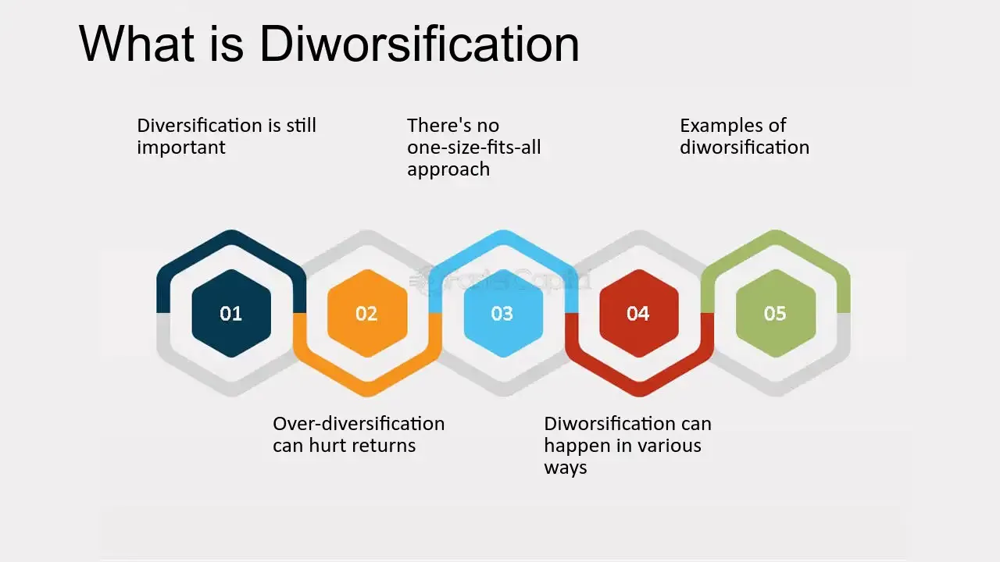

## Table of Contents

## What is diworsification?

Diworsification is a term used to describe when a company or an investor spreads their resources or money too thin across too many areas. Instead of helping, this can actually hurt their overall performance. For a company, it might mean trying to do too many different things at once, which can make them less focused and less effective in their main business. For an investor, it means putting money into too many different investments, which can lead to lower returns and more complexity in managing their portfolio.

The idea behind diworsification is that while diversification, or spreading out investments, can reduce risk, there is a point where it starts to do more harm than good. If a company or investor tries to cover too many bases, they might not be able to do any of them well. This can lead to wasted resources, lower profits, and missed opportunities to focus on what they do best. It's important for companies and investors to find a balance and not fall into the trap of diworsification.

## How does diworsification differ from diversification?

Diversification is when you spread your money or resources across different things to lower risk. For example, if you invest in many different companies or industries, a problem in one area won't hurt you too much because you have other areas doing well. It's like not putting all your eggs in one basket. This can help you be safer and maybe even make more money over time.

Diworsification is when you spread your money or resources too much, and it starts to hurt you instead of help. It's like trying to do too many things at once and not doing any of them well. If a company tries to be in too many businesses, it might lose focus on what it does best. For an investor, having too many different investments can make things complicated and lower your overall returns. The key is to find a good balance so you don't end up diworsifying instead of diversifying.

## What are the common causes of diworsification in investment portfolios?

One common cause of diworsification in investment portfolios is when investors try to own too many different investments. They might think that having lots of stocks, bonds, and other assets will make them safer. But if they have too many, it can be hard to keep track of everything. This can lead to lower returns because they might not be able to focus on the best investments. Also, managing a huge number of investments takes a lot of time and can be confusing.

Another cause is when investors chase after every new trend or hot stock without thinking about their overall plan. They might see something that seems exciting and want to jump in, but this can lead to a messy and unfocused portfolio. Instead of sticking to a clear strategy, they end up with a bunch of random investments that don't work well together. This can make their portfolio less effective and harder to manage.

Sometimes, diworsification happens because investors don't review and adjust their portfolios regularly. Over time, they might keep adding new investments without taking anything out. This can lead to a cluttered portfolio where the good investments are mixed in with the not-so-good ones. Regularly checking and cleaning up the portfolio can help avoid this problem and keep investments focused and effective.

## Can you explain the mechanisms through which diworsification negatively impacts investment returns?

When an investor diworsifies their portfolio, they spread their money across too many different investments. This can make it hard to focus on the best opportunities. Instead of putting more money into the investments that are doing well, they have to split it among many different ones. This can lead to lower returns because the money is not being used as effectively as it could be. It's like trying to water too many plants with a small watering can; none of the plants get enough water to grow well.

Another way diworsification hurts returns is by making things more complicated. When an investor has too many different investments, it can be hard to keep track of them all. They might miss important information about how each investment is doing. This can lead to bad decisions, like holding onto investments that are not doing well or selling good investments too soon. Also, it takes a lot of time to manage a large number of investments, and this time could be better spent on other things that could help the portfolio grow.

## What are some real-world examples of diworsification?

One real-world example of diworsification is when a company like General Electric (GE) tried to do too many different things at once. GE used to be known for making light bulbs and appliances, but then it started getting into businesses like finance, media, and even plastics. By trying to do so many different things, GE lost focus on what it did best. This led to big problems and a drop in its overall performance. Eventually, GE had to sell off many of these other businesses to get back to its core strengths.

Another example is when an investor puts their money into too many different stocks, thinking it will make them safer. For instance, an investor might own 50 different stocks across many industries, from tech to healthcare to energy. While diversification can reduce risk, having so many stocks can make it hard to keep track of everything. The investor might not be able to focus on the best opportunities or manage their portfolio well. This can lead to lower returns and more complexity, which is the opposite of what they wanted.

## How can an investor identify diworsification in their own portfolio?

An investor can identify diworsification in their portfolio by looking at how many different investments they have. If they own a lot of different stocks, bonds, or other assets, it might be a sign that they are spreading their money too thin. They should ask themselves if they can really keep track of all these investments and if they are all helping to meet their goals. If the portfolio feels too complicated or if they can't explain why they own each investment, it might be a case of diworsification.

Another way to spot diworsification is to see if the investments are all over the place without a clear plan. If an investor is jumping from one hot stock to another without thinking about how it fits into their overall strategy, they might be diworsifying. They should check if their investments are working together to grow their money or if they are just a random collection of different things. Regularly reviewing the portfolio and making sure each investment has a purpose can help an investor avoid diworsification.

## What are the psychological factors that lead to diworsification?

One psychological [factor](/wiki/factor-investing) that leads to diworsification is the fear of missing out, or FOMO. When investors see others making money from a new trend or hot stock, they might feel like they need to jump in too. This can make them add more and more investments to their portfolio, even if it doesn't make sense for their overall plan. They might think that having a lot of different investments will keep them safe, but it can actually make things more complicated and less effective.

Another factor is overconfidence. Some investors might think they can handle a lot of different investments and make good decisions about all of them. They might believe they can beat the market by [picking](/wiki/asset-class-picking) lots of different stocks or other assets. But this can lead to a cluttered portfolio where they can't focus on the best opportunities. Overconfidence can make them ignore the risks of having too many investments and lead to diworsification.

## What strategies can be employed to prevent diworsification?

One way to prevent diworsification is to have a clear investment plan and stick to it. Instead of chasing every new trend or hot stock, investors should focus on their goals and choose investments that help them reach those goals. They should think about how each investment fits into their overall strategy and not add new ones just because they seem exciting. By keeping their portfolio focused and simple, investors can avoid the problems that come with having too many different investments.

Another strategy is to regularly review and adjust the portfolio. Investors should take the time to look at their investments and see if they are still working well together. If they find that they have too many different assets, they can sell some of them to simplify their portfolio. This helps them stay focused on the best opportunities and avoid the clutter that can lead to diworsification. By keeping things simple and sticking to a plan, investors can make sure their money is being used effectively.

## How does rebalancing a portfolio help in mitigating diworsification?

Rebalancing a portfolio means checking it regularly and making changes to keep it in line with your goals. If you have too many different investments, rebalancing can help you get rid of the ones that aren't helping you. By selling some of these extra investments, you can put more money into the ones that are doing well. This helps you stay focused on your best opportunities and makes your portfolio simpler and more effective.

When you rebalance, you can also make sure that your investments are still working together to grow your money. If you find that your portfolio has become too complicated because you've added too many different things, rebalancing gives you a chance to fix that. By keeping your portfolio balanced and focused, you can avoid the problems that come with diworsification and make sure your money is being used in the best way possible.

## What role does asset allocation play in avoiding diworsification?

Asset allocation is like deciding how to divide your money among different types of investments, like stocks, bonds, and cash. It helps you avoid diworsification by making sure you don't spread your money too thin. When you have a good asset allocation plan, you put your money into a few key areas that match your goals and how much risk you're willing to take. This way, you can focus on the investments that are most likely to help you reach your goals without getting overwhelmed by too many different things.

By sticking to a clear asset allocation plan, you can keep your portfolio simple and effective. If you start to add too many different investments, you can look at your plan and see if they fit. If they don't, you can choose not to add them, which helps you avoid diworsification. A good asset allocation plan keeps your investments working together to grow your money, instead of having a bunch of random investments that don't help each other.

## How can advanced statistical tools be used to detect and measure diworsification?

Advanced statistical tools can help investors detect and measure diworsification by analyzing the performance and correlation of different investments in a portfolio. These tools can calculate metrics like the Sharpe ratio, which measures risk-adjusted returns, and the correlation coefficient, which shows how different investments move together. By using these metrics, investors can see if adding more investments is actually helping or if it's just making things more complicated and less effective. If the Sharpe ratio starts to go down as more investments are added, it might be a sign of diworsification.

Another way these tools can help is by running simulations and stress tests on the portfolio. For example, Monte Carlo simulations can show how a portfolio might perform under different market conditions. If the results show that having too many different investments leads to worse outcomes, it can be a clear sign of diworsification. These advanced tools give investors a more detailed and scientific way to check their portfolios and make sure they are not spreading their money too thin.

## What are the latest research findings on the long-term effects of diworsification on portfolio performance?

Recent research has shown that diworsification can hurt a portfolio's performance over the long term. When investors spread their money across too many different investments, it can make it hard to focus on the best opportunities. Studies have found that portfolios with too many investments often have lower returns compared to those that are more focused. This is because the good investments get less money, and the portfolio becomes harder to manage. Over time, this can lead to missed chances to grow wealth and lower overall performance.

Researchers have also looked at how diworsification affects risk. While diversification can reduce risk, having too many investments can actually increase it. This happens because it becomes harder to keep track of everything, and investors might end up with a mix of investments that don't work well together. Studies show that portfolios that are too spread out can be more volatile and less stable. This means that in the long run, diworsification can make a portfolio less safe and less likely to meet the investor's goals.

## What is the Concept of Diworsification?

Diworsification is a term coined by Peter Lynch to describe the ineffective diversification that results in increased risk without a corresponding potential for higher returns. This phenomenon typically arises when the components of a portfolio exhibit high correlations, or when the investment allocations diverge from the strategic objectives intended to optimize performance. 

Effective diversification ideally reduces unsystematic risk by spreading investments across various asset classes, industries, or geographies that do not correlate directly with one another. Diworsification, however, occurs when investors overextend their diversification efforts, leading to a portfolio that mimics market indices without offering tailored risk-reward benefits. This can result in diminished returns and amplified risks, which contradicts the primary goal of diversification.

To effectively avoid diworsification, investors need to understand asset correlations and engage in strategic asset allocation. By using correlation coefficients, investors can measure the degree to which asset prices move in relation to one another. A correlation coefficient ranges from -1 to 1, where -1 indicates perfect inverse correlation, 0 indicates no correlation, and 1 indicates perfect correlation. Optimal asset selection would ideally involve uncorrelated or negatively correlated assets, thereby ensuring that the overall portfolio risk is minimized.

$$
\text{Correlation coefficient (r)} = \frac{\sum (X_i - \bar{X})(Y_i - \bar{Y})}{\sqrt{\sum (X_i - \bar{X})^2 \sum (Y_i - \bar{Y})^2}}
$$

In addition to manual oversight, robo advisors and professional financial advisors provide valuable support in managing diworsification. Robo advisors harness algorithms and data analysis to optimize asset allocation, taking into account an investor's risk tolerance, time horizon, and unique financial goals. They can automatically rebalance portfolios to maintain strategic alignment and mitigate the risks associated with asset correlation and market fluctuation.

Professional financial advisors bring expertise and personalized guidance, evaluating both qualitative and quantitative aspects of investment decisions to ensure portfolios meet the desired objectives. They can also interpret complex situations where human judgment is necessary, such as macroeconomic shifts or regulatory changes impacting financial markets, to prevent diworsification.

Thus, understanding and addressing the risk of diworsification is integral to maintaining a well-balanced portfolio that aligns with an investor's strategic objectives and market conditions.

## References & Further Reading

[1]: Peter Lynch. ["One Up On Wall Street: How To Use What You Already Know To Make Money In The Market"](https://www.amazon.com/One-Up-Wall-Street-Already/dp/0743200403)

[2]: Marcos Lopez de Prado. ["Advances in Financial Machine Learning"](https://www.amazon.com/Advances-Financial-Machine-Learning-Marcos/dp/1119482089)

[3]: David Aronson. ["Evidence-Based Technical Analysis: Applying the Scientific Method and Statistical Inference to Trading Signals"](https://www.amazon.com/Evidence-Based-Technical-Analysis-Scientific-Statistical/dp/0470008741)

[4]: Stefan Jansen. ["Machine Learning for Algorithmic Trading"](https://github.com/stefan-jansen/machine-learning-for-trading)

[5]: Ernest P. Chan. ["Quantitative Trading: How to Build Your Own Algorithmic Trading Business"](https://www.amazon.com/Quantitative-Trading-Build-Algorithmic-Business/dp/0470284889)

[6]: Markowitz, H. (1952). ["Portfolio Selection"](https://onlinelibrary.wiley.com/doi/abs/10.1111/j.1540-6261.1952.tb01525.x). Journal of Finance, 7(1), 77-91.

[7]: Eugene Fama, Kenneth R. French. ["A Five-Factor Asset Pricing Model"](https://www.sciencedirect.com/science/article/pii/S0304405X14002323). Journal of Financial Economics, 116(1), 1-22.