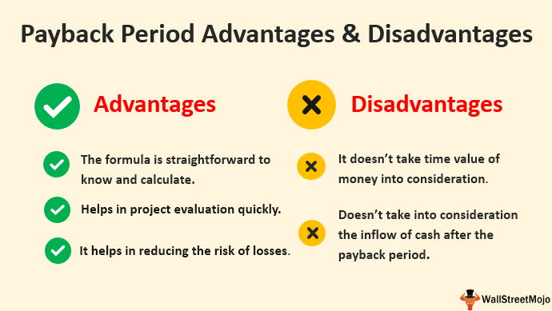

DIY investing has become an increasingly popular approach for individual investors seeking to take control of their financial futures. This shift towards self-management is largely fueled by advancements in technology that empower investors with a suite of tools enabling them to manage their own portfolios. These tools eliminate the need for full-service financial advisors by providing direct access to trading platforms, financial data, and investment strategies.

The democratization of information through the internet allows investors to educate themselves on financial markets, trading techniques, and asset management. Online educational resources, financial news platforms, and investing communities offer robust support structures for DIY investors. Furthermore, the rise of fintech companies has provided cost-effective solutions, such as discount brokerage platforms, which significantly reduce transaction fees compared to traditional brokers.



The proliferation of mobile applications and online tools allows real-time portfolio tracking and transaction execution, offering a level of convenience and oversight that was previously inaccessible to individual investors. Algorithmic trading platforms and robo-advisors present automated solutions that utilize artificial intelligence and machine learning to formulate informed trading decisions, balancing and adjusting portfolios with precision.

This article will explore DIY investing in greater detail, examining the range of investment tools available to individuals, the benefits and challenges associated with self-directed investing, and the role of algorithmic trading in enhancing portfolio management. Through this exploration, investors can better understand the potential of DIY investing and its implications for achieving personal financial goals.

## Table of Contents

## What Is DIY Investing?

DIY investing, also known as self-directed investing, allows individuals to manage their own investment portfolios. This investment approach gives investors the autonomy to make and implement decisions without the necessity of engaging full-service brokerages or professional money managers. This autonomy is primarily made possible through the advent of technology, which has democratized access to financial markets and investment information.

Technological advancements have played a crucial role in enhancing the accessibility and cost-effectiveness of DIY investing. The emergence of discount brokerage platforms, for example, has dramatically lowered the cost of trading by offering reduced fees compared to traditional brokerage services. These platforms provide user-friendly online interfaces, enabling investors to execute trades, research market trends, and access real-time data with ease. Additionally, the availability of comprehensive educational resources and analytical tools online supports informed decision-making by individual investors.

Furthermore, the landscape of DIY investing has been enriched by the availability of various digital tools and resources. For instance, there are online financial forums and investment communities where individuals can share insights and strategies. The rise of mobile applications dedicated to finance and investing further underscores the convenience and access that DIY investors now enjoy. These developments collectively allow investors to take charge of their financial plans, adjust their investment portfolios, and explore diverse asset classes at a fraction of the traditional cost. As a result, DIY investing serves as a viable alternative for those seeking control over their financial future, empowered by the advancements in financial technology (FinTech).

## DIY Investing Tools

DIY investors have access to a wide array of tools that facilitate the management of their investment portfolios. These tools include discount brokerage platforms, fund family accounts, robo-advisors, and personal account aggregators.

Discount brokerage platforms have significantly transformed the investment landscape. They provide investors with cost-effective solutions by offering lower fees compared to traditional brokerage services. These platforms often include user-friendly online interfaces, making it easier for investors to buy and sell securities without needing a broker. By eliminating or reducing commission fees, discount brokerage platforms allow investors to allocate more of their capital into their investment choices instead of brokerage costs. Examples of popular discount brokerage platforms include Charles Schwab, E*TRADE, and Robinhood.

Robo-advisors offer automated portfolio management services. These tools leverage algorithms to construct and manage investment portfolios with minimal human intervention. By assessing an investor's risk tolerance, time horizon, and financial goals, robo-advisors can create diversified portfolios that are periodically rebalanced to maintain the desired asset allocation. This automated approach can be particularly appealing to investors seeking a hands-off solution that also keeps costs low. Notable robo-advisors include Betterment, Wealthfront, and Vanguard Digital Advisor.

Personal account aggregators are another valuable tool for DIY investors, particularly for those with multiple investment accounts across different platforms. These aggregators consolidate financial information from various accounts into a single interface, providing a comprehensive overview of an investor's financial situation. This can help investors to better manage their assets, track performance, and make informed decisions. Personal account aggregators often provide budgeting tools, net worth tracking, and expense analysis, further assisting investors in managing their overall financial health. Examples of personal account aggregators include Mint, Personal Capital, and Yodlee.

The integration of these tools empowers DIY investors to effectively manage their portfolios, offering both autonomy and efficiency in their investment strategies.

## Pros of DIY Investing

DIY investing offers several distinct advantages that attract individuals seeking greater autonomy over their financial portfolio. 

**Cost Efficiency:** One of the foremost benefits of DIY investing is the potential for cost savings. By bypassing traditional financial advisors, investors can substantially reduce or even eliminate management fees typically charged by full-service brokers. These savings can be significant, particularly over long investment horizons. More capital remains in the investment account to be compounded, which can enhance long-term growth. For example, eliminating a 1% annual management fee on a $100,000 portfolio equates to saving $1,000 annually—funds that can be reinvested to potentially generate additional returns.

**Strategic Control:** DIY investors have the liberty to construct and adjust their portfolios according to their personal financial goals and risk appetite. They can swiftly adapt their strategies in response to market changes or personal circumstances without needing to consult with a third party. This strategic autonomy allows for tailored investment approaches that can align closely with the investor's preferences, be it towards growth, income, or capital preservation.

**Transparency:** A hands-on approach to investing provides greater transparency regarding costs and fees. Investors have direct visibility into their transactions, tax implications, and the performance of specific assets within their portfolio. This transparency is particularly valuable for understanding where money is being utilized, helping to make informed decisions about asset allocation and specific investment choices.

**Diverse Investment Opportunities:** DIY investing opens the door to a broad array of asset classes, including alternative investments such as real estate, commodities, or peer-to-peer lending. This breadth of options allows investors to diversify beyond traditional stocks and bonds, potentially enhancing their portfolio returns while spreading risk across different sectors and asset types. For example, investing in a mix of equities, real estate investment trusts (REITs), and commodities could provide a hedge against inflation and market volatility.

Overall, DIY investing empowers individuals to mold their investment journey to their unique specifications, fostering both financial literacy and independence.

## Cons of DIY Investing

DIY investing, while offering significant autonomy and potential cost savings, comes with its own set of challenges. One of the primary considerations is the time commitment required. Successfully managing an investment portfolio demands substantial research and ongoing management efforts. Investors must stay informed about market trends, analyze financial reports, and continuously adjust their portfolios in response to changing economic conditions. This can be especially demanding for individuals balancing other professional and personal responsibilities.

Behavioral risk is another notable concern for DIY investors. Emotional decision-making, particularly during periods of market [volatility](/wiki/volatility-trading-strategies), can lead to inefficient investment choices and losses. The tendency to overreact to market fluctuations or follow the herd can result in buying high and selling low, which is counterproductive to successful investing. Recognizing and mitigating one's own cognitive biases is crucial for maintaining a disciplined investment strategy.

A solid knowledge base of financial markets and investment principles is a prerequisite for effective DIY investing. This requirement can be daunting for beginners who may lack experience or comprehensive financial education. Understanding complex concepts, such as asset allocation, diversification, and risk management, is essential but can be challenging without structured guidance. DIY investors often need to engage in continuous learning and education to sharpen their skills.

Moreover, without professional oversight, there is a potential for mistakes. DIY investors may overlook critical financial information, misinterpret data, or make errors in executing trades. The absence of an external advisor reduces the safety net typically provided by professional scrutiny. This increases the likelihood of incurring costly mistakes, which can have long-term implications on an individual's financial health.

While DIY investing offers significant rewards, it requires a disciplined approach to manage the inherent challenges effectively. Investors must conduct thorough self-assessments to ensure they have the necessary time, emotional resilience, and knowledge to navigate the complexities of the financial markets independently.

## Algorithmic Trading in DIY Investing

Algorithmic trading, commonly referred to as algo trading, is the use of automated software to execute trading strategies based on pre-defined criteria. This approach leverages mathematical models and algorithms to make decisions, allowing DIY investors to optimize their portfolios with increased precision and efficiency. One of the main advantages of [algorithmic trading](/wiki/algorithmic-trading) is its ability to process and analyze large data sets rapidly, transforming these insights into trading actions without the emotional biases that often affect human decision-making.

For DIY investors, algorithmic trading can be a valuable tool for developing sophisticated trading strategies. By using data-driven approaches, investors can backtest strategies against historical data to assess potential outcomes and refine their plans before implementing them in the real market. This empirical testing helps in understanding the likelihood of various strategies succeeding under different market conditions.

Python, as a programming language, is commonly used by DIY investors for developing algo trading strategies due to its rich ecosystem of libraries and frameworks. For example:

```python
import pandas as pd
import numpy as np
import matplotlib.pyplot as plt

# Simple Moving Average Cross Strategy
def sma_cross_strategy(data, short_window, long_window):
    signals = pd.DataFrame(index=data.index)
    signals['price'] = data['Close']
    signals['short_mavg'] = data['Close'].rolling(window=short_window, min_periods=1).mean()
    signals['long_mavg'] = data['Close'].rolling(window=long_window, min_periods=1).mean()
    signals['signal'] = 0.0
    signals['signal'][short_window:] = np.where(signals['short_mavg'][short_window:] > signals['long_mavg'][short_window:], 1.0, 0.0)
    signals['positions'] = signals['signal'].diff()
    return signals

# Example usage with a pandas DataFrame 'data' containing stock prices
# data = pd.read_csv('stock_data.csv', parse_dates=True, index_col='Date')
# strategy = sma_cross_strategy(data, short_window=40, long_window=100)
```

This code illustrates a simple moving average (SMA) crossover strategy, which is a basic yet widely used algorithmic trading strategy. The SMA crossover involves comparing short-term and long-term moving averages of a security's price to generate buy or sell signals. This type of strategy can be further enhanced with more complex indicators and parameters to fit specific investment goals.

Despite its advantages, algorithmic trading is not without risks. The complexity and depth of financial data require a robust understanding of both programming and financial markets. Errors in algorithm design or assumptions can lead to significant financial losses. Additionally, the changing nature of markets means that strategies must be continually reviewed and updated to remain effective.

Moreover, there are operational risks, such as those associated with software glitches or connectivity issues, that can disrupt trading activities. As a result, DIY investors interested in algo trading must invest time in acquiring the necessary technical skills and market knowledge. They should also consider using risk management techniques to mitigate potential drawbacks, ensuring their algorithmic strategies align with their overall financial goals and risk tolerance.

Algorithmic trading represents a powerful avenue for DIY investors to explore, offering enhanced trading capabilities and the potential for greater returns. However, the challenges involved necessitate a careful and informed approach.

## Conclusion

DIY investing offers individual investors an empowering avenue to take control of their financial futures through self-managed investment strategies. This approach enables investors to make autonomous decisions, often translating into cost savings by reducing reliance on professional financial advisors or full-service brokerages. The sense of strategic control afforded by DIY investing allows individuals to tailor their investment strategies and asset allocations to align closely with their personal financial goals.

Despite these benefits, DIY investing is not without its challenges. One significant challenge is the time commitment required to effectively research and manage a diverse investment portfolio. Unlike managed funds, where professionals monitor and adjust investments, DIY investors must frequently review and update their holdings. Additionally, a strong foundation in financial knowledge and investment principles is necessary to navigate the intricacies of the market and to make informed decisions.

The advent of technology has furnished DIY investors with a suite of modern tools that facilitate the efficient management of investments. Discount brokerage platforms, robo-advisors, and algorithmic trading systems provide resources that can lower entry barriers and enhance decision-making processes. However, the effective use of these tools demands a disciplined approach, ensuring that emotional biases are minimized and investment strategies are consistently followed.

Ultimately, each investor must weigh the advantages and potential drawbacks to determine if DIY investing aligns with their personal financial goals and capabilities. Prospective DIY investors should assess their willingness and ability to engage with the required time, effort, and learning curve. Those who achieve this balance can harness the full potential of DIY investing, leveraging technology and strategy to manage their financial portfolios with confidence and efficacy.

## References & Further Reading

[1]: Bergstra, J., Bardenet, R., Bengio, Y., & Kégl, B. (2011). ["Algorithms for Hyper-Parameter Optimization."](https://dl.acm.org/doi/10.5555/2986459.2986743) Advances in Neural Information Processing Systems 24.

[2]: ["Advances in Financial Machine Learning"](https://www.amazon.com/Advances-Financial-Machine-Learning-Marcos/dp/1119482089) by Marcos Lopez de Prado

[3]: ["Evidence-Based Technical Analysis: Applying the Scientific Method and Statistical Inference to Trading Signals"](https://www.amazon.com/Evidence-Based-Technical-Analysis-Scientific-Statistical/dp/0470008741) by David Aronson

[4]: ["Machine Learning for Algorithmic Trading"](https://github.com/stefan-jansen/machine-learning-for-trading) by Stefan Jansen

[5]: ["Quantitative Trading: How to Build Your Own Algorithmic Trading Business"](https://github.com/LucindaYa/quant-resources/blob/master/Quantitative%20Trading%20How%20to%20Build%20Your%20Own%20Algorithmic%20Trading%20Business.pdf) by Ernest P. Chan