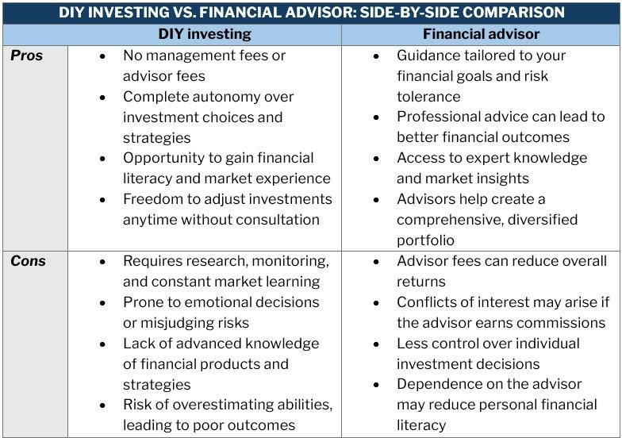

## Table of Contents

## What is DIY investing?

DIY investing means "Do It Yourself" investing. It's when you choose to manage your own investments without help from a professional. Instead of hiring someone to pick stocks or funds for you, you do all the research and make all the decisions yourself. This can be done through online platforms or apps that let you buy and sell investments easily.

People choose DIY investing for different reasons. Some like having control over their money and enjoy learning about the stock market. Others want to save money because professional advisors can be expensive. But DIY investing also has risks. If you don't know enough about investing, you might make bad choices and lose money. It's important to learn as much as you can before you start.

## What are the basic steps to start DIY investing?

To start DIY investing, first you need to set your goals. Think about why you want to invest. Are you saving for a new house, your retirement, or something else? Knowing your goals will help you decide how much risk you're willing to take and how long you plan to invest. Next, you need to learn the basics of investing. There are many resources online, like articles, videos, and books, that can teach you about stocks, bonds, mutual funds, and ETFs. Understanding these will help you make smart choices.

Once you feel ready, you should open a brokerage account. This is like a bank account but for buying and selling investments. Many online brokers offer low fees and easy-to-use apps, so pick one that fits your needs. After setting up your account, you can start investing. Begin with a small amount of money if you're new to this. You might want to start with a diversified fund like an index fund or [ETF](/wiki/etf-trading-strategies), which spreads your money across many different investments to reduce risk. Remember, investing is a long-term game, so be patient and keep learning as you go.

## What tools and platforms are available for DIY investors?

There are many tools and platforms that can help DIY investors manage their investments. Some popular online brokers include Robinhood, which is known for its user-friendly app and no-commission trades, and E*TRADE, which offers a variety of investment options and educational resources. Another option is Fidelity, which provides low-cost funds and a lot of research tools. These platforms make it easy to buy and sell stocks, ETFs, and other investments right from your phone or computer.

In addition to brokers, there are tools that can help you keep track of your investments and learn more about the market. Apps like Yahoo Finance and Google Finance let you watch stock prices and read news about companies. For more in-depth analysis, you might use tools like Morningstar or Seeking Alpha, which offer detailed reports and expert opinions on stocks and funds. These tools can help you make better decisions and stay informed about your investments.

Lastly, there are also robo-advisors like Betterment and Wealthfront, which use computer algorithms to manage your investments for you. While they still fall under the DIY category because you set up and monitor the account, they automatically adjust your portfolio based on your goals and risk tolerance. This can be a good option if you want a hands-off approach but still want to manage your own money.

## How do you choose the right investment tools for your needs?

Choosing the right investment tools depends on what you need and how much you know about investing. If you're just starting out, you might want a tool that's easy to use and has lots of help and learning materials. A platform like Robinhood could be good because it's simple and doesn't charge you to buy or sell stocks. If you want to learn more and need lots of information, a tool like E*TRADE or Fidelity might be better because they have lots of research and tools to help you make decisions.

If you're more experienced and want to manage your investments closely, you might look for tools that give you detailed data and let you trade quickly. Platforms like Thinkorswim by TD Ameritrade are good for this because they have advanced charts and trading options. But if you want something that does a lot of the work for you, a robo-advisor like Betterment or Wealthfront could be the right choice. They use computers to pick and manage your investments based on what you tell them you want.

In the end, the best tool for you is the one that fits your goals, how much you know, and how involved you want to be. It's a good idea to try out a few different tools to see which one feels right for you. Remember, you can always change tools later if you find something that works better for your needs.

## What are the advantages of DIY investing over traditional investing methods?

DIY investing lets you be in control of your money. Instead of paying a financial advisor to pick your investments, you get to make all the choices yourself. This can save you a lot of money because advisors often charge fees, and those fees can add up over time. Plus, when you do your own investing, you learn a lot about the stock market and how to make your money grow. It can be really fun and satisfying to see your investments do well because of the decisions you made.

Another big advantage is that DIY investing gives you more flexibility. With traditional investing, you might have to wait for your advisor to make moves or stick to the options they offer. But when you do it yourself, you can buy and sell whenever you want and pick from a huge range of investments. This means you can react quickly to changes in the market or try out new strategies. And with all the online tools and apps available, it's easier than ever to manage your investments from your phone or computer, no matter where you are.

## What are the potential disadvantages and risks of DIY investing?

DIY investing can be risky if you don't know enough about the stock market. Without the help of a professional, you might make bad choices and lose money. It's easy to get caught up in the excitement of buying and selling stocks, but if you don't understand what you're doing, you could end up making big mistakes. For example, you might put all your money into one stock and lose it all if that company does poorly. It's important to do a lot of research and be careful with your choices.

Another risk is that DIY investing can take a lot of time. You have to keep up with market news, analyze different investments, and make decisions about when to buy and sell. This can be a lot of work, especially if you have a job or other responsibilities. If you don't have the time to stay on top of things, you might miss out on good opportunities or not notice when it's time to sell a stock that's doing badly. It's important to be ready to put in the time and effort needed to manage your investments well.

## How can a beginner investor educate themselves to make informed DIY investment decisions?

To start making smart DIY investment choices, a beginner should first learn the basics of investing. You can find a lot of free resources online, like articles, videos, and blogs that explain things like stocks, bonds, mutual funds, and ETFs in simple terms. Websites like Investopedia and The Motley Fool are great places to start. You can also check out [books](/wiki/algo-trading-books) from the library or buy them; some good ones for beginners are "The Intelligent Investor" by Benjamin Graham and "A Random Walk Down Wall Street" by Burton G. Malkiel. These resources will help you understand how the stock market works and what different types of investments do.

Once you have a basic understanding, it's helpful to practice what you've learned. Many online brokers let you open a practice account where you can pretend to buy and sell investments without using real money. This is a safe way to try out different strategies and see how the market moves. As you get more comfortable, you can start joining online communities and forums where other investors share their experiences and advice. Websites like Reddit's r/investing and Bogleheads.org are good places to ask questions and learn from others. Remember, the more you learn and practice, the better decisions you'll be able to make with your real money.

## What are some common strategies used in DIY investing?

One common strategy in DIY investing is called dollar-cost averaging. This means you put a set amount of money into your investments regularly, like every month. Instead of trying to guess the best time to buy, you spread out your purchases over time. This can help reduce the risk of buying at a bad time because you're buying at different prices. It's a good strategy for beginners because it's simple and helps you build a habit of saving and investing.

Another popular strategy is diversification. This means you spread your money across different types of investments, like stocks, bonds, and maybe even real estate. The idea is not to put all your eggs in one basket. If one investment does badly, others might do well and balance things out. Many people start with index funds or ETFs, which hold a lot of different stocks or bonds, making it easy to diversify without [picking](/wiki/asset-class-picking) each investment one by one.

Some investors also use a strategy called value investing. This is where you look for companies that you think are undervalued, meaning their stock price is lower than what the company is really worth. You buy these stocks hoping that other people will eventually see their true value and the price will go up. This strategy takes a lot of research and patience, but it can be rewarding if you pick the right companies.

## How do taxes affect DIY investing and what strategies can be used to minimize tax liabilities?

Taxes can have a big impact on your DIY investing. When you sell an investment for more than you paid for it, you have to pay capital gains tax on the profit. If you hold the investment for more than a year, it's called a long-term capital gain, and the tax rate is usually lower than if you sell it in less than a year, which is a short-term capital gain. Also, if you earn money from your investments, like dividends from stocks or interest from bonds, you have to pay taxes on that income too. Knowing about these taxes can help you plan your investments better and keep more of your money.

There are some strategies you can use to lower your tax bills. One way is to use tax-advantaged accounts like IRAs or 401(k)s. These accounts let your investments grow without being taxed until you take the money out, which can be a big help. Another strategy is tax-loss harvesting, where you sell investments that have lost value to offset the gains from other investments. This can lower the amount of capital gains tax you owe. Also, if you're investing in stocks, you might want to focus on companies that pay qualified dividends, which are taxed at a lower rate than regular income. By thinking about taxes as you make your investment choices, you can keep more of your earnings.

## What are the advanced tools and analytics available for experienced DIY investors?

Experienced DIY investors often use advanced tools and analytics to make better decisions. One popular tool is stock screeners, which let you filter stocks based on things like price, earnings, or how much the stock has gone up or down. This helps you find stocks that match what you're looking for without having to look through all of them yourself. Another tool is technical analysis software, which uses charts and patterns to try to predict where stock prices might go next. These tools can be really helpful if you know how to use them right.

In addition to these, many experienced investors use portfolio analysis tools to keep track of how their investments are doing. These tools can show you how your investments are spread out and how much risk you're taking. They can also help you see if you need to make changes to keep your investments balanced. Some platforms also offer [backtesting](/wiki/backtesting), which lets you test your investment strategies using old data to see how they would have worked in the past. This can give you a good idea of how well your strategies might work in the future.

## How can DIY investors manage and diversify their portfolios effectively?

To manage and diversify their portfolios effectively, DIY investors should start by spreading their money across different types of investments. This means not putting all your money into just one stock or one type of investment. Instead, you might want to invest in a mix of stocks, bonds, and maybe even real estate. A good way to do this is by using index funds or ETFs, which hold a lot of different investments in one package. This helps you own a little bit of many companies or bonds, which can lower your risk because if one investment does badly, the others might do well and balance things out.

Once you have a diversified portfolio, it's important to keep an eye on it and make changes when needed. This is called rebalancing. Over time, some of your investments might grow faster than others, which can throw off your balance. For example, if your stocks do really well, they might end up taking up a bigger part of your portfolio than you planned. To fix this, you might sell some stocks and buy more bonds or other investments to get back to your original plan. Regularly checking and adjusting your portfolio helps keep it in line with your goals and risk level.

## What are the latest trends and future predictions in the DIY investing space?

The DIY investing space is seeing a big trend toward using technology to make investing easier and more accessible. More and more people are using apps and online platforms to manage their investments without needing a financial advisor. These platforms often have low fees and let you buy and sell investments with just a few clicks on your phone. Another trend is the rise of robo-advisors, which use computers to pick and manage your investments for you. They're becoming popular because they're easy to use and can help you save money on fees. Also, there's a growing interest in sustainable and socially responsible investing, where people choose investments that match their values, like companies that are good for the environment or treat their workers well.

Looking to the future, experts think that technology will keep playing a bigger role in DIY investing. We might see even more advanced tools that use [artificial intelligence](/wiki/ai-artificial-intelligence) to help investors make better decisions. These tools could analyze huge amounts of data to find the best investment opportunities or help you understand the risks better. Another prediction is that more people will start investing in things like cryptocurrencies and other new types of investments as they become more mainstream. But no matter what new trends come along, the basics of investing—like diversifying your portfolio and keeping an eye on your investments—will still be important for DIY investors.

## References & Further Reading

[1]: Bergstra, J., Bardenet, R., Bengio, Y., & Kégl, B. (2011). ["Algorithms for Hyper-Parameter Optimization."](https://dl.acm.org/doi/10.5555/2986459.2986743) Advances in Neural Information Processing Systems 24.

[2]: ["Advances in Financial Machine Learning"](https://www.amazon.com/Advances-Financial-Machine-Learning-Marcos/dp/1119482089) by Marcos Lopez de Prado

[3]: ["Evidence-Based Technical Analysis: Applying the Scientific Method and Statistical Inference to Trading Signals"](https://www.amazon.com/Evidence-Based-Technical-Analysis-Scientific-Statistical/dp/0470008741) by David Aronson

[4]: ["Machine Learning for Algorithmic Trading"](https://github.com/stefan-jansen/machine-learning-for-trading) by Stefan Jansen

[5]: ["Quantitative Trading: How to Build Your Own Algorithmic Trading Business"](https://github.com/LucindaYa/quant-resources/blob/master/Quantitative%20Trading%20How%20to%20Build%20Your%20Own%20Algorithmic%20Trading%20Business.pdf) by Ernest P. Chan