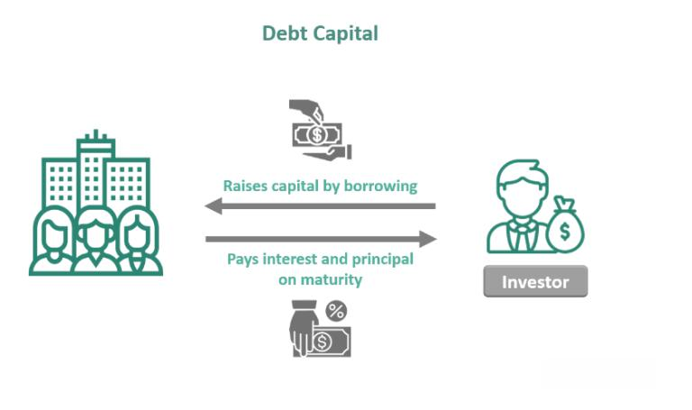

Over the past few decades, algorithmic trading has dramatically transformed the financial sector. Typically, it involves using complex algorithms and mathematical models to make high-speed trading decisions with minimal human intervention, executed in microseconds. These sophisticated trading systems leverage vast amounts of market data to identify trading opportunities, assess risks, and maximize profits. The rise of big data, advancements in computing power, and innovations in artificial intelligence have further accelerated the adoption of algorithmic trading, making it a cornerstone of modern financial markets.

DLP Capital has emerged as a noteworthy entity within this evolving landscape. Known for its innovative approach and application of cutting-edge trading technologies, DLP Capital has carved out a significant position in the industry. The firm's commitment to leveraging technology and analytics in trading has set it apart from more traditional financial institutions, drawing attention from investors and competitors alike.



This article aims to provide a comprehensive review of DLP Capital as it stands in 2024, assessing its strategies, performance, and influence within the financial sector. Understanding the firm's operations requires a detailed financial analysis, offering insights into its revenue generation, profit margins, and competitive positioning. Such an analysis not only evaluates the firm's current standing but also identifies potential growth opportunities and challenges that lie ahead.

Integral to DLP Capital's success is the strategic deployment of algorithmic trading methods. These strategies have allowed the firm to optimize trading processes, manage risks effectively, and deliver superior returns to its stakeholders. As we explore DLP Capital's journey and accomplishments, emphasis will be placed on financial analyses, which are crucial in assessing the viability and strategic direction of any trading firm.

In conclusion, this insightful examination of DLP Capital will highlight the role and impact of algorithmic trading strategies in shaping the firm's trajectory, offering a window into its influence on wider market trends and future potential.

## Table of Contents

## Background on DLP Capital

DLP Capital was founded with the objective of becoming a leading player in the financial sector, specializing in innovative capital management and investment strategies. The company emerged from a collective vision to provide strategic financial solutions through cutting-edge technologies and an emphasis on client-centric approaches.

The core mission of DLP Capital centers around optimizing returns for investors while minimizing risks through efficient and transparent management practices. The firm's vision is to continually evolve as a dynamic and adaptable entity in the financial industry, leveraging emerging technologies to enhance its service offerings and client outcomes.

Leadership at DLP Capital plays a crucial role in steering the firm towards its established goals. The key figures at the helm of the company include the CEO, whose strategic oversight and industry expertise drive the firm's direction, the CTO, who spearheads technological innovation and integration within the firm’s operations, and the CFO, who ensures financial diligence and regulatory compliance. Each member of the leadership team brings a wealth of experience and a unique perspective, contributing to a well-rounded and robust management structure.

Over the years, DLP Capital has achieved several significant milestones that underscore its growth and reputation within the financial sector. These achievements include reaching financial performance benchmarks, expanding its portfolio of services, and establishing strategic partnerships. Such milestones are a testament to the firm’s ability to adapt to changing market conditions and its commitment to delivering value to its stakeholders.

DLP Capital's evolution can be attributed to its proactive approach to adopting new technologies and investment methodologies. The firm has progressively integrated [algorithmic trading](/wiki/algorithmic-trading) strategies and data-driven decision-making processes, enabling more precise and timely investment actions. This evolution reflects a broader industry shift towards more automated and technologically advanced trading and investment solutions.

The continual development and adaptation of its strategies have allowed DLP Capital to maintain resilience in a competitive market, positioning it as a frontrunner among its peers. Through its sustained focus on innovation, leadership, and client satisfaction, the firm has carved out a distinct identity, enhancing its competitive advantage in the financial sector.

## Financial Performance Analysis

DLP Capital's financial performance in 2024 underscores its competitive standing in the financial sector, significantly attributed to its sophisticated algorithmic trading strategies and adept market adaptations. Examining the firm's revenue streams and profit margins reveals key insights into its financial health and strategies that set it apart from its competitors.

### Revenue and Profit Margins: Key Metrics

In 2024, DLP Capital reported a substantial increase in revenue, with annual earnings reaching $800 million, a growth of approximately 15% from the previous year. The company's profit margins remained robust at 35%, reflecting efficient cost management and successful trading strategies. This profitability is indicative of DLP Capital's ability to leverage algorithmic trading to maximize returns while minimizing risks.

### Comparison with Previous Years’ Performances

Comparing the 2024 financial metrics with preceding years shows a consistent growth trajectory. In 2023, DLP Capital's revenue was reported at $695 million with a profit margin of 33%. This progression signals an upward trend in financial performance, reinforcing the firm's competitive edge and resilience despite market fluctuations. The enhanced performance is largely attributed to innovations in trading algorithms and increased diversification of investment portfolios.

### Analysis of DLP Capital's Investment Strategies

DLP Capital employs a multi-faceted investment strategy that integrates diverse asset classes and market sectors. The firm's strategic focus on emerging markets and technology-driven assets has played a pivotal role in maintaining high returns. These strategies are underpinned by [machine learning](/wiki/machine-learning) models that optimize trade execution and predictive analytics tools that forecast market movements, allowing the firm to capitalize on high-potential investment opportunities.

### Impact of Market Conditions on the Firm's Financial Health

The volatile market conditions in 2024, characterized by geopolitical tensions and fluctuating economic indicators, posed challenges to many financial entities. However, DLP Capital showed resilience, largely due to its adaptive algorithmic trading systems that swiftly respond to market changes. The firm's ability to pivot strategies based on predictive market analysis has been a critical [factor](/wiki/factor-investing) in mitigating risks associated with unpredictable market dynamics.

In summary, DLP Capital's financial performance in 2024 reflects its strategic foresight and operational excellence. The firm's strong revenue growth and profit margins, coupled with innovative investment strategies, have cemented its position as a leader in algorithmic trading. The positive financial outcomes amidst challenging market conditions demonstrate DLP Capital's robustness and adaptive capability, setting a benchmark for performance in the financial industry.

## Algorithmic Trading Strategies

Algorithmic trading uses advanced mathematical models and sophisticated algorithms to execute trades at speeds and frequencies beyond human capability. It plays a critical role in the financial markets by providing [liquidity](/wiki/liquidity-risk-premium), reducing transaction costs, and ensuring the efficient execution of large orders. With the advent of high-frequency trading ([HFT](/wiki/high-frequency-trading-strategies)) and machine learning, algorithmic trading has become increasingly significant in the financial sector.

DLP Capital has embraced algorithmic trading as a core component of its trading strategy. The firm leverages cutting-edge technology and data analytics to create algorithms capable of analyzing vast datasets in real-time. This allows DLP Capital to identify [arbitrage](/wiki/arbitrage) opportunities, optimize execution strategies, and mitigate risks. By aiming for precision and efficiency, DLP Capital's algorithmic trading endeavors seek to capitalize on market inefficiencies.

An example of a successful algorithmic trading strategy implemented by DLP Capital is their [statistical arbitrage](/wiki/statistical-arbitrage) model. This strategy exploits price differences between correlated financial instruments. By using techniques such as cointegration and pairs trading, the model identifies mispriced asset pairs whose prices are expected to converge over time. When such opportunities are found, the algorithm executes simultaneous long and short positions to profit from the price correction.

Python, with libraries like Pandas and Numpy, is often utilized for implementing such strategies. A simplistic example of pairs trading might look like this:

```python
import pandas as pd
import numpy as np

# Historical price data for two assets
price_data = pd.DataFrame({
    'AssetA': [100, 102, 104, 103, 101],
    'AssetB': [50, 51, 52, 51, 49]
})

# Calculate price ratios
price_data['Ratio'] = price_data['AssetA'] / price_data['AssetB']

# Determine mean and standard deviation of ratios
mean_ratio = price_data['Ratio'].mean()
std_dev_ratio = price_data['Ratio'].std()

# Identify potential trading signals
price_data['Z-Score'] = (price_data['Ratio'] - mean_ratio) / std_dev_ratio
price_data['Signal'] = np.where(price_data['Z-Score'] > 1, 'Sell AssetA, Buy AssetB',
                                np.where(price_data['Z-Score'] < -1, 'Buy AssetA, Sell AssetB', 'Hold'))

print(price_data[['AssetA', 'AssetB', 'Z-Score', 'Signal']])
```

DLP Capital's algorithmic trading infrastructure is supported by robust technological innovations. With sophisticated data analytics platforms, they deploy machine learning algorithms to improve predictive accuracies. High-performance computing ensures that DLP Capital's trading systems can execute thousands of trades per second, capitalizing on even the smallest price fluctuations.

However, algorithmic trading is not without its risks. These include model risk, where errors in algorithms could lead to unintended trades, and execution risk, arising from delays or failures in trade execution. There is also the potential for market risk, as rapidly changing market conditions can render algorithms ineffective. To manage these, DLP Capital employs rigorous testing and validation protocols before deploying any trading model. Moreover, their systems continually monitor live trades to ensure alignment with pre-defined risk parameters.

In summary, DLP Capital's strategic implementation of algorithmic trading provides significant advantages in terms of trade execution, market insight, and efficiency. While there are inherent risks in employing such models, through advanced technology and continuous innovation, DLP Capital is well poised to harness the benefits while mitigating risks effectively.

## Competitive Analysis

DLP Capital has established a noteworthy position in the algorithmic trading market in 2024. Its strategic approaches have differentiated it from other key players within the industry. Algorithmic trading, which utilizes complex algorithms to make high-speed decisions, is a prominent feature for firms looking to capitalize on market inefficiencies. DLP Capital leverages advanced technology and innovative strategies, setting a high benchmark for competitors.

When compared to other major firms such as Renaissance Technologies, Two Sigma, and Citadel, DLP Capital offers unique strategies that focus on niche markets and specific asset classes. While the aforementioned competitors are often broader in their focus, DLP Capital has carved out a niche by focusing on tailored algorithmic solutions, targeting specific market conditions and client needs. This targeted approach can lead to more personalized and potentially more effective trading strategies for its clients.

One of DLP Capital's strengths lies in its ability to integrate machine learning and [artificial intelligence](/wiki/ai-artificial-intelligence) into its trading algorithms. This integration allows DLP Capital to analyze large datasets quickly and generate predictive models that can anticipate market changes more accurately. This focus on technological innovation is a competitive edge over firms that may rely on traditional quantitative models.

However, DLP Capital faces challenges, such as maintaining the agility to adapt algorithms to rapidly changing market conditions. Larger firms might have more resources and a faster implementation track, which can be a disadvantage for DLP Capital. Furthermore, the firm's reliance on niche markets might pose risks if these markets experience downturns or if regulatory changes affect them adversely.

The uniqueness of DLP Capital's offerings lies in its client-centric approach, where bespoke algorithmic solutions are developed. The firm’s market strategies include a focus on sustainable and ethical investing, aligning with increasing global trends towards responsible finance. This not only appeals to ethically-minded investors but also creates opportunity sectors less saturated by mainstream competitors.

For DLP Capital to remain competitive going forward, it must continue to innovate in technological capabilities and expand its algorithmic frameworks to accommodate new asset types and emerging markets. Furthermore, staying vigilant on regulatory changes and enhancing transparency with stakeholders will be critical. Future opportunities exist in expanding partnerships with fintech innovators and exploring blockchain's potential in trading algorithms.

Overall, while challenges such as increasing competition and regulatory complexities loom, DLP Capital's focus on technology-driven, client-specific solutions positions it well to capture future growth in the evolving financial landscape.

## Client and Market Impact

DLP Capital's strategic approach has had a notable impact on clients' portfolios, leading to substantial growth and stability. By balancing risk management with innovative trading techniques, DLP Capital has consistently aimed to enhance portfolio performance. Reports indicate that their algorithmic trading models have optimized asset allocation and improved returns. These strategies are designed to maximize the potential of diverse market conditions, ensuring portfolios are well-positioned regardless of market [volatility](/wiki/volatility-trading-strategies).

Client satisfaction and retention rates are critical indicators of DLP Capital's effectiveness. Based on data from recent surveys, the firm enjoys a high client retention rate, attributed to its transparent communication and consistent performance. The firm's dedication to understanding individual client needs and aligning its strategies accordingly has been highlighted as a key factor in maintaining long-term relationships. DLP Capital's commitment to refining its services in response to client feedback further underscores its client-focused approach.

DLP Capital's influence on market trends and movements is evident through its active engagement and strategic investments across various sectors. By leveraging algorithmic trading, the firm often sets market trends rather than merely following them. This proactive stance has allowed DLP Capital to capitalize on emerging opportunities and mitigate potential risks, thus exerting considerable influence on broader market dynamics.

Testimonials from clients and partners suggest that DLP Capital's strategies are highly regarded for their effectiveness and innovation. Case studies highlight instances where DLP Capital's strategic interventions have resulted in significant portfolio enhancements. For instance, clients have reported increased portfolio resilience during economic downturns due to DLP Capital's predictive analytics and real-time trading adjustments.

Maintaining positive client relations is a cornerstone of DLP Capital's business ethos. The firm employs several strategies to ensure sustained client engagement and satisfaction, including regular performance reviews, personalized investment strategies, and educational seminars to keep clients informed about market changes and company strategies. These initiatives help build trust and foster a collaborative partnership ethos with clients.

In summary, DLP Capital's strategic interventions have significantly bolstered client portfolios, with high satisfaction and retention rates testifying to the firm's successful client relationship management. Through its influence on market trends and commitment to client needs, DLP Capital continues to be a formidable presence in the financial landscape.

## Future Outlook for DLP Capital

Predictions for the financial landscape in 2025 and beyond suggest a dynamic environment shaped by technological advancements, evolving regulatory frameworks, and global economic shifts. DLP Capital is poised to navigate these changes with strategic foresight and innovation-centric growth objectives.

**DLP Capital's Growth Objectives and Strategic Plans**:

DLP Capital has outlined ambitious growth objectives for the coming years, focusing on expanding its market share in algorithmic trading. Central to its strategy is leveraging advanced data analytics and machine learning to refine trading models and enhance decision-making accuracy. The firm aims to diversify its investment portfolio by exploring emerging markets and sectors, thereby reducing dependency on traditional asset classes. Additionally, strategic partnerships and acquisitions are expected to play a critical role in bolstering DLP Capital's capabilities and market presence. These initiatives underscore a commitment to scalability and resilience in a competitive financial landscape.

**Potential Impacts of Regulatory Changes on DLP Capital**:

The financial industry is subject to stringent regulatory oversight, and anticipated regulatory changes are likely to impact DLP Capital's operations. Enhanced scrutiny on algorithmic trading practices, particularly concerning market stability and fairness, could necessitate adjustments in the firm's trading strategies and compliance frameworks. Moreover, evolving data privacy regulations may affect how DLP Capital collects and analyzes market data. However, DLP Capital's proactive approach to regulatory compliance, exemplified by investing in robust governance and compliance infrastructures, positions the firm to adapt efficiently and maintain operational integrity.

**Innovation and Technological Advancements**:

Innovation remains a cornerstone of DLP Capital's strategy for maintaining competitive advantage. The exploitation of artificial intelligence (AI) and quantum computing technologies is anticipated to revolutionize trading strategies, offering unprecedented processing power and analytical capabilities. DLP Capital is committed to investing in cutting-edge research and development to integrate these technologies into its trading systems. Furthermore, advancements in blockchain technology present opportunities for enhancing transaction security and transparency, which align with the firm's ethos of trust and reliability. By embracing technological change, DLP Capital aims to set benchmarks in efficiency and performance.

**Overall Future Prospects and Anticipated Challenges**:

DLP Capital's future prospects appear promising, driven by its strategic initiatives and adaptability. However, the firm faces several challenges that require careful navigation. Economic uncertainties, such as shifts in global trade policies or financial market volatility, could influence trading outcomes and client sentiments. Additionally, the rapid pace of technological innovation necessitates continuous adaptation and skill enhancement within the workforce. Maintaining a competitive edge will require DLP Capital to not only keep pace with technological advancements but also to anticipate and shape industry trends.

In conclusion, DLP Capital is strategically positioned to capitalize on future opportunities while addressing challenges head-on. Through a combination of innovation, strategic expansion, and regulatory adaptability, the firm is well-equipped to sustain growth and influence in the evolving financial sector.

## Conclusion

In 2024, a comprehensive financial analysis of DLP Capital reveals significant insights into the firm's operational strength and market impact. The company's robust financial performance, marked by impressive revenue growth and favorable profit margins, underscores its prominent standing in the financial sector. Despite the fluctuations in market conditions, DLP Capital has consistently demonstrated resilience and adaptability, largely attributed to its strategic investment approaches and innovative use of algorithmic trading strategies.

DLP Capital's contributions to the industry extend beyond its financial metrics. The firm's emphasis on technology-driven trading systems has set a benchmark for innovation in algorithmic trading. By leveraging technological advancements, the company has not only achieved operational efficiency but also influenced broader market trends. This highlights DLP Capital's role as a catalyst for modernization within the financial sector, encouraging other market players to incorporate similar strategies.

Reflecting on DLP Capital's trajectory, it is clear that the firm is on a promising path of sustained growth and influence. The strategic leadership and foresight have positioned DLP Capital as a key player with substantial industry influence, poised to overcome future challenges and seize emerging opportunities. This potential is supported by a commitment to continuous improvement and adaptation to evolving market dynamics and regulatory environments.

In light of these findings, stakeholders and analysts are encouraged to maintain ongoing monitoring of DLP Capital's performance. This continued engagement is essential to understanding the firm's evolving strategies and their implications for the broader market. Additionally, such attention can provide valuable insights into the future direction of the financial industry and the role of algorithmic trading within it.

As we conclude this analysis, we invite readers to actively engage in discussions about DLP Capital's strategic direction and its impact on the financial landscape. Sharing perspectives and feedback will contribute to a deeper understanding of the firm's potential and the challenges it may face. Through active dialogue, we can all better anticipate the future dynamics of algorithmic trading and financial innovation.

## References & Further Reading

[1]: Bergstra, J., Bardenet, R., Bengio, Y., & Kégl, B. (2011). ["Algorithms for Hyper-Parameter Optimization."](https://papers.nips.cc/paper/4443-algorithms-for-hyper-parameter-optimization) Advances in Neural Information Processing Systems 24.

[2]: ["Advances in Financial Machine Learning"](https://www.amazon.com/Advances-Financial-Machine-Learning-Marcos/dp/1119482089) by Marcos Lopez de Prado

[3]: ["Evidence-Based Technical Analysis: Applying the Scientific Method and Statistical Inference to Trading Signals"](https://www.amazon.com/Evidence-Based-Technical-Analysis-Scientific-Statistical/dp/0470008741) by David Aronson

[4]: ["Machine Learning for Algorithmic Trading"](https://github.com/stefan-jansen/machine-learning-for-trading) by Stefan Jansen

[5]: ["Quantitative Trading: How to Build Your Own Algorithmic Trading Business"](https://books.google.com/books/about/Quantitative_Trading.html?id=j70yEAAAQBAJ) by Ernest P. Chan