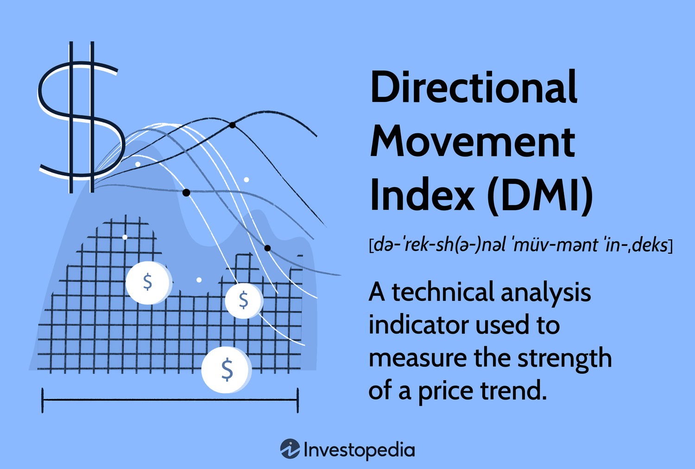

## Table of Contents

## What is the Directional Movement Index (DMI)?

The Directional Movement Index (DMI) is a technical analysis tool used by traders to determine the strength of a trend and whether a market is trending or not. It consists of three lines: the Positive Directional Indicator (+DI), the Negative Directional Indicator (-DI), and the Average Directional Index (ADX). The +DI measures the strength of upward price movement, while the -DI measures the strength of downward price movement. The ADX, on the other hand, indicates the strength of the trend, regardless of its direction.

Traders use the DMI to make decisions about entering or exiting trades. When the +DI line crosses above the -DI line, it suggests that the market might be entering a bullish trend, which could be a signal to buy. Conversely, if the -DI line crosses above the +DI line, it indicates a potential bearish trend, suggesting a time to sell. The ADX line helps traders understand the strength of the trend; a rising ADX above a certain threshold, typically 25, indicates a strong trend, while a falling ADX suggests a weakening trend or a market that is not trending.

## Who developed the DMI and when was it introduced?

The Directional Movement Index, or DMI, was created by J. Welles Wilder Jr. He is a famous person in the world of technical analysis. Wilder introduced the DMI in his book called "New Concepts in Technical Trading Systems." This book came out in 1978. 

Wilder made the DMI to help traders see if a market was moving in a strong trend or not. The DMI is made up of three parts: the Positive Directional Indicator (+DI), the Negative Directional Indicator (-DI), and the Average Directional Index (ADX). These parts help traders decide when to buy or sell things in the market.

## What are the main components of the DMI?

The Directional Movement Index, or DMI, has three main parts: the Positive Directional Indicator (+DI), the Negative Directional Indicator (-DI), and the Average Directional Index (ADX). The +DI shows how strong the upward price movement is. It helps traders know if the market is going up. The -DI shows how strong the downward price movement is. It helps traders know if the market is going down.

The ADX is different because it doesn't care if the market is going up or down. It just tells traders how strong the trend is. If the ADX number is high, it means the trend is strong. If it's low, the trend is weak or the market is not trending at all. Traders use these three parts together to make decisions about buying or selling in the market.

## How is the Positive Directional Indicator (+DI) calculated?

The Positive Directional Indicator (+DI) is a part of the Directional Movement Index (DMI). It helps traders see how strong the upward price movement is in the market. To calculate the +DI, you first need to find something called the "directional movement." If the current high price is higher than the previous high price, the difference between these two highs is the positive directional movement (+DM). If there's no new high or if the current high is the same or lower than the previous high, the +DM is zero.

Once you have the +DM, you need to compare it with the "true range" (TR) of the price movement. The true range is the biggest of three values: the difference between the current high and low, the difference between the current high and the previous close, or the difference between the current low and the previous close. To get the +DI, you divide the +DM by the TR and then multiply by 100 to turn it into a percentage. You then smooth this value over a period, usually 14 days, to get the final +DI value.

## How is the Negative Directional Indicator (-DI) calculated?

The Negative Directional Indicator (-DI) is another part of the Directional Movement Index (DMI). It helps traders understand how strong the downward price movement is in the market. To calculate the -DI, you first need to find the "directional movement." If the current low price is lower than the previous low price, the difference between these two lows is the negative directional movement (-DM). If there's no new low or if the current low is the same or higher than the previous low, the -DM is zero.

Once you have the -DM, you need to compare it with the "true range" (TR) of the price movement. The true range is the biggest of three values: the difference between the current high and low, the difference between the current high and the previous close, or the difference between the current low and the previous close. To get the -DI, you divide the -DM by the TR and then multiply by 100 to turn it into a percentage. You then smooth this value over a period, usually 14 days, to get the final -DI value.

## What is the Average Directional Index (ADX) and how is it computed?

The Average Directional Index (ADX) is a part of the Directional Movement Index (DMI) that helps traders see how strong a market trend is. It doesn't care if the market is going up or down; it just shows if the trend is strong or weak. Traders use the ADX to know if they should follow a trend or if the market is not trending at all.

To calculate the ADX, you first need to find the difference between the Positive Directional Indicator (+DI) and the Negative Directional Indicator (-DI). You take the absolute value of this difference and divide it by the sum of +DI and -DI. This gives you the Directional Movement Index (DX). You then smooth the DX over a period, usually 14 days, to get the final ADX value. A higher ADX number means a stronger trend, while a lower number means a weaker trend or no trend at all.

## How do traders interpret the ADX values?

Traders use the ADX to see how strong a market trend is. If the ADX number is above 25, it means the trend is strong. This tells traders that it might be a good time to follow the trend, either buying if the market is going up or selling if it's going down. If the ADX is below 20, it means the trend is weak or there is no trend at all. In this case, traders might want to wait or use other trading strategies that don't rely on trends.

When the ADX starts to go up, it shows that the trend is getting stronger. This can be a signal for traders to get into the market or add to their current positions. On the other hand, if the ADX starts to go down, it means the trend is getting weaker. Traders might see this as a sign to get out of their positions or to be more careful with their trades. By watching the ADX, traders can make better decisions about when to buy or sell in the market.

## What are the common strategies for using DMI in trading?

Traders use the Directional Movement Index (DMI) to make decisions about buying and selling in the market. One common strategy is to watch for crossovers between the Positive Directional Indicator (+DI) and the Negative Directional Indicator (-DI). When the +DI line crosses above the -DI line, it's a signal that the market might be starting a bullish trend. This can be a good time for traders to buy. If the -DI line crosses above the +DI line, it suggests a bearish trend might be starting, and traders might want to sell or short sell.

Another strategy involves using the Average Directional Index (ADX) to check the strength of the trend. If the ADX is above 25, it means the trend is strong. Traders might decide to follow the trend, either buying if it's going up or selling if it's going down. If the ADX is below 20, it means the trend is weak or there's no trend at all. In this case, traders might want to wait or use different strategies that work better when the market isn't trending.

Some traders also combine DMI with other tools like moving averages or the Relative Strength Index (RSI) to get a better picture of the market. By looking at these other indicators along with the DMI, traders can make more informed decisions. For example, they might wait for the +DI to cross above the -DI and for the ADX to be above 25 before deciding to buy, making sure the trend is both in their favor and strong.

## Can you explain how to set up DMI on a trading chart?

To set up the Directional Movement Index (DMI) on a trading chart, you first need to open your trading platform or charting software. Look for the indicators section, where you can add new tools to your chart. Find the DMI or ADX indicator in the list of available indicators. Once you find it, you can usually click on it or drag it onto your chart. Most platforms will ask you to set some parameters, like the period length. The default is usually 14 periods, but you can change this if you want. After setting the parameters, the DMI will appear on your chart with three lines: the +DI (Positive Directional Indicator), the -DI (Negative Directional Indicator), and the ADX (Average Directional Index).

Once the DMI is on your chart, you can start using it to make trading decisions. The +DI line will be above the price chart and will show upward price movement strength. The -DI line will also be above the price chart and will show downward price movement strength. The ADX line will be separate and will show the overall strength of the trend. You can use the crossovers between the +DI and -DI lines to spot potential trend changes. If the +DI crosses above the -DI, it might be a good time to buy. If the -DI crosses above the +DI, it might be a good time to sell. Also, watch the ADX line to see if the trend is strong or weak. If the ADX is above 25, the trend is strong, and if it's below 20, the trend is weak or there's no trend.

## What are the limitations and potential pitfalls of using DMI?

Using the Directional Movement Index (DMI) can help traders see trends in the market, but it has some limits. One big problem is that DMI can give signals that are too late. By the time the +DI and -DI lines cross, the trend might already have started, and traders might miss the best time to buy or sell. Also, DMI is better at showing if a trend is strong or weak, not so much at telling when the trend will start or end. This means traders need to use other tools along with DMI to get the whole picture of what's happening in the market.

Another thing to watch out for is that DMI can give false signals. Sometimes the +DI and -DI lines might cross, but the trend doesn't last long or doesn't happen at all. This can make traders buy or sell at the wrong times, losing money. Also, DMI works best in markets that have clear trends. In markets that move up and down a lot without a clear direction, DMI might not be very useful. Traders need to be careful and use DMI with other indicators to make better trading choices.

## How does DMI compare to other technical indicators like RSI or MACD?

The Directional Movement Index (DMI) helps traders see how strong a market trend is and if it's going up or down. It has three lines: the +DI shows how strong the upward movement is, the -DI shows how strong the downward movement is, and the ADX shows the overall strength of the trend. DMI is good at telling traders if a trend is strong, but it can be slow to signal when a trend starts or ends. This means traders might miss the best time to buy or sell. Also, DMI can give false signals sometimes, making traders buy or sell at the wrong times.

The Relative Strength Index (RSI) and the Moving Average Convergence Divergence (MACD) are different from DMI. RSI tells traders if a market is overbought or oversold, which means if the price has gone too high or too low and might change soon. It's good for spotting when a price might turn around, but it doesn't tell about the strength of a trend like DMI does. MACD shows the relationship between two moving averages and can help traders see when a trend might start or end. It's quicker than DMI at signaling trend changes but might not be as good at showing how strong the trend is. Traders often use DMI, RSI, and MACD together to get a better picture of the market and make smarter trading choices.

## Are there any advanced techniques or modifications to the standard DMI that experienced traders use?

Experienced traders sometimes use advanced techniques or modifications to the standard DMI to get more useful information from their charts. One common tweak is to change the period length from the usual 14 days to a different number, like 20 or 10 days, to fit the market they are trading in better. For example, if they are trading in a fast-moving market, they might use a shorter period to get quicker signals. Another technique is to use different types of smoothing for the ADX line, like using an exponential moving average instead of the standard method, to make the ADX line respond faster to changes in the market.

Traders also often combine the DMI with other indicators to create more powerful trading systems. For instance, they might use the DMI along with the Relative Strength Index (RSI) to spot both the strength of the trend and whether the market is overbought or oversold. If the +DI crosses above the -DI and the RSI is not in overbought territory, this could be a strong buy signal. Additionally, some traders use the DMI with the Moving Average Convergence Divergence (MACD) to confirm trend changes. If the MACD line crosses above its signal line at the same time as the +DI crosses above the -DI, it can give a more reliable signal to enter a trade. By using these advanced techniques and modifications, traders can fine-tune their use of the DMI to better suit their trading style and the markets they trade in.

## References & Further Reading

[1]: Wilder, J. W. (1978). ["New Concepts in Technical Trading Systems."](https://www.amazon.com/New-Concepts-Technical-Trading-Systems/dp/0894590278) Trend Research.

[2]: Kirkpatrick, C. D., & Dahlquist, J. R. (2010). ["Technical Analysis: The Complete Resource for Financial Market Technicians"](https://ptgmedia.pearsoncmg.com/images/9780134137049/samplepages/9780134137049.pdf) (2nd Edition). FT Press.

[3]: Pring, M. J. (2014). ["Technical Analysis Explained: The Successful Investor's Guide to Spotting Investment Trends and Turning Points"](https://www.mhebooklibrary.com/doi/epdf/10.1036/9780071826556) (5th Edition). McGraw-Hill Education.

[4]: Elder, A. (2008). ["Trading for a Living: Psychology, Trading Tactics, Money Management"](https://www.amazon.com/Trading-Living-Psychology-Tactics-Management/dp/0471592242) (2nd Edition). Wiley.

[5]: Achour, D. (2019). ["Algorithmic Trading & DMA: An Introduction to Direct Access Trading Strategies"](https://www.amazon.com/Algorithmic-Trading-DMA-introduction-strategies/dp/0956399207). Narrika Press.