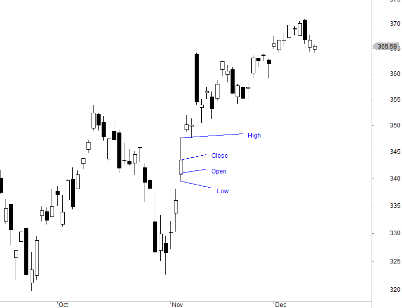

## Table of Contents

## What are candlestick patterns?

Candlestick patterns are a way to look at price movements in trading. They are used in stock markets, forex, and other financial markets. Each candlestick shows the price change of an asset over a certain time, like a day or an hour. The candlestick has a body and sometimes lines called wicks or shadows. The body shows the opening and closing prices. If the closing price is higher than the opening price, the body is usually colored green or white. If the closing price is lower than the opening price, the body is usually colored red or black. The wicks show the highest and lowest prices during that time.

There are many different candlestick patterns, and traders use them to guess where prices might go next. Some common patterns have names like "doji," "hammer," and "shooting star." For example, a doji pattern happens when the opening and closing prices are very close, making the body of the candlestick very small. This can mean that the market is unsure about the next move. Traders look at these patterns along with other information to make decisions about buying or selling. It's important to remember that candlestick patterns are not always right, but they can be a helpful tool for traders.

## How do candlestick patterns work in trading?

Candlestick patterns help traders see what prices did in the past and guess what might happen next. Each candlestick shows what happened to the price over a set time, like a day or an hour. The thick part of the candlestick, called the body, shows where the price started and where it ended. If the price went up, the body is usually green or white. If the price went down, the body is usually red or black. The thin lines above and below the body, called wicks or shadows, show the highest and lowest prices during that time.

Traders look at these patterns to make decisions about buying or selling. For example, if they see a pattern called a "hammer," where the price went down a lot but then came back up, they might think the price will keep going up. Another pattern, called a "shooting star," might make them think the price will go down. But candlestick patterns are not always right. They are just one tool that traders use along with other information to make their choices. By understanding these patterns, traders can get better at guessing what the market might do next.

## Can candlestick patterns predict market movements?

Candlestick patterns can help traders guess where the market might go next, but they can't predict the future for sure. These patterns show what prices did in the past over a short time, like a day or an hour. Traders look at the shapes of the candlesticks to see if the price might go up or down. For example, if they see a pattern like a "hammer," they might think the price will go up because the price went down a lot but then came back up. But these guesses are not always right because the market can change quickly.

Traders use candlestick patterns along with other information to make their decisions. They might look at news, other charts, and what other traders are doing. Even though candlestick patterns can be helpful, they are just one part of the puzzle. Traders need to be careful and use many tools to make the best guesses about the market. So, while candlestick patterns can give clues about what might happen, they can't predict the market perfectly.

## What is the basic theory behind candlestick charting?

Candlestick charting is a way to see how prices move in trading. Each candlestick shows what happened to the price over a set time, like a day or an hour. The thick part of the candlestick, called the body, shows where the price started and where it ended. If the price went up, the body is usually green or white. If the price went down, the body is usually red or black. The thin lines above and below the body, called wicks or shadows, show the highest and lowest prices during that time.

Traders use these candlesticks to guess where prices might go next. They look at the shapes of the candlesticks and see if they make patterns, like a "hammer" or a "shooting star." These patterns can give clues about whether the price might go up or down. But candlestick charting is not a perfect way to predict the future. It's just one tool that traders use along with other information to make their decisions.

## How can beginners start using candlestick patterns in their trading?

For beginners, the first step to using candlestick patterns in trading is to learn the basics of how candlesticks work. Each candlestick shows what happened to the price over a certain time, like a day or an hour. The thick part, called the body, shows where the price started and where it ended. If the price went up, the body is usually green or white. If the price went down, the body is usually red or black. The thin lines above and below the body, called wicks or shadows, show the highest and lowest prices during that time. Beginners should start by looking at simple patterns like the "hammer," which can mean the price might go up, or the "shooting star," which can mean the price might go down.

Once beginners understand the basic patterns, they can practice using them to make trading decisions. It's important to start small and not risk too much money at first. Beginners can use a demo account to practice trading without losing real money. They should also look at other information, like news and other charts, to help them make better guesses about where the price might go. Remember, candlestick patterns are just one tool, and they don't always predict the future perfectly. But with practice and patience, beginners can get better at using them to make smarter trading choices.

## What are some common candlestick patterns and their meanings?

Some common candlestick patterns that traders look at are the doji, hammer, and shooting star. A doji happens when the opening and closing prices are very close, making the body of the candlestick very small. This can mean that the market is unsure about the next move. A hammer has a small body at the top and a long lower wick. It shows that the price went down a lot but then came back up, which can mean the price might keep going up. A shooting star is the opposite of a hammer. It has a small body at the bottom and a long upper wick. It shows that the price went up a lot but then came back down, which can mean the price might go down.

Another pattern is the engulfing pattern, which can be bullish or bearish. A bullish engulfing pattern happens when a small red candlestick is followed by a larger green candlestick that completely covers the red one. This can mean the price might start going up. A bearish engulfing pattern is the opposite, where a small green candlestick is followed by a larger red candlestick that covers it. This can mean the price might start going down. The morning star and evening star patterns are also important. A morning star is a three-candlestick pattern that can mean the price might start going up after going down. It starts with a long red candlestick, followed by a small candlestick, and then a long green candlestick. An evening star is the opposite and can mean the price might start going down after going up. It starts with a long green candlestick, followed by a small candlestick, and then a long red candlestick.

## How effective are candlestick patterns compared to other technical analysis tools?

Candlestick patterns are one of many tools traders use to guess where prices might go next. They are good at showing what prices did over a short time, like a day or an hour. This can help traders see if the price might go up or down. But candlestick patterns are not always right because the market can change quickly. They are just one part of the puzzle, and traders need to use them with other tools to make the best guesses about the market.

Other technical analysis tools, like moving averages and trend lines, look at prices over longer times. Moving averages can help traders see the general direction of the price, while trend lines can show if the price is going up or down over time. These tools can be good at spotting big trends but might miss short-term changes that candlestick patterns can show. Traders often use both candlestick patterns and other technical analysis tools together to get a better picture of what might happen next. This way, they can make smarter trading choices.

## What statistical methods can be used to test the effectiveness of candlestick patterns?

To test how well candlestick patterns work, traders can use statistical methods like [backtesting](/wiki/backtesting) and calculating hit rates. Backtesting means looking at old price data to see how often a pattern led to the price moving the way the pattern said it would. For example, if a "hammer" pattern usually means the price will go up, traders can check past data to see if that happened most of the time. They can also calculate the hit rate, which is the percentage of times the pattern correctly predicted the price move. A high hit rate means the pattern is more reliable, but traders need to test it on lots of different data to be sure.

Another way to test candlestick patterns is by using statistical tests like the t-test or chi-square test. These tests can help see if the pattern's predictions are better than just guessing. For example, a t-test can compare the average price change after a certain pattern to what would happen if you just guessed randomly. If the pattern's results are much better than random guessing, it might be useful. But it's important to remember that past results don't always mean the same thing will happen in the future. Traders should keep testing and updating their methods to stay accurate.

## Are there any studies that quantitatively assess the reliability of candlestick patterns?

Yes, there have been studies that look at how well candlestick patterns work. One well-known study is by Thomas Bulkowski, who wrote a book called "Encyclopedia of Candlestick Charts." In his book, Bulkowski looked at a lot of old price data to see how often different candlestick patterns led to the price moving the way the pattern said it would. He found that some patterns, like the "hammer" and "shooting star," worked better than others. But he also found that no pattern was perfect, and they all had times when they were wrong.

Another study by researchers at the University of California, Davis, used a big set of data to test the reliability of candlestick patterns. They looked at over 20 years of stock market data and found that while some patterns had a better chance of predicting price moves than just guessing, the results were not always strong enough to be useful for trading. They suggested that traders should use candlestick patterns along with other tools to make better guesses about where prices might go next. Both studies show that while candlestick patterns can be helpful, they are not a sure way to predict the market.

## How do different market conditions affect the performance of candlestick patterns?

Different market conditions can change how well candlestick patterns work. In a strong uptrend, where prices are going up a lot, patterns like the "hammer" might not be as useful because the price is likely to keep going up anyway. On the other hand, in a strong downtrend, where prices are going down a lot, patterns like the "shooting star" might be more helpful because they can show that the price might keep going down. When the market is moving sideways, or not going up or down much, candlestick patterns can be more important because they can show small changes in the price that might not be easy to see otherwise.

In times of high market [volatility](/wiki/volatility-trading-strategies), when prices are changing a lot and quickly, candlestick patterns can be harder to use because the price might move in ways that the patterns don't expect. But in quieter markets, where prices are not changing much, candlestick patterns might be more reliable because they can show small changes that can help traders guess where the price might go next. So, traders need to think about what the market is doing when they use candlestick patterns to make their trading choices.

## What are the limitations of using candlestick patterns for trading decisions?

Candlestick patterns can help traders guess where prices might go next, but they have some limits. One big limit is that they are not always right. The market can change quickly, and what the patterns show might not happen. This means traders can't just use candlestick patterns to make their choices. They need to look at other things, like news and other charts, to get a better idea of what might happen. Also, candlestick patterns work best over short times, like a day or an hour. They might not be as good at showing what will happen over longer times, like weeks or months.

Another limit is that different market conditions can change how well candlestick patterns work. In a strong trend, where prices are going up or down a lot, the patterns might not be as useful. In a quiet market, where prices are not changing much, the patterns might be more helpful. But in a very busy market, where prices are changing a lot and fast, the patterns can be hard to use because the price might move in ways the patterns don't expect. So, traders need to think about what the market is doing when they use candlestick patterns. They should use these patterns along with other tools to make the best guesses about where prices might go next.

## How can advanced traders incorporate candlestick patterns into a broader trading strategy?

Advanced traders can use candlestick patterns as one part of a bigger trading plan. They look at candlestick patterns to see what prices did in the past and guess where they might go next. But they know these patterns are not always right, so they use them along with other tools. For example, they might look at moving averages to see the general direction of the price, or trend lines to see if the price is going up or down over time. They also pay attention to news and other charts to get a fuller picture of what might happen next. By combining candlestick patterns with these other tools, advanced traders can make smarter guesses about the market.

In a trading strategy, candlestick patterns can help advanced traders decide when to buy or sell. For instance, if they see a "hammer" pattern in a market that's been going down, they might think the price will start going up and decide to buy. But they won't just use the hammer pattern alone. They'll also check if the moving averages are showing a change in trend, or if the news is saying something important about the market. This way, they can be more sure about their trading choices. By using candlestick patterns as part of a bigger plan, advanced traders can better handle the ups and downs of the market.

## References & Further Reading

[1]: Nison, S. (1991). ["Japanese Candlestick Charting Techniques: A Contemporary Guide to the Ancient Investment Techniques of the Far East"](https://www.amazon.com/Japanese-Candlestick-Charting-Techniques-Contemporary/dp/0139316507). Prentice Hall Press.

[2]: Murphy, J. J. (1999). ["Technical Analysis of the Financial Markets: A Comprehensive Guide to Trading Methods and Applications"](https://www.amazon.com/Technical-Analysis-Financial-Markets-Comprehensive/dp/0735200661). New York Institute of Finance.

[3]: Chan, E. P. (2009). ["Quantitative Trading: How to Build Your Own Algorithmic Trading Business"](https://github.com/ftvision/quant_trading_echan_book). John Wiley & Sons.

[4]: Lopez de Prado, M. (2018). ["Advances in Financial Machine Learning"](https://www.amazon.com/Advances-Financial-Machine-Learning-Marcos/dp/1119482089). Wiley.

[5]: Lehmann, B. N. (1990). ["Fads, Martingales, and Market Efficiency"](https://www.jstor.org/stable/2937816). The Quarterly Journal of Economics, 105(1), 1-28.

[6]: Pring, M. J. (2002). ["Technical Analysis Explained"](https://www.amazon.com/Technical-Analysis-Explained-Fifth-Successful/dp/0071825177). McGraw-Hill Education.

[7]: Aronson, D. R. (2007). ["Evidence-Based Technical Analysis: Applying the Scientific Method and Statistical Inference to Trading Signals"](https://onlinelibrary.wiley.com/doi/book/10.1002/9781118268315). John Wiley & Sons.

[8]: Jansen, S. (2020). ["Machine Learning for Algorithmic Trading: Predictive models to extract signals from market and alternative data for systematic trading strategies with Python"](https://www.amazon.com/Machine-Learning-Algorithmic-Trading-alternative/dp/1839217715). Packt Publishing.