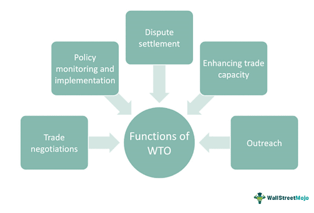

In algorithmic trading, the nuances of order management can significantly impact trade outcomes. A key feature that often goes underappreciated by novice traders is the Do Not Reduce (DNR) order, particularly when dealing in dividend-paying securities. The DNR order is designed to maintain the specified price of a pending order even when the underlying security announces a dividend, which would typically result in a price reduction. This characteristic helps in preserving the integrity of the original trading strategy, thus providing an advantage in trading scenarios where price stability is critical.

Algorithmic trading, which relies heavily on automation and precision, can benefit greatly from the DNR order. By ensuring that orders are not automatically adjusted due to dividend declarations, traders retain control over their strategic decision-making processes. This can be especially beneficial in maintaining consistent trading conditions, allowing for a more predictable trading environment amidst fluctuating market dynamics.



Understanding how the DNR order functions can be pivotal for traders who aim to maintain strategic order placement while navigating the volatility inherent in financial markets. This article examines the significance of DNR orders in algorithmic trading, exploring their usage and the resultant implications on trading strategies. By doing so, the goal is to highlight the rationale for focusing on the DNR order feature and discuss why minimizing its use might not be advantageous. In essence, the DNR order serves as a tool for traders to better manage their portfolios and achieve stability, providing a strategic edge in the ever-evolving landscape of algorithmic trading.

## Table of Contents

## What Is Do Not Reduce (DNR) Order?

A Do Not Reduce (DNR) order is a specialized type of trading order utilized in equity markets, particularly relevant for securities that pay dividends. This order is distinguished by its ability to retain the original order price even after a dividend declaration. Typically, when a company announces a cash dividend, the stock's market price adjusts downward by the amount of the dividend on the ex-dividend date. This automatic adjustment also influences pending orders, often leading to their reduction in price to reflect the change in the stock's valuation. 

However, with a DNR order, this price adjustment does not occur. The specified price of the order remains intact, providing traders with a tactical advantage by preserving their initial trading strategy despite changes in the company's dividend status. The primary utility of a DNR order is to prevent unintentional modifications to pending investment strategies that could arise from automatic downward price adjustments. This is particularly useful for traders seeking to maintain their price points while accounting for dividend yield in their strategic calculations.

In the context of cash dividend distributions, a standard trading order might adjust as follows:

$$
\text{New Price} = \text{Original Price} - \text{Dividend Amount}
$$

For instance, if a stock initially priced at $50 declares a dividend of $2, the adjusted stock price becomes $48. Concurrently, pending orders are usually recalibrated to reflect this adjusted price. However, if the order is tagged as DNR, it maintains the original $50 price point, ensuring that the trader's predefined price criterion is not compromised by the dividend payment.

It is imperative for traders to consider the use of DNR orders within their trading strategies, especially when dealing with stocks that have regular dividend payouts, to safeguard their trading positions and ensure alignment with their intended market engagement plans. The application of DNR can be strategically beneficial in maintaining consistent trading outcomes amidst automatic market adjustments due to dividends.

## The Importance of DNR in Algo Trading

Algorithmic trading, a domain driven by data precision and strategic foresight, benefits significantly from the inclusion of Do Not Reduce (DNR) orders. These orders are designed to maintain an order's specified price levels despite ex-dividend adjustments, which is vital for sustaining the integrity of automated trading strategies. The fundamental advantage of DNR in algorithmic trades is that they shield orders from being modified automatically due to dividend declarations. 

In a typical trading scenario, when a company announces a cash dividend, their stock price typically decreases to reflect the dividend payout to shareholders. Standard orders without DNR tags would consequently adjust downwards, which could unexpectedly alter the intended trade execution price. Such unintended adjustments can compromise the precision and strategic planning inherent in [algorithmic trading](/wiki/algorithmic-trading) systems. By contrast, DNR orders ensure that price levels remain constant, thereby maintaining order integrity.

The accuracy and consistency of trade execution are of paramount importance in algorithmic trading. Algorithms depend on stable and predictable inputs to function optimally. By incorporating DNR orders, traders can safeguard their trades against unwanted fluctuations in order prices, ensuring the algorithmic strategies are executed as intended. This prevents unexpected fills or cancellations due to automatic price adjustments, which could potentially disrupt trading strategies.

Moreover, DNR orders contribute significantly to the reliability of automated trading strategies. When trading algorithms are designed to work within specific price parameters, any changes induced by external factors like dividend declarations can lead to deviations from planned strategies. By utilizing DNR functionality, traders uphold the consistency of these parameters, avoiding disruptions and maintaining the robustness of their strategies.

In conclusion, the DNR order's role in algorithmic trading underscores its importance as a tool for maintaining the integrity, consistency, and reliability of automated trading strategies. As algorithms continue to play a crucial role in market operations, understanding and applying DNR orders remains an important consideration for traders seeking to optimize their automated trading approaches.

## Potential Drawbacks of Reducing DNR Functionality

Reducing the use of Do Not Reduce (DNR) orders in algorithmic trading can lead to several potential drawbacks, particularly in maintaining the integrity of carefully planned trading strategies. When traders minimize the usage of DNR orders, they could inadvertently subject their algorithmic trades to price adjustments linked to dividend payments. This might disrupt previously set strategic trading positions that depend on stable price execution.

Algorithmic trades operate under precise parameters designed to execute trades based on pre-defined conditions. By not employing DNR orders, traders risk having their limit orders automatically adjusted during ex-dividend dates, affecting the expected execution price. For example, a limit order to sell or buy a stock at a particular price might trigger differently than intended when the stock's price adjusts due to dividend declarations. This lack of control can lead to unexpected order fillings or even cancellations, potentially causing losses or missed opportunities.

In environments where price precision is crucial, such as high-frequency trading, the impact of reducing DNR functionality becomes evident. Let's consider a simplified scenario represented in Python code to illustrate this issue:

```python
# Example scenario
# Current stock price
stock_price = 100  
# Dividend declared
dividend = 2  

# Order with and without DNR
order_price_with_dnr = stock_price  # Not adjusted
order_price_without_dnr = stock_price - dividend  # Adjusted

# Execute order based on strategy
if order_price_with_dnr == 100:
    print("Order executed as planned with DNR")
else:
    print("Order execution altered without DNR")
```

In this script, with a stock price of $100 and a $2 dividend, the order intended at $100 remains unaffected by using DNR, ensuring it executes as initially strategized. However, without DNR, the order price adjusts to $98, potentially altering execution conditions and affecting strategic goals.

Furthermore, in automated trading systems, where trades are executed at high speeds, even minor discrepancies caused by unexpected price adjustments can lead to significant financial impacts. Without DNR, algorithms might need constant reprogramming to accommodate dividend-related price changes, thereby increasing system complexity and the risk of errors.

In conclusion, minimizing the use of DNR orders can introduce significant trade-offs in algorithmic trading environments. These include the unintended consequences of price adjustments, potential misalignments with trading strategies, and increased complexity in algorithm management. Therefore, understanding and carefully applying DNR orders is crucial to preserving trading strategy integrity and ensuring predictable trade execution.

## Practical Examples of DNR Application

When trading dividend-paying stocks such as Apple Inc., leveraging Do Not Reduce (DNR) orders can have a significant impact on trade outcomes. This section compares the effects of placing a DNR order versus a regular order for stocks that declare cash dividends. 

Consider a scenario where Apple Inc. announces a $0.22 per share cash dividend. Normally, on the ex-dividend date, the stock price might be expected to drop by the dividend amount. Traditional orders set at a limit price could be automatically reduced to reflect this anticipated change. For instance, a regular limit order set at $150 might be adjusted to $149.78 to account for the dividend deduction. This adjustment can inadvertently trigger executions or cancellations that disrupt intended strategies.

In contrast, a DNR order at $150 remains untouched despite the dividend announcement. This stability can prevent premature executions and allows traders to maintain their original strategic positions. For algorithmic traders, DNR offers the advantage of order immutability, contributing to consistent execution that algorithms heavily rely on.

To illustrate, consider an algorithm designed to execute orders based on real-time market signals, with a sell limit set at $150 for Apple Inc., assuming that no price reduction occurs. Without DNR, the adjusted price of $149.78 might lead to unscheduled executions, creating a mismatch between the algorithm's logic and the external price changes due to dividends.

Python code can be used to simulate this scenario:

```python
def execute_order(order_price, dividend, dnr=False):
    # Calculate the adjusted price considering dividend
    adjusted_price = order_price - dividend if not dnr else order_price

    market_price = get_real_time_market_price()  # Hypothetical function to obtain market price

    # Check execution without DNR
    if market_price <= adjusted_price:
        return "Order Executed"
    else:
        return "Order Not Executed"

# Example usage
order_price = 150.00
dividend = 0.22
print(execute_order(order_price, dividend))  # For Regular Order
print(execute_order(order_price, dividend, dnr=True))  # For DNR Order
```

This hypothetical script demonstrates the potential execution difference between regular and DNR orders. Such illustrates the tactical advantages of utilizing DNR to avoid unintended outcomes and align with broader trading objectives. 

Thus, in practical terms, the comprehensive use of DNR orders can provide considerable benefit to traders who rely on steady and predictable execution aligned with their pre-determined algorithmic strategies, especially in environments influenced by cash dividends.

## Conclusion: Embracing DNR for Strategic Edge

In an increasingly algorithm-driven trading world, maintaining financial strategies shielded from automated alterations via Do Not Reduce (DNR) orders can be vital. The essence of a DNR order lies in its ability to prevent price adjustments following dividend announcements, thus offering traders a sense of stability in volatile markets.

Implementing DNR orders strategically allows traders to maintain control over their order placement without the risk of being dragged into unintended price territories due to dividend-related price shifts. For example, when a dividend is declared, the stock price tends to drop by the amount of the dividend. Commonly, pending orders are adjusted accordingly. However, DNR orders hold their ground, preserving the original price set by the trader.

This non-reduction characteristic is beneficial in algorithmic trading environments, where trades are executed based on predefined criteria and algorithms. By understanding and leveraging DNR orders, traders can avoid unnecessary adjustments and preserve the integrity of their trading strategy.

Moreover, the stability introduced by DNR orders aids in maintaining a balanced portfolio. Traders can navigate through dividend cycles with precision, ensuring their automated systems do not deviate from the intended trading [course](/wiki/best-algorithmic-trading-courses). This foresight and planning are critical in a market landscape where even minor fluctuations can lead to significant impacts on algorithmic strategies.

By carefully considering the implications of DNR in strategy formation, traders can manage their portfolios more effectively. The use of DNR orders, therefore, becomes an integral part of a robust algorithmic trading strategy, facilitating continuity and consistency in an otherwise unpredictable trading environment. Ultimately, embracing the strategic edge provided by DNR orders can lead to better-managed risks and optimized trading outcomes.

## Further Reading and References

Readers interested in exploring the technical aspects of Do Not Reduce (DNR) orders and their implications in the financial markets may find the following resources valuable:

1. **Books and Publications**:
   - **"Algorithmic Trading and DMA: An Introduction to Direct Access Trading Strategies" by Barry Johnson**: This book provides insights into algorithmic trading strategies, including the nuances of order types like DNR, and how they affect trading dynamics.
   - **"Trading and Exchanges: Market Microstructure for Practitioners" by Larry Harris**: This comprehensive guide discusses market structures and order types, offering context on the importance of DNR orders in strategic trading environments.

2. **Journal Articles and Industry Reports**:
   - **"The Impact of Dividends on Stock Prices: Evidence from Dividend Announcements"**: This article examines the repercussions of dividend announcements on stock prices, which is crucial for understanding the rationale behind DNR orders.
   - **Market Structure Reports by Financial Analysts**: Many financial institutions release white papers and reports on market structures, providing insights into order management and execution strategies that incorporate DNR functionality.

3. **Online Platforms and Courses**:
   - **Coursera and EdX**: These platforms offer courses on algorithmic trading, which often cover the significance of order types, including DNR orders, in maintaining trading strategy integrity.
   - **Interactive Brokers Webinars**: Educational webinars from brokerage firms like Interactive Brokers offer practical insights and strategies involving DNR orders, especially for algorithmic traders.

4. **Expert Insights and Forums**:
   - **Trading forums and communities (e.g., Elite Trader, Trade2Win)**: Engaging with these communities can provide practical advice and real-world experiences from seasoned traders who utilize DNR orders.
   - **Interviews and Podcasts featuring Trading Experts**: Listening to experienced traders discuss their use of DNR orders can offer nuanced understanding and innovative strategies.

By accessing these resources, traders can enhance their comprehension of DNR orders and potentially optimize their trading strategies to account for dividend payments and other market events.

## References & Further Reading

[1]: ["Algorithmic Trading and DMA: An Introduction to Direct Access Trading Strategies"](https://www.amazon.com/Algorithmic-Trading-DMA-introduction-strategies/dp/0956399207) by Barry Johnson

[2]: ["Trading and Exchanges: Market Microstructure for Practitioners"](https://www.amazon.com/Trading-Exchanges-Market-Microstructure-Practitioners/dp/0195144708) by Larry Harris

[3]: ["The Impact of Dividends on Stock Prices: Evidence from Dividend Announcements"](https://www.etd.ceu.edu/2018/korganbekova_aliya.pdf) - A study published in the Journal of Financial and Quantitative Analysis

[4]: ["Advances in Financial Machine Learning"](https://www.amazon.com/Advances-Financial-Machine-Learning-Marcos/dp/1119482089) by Marcos Lopez de Prado

[5]: ["Quantitative Trading: How to Build Your Own Algorithmic Trading Business"](https://www.amazon.com/Quantitative-Trading-Build-Algorithmic-Business/dp/1119800064) by Ernest P. Chan