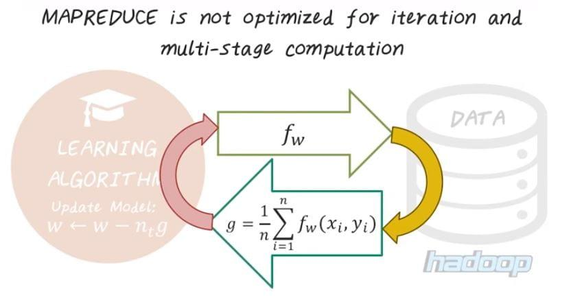

## Table of Contents

## What is Do Not Reduce (DNR) in the context of trading?

Do Not Reduce (DNR) is a term used in trading that tells the broker not to change the order price even if there are dividends or other corporate actions. When a company pays a dividend, the stock price usually goes down by that amount on the ex-dividend date. If you have a DNR order, your order price stays the same, even if the stock price drops due to the dividend.

This can be useful if you want to buy or sell a stock at a specific price, no matter what happens with dividends. For example, if you have a DNR limit order to buy a stock at $50 and the stock goes ex-dividend by $1, your order will still try to buy at $50, not at $49. It's important to understand how DNR orders work because they can affect when and if your order gets filled.

## How does the Do Not Reduce feature work with limit orders?

When you use a Do Not Reduce (DNR) feature with a limit order, it means your order price won't change even if the stock price drops because of a dividend. Let's say you want to buy a stock and you set a limit order at $50 with DNR. If the stock goes ex-dividend and its price drops by $1, your order will still try to buy the stock at $50, not at $49.

This can be helpful if you want to stick to a specific price no matter what happens with dividends. But it also means your order might not get filled if the stock price stays below your limit after the dividend. So, using DNR with limit orders can be a good strategy if you're set on a certain price, but you need to be aware that it might affect when your order gets filled.

## Can you explain the difference between a Do Not Reduce order and a regular limit order?

A regular limit order is when you tell your broker to buy or sell a stock at a specific price or better. If the stock goes down because of a dividend, your limit order price will also go down by the same amount. So, if you want to buy a stock at $50 and it goes ex-dividend by $1, your limit order will change to $49.

A Do Not Reduce (DNR) order is different. With a DNR order, your limit price stays the same even if the stock price drops because of a dividend. Using the same example, if you set a DNR limit order to buy at $50 and the stock goes ex-dividend by $1, your order will still try to buy at $50. This can be good if you really want to buy or sell at that exact price, but it might take longer for your order to be filled if the stock price stays below your limit after the dividend.

## In what scenarios would a trader use a Do Not Reduce order?

A trader might use a Do Not Reduce (DNR) order when they want to buy or sell a stock at a very specific price, no matter what happens with dividends. If a trader sets a limit order to buy a stock at $50 and the stock goes ex-dividend by $1, a regular limit order would change to $49. But with a DNR order, the trader's order would stay at $50. This can be helpful if the trader believes the stock is worth that exact price and doesn't want to settle for less.

Another scenario where a trader might use a DNR order is when they are trying to stick to a strict trading strategy. For example, if a trader has a rule to only buy stocks at certain price points and doesn't want dividends to mess up their plan, they would use a DNR order. This way, they can keep their strategy consistent and not worry about their order price changing due to corporate actions like dividends.

## How does DNR affect the execution of an order during corporate actions like dividends?

When a company pays a dividend, the stock price usually goes down by the amount of the dividend on the ex-dividend date. If you have a regular limit order, your order price will also go down by that amount. But if you have a Do Not Reduce (DNR) order, your order price stays the same, even if the stock price drops because of the dividend. This means if you want to buy a stock at $50 and it goes ex-dividend by $1, your DNR order will still try to buy at $50, not at $49.

Using a DNR order can be good if you want to buy or sell at a very specific price and don't want dividends to change your plan. But it can also make it harder for your order to be filled. If the stock price stays below your limit after the dividend, your order might not get filled until the price goes back up to your limit. So, DNR orders can help you stick to your trading strategy, but you need to be ready to wait longer for your order to be filled.

## What are the potential risks associated with using Do Not Reduce orders?

Using a Do Not Reduce (DNR) order can be risky because it might take longer for your order to be filled. If you want to buy a stock at $50 and it goes ex-dividend by $1, your DNR order will still try to buy at $50, even if the stock price drops to $49. This means you might have to wait until the stock price goes back up to $50 before your order gets filled. If the stock price stays below $50 for a long time, you might miss out on buying the stock at a good price.

Another risk is that you might miss out on other trading opportunities. While you're waiting for your DNR order to be filled, the stock price could go up a lot. If you had used a regular limit order that adjusted for the dividend, you might have bought the stock at a lower price and made more money. So, using a DNR order can make you stick to a specific price, but it might also mean you miss out on other chances to buy or sell the stock at a better time.

## How do various trading platforms implement the Do Not Reduce feature?

Different trading platforms might handle the Do Not Reduce (DNR) feature a bit differently, but the main idea is the same. When you set a DNR order, the platform will keep your order price the same even if the stock price drops because of a dividend. For example, if you want to buy a stock at $50 and it goes ex-dividend by $1, your DNR order will still try to buy at $50, not at $49. This can be helpful if you want to stick to a specific price, but it might take longer for your order to be filled if the stock price stays below your limit after the dividend.

Some platforms might show the DNR option right when you're setting up your order. You might see a checkbox or a button that says "Do Not Reduce" that you can click to turn it on. Other platforms might have the DNR feature as part of their advanced order types, so you might need to look a bit harder to find it. No matter how the platform shows it, the DNR feature helps you keep your order price the same, even when dividends change the stock price.

## Can Do Not Reduce orders be modified or canceled after placement?

Yes, you can usually change or cancel a Do Not Reduce (DNR) order after you place it. Most trading platforms let you do this easily. If you want to change your order, you can go into your account, find the order, and adjust the price or other details. If you want to cancel it, you can also find the order and choose to cancel it before it gets filled.

It's good to know that you can change or cancel DNR orders because sometimes your trading plan might change. Maybe the stock price moves a lot, or you learn new information that makes you want to buy or sell at a different price. Being able to change or cancel your DNR order gives you more control over your trades and helps you stick to your trading strategy.

## What is the impact of DNR on order management systems?

Do Not Reduce (DNR) orders can make things a bit trickier for order management systems. These systems usually change the price of limit orders when a stock goes ex-dividend. But with a DNR order, the system has to keep the price the same, even when the stock price drops because of the dividend. This means the system needs special rules to handle DNR orders differently from regular orders. It has to check if an order is a DNR order and then make sure not to change its price, which can add more work for the system.

Even though it's more work, order management systems are set up to handle DNR orders well. They can keep track of which orders are DNR and make sure they stay at the same price. This helps traders stick to their trading plans and buy or sell at the exact price they want. But it's important for the system to work right, so traders can trust that their DNR orders will be handled correctly and won't be changed by dividends.

## How does the Do Not Reduce functionality interact with other order types like stop orders?

Do Not Reduce (DNR) orders can be used with other order types like stop orders, but it's important to know how they work together. A stop order is when you tell your broker to buy or sell a stock once it reaches a certain price. If you add DNR to a stop order, it means the stop price won't change even if the stock price drops because of a dividend. So, if you set a stop order to sell at $50 with DNR and the stock goes ex-dividend by $1, your stop order will still trigger at $50, not at $49.

This can be helpful if you want to make sure your stop order triggers at a specific price, no matter what happens with dividends. But it can also mean your order might not get filled right away if the stock price stays below your stop price after the dividend. So, using DNR with stop orders can help you stick to your trading plan, but you need to be ready to wait longer for your order to be filled.

## What are the best practices for using Do Not Reduce orders effectively?

When using Do Not Reduce (DNR) orders, it's important to have a clear trading plan. Know exactly why you want to buy or sell at a specific price, and make sure that price is really important to you. DNR orders can help you stick to your plan because they won't change even if the stock price drops because of a dividend. But remember, if the stock price stays below your DNR order price after the dividend, you might have to wait longer for your order to be filled. So, be patient and ready to wait if you choose to use a DNR order.

It's also a good idea to keep an eye on the stock and be ready to change your order if things change. Even though you can set a DNR order and leave it, sometimes new information might make you want to buy or sell at a different price. Most trading platforms let you change or cancel DNR orders easily, so don't be afraid to do that if it helps you make a better trade. Using DNR orders well means balancing sticking to your plan with being flexible enough to change it when you need to.

## How can advanced traders leverage DNR in complex trading strategies?

Advanced traders can use Do Not Reduce (DNR) orders to make their trading strategies more precise. For example, if a trader has a strategy that depends on buying or selling at very specific prices, DNR orders can help them stick to those prices even when dividends change the stock price. This can be really helpful in strategies like scalping, where traders try to make small profits from small price changes. By using DNR orders, traders can keep their orders at the exact prices they want, without worrying about dividends messing up their plans.

Another way advanced traders can use DNR orders is in combination with other order types, like stop orders or limit orders, to create more complex trading strategies. For instance, a trader might use a DNR stop order to protect their profits at a certain price, even if the stock goes ex-dividend. This can help them manage risk better because their stop order will trigger at the exact price they set, not at a lower price because of the dividend. By using DNR orders in this way, traders can build strategies that are more tailored to their goals and more resistant to the effects of corporate actions like dividends.

## What is a Do Not Reduce (DNR) Order?

A Do Not Reduce (DNR) order is a specialized type of trading order utilized in equity markets, particularly relevant for securities that pay dividends. This order is distinguished by its ability to retain the original order price even after a dividend declaration. Typically, when a company announces a cash dividend, the stock's market price adjusts downward by the amount of the dividend on the ex-dividend date. This automatic adjustment also influences pending orders, often leading to their reduction in price to reflect the change in the stock's valuation. 

However, with a DNR order, this price adjustment does not occur. The specified price of the order remains intact, providing traders with a tactical advantage by preserving their initial trading strategy despite changes in the company's dividend status. The primary utility of a DNR order is to prevent unintentional modifications to pending investment strategies that could arise from automatic downward price adjustments. This is particularly useful for traders seeking to maintain their price points while accounting for dividend yield in their strategic calculations.

In the context of cash dividend distributions, a standard trading order might adjust as follows:

$$
\text{New Price} = \text{Original Price} - \text{Dividend Amount}
$$

For instance, if a stock initially priced at $50 declares a dividend of $2, the adjusted stock price becomes $48. Concurrently, pending orders are usually recalibrated to reflect this adjusted price. However, if the order is tagged as DNR, it maintains the original $50 price point, ensuring that the trader's predefined price criterion is not compromised by the dividend payment.

It is imperative for traders to consider the use of DNR orders within their trading strategies, especially when dealing with stocks that have regular dividend payouts, to safeguard their trading positions and ensure alignment with their intended market engagement plans. The application of DNR can be strategically beneficial in maintaining consistent trading outcomes amidst automatic market adjustments due to dividends.

## References & Further Reading

[1]: ["Algorithmic Trading and DMA: An Introduction to Direct Access Trading Strategies"](https://www.amazon.com/Algorithmic-Trading-DMA-introduction-strategies/dp/0956399207) by Barry Johnson

[2]: ["Trading and Exchanges: Market Microstructure for Practitioners"](https://www.amazon.com/Trading-Exchanges-Market-Microstructure-Practitioners/dp/0195144708) by Larry Harris

[3]: ["The Impact of Dividends on Stock Prices: Evidence from Dividend Announcements"](https://www.etd.ceu.edu/2018/korganbekova_aliya.pdf) - A study published in the Journal of Financial and Quantitative Analysis

[4]: ["Advances in Financial Machine Learning"](https://www.amazon.com/Advances-Financial-Machine-Learning-Marcos/dp/1119482089) by Marcos Lopez de Prado

[5]: ["Quantitative Trading: How to Build Your Own Algorithmic Trading Business"](https://www.amazon.com/Quantitative-Trading-Build-Algorithmic-Business/dp/1119800064) by Ernest P. Chan