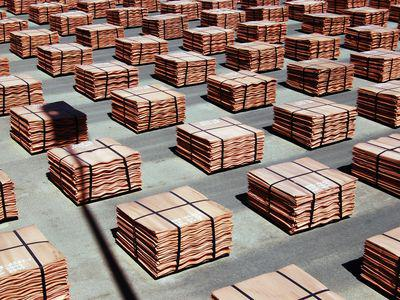

## Table of Contents

## What is Doctor Copper and why is it called that?

Doctor Copper is a nickname for copper metal. It is called this because copper is often used to predict how the economy is doing. When people buy more copper, it usually means that they are building more things and the economy is growing. If less copper is bought, it might mean that the economy is slowing down.

People pay attention to how much copper is being used because it is used in so many things, like wires, pipes, and electronics. By watching the price and demand for copper, experts can get a good idea of what is happening in the economy. That's why copper is called Doctor Copper – it helps give a diagnosis of the economy's health.

## How is copper used in various industries?

Copper is used a lot in the building industry. It's great for making pipes that carry water and gas because it doesn't rust easily. Copper is also used for making roofs and gutters because it lasts a long time and looks good. In homes and buildings, copper wires are used to carry electricity. This is because copper is a very good conductor of electricity, meaning it can move electricity easily from one place to another.

Copper is also important in the electronics industry. It's used in making circuit boards, which are found in all kinds of electronic devices like phones, computers, and TVs. These boards need copper because it helps the electricity flow inside the device. In the car industry, copper is used in the wiring of vehicles and in parts of the engine. This helps the car work properly and efficiently.

In addition to these, copper is used in the energy industry, especially in renewable energy like solar panels and wind turbines. Copper helps move the electricity generated by these sources to where it's needed. It's also used in power plants and electrical grids to [carry](/wiki/carry-trading) electricity over long distances. Because copper is so versatile and useful, it plays a big role in many different industries.

## What makes copper a leading economic indicator?

Copper is called a leading economic indicator because it is used in so many things that people need when the economy is growing. When factories and builders need more copper, it usually means they are making more products and building more houses or offices. This shows that people are spending more money and the economy is doing well. If the demand for copper goes down, it can be a sign that fewer things are being made and the economy might be slowing down.

Watching the price and demand for copper helps experts understand what might happen in the economy next. Because copper is used in so many important industries like construction, electronics, and energy, changes in how much copper is bought can give early warnings about economic changes. This is why copper is such an important tool for predicting economic health.

## How does the price of copper correlate with global economic health?

The price of copper goes up and down based on how much people want to buy it. When the economy is doing well, people build more things like houses and factories, and they need more copper for wires and pipes. This makes the price of copper go up because there is more demand for it. On the other hand, if the economy is not doing well, people build less and buy less copper, so the price goes down.

Because copper is used in so many important things, watching its price can tell us a lot about the global economy. If the price of copper is going up, it often means that many countries are building and making more things, which is a good sign for the world economy. If the price is going down, it might mean that countries are not building as much, and the global economy might be slowing down. So, the price of copper is like a thermometer for the world's economic health.

## What historical data supports the use of copper as an economic indicator?

Historical data shows that copper prices have often gone up and down with the economy. For example, during the economic boom of the 2000s, copper prices rose a lot. This was because countries like China were building a lot of new things and needed more copper. When the global financial crisis hit in 2008, the demand for copper dropped and so did its price. This showed that the economy was not doing well.

Another example is from the 1970s. During that time, there was a big increase in copper prices because of high demand from industries. But when the economy slowed down in the early 1980s, copper prices fell again. These patterns show that copper prices can give early warnings about what is happening in the economy. By looking at these historical trends, people can see how copper has been a good indicator of economic health over time.

## How can investors use copper prices to make economic forecasts?

Investors can use copper prices to help them guess what might happen in the economy. When copper prices go up, it often means that people are building more things and the economy is growing. This can be a good sign for investors because it might mean that companies will make more money and stock prices could go up. If copper prices are going down, it might mean that the economy is slowing down. Investors might want to be careful and maybe not buy as many stocks or look for safer places to put their money.

By watching copper prices over time, investors can see patterns and make better guesses about the future. For example, if copper prices have been going up for a while, it might be a good time to invest in companies that use a lot of copper, like construction or electronics companies. But if copper prices start to drop, it could be a warning sign that the economy might be heading for trouble. This can help investors decide when to buy or sell their investments to make the most money.

## What are the limitations of using copper as an economic indicator?

Using copper as an economic indicator has some problems. One big problem is that other things can change the price of copper, not just the economy. For example, if there is a problem with getting copper from mines, or if new laws make it harder to mine copper, the price can go up even if the economy is not doing well. Also, if people start using other materials instead of copper, the demand for copper can go down even if the economy is growing.

Another limitation is that copper prices can be affected by what is happening in just one or a few big countries. For example, if China, which uses a lot of copper, decides to build less, the price of copper can drop even if other countries are still doing well. This means that copper prices might not always show what is happening in the whole world's economy. So, while copper can be a helpful tool, it is not perfect and should be used with other information to get a better picture of the economy.

## How does the supply and demand of copper affect its reliability as an indicator?

The supply and demand of copper can make it less reliable as an economic indicator. When there is a lot of copper available, the price might go down even if the economy is doing well. This can happen if new copper mines start working or if old mines produce more copper. On the other hand, if there is not enough copper because mines are closed or there are problems with getting copper out of the ground, the price can go up even if the economy is not doing so well.

Also, if people start using other materials instead of copper, the demand for copper can go down. This can make the price drop even if the economy is growing. For example, if new technology makes it easier to use aluminum or plastic instead of copper, the demand for copper can fall. So, while copper prices can give us clues about the economy, they can also be affected by other things that have nothing to do with how the economy is doing.

## What other factors besides economic health can influence copper prices?

Besides the economy, many other things can change the price of copper. One big thing is what happens at copper mines. If a mine has to close because of a problem or a new law, less copper will be available, and the price can go up. Also, if new mines start working or old ones produce more copper, there will be more copper, and the price might go down.

Another thing that can affect copper prices is if people start using other materials instead. If new technology makes it easier to use aluminum or plastic instead of copper, the demand for copper can go down. This can make the price drop even if the economy is doing well. Also, what happens in big countries like China can change copper prices a lot. If China builds less, the demand for copper can drop, making the price go down even if other countries are doing fine.

## How do global events and policies impact the copper market?

Global events and policies can really change the copper market. If there is a big problem like a war or a natural disaster, it can mess up copper mines and make it hard to get copper. This can make the price go up because there is less copper to go around. Also, if countries make new laws about mining or trading copper, it can change how much copper is available and how much it costs. For example, if a country decides to put a tax on copper exports, it can make copper more expensive in other countries.

Policies in big countries like China can have a huge effect on the copper market too. If China decides to build a lot of new things, they will need a lot of copper, and the price can go up. But if China slows down their building, they won't need as much copper, and the price can go down. Also, if countries agree on new rules about using copper in a way that is good for the environment, it can change how much copper is used and how it is made. All these things show how global events and policies can make the copper market go up and down.

## What advanced statistical methods can be used to analyze copper price trends?

To understand copper price trends better, people can use something called time series analysis. This method looks at how copper prices change over time and tries to find patterns. One way to do this is by using something called ARIMA models, which stands for AutoRegressive Integrated Moving Average. These models can help predict future copper prices by looking at past prices and figuring out how they are connected. Another way is to use something called exponential smoothing, which gives more importance to recent prices to make better guesses about what will happen next.

Another useful method is regression analysis. This can help see how other things, like the strength of the economy or what's happening in big countries like China, affect copper prices. By looking at these other factors along with copper prices, we can understand what makes the prices go up or down. Also, machine learning techniques can be used to find patterns in big sets of data that might be hard to see otherwise. These methods can help make better guesses about copper prices and help people make smarter decisions about buying and selling copper.

## How does the integration of copper with other commodities enhance economic analysis?

Looking at copper together with other things people buy and sell can give us a better picture of the economy. Copper is used in many industries, like building and electronics, so its price can show us what's happening in those areas. But if we also look at the prices of other things, like steel or oil, we can see more of the economy. Steel is used a lot in building too, so if both copper and steel prices are going up, it might mean that construction is doing well. Oil is important for transportation and making things, so if oil prices are high, it can affect how much it costs to make and move copper.

By putting all this information together, we can understand the economy better. If copper prices are going up but oil prices are going down, it might mean that people are using less oil but still building a lot. Or if both copper and oil prices are going down, it might be a sign that the economy is slowing down. This way, by looking at copper along with other important things, we can get a fuller picture of what's happening in the economy and make better guesses about what might happen next.

## What is Algo Trading in the Copper Market?

Algorithmic trading, or algo trading, has transformed the landscape of financial markets by leveraging automated systems to execute trades swiftly and efficiently. In the copper market, this method holds particular significance because of copper's established relationship with economic cycles. By employing pre-set trading conditions, algorithmic systems can capitalize on copper price trends and effectively manage large volumes of trading data.

Traders employ sophisticated statistical models to forecast price movements and enhance trading strategies. These models often involve analyzing historical price data, [volume](/wiki/volume-trading-strategy), and economic indicators to identify patterns and trends that are not immediately visible to the human eye. A common approach is the use of time series forecasting models such as Autoregressive Integrated Moving Average (ARIMA), which predicts future price movements based on previously observed data:

$$
X_t = c + \phi_1X_{t-1} + \phi_2X_{t-2} + \ldots + \phi_pX_{t-p} + \epsilon_t
$$

where $X_t$ is the price at time $t$, $\phi_1, \phi_2, \ldots, \phi_p$ are parameters to be estimated, and $\epsilon_t$ is the error term.

Another powerful tool is [machine learning](/wiki/machine-learning) algorithms, which can train models using vast datasets to predict copper price changes. Techniques such as regression analysis, support vector machines, and neural networks analyze input features derived from market data to forecast future values. The ability to process and learn from new data continuously makes these methods particularly adaptive to ever-changing market conditions.

Copper's alignment with economic performance enhances its popularity in algo trading. During times of economic growth, copper demand—and thus its price—typically rises due to increased industrial activity. Conversely, in periods of economic downturn, copper prices tend to fall, reflecting reduced demand. These predictable patterns allow algorithmic systems to make informed trading decisions and tailor strategies to anticipated economic conditions.

For implementation, traders might use Python libraries such as NumPy, Pandas, and scikit-learn to develop and test trading algorithms. Here is a simple implementation of a trading strategy using moving averages, a common statistical technique in algo trading:

```python
import pandas as pd

# Load copper price data
data = pd.read_csv('copper_prices.csv')
data['Short_MA'] = data['Close'].rolling(window=20).mean()  # Short-term moving average
data['Long_MA'] = data['Close'].rolling(window=100).mean() # Long-term moving average

# Generate trading signals
data['Signal'] = 0
data['Signal'][20:] = np.where(data['Short_MA'][20:] > data['Long_MA'][20:], 1, -1)
data['Position'] = data['Signal'].shift()

# Calculate returns
data['Returns'] = data['Close'].pct_change()
data['Strategy_Returns'] = data['Position'] * data['Returns']

# Plot results
import matplotlib.pyplot as plt
plt.plot(data['Strategy_Returns'].cumsum(), label='Strategy Returns')
plt.plot(data['Returns'].cumsum(), label='Market Returns')
plt.legend()
plt.show()
```

In summary, copper's strong correlation with economic cycles and its reliable price patterns make it an attractive asset for algo trading. By harnessing advanced statistical and computational models, traders can optimize their strategies and potentially improve their returns, taking advantage of the automated efficiencies that [algorithmic trading](/wiki/algorithmic-trading) brings to the financial markets.

## References & Further Reading

[1]: ["Advances in Financial Machine Learning"](https://www.amazon.com/Advances-Financial-Machine-Learning-Marcos/dp/1119482089) by Marcos Lopez de Prado

[2]: ["Evidence-Based Technical Analysis: Applying the Scientific Method and Statistical Inference to Trading Signals"](https://www.amazon.com/Evidence-Based-Technical-Analysis-Scientific-Statistical/dp/0470008741) by David Aronson

[3]: ["Machine Learning for Algorithmic Trading"](https://github.com/stefan-jansen/machine-learning-for-trading) by Stefan Jansen

[4]: ["Quantitative Trading: How to Build Your Own Algorithmic Trading Business"](https://www.amazon.com/Quantitative-Trading-Build-Algorithmic-Business/dp/1119800064) by Ernest P. Chan