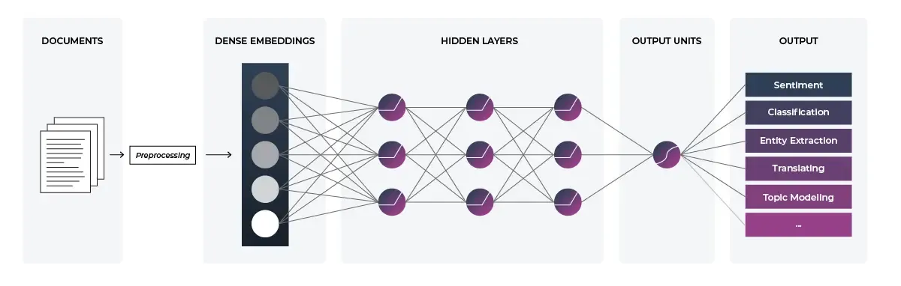

## Table of Contents

## What are document embeddings in the context of machine learning?

Document embeddings are a way to represent text documents as numerical vectors in machine learning. This transformation allows computers to process and analyze text more easily. Imagine you have a long document filled with words. Instead of the computer trying to understand all those words directly, it converts the document into a series of numbers. These numbers, or vectors, capture the meaning and context of the document in a way that machines can work with.

To create document embeddings, various techniques can be used, such as word embeddings and sentence embeddings. For example, a common method is to use models like Word2Vec or BERT. These models take individual words or sentences and convert them into vectors. Then, these vectors are combined to represent the entire document. This process helps in tasks like document classification, where you might want to sort documents into categories, or in information retrieval, where you search for documents similar to a given query. By using document embeddings, these tasks become more efficient and effective.

## How do document embeddings differ from word embeddings?

Document embeddings and word embeddings both turn text into numbers that computers can understand, but they do this at different levels. Word embeddings focus on individual words. They create a vector for each word that captures its meaning and how it relates to other words. For example, if you use a model like Word2Vec, it might represent the word "king" as a vector, and this vector would be similar to the vector for "queen" because they are related concepts.

On the other hand, document embeddings look at entire documents. They combine the vectors of all the words in a document to create a single vector that represents the whole text. This means a document embedding captures the overall theme or topic of the document, not just the meanings of individual words. For instance, if you have a document about "space exploration," its embedding would reflect this topic, even if it contains many different words.

In practical terms, word embeddings are useful for tasks like understanding word relationships or predicting the next word in a sentence. Document embeddings, however, are better suited for tasks that involve whole documents, such as classifying documents into categories or finding similar documents in a large collection. Both types of embeddings help machines process and analyze text, but they do so at different scales and for different purposes.

## What is the basic process of creating document embeddings?

Creating document embeddings starts with turning individual words into numbers. We use models like Word2Vec or BERT to make word embeddings. These models look at a lot of text and learn to represent each word as a vector. For example, the word "cat" might be represented as a list of numbers that capture what "cat" means and how it relates to other words.

Once we have word embeddings, we combine them to make a document embedding. If a document has many words, we add up or average their vectors to get one vector for the whole document. This new vector, the document embedding, captures the overall meaning of the document. For instance, if a document is about pets, its embedding will reflect this topic, even though it might contain many different words.

This process helps computers understand and work with documents more easily. By turning documents into numbers, we can do things like sort documents into categories or find similar documents in a big collection. It's like giving the computer a way to "read" and understand the main ideas of texts, even if it can't read the words themselves.

## Can you explain the concept of Contextualized Topic Models in relation to document embeddings?

Contextualized Topic Models (CTMs) are a way to understand what documents are about by using both topic modeling and document embeddings. Topic modeling is like sorting a big pile of documents into different groups based on their main ideas or topics. Document embeddings, as we talked about before, turn these documents into numbers that computers can work with. CTMs take the best of both worlds: they use document embeddings to get a deeper understanding of the context and meaning of the words in the documents, and then they group these documents into topics.

Imagine you have a bunch of articles about different subjects. A regular topic model might just look at the words and try to group them, but it might miss the deeper meaning or context. With CTMs, we first turn each article into a document embedding, which captures not just the words but how they are used and what they mean in that specific article. Then, we use these embeddings to find patterns and group the articles into topics. This way, CTMs can better understand and categorize documents, making them more useful for tasks like organizing a library or finding similar articles in a large collection.

## What is lda2vec and how does it contribute to document embedding techniques?

lda2vec is a special way to mix two powerful tools: Latent Dirichlet Allocation (LDA) and word2vec. LDA is like a sorting machine that puts documents into different topic groups. Word2vec, on the other hand, turns words into numbers that show their meanings and how they relate to each other. When you combine these two, you get lda2vec, which helps in understanding not just the topics in documents but also the meaning of words within those topics.

Lda2vec works by first creating word embeddings with word2vec. Then, it uses these embeddings to help LDA figure out the topics in the documents. This way, lda2vec can capture both the overall themes of the documents and the detailed meanings of the words. It's like having a map that shows not only the big cities (topics) but also the roads and landmarks (word meanings) that connect them. This makes lda2vec a powerful tool for tasks like organizing documents or finding similar ones, because it gives a richer and more detailed picture of what the documents are about.

## How does EDLPS (Embedding-based Document-Level Pre-training and Supervised fine-tuning) work?

EDLPS, or Embedding-based Document-Level Pre-training and Supervised fine-tuning, is a way to teach computers to understand and work with whole documents better. It starts with pre-training, where the computer learns from a lot of documents. During this step, it creates embeddings, which are like numerical summaries of the documents. These embeddings help the computer capture the main ideas and themes of the documents. The pre-training part is important because it gives the computer a good starting point to understand many different kinds of documents.

After pre-training, EDLPS moves to supervised fine-tuning. This is where the computer gets more specific training on a smaller set of documents with known labels or categories. The computer uses what it learned during pre-training to make its understanding even better. By fine-tuning, the computer can become really good at tasks like sorting documents into the right categories or finding documents that are similar to a given one. This two-step process of pre-training and fine-tuning helps the computer handle documents more accurately and effectively.

## What are some common applications of document embeddings in natural language processing?

Document embeddings are used a lot in natural language processing to help computers understand and work with text. One common use is in document classification, where computers sort documents into different groups or categories. For example, if you have a bunch of emails, document embeddings can help decide if they are spam or not. Another use is in information retrieval, where you search for documents that are similar to a given query. If you're looking for articles about space travel, document embeddings can find other articles that talk about the same topic.

Another important application is in semantic search, which goes beyond simple keyword matching to find documents based on their meaning. For instance, if you search for "climate change solutions," document embeddings can find articles that discuss ways to reduce carbon emissions, even if those exact words aren't used. Additionally, document embeddings are useful in text summarization, where the computer creates a short summary of a long document. By understanding the main themes through embeddings, the computer can pick out the most important parts to include in the summary.

Lastly, document embeddings are also used in recommendation systems. If you're reading news articles online, the website might suggest other articles you might like based on the embeddings of the articles you've already read. This helps personalize your reading experience. Overall, document embeddings make it easier for computers to handle and analyze large amounts of text, making them a key tool in many natural language processing tasks.

## How can document embeddings improve the performance of text classification tasks?

Document embeddings help make text classification better by turning long documents into numbers that computers can understand easily. When you want to sort documents into different groups, like figuring out if an email is spam or not, document embeddings capture the main ideas of the text. This makes it easier for the computer to see patterns and similarities between documents. Instead of looking at every single word, the computer can use the embeddings to quickly decide which category a document belongs to. This speeds up the process and often makes it more accurate because the embeddings hold a lot of information about the document's meaning.

Using document embeddings also lets the computer learn from a lot of data during something called pre-training. This is like giving the computer a head start by showing it many different kinds of documents before it starts sorting them. After pre-training, the computer can fine-tune its understanding with more specific examples, making it even better at classifying new documents. This two-step process of pre-training and fine-tuning helps the computer handle all sorts of texts more effectively, making text classification tasks more successful.

## What are the challenges faced when scaling document embedding techniques to large datasets?

When you want to use document embedding techniques on a big pile of documents, you run into some problems. One big challenge is that it takes a lot of computer power and time to turn all those documents into numbers. If you have millions of documents, your computer might get slow or even run out of memory. This means you need special computers or ways to break the job into smaller pieces that can be done one at a time or on different computers.

Another challenge is keeping the quality of the embeddings high when you're working with so many documents. Sometimes, when you try to speed things up, the embeddings might not capture the meaning of the documents as well. This can make it harder for the computer to sort the documents correctly or find similar ones. So, you need to find a balance between doing the job quickly and making sure the embeddings are still good enough to be useful.

## How do different document embedding methods compare in terms of performance and efficiency?

Different document embedding methods vary in how well they work and how fast they can process large amounts of data. For example, methods like Word2Vec and GloVe are good at capturing the meaning of individual words, but they might not do as well with whole documents. These methods are usually faster and need less computer power, which makes them easier to use with big datasets. On the other hand, more advanced models like BERT and its variants, such as RoBERTa, are better at understanding the context and meaning of entire documents. They create richer embeddings but need more time and stronger computers to work with, especially when dealing with a lot of documents.

When comparing these methods, you need to think about what you want to do with the embeddings. If you need quick results and don't mind if the embeddings are not perfect, simpler models like Word2Vec might be enough. But if you need very accurate embeddings for tasks like sorting documents into categories or finding similar ones, you might want to use BERT or similar models, even if they take longer. The choice depends on whether you value speed and efficiency more or if you need high-quality embeddings, even if it means waiting longer and using more computer power.

## What advanced techniques can be used to enhance the semantic understanding of document embeddings?

To make document embeddings better at understanding the meaning of text, you can use advanced techniques like using models that pay attention to the context of words. One popular method is using transformer models like BERT. These models look at all the words in a document at the same time and figure out how they relate to each other. This helps the embeddings capture not just the words but also the ideas and themes of the whole document. For example, if a document talks about "climate change," BERT can understand that it's related to "global warming" and "carbon emissions," even if those exact words aren't used.

Another technique is to use something called "sentence embeddings" before making document embeddings. Models like Sentence-BERT (SBERT) create embeddings for whole sentences, which are then combined to make the document embedding. This way, the document embedding can better reflect the meaning of the text because it's built from smaller, meaningful parts. By using these advanced methods, the embeddings become more accurate and useful for tasks like sorting documents into categories or finding similar documents. This makes it easier for computers to understand and work with large amounts of text.

## What future developments can we expect in the field of document embeddings?

In the future, we can expect document embeddings to become even better at understanding the meaning of text. One big change might be the use of more advanced models that can learn from even larger amounts of data. These models could use techniques like self-supervised learning, where they learn from the text itself without needing extra labels. This could make document embeddings more accurate and useful for tasks like sorting documents into categories or finding similar ones. Also, we might see new ways to combine different types of embeddings, like mixing word and sentence embeddings to create even richer document embeddings.

Another area of development could be making document embeddings work faster and use less computer power. Right now, some of the best models need a lot of time and strong computers to work with big sets of documents. In the future, new methods might help speed things up and make it easier to use these models on regular computers. This would make document embeddings more accessible to more people and businesses. Overall, these future developments could make working with text easier and more effective, helping computers understand and use documents in new and better ways.

## References & Further Reading

[1]: Mikolov, T., Chen, K., Corrado, G., & Dean, J. (2013). ["Efficient Estimation of Word Representations in Vector Space."](https://arxiv.org/abs/1301.3781) arXiv:1301.3781.

[2]: Devlin, J., Chang, M.-W., Lee, K., & Toutanova, K. (2018). ["BERT: Pre-training of Deep Bidirectional Transformers for Language Understanding."](https://aclanthology.org/N19-1423/) arXiv:1810.04805.

[3]: Reimers, N., & Gurevych, I. (2019). ["Sentence-BERT: Sentence Embeddings using Siamese BERT-Networks."](https://aclanthology.org/D19-1410/) arXiv:1908.10084.

[4]: Moody, C. E. (2016). ["Mixing Dirichlet Topic Models and Word Embeddings to Make lda2vec."](https://arxiv.org/abs/1605.02019) arXiv:1605.02019.

[5]: Ruder, S. (2019). ["Neural Transfer Learning for Natural Language Processing."](https://researchrepository.universityofgalway.ie/bitstream/handle/10379/15463/neural_transfer_learning_for_nlp.pdf) PhD Thesis.

[6]: Blei, D. M., Ng, A. Y., & Jordan, M. I. (2003). ["Latent Dirichlet Allocation."](https://dl.acm.org/doi/10.5555/944919.944937) Journal of Machine Learning Research, 3, 993-1022.

[7]: Qiu, X., Sun, T., Xu, Y., Shao, Y., & Dai, N. (2020). ["Pre-trained Models for Natural Language Processing: A Survey."](https://arxiv.org/abs/2003.08271) arXiv:2003.08271.