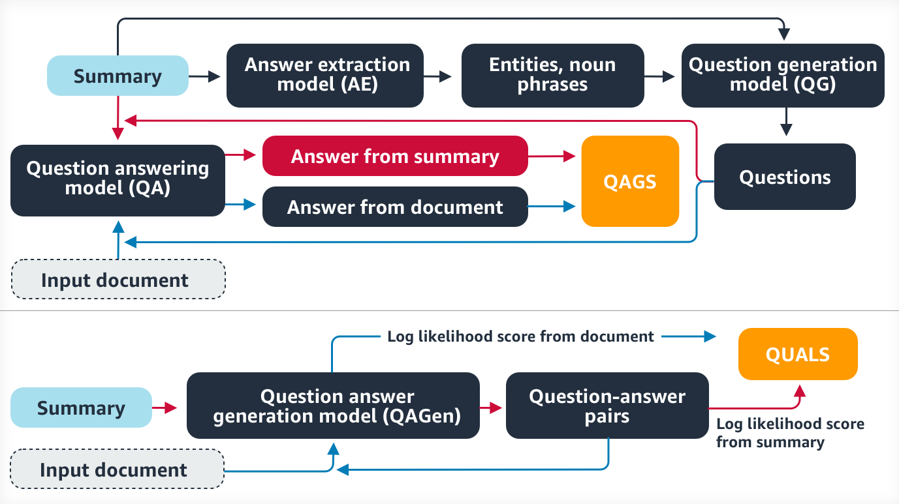

## Table of Contents

## What is document summary evaluation in the context of machine learning?

Document summary evaluation in machine learning is the process of measuring how good a computer-generated summary of a document is. When a machine creates a summary, it tries to capture the most important points from the original document in a shorter form. To check if the summary is good, we compare it to the original document or to summaries made by humans. This helps us see if the machine's summary is accurate, complete, and easy to understand.

There are different ways to evaluate these summaries. One common method is using automatic metrics like ROUGE (Recall-Oriented Understudy for Gisting Evaluation), which compares the machine's summary to a reference summary by looking at overlapping words or phrases. Another approach involves human evaluators who read both the original document and the summary, then rate the summary based on criteria like relevance, coherence, and informativeness. Both automatic and human evaluation methods help improve how machines create summaries, making them more useful for people.

## Why is evaluating document summaries important?

Evaluating document summaries is important because it helps us understand how well a machine can capture the main ideas of a long document in a short form. When machines create summaries, they need to be accurate and useful. If we don't evaluate them, we won't know if the summaries are good enough for people to use. By checking the summaries, we can make sure they are helpful and not missing important information.

Evaluation also helps improve the technology behind summary creation. When we find out what the machine is doing wrong, we can fix it and make the summaries better over time. This means that the next time a machine creates a summary, it will be more likely to be accurate and useful. This process of continuous improvement is key to developing better tools for summarizing documents.

## What are the basic metrics used to evaluate document summaries?

The basic metrics used to evaluate document summaries include ROUGE, BLEU, and human evaluation. ROUGE, which stands for Recall-Oriented Understudy for Gisting Evaluation, measures how well a summary captures the content of the original document by comparing overlapping words and phrases between the summary and a reference summary. BLEU, or Bilingual Evaluation Understudy, is another metric that was originally used for machine translation but can be applied to summary evaluation. It measures the precision of n-grams (groups of words) in the generated summary compared to the reference summary.

Human evaluation is another important metric where people read both the original document and the summary, then rate the summary based on criteria like relevance, coherence, and informativeness. This method provides a more nuanced understanding of the summary's quality because humans can understand context and meaning better than automatic metrics. However, human evaluation can be time-consuming and expensive, which is why automatic metrics like ROUGE and BLEU are often used in combination with human evaluation to get a fuller picture of a summary's effectiveness.

## How does the BLANC metric work for document summary evaluation?

The BLANC metric, which stands for "BLind ANnotation-based Coherence metric," is used to evaluate the coherence of document summaries. Coherence means how well the summary flows and makes sense as a whole piece of writing. BLANC works by comparing the summary to a set of reference summaries, but it does not need to know which summary is the original one. It looks at how similar the sentences in the summary are to each other, and how well they fit together. This helps see if the summary makes sense even if it doesn't use the exact same words as the original document.

BLANC uses a method called "annotation-based" evaluation. This means it takes sentences from the summary and checks if they are similar to sentences in the reference summaries. It measures how well the summary's sentences connect to each other by looking at their similarity scores. If the sentences in the summary are very similar to each other and to the reference summaries, it means the summary is coherent. This way, BLANC can tell if a summary is well put together, even if it's different from the original document.

## What are the differences between intrinsic and extrinsic evaluation methods for document summaries?

Intrinsic evaluation looks at how good a summary is by itself. It checks if the summary is accurate, complete, and easy to understand without comparing it to how it's used in real life. Metrics like ROUGE and BLEU are often used in intrinsic evaluation. They compare the summary to a reference summary to see how many words or phrases match. This helps see if the summary captures the main ideas from the original document. Intrinsic evaluation is useful because it gives quick feedback on the quality of the summary, but it doesn't tell us if the summary is useful for people in real situations.

Extrinsic evaluation looks at how well a summary helps with a specific task. For example, it might check if a summary helps someone answer questions about the document faster or better. This type of evaluation is more about how useful the summary is in real life. It takes longer and can be more expensive because it often involves people using the summary and giving feedback. But it gives a better idea of whether the summary is actually helping people do what they need to do. Both intrinsic and extrinsic evaluation are important to make sure summaries are both good on their own and useful in practice.

## Can you explain the role of ROUGE in document summary evaluation?

ROUGE, which stands for Recall-Oriented Understudy for Gisting Evaluation, is a popular metric used to evaluate how good a machine-generated summary is. It does this by comparing the summary to a reference summary, which is usually written by a human. ROUGE looks at how many words or phrases in the machine's summary match those in the reference summary. There are different types of ROUGE, like ROUGE-N, ROUGE-L, and ROUGE-S, each focusing on different aspects of the summary. For example, ROUGE-N measures the overlap of n-grams, which are groups of words, between the summaries.

Using ROUGE helps us see if the machine's summary captures the important parts of the original document. If a lot of the words or phrases in the machine's summary match those in the reference summary, it means the summary is probably good. ROUGE is useful because it gives us a quick way to check the quality of a summary without needing people to read and rate it. However, ROUGE is not perfect. It can't tell if the summary makes sense or if it's easy to understand, so it's often used along with other methods, like human evaluation, to get a full picture of how good a summary is.

## How do human evaluations compare to automated metrics in document summary assessment?

Human evaluations and automated metrics both help us see how good a document summary is, but they do this in different ways. Human evaluations involve people reading the original document and the summary, then rating the summary based on things like how well it captures the main points, how easy it is to understand, and if it flows well. This method gives a deeper look into the summary's quality because humans can understand the context and meaning better than computers. However, human evaluations can take a lot of time and money, which makes them less practical for quickly checking many summaries.

Automated metrics like ROUGE and BLEU use computer programs to compare the summary to a reference summary. They look at how many words or phrases match between the two. This gives a quick and easy way to check the summary's quality without needing people to read it. But, these metrics can't tell if the summary makes sense or if it's easy to read. They focus more on how many words match rather than how well the summary works as a whole. Because of this, automated metrics are often used along with human evaluations to get a complete picture of how good a summary is.

## What challenges are faced when evaluating multi-document summaries?

Evaluating multi-document summaries can be harder than evaluating summaries of just one document. When you summarize multiple documents, you need to pull out the main ideas from all of them and put them together in a way that makes sense. This means the summary has to cover a lot more information and be more organized. It's tricky because the summary might leave out important points from one document to fit in points from another. Also, the summary needs to connect the ideas from different documents smoothly, which can be hard to do well.

Automated metrics like ROUGE can struggle with multi-document summaries. These metrics work by comparing the summary to a reference summary, but with multiple documents, it's tough to have a perfect reference summary that covers everything. Human evaluations can be more helpful because people can understand how well the summary brings together the main points from all the documents. But, human evaluations take more time and can be expensive. So, finding the right balance between using automated metrics and human evaluations is a big challenge when checking multi-document summaries.

## How can machine learning models be trained to improve summary evaluation?

Machine learning models can be trained to improve summary evaluation by using large datasets of documents and their summaries. These datasets often include human-written summaries that serve as reference points. The models learn to compare machine-generated summaries to these reference summaries, looking for matches in words or phrases. By feeding the models many examples, they can get better at figuring out what makes a good summary. Techniques like supervised learning, where the model is given examples of good and bad summaries, help the model understand what to look for. The more data the model sees, the better it gets at evaluating summaries.

To make the models even better, we can use feedback from human evaluators. After the model makes its first guesses about how good a summary is, people can check the model's work and give feedback. This feedback helps the model learn from its mistakes and improve over time. For example, if the model rates a summary as good but humans think it's bad, the model can adjust its understanding. By combining automatic metrics with human input, the machine learning model can become more accurate and reliable in evaluating summaries. This process of continuous learning and adjustment helps the model keep getting better at its job.

## What are some advanced techniques beyond BLANC for evaluating document summaries?

One advanced technique beyond BLANC for evaluating document summaries is the Pyramid method. This method uses multiple human reference summaries to create a "pyramid" of important content units, or SCUs (Summary Content Units). Each SCU represents a piece of information that should be in a good summary. By comparing a machine-generated summary to this pyramid, we can see how many important SCUs it includes. The more SCUs it matches, the better the summary is. This method helps us understand if the summary captures the key points from the document well, even if it uses different words.

Another advanced technique is the use of neural network-based models, like BERTScore. BERTScore uses a pre-trained language model to compare the summary to a reference summary. It looks at how similar the meanings of the words and sentences are, not just if the words match exactly. This helps us see if the summary is good even if it doesn't use the same words as the reference. BERTScore can be more accurate than older metrics like ROUGE because it understands the context and meaning better. By using these advanced techniques, we can get a better idea of how good a summary is and help machine learning models create even better summaries in the future.

## How do you handle the evaluation of summaries in different languages?

Evaluating summaries in different languages can be tricky because languages have different words and ways of saying things. When you want to check if a summary in another language is good, you need to compare it to a reference summary in that same language. Tools like ROUGE and BLEU can help, but they might not work as well because they look at matching words or phrases. If the summary and the reference use different words to say the same thing, these tools might think the summary is bad even if it's actually good.

To make the evaluation better, you can use tools that understand the meaning of words, not just the words themselves. For example, BERTScore can be used for different languages because it looks at how similar the meanings are. This means it can tell if a summary is good even if it uses different words from the reference summary. Human evaluators who speak the language can also help because they can understand the context and meaning better than computers. Using both automatic tools and human checks can give a fuller picture of how good a summary is in any language.

## What future developments are expected in the field of document summary evaluation?

In the future, document summary evaluation is expected to become more accurate and helpful. One big change might be using more advanced AI models that understand language better. These models, like those based on large language models, can look at the meaning of a summary, not just the words. This means they can tell if a summary is good even if it uses different words from the original document. Researchers are also working on ways to make these models learn from human feedback, so they can keep getting better over time. This could make summary evaluation more reliable and useful for people.

Another expected development is better ways to handle summaries in different languages. Right now, tools like ROUGE and BLEU work best for one language at a time. But in the future, we might see tools that can evaluate summaries in many languages at once. These tools could use techniques like machine translation to compare summaries in different languages to reference summaries. This would help people around the world use and understand summaries better. Overall, the future of document summary evaluation looks promising, with more accurate and versatile methods on the way.