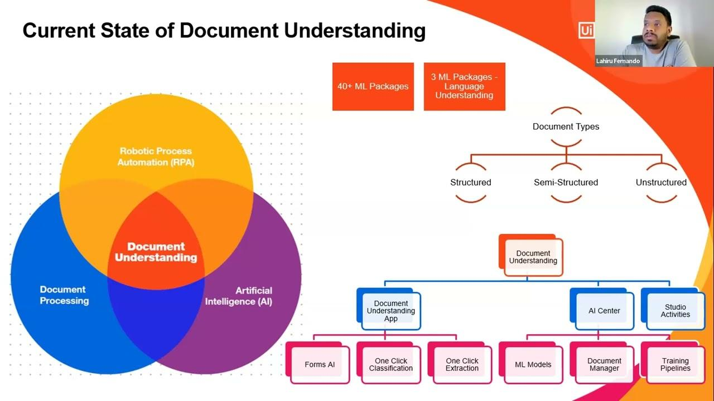

## Table of Contents

## What is a Document Understanding Model in the context of machine learning?

A Document Understanding Model in machine learning is a type of artificial intelligence system designed to interpret and extract information from various types of documents. These documents can include invoices, receipts, forms, and other text-heavy files. The model uses techniques like Optical Character Recognition (OCR) to convert images of text into machine-readable text. Then, it applies natural language processing (NLP) and machine learning algorithms to understand the content and context of the document. This allows the model to identify and extract key information such as names, dates, amounts, and other relevant data points.

These models are particularly useful in automating data entry tasks, reducing the need for manual input and minimizing errors. For instance, in a business setting, a Document Understanding Model can quickly process incoming invoices, extracting the necessary details and entering them into an accounting system without human intervention. This not only speeds up the workflow but also enhances accuracy and efficiency. As these models continue to learn from new data, their performance improves over time, making them an increasingly valuable tool in document management and data processing.

## How do Document Understanding Models differ from traditional Optical Character Recognition (OCR) systems?

Document Understanding Models go beyond what traditional Optical Character Recognition (OCR) systems can do. OCR systems are mainly focused on converting images of text into editable text. They can read the text on a scanned document or a photo, but they don't understand what the text means. For example, an OCR system can turn a picture of an invoice into text, but it won't know which part of the text is the total amount or the date.

On the other hand, Document Understanding Models use OCR as a first step, but then they go further. They use [machine learning](/wiki/machine-learning) and natural language processing to understand the context and meaning of the text. This means they can identify and extract specific pieces of information, like the total amount on an invoice or the due date. They can also understand the layout of the document and how different parts relate to each other, making them much more useful for automating tasks that require understanding the content of documents.

## What is LayoutLMv2 and how does it contribute to document understanding?

LayoutLMv2 is a type of AI model that helps computers understand documents better. It's an improved version of LayoutLM, and it's really good at figuring out what different parts of a document mean and how they're laid out on the page. It uses a special way of learning called pre-training, which means it learns from a lot of documents before it's used for a specific task. This helps it understand things like text, pictures, and how they're arranged on a page.

What makes LayoutLMv2 special is that it can look at both the text and the layout of a document at the same time. This is important because in real documents, where things are placed on the page can give clues about what they mean. For example, if a number is at the bottom right of an invoice, it might be the total amount. By understanding both the words and their positions, LayoutLMv2 can do a better job at tasks like pulling out important information from documents or figuring out what type of document it's looking at.

## What are the key components of LayoutLMv2 architecture?

LayoutLMv2 is made up of several important parts that help it understand documents. The first part is called the text embedding layer. This part takes the words in the document and turns them into numbers that the computer can understand. The second part is the position embedding layer, which looks at where each word is on the page. By knowing the positions, LayoutLMv2 can understand how the document is laid out. The third part is the image embedding layer, which looks at any pictures or images in the document and turns them into numbers too.

These three parts feed into a big model called a transformer. The transformer is like a smart brain that can learn from the numbers it gets from the text, positions, and images. It uses something called self-attention to figure out how different parts of the document are related to each other. This helps LayoutLMv2 understand the whole document better. The transformer then gives its best guess about what the document means or what information to pull out, and that's how LayoutLMv2 helps with document understanding.

## How does LayoutLMv2 integrate visual, textual, and layout information?

LayoutLMv2 is really good at understanding documents because it can look at the words, where they are on the page, and any pictures all at the same time. It does this by turning the words into numbers with something called text embedding. It also turns the positions of the words into numbers using position embedding. And if there are any pictures, it uses image embedding to turn those into numbers too. By doing this, LayoutLMv2 can see the whole document as a set of numbers that it can work with.

These numbers then go into a big model called a transformer. The transformer is like a smart brain that figures out how all the numbers are connected. It uses something called self-attention to understand how the words, their positions, and the pictures all fit together. This helps LayoutLMv2 understand what the document is about and what important information it needs to pull out. By looking at everything together, LayoutLMv2 can do a much better job at understanding documents than if it just looked at the words or the pictures by themselves.

## What datasets are commonly used to train Document Understanding Models like LayoutLMv2?

Document Understanding Models like LayoutLMv2 are often trained using a variety of datasets that include different types of documents. Some popular datasets include the FUNSD dataset, which has forms and scanned documents, and the RVL-CDIP dataset, which has a lot of different kinds of documents like letters and invoices. These datasets help the model learn to understand different layouts and types of text. Another important dataset is the PubLayNet dataset, which has scientific articles and helps the model learn how to understand the layout of academic papers.

These datasets are crucial because they provide a wide range of examples for the model to learn from. By training on datasets like these, LayoutLMv2 can get better at figuring out where important information is on a page and what it means. The model learns to recognize patterns in how documents are laid out and how text and images are used together. This makes it really good at understanding and working with all kinds of documents, from simple forms to complex reports.

## What are some practical applications of Document Understanding Models in various industries?

Document Understanding Models are used in many industries to make work easier and faster. In the banking and finance sector, these models help with processing lots of documents like invoices, receipts, and loan applications. They can quickly find important information like amounts, dates, and customer details, which saves time and reduces mistakes. This means banks can handle more customers and process transactions faster. In healthcare, these models help doctors and nurses by reading patient records and pulling out important information like medical history and test results. This helps them give better care to patients without spending too much time looking through papers.

In the legal field, Document Understanding Models are used to go through contracts, legal documents, and case files. They can find key information and help lawyers prepare for cases more quickly. This makes their work more efficient and helps them serve their clients better. In the retail and e-commerce industry, these models are used to process orders, invoices, and customer feedback. They can help businesses understand what customers want and improve their services. By automating these tasks, companies can focus more on growing their business and less on paperwork.

## How can one evaluate the performance of a Document Understanding Model?

To evaluate the performance of a Document Understanding Model, you can use different ways to see how well it works. One common way is to check how accurate the model is at finding and pulling out important information from documents. This is called the extraction accuracy. You can measure this by comparing what the model finds with what a person would find. If the model gets most of the information right, it has a high extraction accuracy. Another way to evaluate the model is to look at how fast it can process documents. If it can handle a lot of documents quickly, it's good for businesses that need to process a lot of paperwork.

Another important way to evaluate the model is to see how well it understands the layout of the documents. This is called layout understanding. You can test this by giving the model different types of documents and seeing if it can still find the right information even when the layout changes. If the model can do this well, it means it's good at understanding different document layouts. Finally, you can also look at how well the model can be used for different tasks. This is called generalizability. If the model can work well with different kinds of documents and tasks, it's very useful and flexible.

## What are the challenges faced when training Document Understanding Models?

Training Document Understanding Models can be tough because documents come in all sorts of shapes and sizes. Each document might have a different layout, and the model needs to learn how to read them all. This means the model needs a lot of different examples to learn from. If the model doesn't see enough types of documents during training, it might not work well with new kinds of documents it hasn't seen before. This is called the challenge of generalization. Also, documents often have pictures and text mixed together, and the model needs to understand how they relate. This makes training more complicated because the model has to learn about both text and images at the same time.

Another challenge is making sure the model is accurate. Even small mistakes can cause big problems, especially in important fields like healthcare or finance. For example, if the model reads a number wrong on an invoice, it could lead to the wrong amount being paid. To make the model more accurate, it needs to be trained on very clean and correct data. But cleaning up data can take a lot of time and effort. Also, the model needs to be fast enough to handle a lot of documents quickly. If it's too slow, it won't be useful for businesses that need to process a lot of paperwork every day. Balancing accuracy and speed is a big challenge when training these models.

## How does LayoutLMv2 improve upon its predecessor, LayoutLM?

LayoutLMv2 is a better version of LayoutLM because it can understand documents even better. It does this by looking at the words, where they are on the page, and any pictures all at the same time. This helps it see the whole document as one big picture. LayoutLMv2 also uses a special way of learning called pre-training, which means it learns from a lot of documents before it's used for a specific task. This helps it understand things like text, pictures, and how they're arranged on a page even better than LayoutLM.

One big improvement in LayoutLMv2 is that it can learn from both the text and the layout at the same time. This means it can figure out what different parts of the document mean and how they're laid out. For example, if a number is at the bottom right of an invoice, LayoutLMv2 can understand that it might be the total amount. By understanding both the words and their positions, LayoutLMv2 can do a better job at tasks like pulling out important information from documents or figuring out what type of document it's looking at.

## What advanced techniques can be used to further enhance the accuracy of Document Understanding Models?

One way to make Document Understanding Models more accurate is by using something called transfer learning. This means the model starts by learning from a big set of documents, and then it gets fine-tuned for a specific job. For example, the model might first learn to read all kinds of documents, and then it gets trained to find the total amount on invoices. This helps the model understand documents better because it has seen a lot of examples before. Another technique is called [data augmentation](/wiki/data-augmentation), where you make more training data by changing the existing documents a little bit. You might rotate the document or add some noise to the image. This helps the model learn to read documents even if they are not perfect.

Another advanced technique is using ensemble methods, where you combine the results from different models to get a better answer. For example, you might use one model that's good at reading text and another that's good at understanding layouts. By putting their answers together, you can get a more accurate result. Also, using more advanced [neural network](/wiki/neural-network) architectures, like transformers with attention mechanisms, can help the model understand the relationships between different parts of the document better. These techniques can make Document Understanding Models much more accurate and useful for real-world tasks.

## What future developments are expected in the field of Document Understanding Models?

In the future, Document Understanding Models are expected to become even better at understanding documents. They will be able to read and understand more types of documents, like handwritten notes or documents with very complex layouts. This will happen because researchers will keep working on new ways to train these models, like using more advanced neural networks and finding new ways to combine text and image information. Also, as more and more documents are created and stored digitally, there will be more data for these models to learn from. This will make them even smarter and more accurate.

Another big change will be that these models will become easier to use. Right now, they need a lot of special knowledge to set up and use. But in the future, they will be more like tools that anyone can use, even if they don't know much about computers. This means businesses, schools, and even regular people will be able to use these models to help with their work. They will help with things like sorting mail, filling out forms, and keeping track of important information. As these models get better and easier to use, they will become a big part of how we work with documents every day.

## References & Further Reading

[1]: Xu, Y., Xu, Y., Lv, T., Cui, L., Florencio, D. A. F., Zhang, C., Huang, C., Wei, F., & Zhang, M. (2020). ["LayoutLM: Pre-training of Text and Layout for Document Image Understanding."](https://www.sciencedirect.com/science/article/pii/S138589472501633X) arXiv preprint arXiv:1912.13318.

[2]: Xu, Y., Li, M., Cui, L., Wang, L., Wei, F., & Zhou, M. (2020). ["LayoutLMv2: Multi-modal Pre-training for Visually-rich Document Understanding."](https://arxiv.org/abs/2012.14740) arXiv preprint arXiv:2012.14740.

[3]: Jaume, G., Sistach, A., Kerautret, B., & Ouaret, M. (2019). ["FUNSD: A Dataset for Form Understanding in Noisy Scanned Documents."](https://arxiv.org/abs/1905.13538) International Conference on Document Analysis and Recognition.

[4]: ["The RVL-CDIP Dataset"](https://adamharley.com/rvl-cdip/) - A large dataset for document classification provided by Carnegie Mellon University.

[5]: PubLayNet. ["Dataset for Document Layout Analysis."](https://arxiv.org/abs/1908.07836) IBM-ABL.