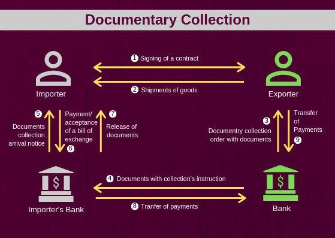

## Table of Contents

## What is a documentary collection?

A documentary collection is a way for sellers to get paid for goods they send to buyers in other countries. In this method, the seller gives the shipping documents, like the bill of lading, to their bank. The bank then sends these documents to the buyer's bank. The buyer can only get the documents to pick up the goods after they pay or agree to pay later.

This method is less risky for the seller than just sending goods without any payment guarantee, but it's not as safe as using a letter of credit. With a documentary collection, the seller trusts that the buyer will pay once they get the documents. If the buyer doesn't pay, the seller can take back the goods, but this can be hard and costly, especially if the goods are already in another country.

## What are the main types of documentary collection?

There are two main types of documentary collection: Documents Against Payment (D/P) and Documents Against Acceptance (D/A). D/P means the buyer has to pay for the goods before they can get the documents to pick them up. This is safer for the seller because they get the money right away. If the buyer doesn't pay, the seller can take back the goods.

D/A means the buyer can get the documents by promising to pay later, usually with a bill of exchange. This is riskier for the seller because they have to wait to get paid. If the buyer doesn't pay when they're supposed to, it can be hard for the seller to get their money or the goods back.

## How does the process of documentary collection work?

The process of documentary collection starts when the seller ships the goods and sends the shipping documents, like the bill of lading, to their bank. The seller's bank then sends these documents to the buyer's bank. The buyer's bank will hold onto the documents until the buyer either pays for the goods (in a Documents Against Payment or D/P collection) or agrees to pay later (in a Documents Against Acceptance or D/A collection).

If it's a D/P collection, the buyer has to pay the full amount before they can get the documents to pick up the goods. This way, the seller gets their money right away. If it's a D/A collection, the buyer can get the documents by signing a promise to pay later, usually with a bill of exchange. The buyer then has to pay on the date they agreed to. If the buyer doesn't pay, the seller can try to get the goods back, but this can be difficult and expensive.

## What is the difference between documents against payment (D/P) and documents against acceptance (D/A)?

Documents Against Payment (D/P) is a type of documentary collection where the buyer has to pay for the goods before they can get the documents to pick them up. This means the seller gets their money right away. It's safer for the seller because they don't have to wait to get paid. If the buyer doesn't pay, the seller can take back the goods.

Documents Against Acceptance (D/A) is different. With D/A, the buyer can get the documents by promising to pay later, usually by signing a bill of exchange. The buyer gets the goods first and then pays on the date they agreed to. This is riskier for the seller because they have to wait to get paid. If the buyer doesn't pay when they're supposed to, it can be hard for the seller to get their money or the goods back.

## What are the roles of the parties involved in a documentary collection?

In a documentary collection, the seller's role is to ship the goods and send the shipping documents, like the bill of lading, to their bank. The seller wants to make sure they get paid for the goods they sent. If it's a Documents Against Payment (D/P) collection, the seller will get paid right away. If it's a Documents Against Acceptance (D/A) collection, the seller has to wait for the buyer to pay later.

The buyer's role is to pay for the goods to get the documents they need to pick up the goods. In a D/P collection, the buyer has to pay before they can get the documents. In a D/A collection, the buyer can get the documents by promising to pay later. The buyer needs to follow through on this promise to pay on time.

The banks play a big role too. The seller's bank sends the documents to the buyer's bank. The buyer's bank holds onto the documents until the buyer either pays (for D/P) or agrees to pay later (for D/A). The banks make sure the process goes smoothly and that the documents are only given to the buyer after the payment or promise to pay is made.

## What documents are typically used in a documentary collection?

In a documentary collection, the main document used is the bill of lading. This is a document from the shipping company that says who owns the goods and where they are going. The seller gives this document to their bank, and the bank sends it to the buyer's bank. The buyer needs this document to pick up the goods from the shipping company.

Other documents that might be used are the commercial invoice, which shows what the buyer is buying and how much it costs, and the packing list, which lists what is in each package. Sometimes, there might also be an insurance document if the goods are insured. All these documents help make sure the buyer gets what they paid for and the seller gets paid for what they sent.

## What are the advantages of using documentary collection for international trade?

Using documentary collection for international trade can help both the seller and the buyer. For the seller, it's a safer way to get paid than just sending goods and hoping the buyer pays later. The seller's bank holds the important documents, like the bill of lading, until the buyer pays or agrees to pay later. This way, the seller can make sure they get their money before the buyer gets the goods. It's also usually cheaper than using a letter of credit, which can cost more in bank fees.

For the buyer, documentary collection can be easier and quicker than other payment methods. The buyer can get the goods faster because they don't have to wait for a letter of credit to be approved. They just need to pay or promise to pay later to get the documents. This can help keep the trade moving smoothly. Even though there is some risk for the buyer if they can't pay on time, it's still a good way to do business if both the seller and buyer trust each other.

## What are the risks associated with documentary collection?

Documentary collection can be risky for both the seller and the buyer. For the seller, the biggest risk is that the buyer might not pay. If it's a Documents Against Payment (D/P) collection, the buyer has to pay before they get the documents, which is safer for the seller. But if it's a Documents Against Acceptance (D/A) collection, the buyer can get the documents by promising to pay later. If the buyer doesn't pay when they're supposed to, it can be hard and expensive for the seller to get their money or the goods back, especially if the goods are already in another country.

For the buyer, the risk is that they might not be able to pay on time. If the buyer can't pay in a D/P collection, they won't get the documents to pick up the goods. In a D/A collection, if the buyer can't pay when they promised, they could lose the goods and damage their relationship with the seller. Both the seller and the buyer need to trust each other for documentary collection to work well. If trust breaks down, it can lead to big problems and losses for both sides.

## How does documentary collection compare to letters of credit?

Documentary collection and letters of credit are both ways to help sellers get paid when they send goods to buyers in other countries. With documentary collection, the seller gives the shipping documents to their bank, which sends them to the buyer's bank. The buyer can only get the documents by paying (D/P) or promising to pay later (D/A). This method is usually cheaper than using a letter of credit because it has fewer bank fees. But it's also riskier for the seller because they might not get paid if the buyer doesn't follow through.

Letters of credit, on the other hand, are more secure for the seller. A letter of credit is a promise from the buyer's bank to pay the seller as long as the seller meets all the conditions in the letter. The seller's bank checks these conditions and, if everything is right, the buyer's bank pays the seller. This means the seller gets paid even if the buyer can't pay. But letters of credit can be more complicated and cost more in bank fees. They also take longer to set up because the buyer's bank has to approve the letter of credit before the goods are sent.

## What steps should be taken to ensure a smooth documentary collection process?

To make sure the documentary collection process goes smoothly, the seller needs to send the right documents to their bank. The main document is the bill of lading, which shows who owns the goods and where they are going. The seller should also include a commercial invoice that lists what the buyer is buying and how much it costs, and a packing list that says what's in each package. If the goods are insured, the seller should include an insurance document too. The seller's bank will check these documents and send them to the buyer's bank, so it's important that everything is correct.

The buyer needs to be ready to pay or promise to pay when the documents arrive at their bank. If it's a Documents Against Payment (D/P) collection, the buyer has to pay right away to get the documents. If it's a Documents Against Acceptance (D/A) collection, the buyer can get the documents by promising to pay later. The buyer should make sure they can pay on time to avoid problems. Both the seller and the buyer need to trust each other and communicate well to make the process go smoothly. If there are any issues with the documents or payment, they should talk to their banks to fix them quickly.

## What are the common issues or disputes that can arise in documentary collection?

Common issues in documentary collection often happen when the documents are not right or complete. The seller needs to make sure all the documents, like the bill of lading, commercial invoice, and packing list, are correct and sent to their bank on time. If something is missing or wrong, the buyer's bank might not release the documents to the buyer, which can delay the whole process. The seller and buyer need to check everything carefully before sending the documents to avoid these problems.

Another issue can come up if the buyer can't pay on time. In a Documents Against Payment (D/P) collection, the buyer has to pay right away to get the documents. If they can't pay, they won't get the goods. In a Documents Against Acceptance (D/A) collection, the buyer can get the documents by promising to pay later, but if they don't pay when they're supposed to, it can be hard for the seller to get their money or the goods back. Both the seller and the buyer need to trust each other and communicate well to solve these payment issues quickly.

## How can technology enhance the efficiency of documentary collection processes?

Technology can make the documentary collection process easier and faster. With online systems, sellers can send documents to their bank quickly and easily. This means the documents can get to the buyer's bank faster, which helps the whole process move along more smoothly. Also, technology can help keep track of where the documents are and when they are sent and received. This can help avoid mistakes and make sure everything is done on time.

Using electronic documents instead of paper ones can also help. Electronic documents are easier to send and can't get lost or damaged like paper ones. This makes the process more reliable and can save time and money. Plus, with technology, banks can check the documents more quickly and make sure they are correct. This can help prevent delays and make the whole process go more smoothly for both the seller and the buyer.

## References & Further Reading

[1]: ["ICC Uniform Rules for Collections (URC 522)"](https://iccwbo.org/wp-content/uploads/sites/3/2019/06/825E_eURC_Final.pdf) by the International Chamber of Commerce

[2]: Petrin, M. (2017). ["Algorithmic Trading and its Implications on Financial Stability."](https://www.researchgate.net/publication/378548435_Algorithmic_Trading_and_AI_A_Review_of_Strategies_and_Market_Impact) European Business Organization Law Review.

[3]: ["Trade Finance: Principles of Document Examination"](https://www.tradefinanceglobal.com/posts/document-examination-and-conflicts-of-data/) by Global Logistics Cluster 

[4]: Davidsson, P., et al. (2018). ["Using Automated Algorithms for Trade Futures."](https://www.sciencedirect.com/science/article/pii/S0148296319307866) International Conference on Artificial Intelligence in Finance.

[5]: ["The Role of Machine Learning in Finance: Algorithmic Trading"](https://www.researchgate.net/publication/378287610_Machine_learning_in_financial_markets_A_critical_review_of_algorithmic_trading_and_risk_management) in Machine Learning Techniques for Financial Management and Risk includes insights on how Python and data analysis are transforming trade finance systems.