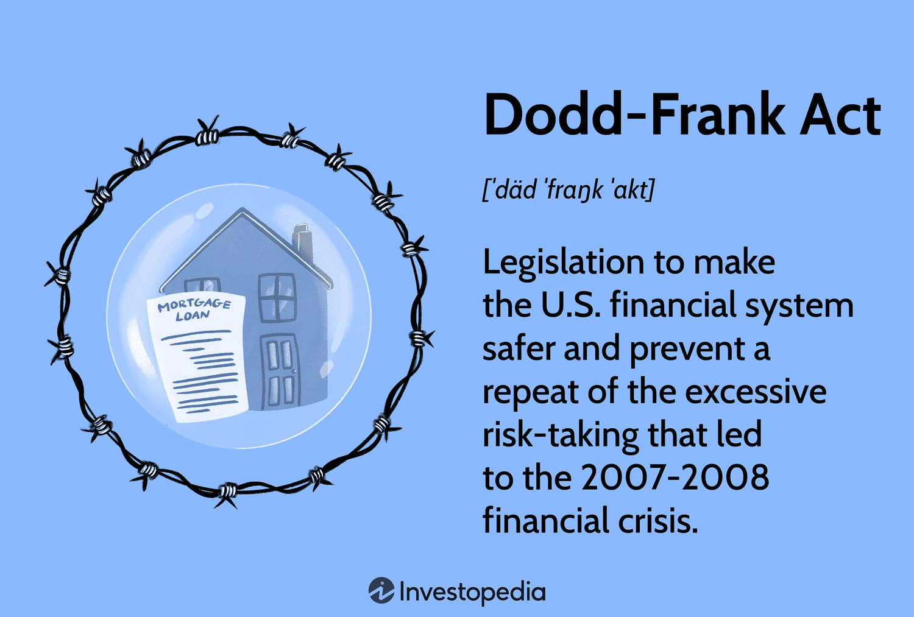

## Table of Contents

## What is the Dodd-Frank Act?

The Dodd-Frank Act is a law that was passed in the United States in 2010. It was created to help prevent another big financial crisis like the one that happened in 2008. The act made new rules for banks and other financial companies to follow. It was named after the two people who helped write it, Senator Chris Dodd and Representative Barney Frank.

One of the main goals of the Dodd-Frank Act was to protect consumers. It set up a new group called the Consumer Financial Protection Bureau (CFPB). This group makes sure that banks and other financial companies treat people fairly and don't trick them. The act also made sure that big banks have enough money saved up, so if they get into trouble, they won't cause problems for the whole economy.

## When was the Dodd-Frank Act signed into law?

The Dodd-Frank Act was signed into law on July 21, 2010. It was created to stop another big financial crisis from happening, like the one in 2008. The act made new rules for banks and other financial companies to follow. It was named after Senator Chris Dodd and Representative Barney Frank, who helped write it.

One of the main goals of the Dodd-Frank Act was to protect people who use banks and other financial services. It set up a new group called the Consumer Financial Protection Bureau (CFPB). This group makes sure that banks and other financial companies treat people fairly and don't trick them. The act also made sure that big banks have enough money saved up, so if they get into trouble, they won't cause problems for the whole economy.

## What was the primary goal of the Dodd-Frank Act?

The main goal of the Dodd-Frank Act was to stop another big financial crisis from happening. This law was made after the big economic problem in 2008, and it wanted to make sure that banks and other financial companies would be safer and more responsible.

To reach this goal, the Dodd-Frank Act set up new rules for banks and other financial companies. It also created the Consumer Financial Protection Bureau (CFPB) to protect people from being treated unfairly by banks. The act made sure that big banks have enough money saved up, so if they get into trouble, it won't hurt the whole economy.

## Which major financial crisis prompted the creation of the Dodd-Frank Act?

The Dodd-Frank Act was created because of the big financial crisis that happened in 2008. This crisis caused a lot of problems for people and the economy. Many people lost their jobs and their homes. Banks and other big financial companies were in trouble, and it made things hard for everyone.

To stop something like this from happening again, the government made the Dodd-Frank Act. This law set new rules for banks and other financial companies to follow. It also made a new group called the Consumer Financial Protection Bureau to help protect people from being treated unfairly by banks. The goal was to make the financial system safer and more responsible.

## What are the key components of the Dodd-Frank Act?

The Dodd-Frank Act has many important parts that work together to make the financial system safer and more fair. One of the main parts is the creation of the Consumer Financial Protection Bureau (CFPB). This group helps protect people from being treated unfairly by banks and other financial companies. The CFPB makes sure that banks give clear information and don't trick people with confusing or hidden fees. Another important part is the Volcker Rule, which stops banks from making risky investments with the money people put in their savings accounts.

Another key part of the Dodd-Frank Act is the requirement for big banks to have enough money saved up, known as capital requirements. This means that if a bank gets into trouble, it has enough money to handle it without causing problems for the whole economy. The act also set up the Financial Stability Oversight Council (FSOC) to watch over the financial system and spot any big risks before they become a problem. These rules and groups work together to make sure that banks and other financial companies are safer and more responsible.

## How does the Dodd-Frank Act aim to protect consumers?

The Dodd-Frank Act aims to protect consumers by setting up the Consumer Financial Protection Bureau (CFPB). The CFPB's job is to make sure that banks and other financial companies treat people fairly. They do this by making rules that stop banks from using confusing language or hiding fees in their contracts. The CFPB also helps people understand their rights and where to go if they have a problem with a bank. This way, people can make better choices about their money and not get tricked by unfair practices.

Another way the Dodd-Frank Act protects consumers is by making banks more responsible. The act has rules like the Volcker Rule, which stops banks from making risky investments with the money people save in their accounts. This helps keep people's money safe. The act also makes sure that big banks have enough money saved up, so if they get into trouble, they won't cause big problems for everyone else. By making banks safer and more responsible, the Dodd-Frank Act helps protect people who use their services.

## What is the Volcker Rule and how does it relate to the Dodd-Frank Act?

The Volcker Rule is a part of the Dodd-Frank Act. It was made to stop banks from making risky investments with the money people save in their accounts. Before the Volcker Rule, banks could use this money to make bets on things like stocks and bonds. If these bets went wrong, it could cause big problems for the bank and the people who saved their money there. The Volcker Rule says that banks can't do this anymore, which makes them safer and helps protect people's savings.

The Volcker Rule is important because it helps make the financial system more stable. By stopping banks from making risky bets, it lowers the chance that a bank will fail and cause a big problem for the whole economy. This rule is a key part of the Dodd-Frank Act, which was made to stop another big financial crisis like the one in 2008. By making banks more responsible, the Volcker Rule helps the Dodd-Frank Act reach its goal of protecting consumers and keeping the financial system safe.

## What role does the Financial Stability Oversight Council (FSOC) play under the Dodd-Frank Act?

The Financial Stability Oversight Council (FSOC) is an important part of the Dodd-Frank Act. Its main job is to watch over the whole financial system and make sure it stays safe and stable. The FSOC looks out for any big risks that could cause problems for the economy. It can spot these risks early and work to fix them before they become a big issue. This helps stop another big financial crisis like the one in 2008 from happening.

The FSOC also has the power to say which big financial companies need to follow extra rules to stay safe. If a company is seen as a risk to the whole economy, the FSOC can make it follow stricter rules. This makes sure that these big companies don't cause problems for everyone else if they get into trouble. By keeping an eye on the financial system and making sure big companies are safe, the FSOC helps the Dodd-Frank Act reach its goal of protecting the economy and people who use financial services.

## How has the Dodd-Frank Act impacted the banking industry?

The Dodd-Frank Act has changed the banking industry a lot. It made banks follow new rules to be safer and more responsible. One big change is that big banks now have to keep more money saved up. This is called capital requirements. It means that if a bank gets into trouble, it has enough money to handle it without causing big problems for everyone else. The Volcker Rule, another part of the act, stops banks from making risky bets with the money people save in their accounts. This makes banks safer and helps protect people's savings.

Another way the Dodd-Frank Act has impacted the banking industry is by making banks treat people more fairly. The Consumer Financial Protection Bureau (CFPB) was set up to watch over banks and make sure they don't trick people or use confusing language. This has made banks more careful about how they deal with customers. Also, the Financial Stability Oversight Council (FSOC) keeps an eye on the whole financial system and can make big companies follow extra rules if they're seen as a risk. All these changes have made the banking industry safer and more responsible, but they also mean that banks have to follow more rules and be more careful about how they do business.

## What are some common criticisms of the Dodd-Frank Act?

Some people say the Dodd-Frank Act makes it too hard for banks to do business. They think the new rules are too strict and make it harder for banks to make money. This can make it tough for small banks to stay open because they don't have as much money to follow all the rules. Some critics also say that the act makes it harder for people to get loans because banks are more careful about who they lend money to.

Others argue that the Dodd-Frank Act might not do enough to stop another big financial crisis. They think the rules might not catch all the risky things banks do. Some also say that the act gives too much power to the government, like with the Consumer Financial Protection Bureau (CFPB) and the Financial Stability Oversight Council (FSOC). They worry that these groups might make rules that are too tough on banks and slow down the economy.

## How have subsequent administrations modified or attempted to modify the Dodd-Frank Act?

Since the Dodd-Frank Act was passed in 2010, different administrations have tried to change it. One big change happened in 2018 when President Donald Trump signed a law called the Economic Growth, Regulatory Relief, and Consumer Protection Act. This law made some of the rules in the Dodd-Frank Act less strict, especially for smaller banks. It raised the size limit for banks that have to follow the strictest rules from $50 billion to $250 billion in assets. This meant that many smaller banks didn't have to follow as many rules, which some people thought would help them grow and lend more money to people.

Other attempts to change the Dodd-Frank Act have been talked about but not passed into law. Some lawmakers have wanted to change or get rid of parts of the act, like the Volcker Rule, because they think it makes it too hard for banks to do business. On the other hand, some people want to make the rules even stricter to stop another big financial crisis. These ideas have been debated a lot, but so far, the main change has been the 2018 law that made things easier for smaller banks.

## What are the potential long-term effects of the Dodd-Frank Act on the global financial system?

The Dodd-Frank Act could have big effects on the global financial system over time. It was made to stop another big financial crisis like the one in 2008. By making banks follow stricter rules, the act helps make the financial system safer and more stable. This can help stop problems in one country from causing big problems around the world. If banks in the United States are safer, it can make the whole world's financial system more stable because the U.S. is a big part of the global economy. Other countries might even copy some of the rules from the Dodd-Frank Act to make their own financial systems safer.

But the Dodd-Frank Act might also make it harder for banks to do business. Some people worry that the strict rules could slow down the economy because banks might be more careful about lending money. This could affect not just the U.S. but other countries too, because when the U.S. economy slows down, it can impact the whole world. Also, if other countries don't follow similar rules, it might not be fair for U.S. banks that have to follow stricter rules. Over time, this could change how banks around the world do business and how they work together.

## References & Further Reading

[1]: Acharya, V. V., & Richardson, M. (Eds.). (2009). ["Restoring Financial Stability: How to Repair a Failed System."](https://onlinelibrary.wiley.com/doi/book/10.1002/9781118258163) Wiley Finance.

[2]: Barth, J. R., Prabha, A., & Swagel, P. (2012). ["The Dodd-Frank Act: Key Features, Implementation Progress, and Financial System Impact."](https://onlinelibrary.wiley.com/doi/full/10.1111/fmii.12083) National Bureau of Economic Research.

[3]: Lopez, I. (2018). ["The Volcker Rule: Broad Overview and the Concerns Related to an Implementation."](https://crsreports.congress.gov/product/pdf/IF/IF10923) Journal of Economic Perspectives, 32(4), 212-235.

[4]: Title X of the Dodd-Frank Wall Street Reform and Consumer Protection Act, establishing the Consumer Financial Protection Bureau. [United States Government Publishing Office.](https://www.congress.gov/111/plaws/publ203/PLAW-111publ203.pdf)

[5]: Stiglitz, J. E. (2010). ["Freefall: America, Free Markets, and the Sinking of the World Economy."](https://cgt.columbia.edu/research/books/archive/freefall-america-free-markets-and-the-sinking-of-the-world-economy/) W.W. Norton & Company.

[6]: Easley, D., López de Prado, M. M., & O'Hara, M. (2012). ["The 'Flash Crash': The Impact of High Frequency Trading on an Electronic Market."](https://www.semanticscholar.org/paper/Flow-Toxicity-and-Liquidity-in-a-High-Frequency-Easley-Prado/9369430bd005d194f9332ae7cbd5a57ace5e9ab3) The Review of Financial Studies, 25(5), 1455-1483.

[7]: ["The Federal Reserve and Dodd-Frank: Overview and Analysis"](https://www.federalreservehistory.org/essays/dodd-frank-act) by the Board of Governors of the Federal Reserve System.