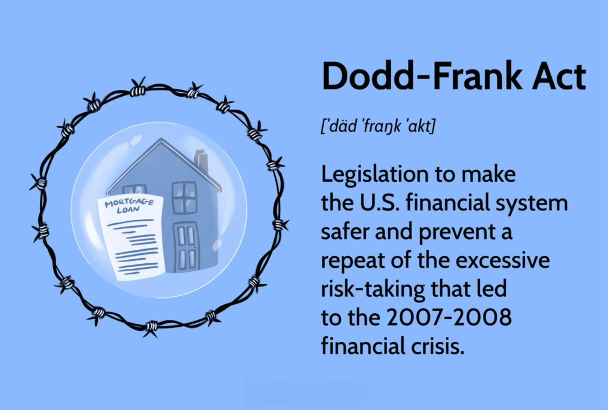

The Dodd-Frank Wall Street Reform and Consumer Protection Act, enacted in 2010, represents a pivotal response to the critical vulnerabilities and systemic failures exposed during the 2008 financial crisis. Aimed at comprehensive financial reform, the Act was crafted to reinforce the stability and integrity of the United States financial system. Central to this legislation is its commitment to enhancing consumer protection, restructuring financial markets, and addressing the complexities of algorithmic trading.

This article examines the profound effects of the Dodd-Frank Act on consumer protection measures and the overarching financial reforms that have reshaped the landscape of financial regulation in the United States. By scrutinizing its main components and implications, we shed light on the Act's strategic role in guiding the financial markets towards transparency and accountability.

Key to our discussion is understanding the foundational goals of the Dodd-Frank Act, including its dedication to reducing systemic risk and preventing future financial disruptions. We will also explore how the Act engages with the rapidly evolving practice of algorithmic trading, which presents new challenges and opportunities for market stability.

As we address these critical areas, the article underscores the lasting significance of the Dodd-Frank Act in the context of current financial regulations. It highlights the ongoing evolution of oversight mechanisms aimed at fostering a robust and transparent financial ecosystem, essential for mitigating risks and safeguarding consumers. Through these lenses, the Dodd-Frank Act emerges as a cornerstone of financial regulation, striving to balance innovation with necessary prudential oversight.

## Table of Contents

## Overview of the Dodd-Frank Act

The Dodd-Frank Wall Street Reform and Consumer Protection Act, enacted in 2010, was a legislative measure designed to address the financial excesses and systemic risks that became apparent during the 2008 financial crisis. Its primary aim was to reform the regulatory framework governing financial institutions and markets to prevent future economic downturns of similar magnitude. 

Central to its creation were Senator Christopher J. Dodd and Representative Barney Frank, who spearheaded the legislative efforts to rectify oversight deficiencies that were instrumental in precipitating the financial crisis. The Act, therefore, comprises a broad spectrum of provisions targeting the enhancement of financial stability and the protection of consumers.

Among the most significant elements of the Dodd-Frank Act was the establishment of oversight entities such as the Financial Stability Oversight Council (FSOC) and the Consumer Financial Protection Bureau (CFPB). The FSOC is tasked with identifying potential risks to the financial stability of the United States, thereby addressing the issue of institutions becoming "too big to fail". On the other hand, the CFPB centralizes the regulation of financial products and services to protect consumers from unethical practices.

The Dodd-Frank Act aimed to instill principles of transparency and accountability in financial operations. It sought to limit the obscurity that characterized financial transactions prior to the crisis by enforcing rigorous disclosure standards. This was seen as essential to ensuring that stakeholders, including regulators, investors, and consumers, could make informed decisions and hold financial institutions accountable.

Overall, the Dodd-Frank Act represented a comprehensive effort to transform the financial regulatory landscape. By introducing extensive reforms, it sought to curtail the unchecked risk-taking that had pervaded financial markets and emphasize the importance of ethical standards in the conduct of financial activities.

## Consumer Protection and Financial Reforms

The Dodd-Frank Wall Street Reform and Consumer Protection Act introduced substantial reforms aimed at enhancing consumer protection and instilling fair lending practices. One of the pivotal creations under this Act is the Consumer Financial Protection Bureau (CFPB). This agency serves a crucial role in overseeing financial products and services, ensuring that consumers are safeguarded against predatory practices that had previously marred the financial landscape. The CFPB is authorized to enforce regulations across multiple financial sectors, covering mortgages, credit cards, and loans, thereby promoting transparency and accountability in financial offerings.

Another major component of the Act is the Volcker Rule, which addresses the speculative activities of banks. This rule is designed to prohibit banking entities from engaging in proprietary trading, which involves trading securities for their own profit rather than on behalf of customers. By restricting banks from investing in hedge funds and private equity, the Volcker Rule aims to curtail high-risk activities that could jeopardize bank stability and, by extension, the broader financial system.

Additionally, the Dodd-Frank Act focuses on enhancing the regulation of derivatives, financial instruments whose value is derived from underlying assets such as stocks, bonds, or commodities. During the 2008 financial crisis, the lack of oversight in the derivatives market was a significant [factor](/wiki/factor-investing) that contributed to the systemic risks faced by financial institutions. To address these concerns, the Act mandates the clearing of certain derivatives through central counterparties and necessitates greater transparency in their trading. This move seeks to mitigate the opacity and interconnectedness that previously allowed risks to accumulate unchecked.

Overall, the provisions of Dodd-Frank have established more stringent standards across the financial sector. By enforcing these regulations, the Act aims to bolster consumer confidence and ensure that market participants adhere to practices that uphold market integrity. The enduring impact of these reforms highlights a commitment to maintaining a secure and equitable financial environment for consumers.

## Algorithmic Trading Under Dodd-Frank

Algorithmic trading, characterized by the use of computer algorithms to automate trading decisions and execute orders, has notably impacted financial markets by increasing efficiency and [liquidity](/wiki/liquidity-risk-premium). The rise of this trading method, however, has also introduced significant challenges related to market stability and risk management. 

The Dodd-Frank Wall Street Reform and Consumer Protection Act addresses these challenges by implementing strict transparency and risk management protocols specifically for [algorithmic trading](/wiki/algorithmic-trading). A key provision is the requirement for financial institutions engaged in high-frequency trading to employ advanced monitoring systems. These systems are designed to ensure compliance with regulatory standards and to manage the risks associated with these rapid trading activities. For example, the use of real-time surveillance tools helps in detecting and preventing market manipulation tactics that could compromise market integrity.

By mandating such comprehensive oversight, the Dodd-Frank Act aims to prevent the recurrence of destabilizing activities that were prevalent during the 2008 financial downturn. These regulations are particularly geared towards mitigating issues such as flash crashes, which can occur due to the erroneous algorithms or execution errors in high-speed trading environments. The Act's provisions ensure that any algorithm-developed strategies adhere to rigorous testing and risk management procedures before being deployed in the live market.

As the field of algorithmic trading evolves, it necessitates continuous adaptation from regulatory bodies. Organizations such as the Securities and Exchange Commission (SEC) and the Commodity Futures Trading Commission (CFTC) have been tasked with enforcing Dodd-Frank's provisions to strike a balance between financial innovation and market safety. The continuous dialogue between these regulatory entities and the financial industry ensures that the regulatory framework remains relevant and effective in addressing the emerging risks associated with algorithmic trading.

In summary, the Dodd-Frank Act's approach to managing the complexities of algorithmic trading through rigorous oversight frameworks underscores its commitment to safeguarding market stability while encouraging technological advancements in the financial sector.

## 2018 Amendments and Their Impact

In 2018, the Economic Growth, Regulatory Relief, and Consumer Protection Act brought considerable amendments to the original Dodd-Frank legislation. These changes were primarily focused on reducing regulatory pressures on smaller banks, thus adjusting the definitions for institutions considered "too big to fail." A key modification raised the asset threshold at which banks are subjected to stringent regulatory standards, from $50 billion to $250 billion. This shift was intended to alleviate compliance burdens for smaller financial entities while maintaining rigorous oversight on larger institutions that pose substantial systemic risk.

The amendments were met with diverging opinions. Proponents argued that the relaxation of regulations for smaller banks fostered economic growth by freeing up capital for lending and investment activities. However, critics voiced concerns that the rollbacks could potentially reintroduce vulnerabilities into the financial system, similar to those that contributed to the 2008 financial crisis. These concerns were intensified following the collapse of Silicon Valley Bank in 2023, which fueled debates on whether the regulatory easing adequately balanced risk management with financial freedom.

The evolving regulatory environment underscores the ongoing debate over the balance between stringent oversight and fostering financial sector vitality. Recent adjustments reflect an attempt to find that balance, highlighting the dynamic interplay between safeguarding against systemic risks and enabling economic growth. The dialogue surrounding these reforms continues, illustrating the complexities inherent in financial regulation and the necessity for adaptive legislative approaches.

## Criticisms of the Dodd-Frank Act

The Dodd-Frank Wall Street Reform and Consumer Protection Act, while designed to stabilize financial markets and protect consumers, has attracted substantial criticism. A primary concern is the regulatory weight it places on smaller banks and credit unions, which argue that the compliance costs associated with the Act are disproportionately high given their minimal involvement in the practices leading to the 2008 financial crisis. Such institutions often lack the resources to manage the extensive reporting and compliance requirements effectively, thereby stifling their operational capacity and growth.

Critics also highlight the international repercussions of the Dodd-Frank Act. Several influential figures in the financial sector contend that the stringent regulations compromise the fluidity of the U.S. markets, impacting their competitive edge on a global scale. This perception is based on the belief that the Act hampers market operations by creating barriers to entry and reducing the flexibility that financial institutions require to respond to market developments swiftly.

Moreover, the Act is often criticized for restricting liquidity and flexibility in certain financial markets. Restrictions such as the Volcker Rule, which limits speculative investments by banks, are said to constrain the ability of financial institutions to engage in activities that could enhance market liquidity. Critics argue that, in some cases, these restrictions diminish the ability of markets to function efficiently and adapt to fluctuations.

Despite these criticisms, it is important to recognize that the Dodd-Frank Act has played a pivotal role in enhancing the stability of financial systems. Its rigorous oversight mechanisms and protective measures are credited with significantly reducing the systemic risks that were evident in the pre-2008 financial framework. While debates on the efficacy and impact of the Act continue, the emphasis on safeguarding against systemic failures remains integral to its legacy.

## Conclusion

The Dodd-Frank Act remains a cornerstone in U.S. financial regulation, encapsulating efforts to avert crises akin to that of 2008. The legislative framework is pivotal in mitigating systemic risk and enhancing consumer protections, which continue to be essential pillars in the financial landscape. The post-crisis reforms introduced by the Act have established a robust foundation aimed at ensuring the stability and transparency of the financial system.

As financial innovation accelerates, maintaining an optimal balance between regulation and industry growth becomes imperative. The rapid evolution of financial technologies and products necessitates adaptable regulatory frameworks that can effectively oversee new developments without stifling innovation. The Dodd-Frank Act's provisions, particularly those related to monitoring and managing risks associated with high-frequency and algorithmic trading, exemplify the importance of evolving regulations to safeguard market integrity.

Furthermore, the legacy of the Dodd-Frank Act underscores the ongoing dialogue between regulatory evolution and market reality. This dialogue is crucial for ensuring adaptive strategies that can respond to emerging challenges and prevent potential crises. The Act's role in shaping this discourse highlights the necessity of continuous scrutiny and revision of financial laws to align with current and future market dynamics.

Ultimately, the Dodd-Frank Act exemplifies a continued commitment to fostering a secure and transparent financial ecosystem. Its comprehensive approach to regulation not only addresses the causes of past financial failures but also sets a framework for proactive risk management and consumer protection. As the financial sector continues to adapt to new challenges and opportunities, the principles established by the Dodd-Frank Act will likely remain influential in guiding the development of future financial regulations.

## References & Further Reading

[1]: ["The Dodd-Frank Act: Key Provisions and Implications for Financial Markets"](https://www.investopedia.com/terms/d/dodd-frank-financial-regulatory-reform-bill.asp) by Brookings Institution

[2]: Barth, J. R., Caprio, G., & Levine, R. (2013). ["Guardians of Finance: Making Regulators Work for Us"](https://www.emerald.com/insight/content/doi/10.1108/17576381311329661/full/html). MIT Press.

[3]: Duffie, D. (2012). ["Market Regulation through the Lens of Dodd-Frank"](https://www.darrellduffie.com/uploads/1/4/8/0/148007615/duffiesintrajune2016.pdf), The Economists' Voice, 9(4).

[4]: ["Consumer Financial Protection Bureau: What It Does and Why It Matters"](https://www.consumerfinance.gov/about-us/the-bureau/) by Consumer Financial Protection Bureau

[5]: Shull, B. (2012). ["Financial Regulatory Reform after the Dodd-Frank Act: It's Complicated"](https://papers.ssrn.com/sol3/papers.cfm?abstract_id=2176822). Business Economics, 47(3).

[6]: Johnson, S., & Kwak, J. (2011). ["13 Bankers: The Wall Street Takeover and the Next Financial Meltdown"](https://www.emerald.com/insight/content/doi/10.1108/17422041111149543/full/html) by Pantheon Books.

[7]: ["Economic Growth, Regulatory Relief, and Consumer Protection Act: Impact Analysis"](https://en.wikipedia.org/wiki/Economic_Growth,_Regulatory_Relief,_and_Consumer_Protection_Act) by Federal Reserve Board