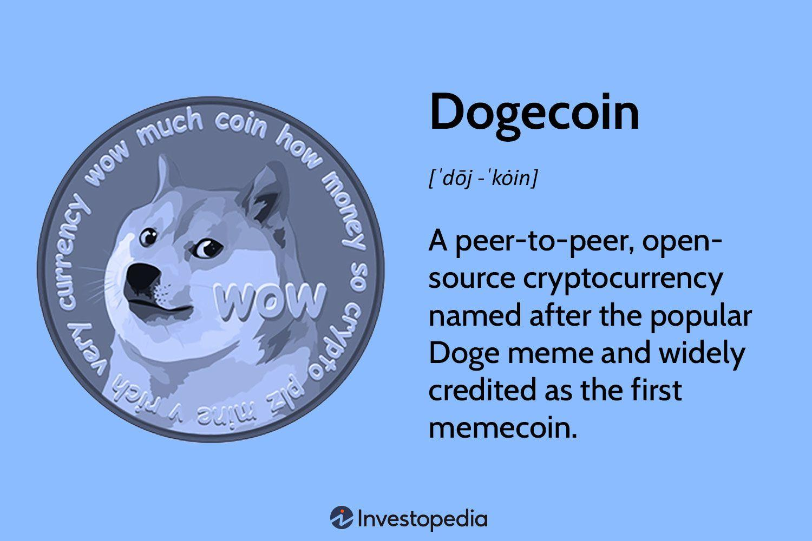

## Table of Contents

## What is Dogecoin?

Dogecoin is a type of digital money that you can use on the internet. It started as a joke in 2013, inspired by a popular meme of a dog called Dogecoin. Even though it began as something funny, it grew and became a real way for people to buy things and send money to each other online.

People like Dogecoin because it's easy to use and doesn't cost a lot to send. It's also popular on social media, where people talk about it a lot. Some famous people, like Elon Musk, have talked about Dogecoin, which made more people interested in it. Even though it's not as serious as other digital money like Bitcoin, Dogecoin has a fun community around it.

## Who created Dogecoin and when was it launched?

Dogecoin was created by two people named Billy Markus and Jackson Palmer. They made it in 2013. Billy and Jackson wanted to make a funny kind of digital money that was different from others like Bitcoin. They used a picture of a dog from a meme called "Doge" to make people laugh and to make Dogecoin special.

Dogecoin was launched on December 6, 2013. From the start, it was meant to be easy and fun for everyone to use. People quickly started using it to tip others on the internet and to buy small things. Even though it began as a joke, Dogecoin grew and became popular with a big group of people who liked its friendly and fun community.

## What is the origin of the Dogecoin name and logo?

The name Dogecoin comes from a popular internet meme called "Doge." The Doge meme features a picture of a Shiba Inu dog with funny captions written in broken English. Billy Markus and Jackson Palmer, the creators of Dogecoin, thought it would be fun to name their new digital money after this meme. They wanted to make something that was different from other digital money like Bitcoin, which they felt was too serious. So, they chose the name Dogecoin to make people smile and to create a friendly community around their project.

The logo of Dogecoin is also based on the Doge meme. It shows the same Shiba Inu dog, but this time, the dog is looking straight ahead with a happy expression. The creators used this image because it was already well-known and loved by many people on the internet. They wanted the logo to be easy to recognize and to reflect the playful and fun spirit of Dogecoin. By using the Doge meme for both the name and the logo, Dogecoin quickly became popular and attracted a lot of attention from people who enjoyed the humor and light-heartedness of the project.

## How does Dogecoin differ from other cryptocurrencies like Bitcoin?

Dogecoin and Bitcoin are both types of digital money, but they have some big differences. One main difference is how they were made. Bitcoin was created to be a serious kind of money that could be used all over the world without needing banks. It's seen as a big deal in the world of digital money. Dogecoin, on the other hand, started as a joke. It was made by two people who wanted to have fun and make people laugh with a digital money based on a funny dog meme. So, while Bitcoin is all about being serious and important, Dogecoin is more about being fun and friendly.

Another big difference is how they work and how many there are. Bitcoin has a limit on how many coins can ever be made, which is 21 million. This makes Bitcoin kind of rare and can make its value go up over time. Dogecoin doesn't have a limit like that. It keeps making more and more coins, which means it's not as rare as Bitcoin. This can keep the value of Dogecoin from going up too much. Also, Dogecoin is easier and cheaper to use for small things, like tipping people online or buying little items. Bitcoin, because it's more expensive to use, is often used for bigger things or as a way to store value over time.

## What is the total supply of Dogecoin and how is it mined?

Dogecoin has a very big total supply, and it keeps getting bigger all the time. Right now, there are over 130 billion Dogecoins, and about 5 billion more are made every year. Unlike Bitcoin, which has a limit on how many can ever be made, Dogecoin doesn't have a limit. This means that the total number of Dogecoins will keep growing forever. The idea behind this is to make sure that Dogecoin stays easy to use and doesn't become too rare or expensive.

Dogecoin is mined using a process called "proof of work," which is similar to how Bitcoin is mined. Miners use special computers to solve hard math problems, and when they solve one, they get to add a new block of transactions to the Dogecoin blockchain. For each block they add, miners get a reward of new Dogecoins. Right now, the reward for mining a block is 10,000 Dogecoins. This reward helps to keep the Dogecoin network running smoothly and encourages people to keep mining. Mining Dogecoin is easier and cheaper than mining Bitcoin, which is one reason why Dogecoin is popular with a lot of people.

## What are some key events in the history of Dogecoin?

Dogecoin started on December 6, 2013, when Billy Markus and Jackson Palmer made it as a fun and friendly kind of digital money. It quickly got popular because of its funny dog meme and the nice community around it. In 2014, Dogecoin had a big moment when it raised money to help the Jamaican bobsled team go to the Winter Olympics. This showed that Dogecoin could be used for good things, not just for fun. Later that year, Dogecoin also helped to build wells in Kenya, showing that the community was caring and wanted to help others.

Over the years, Dogecoin kept growing and getting more attention. In 2020 and 2021, it became really popular on social media, especially after famous people like Elon Musk started talking about it. Elon Musk's tweets about Dogecoin made its value go up a lot, and more people started using it. In May 2021, Dogecoin hit a big milestone when it was accepted as a way to pay for things on some big websites, like the Dallas Mavericks' online store. This made Dogecoin seem more like a real kind of money that people could use every day. Even though it started as a joke, Dogecoin has had a big impact and has shown that it can do a lot of good things.

## How has Dogecoin been used in tipping and charitable donations?

Dogecoin has been used a lot for tipping people on the internet. It started because it was easy and fun to send small amounts of Dogecoin to others. People would use it to say thanks for a funny post or a helpful comment. Websites like Reddit and Twitter made it simple for people to tip each other with Dogecoin. This helped to make a friendly community around Dogecoin, where people could show appreciation in a fun way.

Dogecoin has also been used for charitable donations. One of the first big things Dogecoin did was help the Jamaican bobsled team go to the Winter Olympics in 2014. People from the Dogecoin community came together and raised money to help the team. Another time, Dogecoin was used to build wells in Kenya to give people clean water. These examples show how the Dogecoin community likes to help others and use their digital money for good causes. Even though Dogecoin started as a joke, it has been used to do a lot of good things.

## What are the current applications of Dogecoin in the marketplace?

Dogecoin is used in many ways in the marketplace today. People can use it to buy things online from different stores and websites. For example, some big companies like the Dallas Mavericks and Newegg accept Dogecoin as payment. This means you can use Dogecoin to buy sports gear or computer parts. Also, some smaller businesses and online shops accept Dogecoin, making it easier for people to use it for everyday purchases. Because Dogecoin is easy and cheap to use, it's becoming more popular as a way to pay for things on the internet.

Another way Dogecoin is used in the marketplace is for tipping and donations. On social media platforms like Reddit and Twitter, people can tip each other with Dogecoin to say thanks for a funny post or a helpful comment. This has created a friendly community around Dogecoin. Also, Dogecoin has been used for charitable donations. The community has come together to raise money for good causes, like helping the Jamaican bobsled team go to the Olympics or building wells in Kenya. These uses show how Dogecoin can be more than just a fun kind of money; it can also be used to help others.

## How does Dogecoin's technology work, including its consensus mechanism?

Dogecoin uses a technology called blockchain, which is like a big digital book where all the transactions are recorded. This book is shared across many computers all over the world, so everyone can see what's happening with Dogecoin. The technology behind Dogecoin is similar to Bitcoin, but it's a bit simpler and easier to use. Dogecoin uses a consensus mechanism called "proof of work," which means miners use their computers to solve hard math problems. When they solve a problem, they can add a new page to the digital book and get rewarded with new Dogecoins.

The "proof of work" system helps keep Dogecoin safe and fair. Miners compete to solve these math problems, and the first one to solve it gets to add a new block of transactions to the blockchain. This block is then checked by other miners to make sure it's correct. If everyone agrees that the block is good, it gets added to the blockchain, and the miner gets their reward of 10,000 Dogecoins. This process keeps the network running smoothly and makes sure that no one can cheat or change the transactions. Because Dogecoin is easier and cheaper to mine than Bitcoin, it attracts a lot of people who want to be part of the fun and friendly Dogecoin community.

## What are the future prospects and potential developments for Dogecoin?

Dogecoin has a bright future ahead because more and more people are starting to use it. Big companies like the Dallas Mavericks and Newegg are already accepting Dogecoin as a way to pay for things, and this could keep growing. If more businesses start to use Dogecoin, it could become a common way to buy things online. Also, because Dogecoin is easy and cheap to use, it might be used more for small payments and tipping on the internet. The fun and friendly community around Dogecoin could help it keep growing and attract new people.

There are also some possible new developments for Dogecoin. One idea is to make it easier to use Dogecoin for everyday things, like paying for a cup of coffee or a bus ticket. This would make Dogecoin more useful for people in their daily lives. Another idea is to work on making Dogecoin more eco-friendly, since mining can use a lot of energy. If Dogecoin can find ways to use less energy, it could become more popular with people who care about the environment. Overall, while Dogecoin started as a joke, it has the potential to keep growing and becoming more useful in the future.

## How has Dogecoin's community and culture influenced its growth and adoption?

Dogecoin's community and culture have been a big part of why it has grown so much. From the start, Dogecoin was all about being fun and friendly. People liked that it was different from other digital money like Bitcoin, which can be very serious. The Dogecoin community uses the funny dog meme to make people smile and feel welcome. They often tip each other on social media to say thanks for funny posts or helpful comments. This has made a nice group of people who enjoy using Dogecoin and want to help it grow.

The culture around Dogecoin has also helped it get more popular. When famous people like Elon Musk talk about Dogecoin on social media, it gets a lot of attention. People start talking about it and wanting to use it. The community has also done good things with Dogecoin, like raising money to help the Jamaican bobsled team go to the Olympics and building wells in Kenya. These actions show that the Dogecoin community cares about helping others, which makes more people want to be part of it. Because of this fun and caring culture, Dogecoin has become more than just a funny kind of money; it's a way for people to connect and do good things together.

## What are the risks and criticisms associated with Dogecoin?

Dogecoin has some risks and people have criticized it for a few reasons. One big risk is that Dogecoin doesn't have a limit on how many coins can be made. This means that the total number of Dogecoins keeps growing, which can make it harder for the value to go up a lot. If too many Dogecoins are made, they might become less valuable over time. Another risk is that Dogecoin can be very unpredictable. Its value can go up and down a lot, especially when famous people like Elon Musk talk about it on social media. This can make it risky for people who want to use Dogecoin as a way to store value or invest money.

People also criticize Dogecoin for starting as a joke. Some think that because it began as something funny, it's not as serious or useful as other kinds of digital money like Bitcoin. They worry that Dogecoin might not be a good long-term investment because it's not taken seriously by everyone. Another criticism is that mining Dogecoin can use a lot of energy, which is bad for the environment. Even though the Dogecoin community is fun and friendly, these risks and criticisms make some people think twice about using or investing in Dogecoin.

## References & Further Reading

[1]: ["Dogecoin: Much Wow!"](https://coinmarketcap.com/currencies/dogecoin/) Dogecoin Foundation.

[2]: Wallace, B. (2013). ["The Rise of Dogecoin: The Internet's Favorite Currency."](https://www.wired.com/2011/11/mf-bitcoin/) Wired.

[3]: Niranjan, N. (2021). ["How to Trade with Dogecoin and Algorithmic Trading Strategies."](https://cointelegraph.com/learn/articles/how-to-trade-cryptocurrencies-the-ultimate-beginners-guide) Investopedia.

[4]: De Prado, M. L. (2018). ["Advances in Financial Machine Learning"](https://www.amazon.com/Advances-Financial-Machine-Learning-Marcos/dp/1119482089) Wiley.

[5]: Jansen, S. (2020). ["Machine Learning for Algorithmic Trading"](https://github.com/stefan-jansen/machine-learning-for-trading) Packt Publishing.

[6]: Aronson, D. R. (2007). ["Evidence-Based Technical Analysis: Applying the Scientific Method and Statistical Inference to Trading Signals"](https://onlinelibrary.wiley.com/doi/book/10.1002/9781118268315) Wiley.

[7]: Chan, E. P. (2008). ["Quantitative Trading: How to Build Your Own Algorithmic Trading Business"](https://github.com/ftvision/quant_trading_echan_book) Wiley.