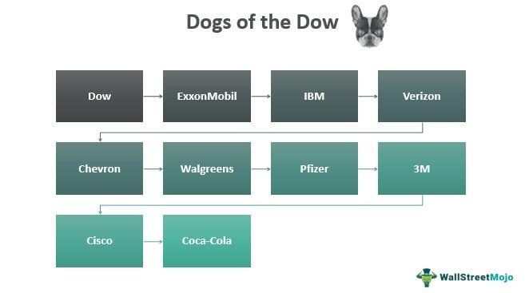

Algorithmic trading has transformed the financial landscape by employing complex mathematical models and software programs to make trading decisions at speeds and frequencies far beyond human capability. One of the distinctive strategies that can benefit from algorithmic trading is the Dogs of the Dow. This approach targets high-yield dividend stocks within the Dow Jones Industrial Average (DJIA), aiming to deliver above-average returns with relatively low risk. It attracts investors due to its simplicity and the historical stability of dividend-paying stocks. By investing in the 10 DJIA stocks with the highest dividend yield, investors seek to capitalize on companies with stable earnings and an undervalued market position, anticipating that these stocks will offer consistent income and growth potential.

The allure of the Dogs of the Dow strategy lies in its straightforward nature and potential for a sizable passive income stream, particularly in low-interest-rate environments. Dividends can provide a cushion against market downturns and add a layer of dependability not guaranteed with other investment strategies. The focus on established companies further enhances the appeal by mitigating risk related to corporate performance uncertainty.



The integration of algorithms into the Dogs of the Dow strategy can enhance investment outcomes by increasing efficiency, precision, and scalability. Algorithms can systematically apply the strategy, making real-time adjustments based on the latest market data and predefined criteria. The automation of buying and selling stocks based on algorithm-driven signals can optimize dividend capture and reduce response times to market volatilities—a critical advantage in the fast-paced trading environment.

Using algorithms in investment strategies leverages data and computational power to test various market scenarios and refine portfolio management approaches. By performing backtests and simulations, investors can understand how the Dogs of the Dow strategy might behave in different market conditions, adjusting parameters as needed to maximize returns and minimize risks. This dynamic approach offers a significant edge over traditional human-led investment strategies, potentially unlocking new avenues for strategic dividend investing.

## Table of Contents

## What is the Dogs of the Dow Strategy?

The Dogs of the Dow strategy is a well-known investment approach that targets high-dividend-yield stocks within the Dow Jones Industrial Average (DJIA). Originally popularized by Michael B. O'Higgins in his 1991 book, "Beating the Dow," this strategy is appealing for its simplicity and consistent approach to dividend investing. It offers an accessible methodology for investors seeking to capitalize on dividend income, potentially identifying undervalued stocks within a major market index.

The fundamental premise of the Dogs of the Dow strategy involves selecting the ten stocks from the DJIA that have the highest dividend yield at the start of each year. Dividend yield is calculated by the formula:

$$
\text{Dividend Yield} = \frac{\text{Annual Dividend per Share}}{\text{Price per Share}}
$$

Stocks with a high dividend yield are typically perceived as undervalued by the market, thus offering both income generation and potential capital appreciation. This approach inherently focuses on larger, more established companies that are generally financially stable and capable of providing reliable dividend payments.

A key feature of the Dogs of the Dow is its annual portfolio rebalancing. At the beginning of each year, the investor reviews the dividend yields of DJIA stocks and reconstructs the portfolio by selecting the ten highest yielders once again. This rebalancing ensures the portfolio remains aligned with the original strategy metrics and adapts to any changes in the market conditions or individual stock performances throughout the previous year.

This straightforward strategy has garnered interest among individual and institutional investors due to its low trading costs, relatively passive management, and emphasis on high-dividend income. While the methodology does not guarantee outperformance relative to other investment strategies or indices, it is praised for its transparency and ease of implementation.

## Importance of Algorithmic Trading in Modern Finance

Algorithmic trading, often referred to as automated or black-box trading, utilizes computer algorithms to execute trading strategies in financial markets. It has transformed the trading landscape by allowing firms and individual investors to take advantage of efficiency, precision, and speed that surpass traditional human capabilities.

The essence of [algorithmic trading](/wiki/algorithmic-trading) lies in its ability to process vast datasets and execute orders at high speeds. Algorithms can scan markets for trading opportunities, analyze multiple variables, and execute trades within milliseconds, thus capitalizing on fleeting opportunities that might be missed by human traders. This high-frequency trading is particularly advantageous as it allows for the exploitation of [arbitrage](/wiki/arbitrage) opportunities and the enhancement of [liquidity](/wiki/liquidity-risk-premium) in the markets, which in turn tightens bid-ask spreads and increases trading volumes.

One of the significant advantages of algorithmic trading is precision. Algorithms operate based on predetermined rules and criteria, eliminating the emotional and psychological biases that often affect human decisions. For example, they can adhere strictly to a mean reversion strategy or [momentum](/wiki/momentum) strategy, ensuring strict adherence to the investment plan without errors induced by human judgment.

Another important benefit is efficiency. Algorithmic trading algorithms can manage a portfolio's buying or selling process in a fraction of the time it would take a human. This not only saves time but also reduces transaction costs due to the reduced bid-ask spreads.

Algorithmic trading's speed is critical in exploiting profitability in time-sensitive opportunities. The ability to execute trades almost instantaneously ensures that algorithmic traders can react quickly to market news and changes, often securing a favorable price before the rest of the market can respond.

In existing strategies such as the Dogs of the Dow, which focuses on high-dividend yield stocks within the Dow Jones Industrial Average (DJIA), algorithms can serve to optimize timing and execution. By implementing algorithms, investors can efficiently rebalance portfolios at the end of each year, as required by the strategy, ensuring they capitalize on yield advantages and market movements. Algorithms can also assist in dynamically adjusting to the rapid shifts in stock valuation or economic data that might influence dividend yields, potentially improving returns.

In summary, the importance of algorithmic trading in modern finance cannot be overstated. Its integration into existing strategies such as the Dogs of the Dow represents a significant evolution in investment practices, offering enhanced precision, efficiency, and speed to investors looking to optimize their portfolio performance.

## Applying Algorithmic Trading to Dogs of the Dow

Algorithmic trading, integrating the Dogs of the Dow strategy, involves leveraging computational algorithms to enhance decision-making and execution efficiency. The fundamental mechanics of using algorithms with the Dogs of the Dow strategy start with data acquisition. Algorithms sift through historical market data, particularly focusing on stocks in the Dow Jones Industrial Average (DJIA) that have high dividend yields. The intent is to automate the selection process based on quantifiable criteria, primarily targeting the ten DJIA stocks with the highest dividend yield at the end of the previous year.

A typical algorithm for the Dogs of the Dow might be structured to execute annual rebalancing, a core component of the strategy. The algorithm will identify these stocks, purchase them at the beginning of the year, hold the portfolio over the [course](/wiki/best-algorithmic-trading-courses) of the year, and liquidate and reconstruct the portfolio at year-end based on updated yield data. This cycle promotes a systematic and unbiased adherence to the strategy, eliminating human emotional biases.

The simulation and [backtesting](/wiki/backtesting) of algorithm-driven portfolios are significant to this approach. Backtesting allows for the evaluation of the strategy by simulating how the algorithm would have performed in past market conditions. Using platforms such as Python, with libraries like `pandas` and `numpy`, as well as `[backtrader](/wiki/backtrader)`, traders can effectively conduct these simulations. Here's a simple example of how such a backtest might begin in Python:

```python
import pandas as pd
import numpy as np
import backtrader as bt

class DogsOfTheDow(bt.Strategy):
    def __init__(self):
        self.high_yield_stocks = []

    def next(self):
        if len(self.high_yield_stocks) != 10:
            # Logic to select top 10 Dow stocks by yield
            self.high_yield_stocks = select_top_dividend_stocks(self.data)

        # Rebalancing logic at the end of the year
        if self.trading_days % 252 == 0:  # Assuming ~252 trading days a year
            self.rebalance_portfolio()

    def rebalance_portfolio(self):
        # Buy and sell logic based on high_yield_stocks list
        pass

def select_top_dividend_stocks(data):
    # Logic to determine top dividend yield stocks from data
    return []

data = pd.read_csv('djia_data.csv')  # Sample data ingestion
cerebro = bt.Cerebro()
cerebro.addstrategy(DogsOfTheDow)
cerebro.adddata(data)
cerebro.run()
```

Comparatively, algorithmic approaches offer numerous advantages over traditional human-led investment management. Algorithms provide speed and precision unattainable by human traders, executing trades in milliseconds and rebalancing portfolios without subjective judgments. These processes reduce the cognitive load on investors and minimize errors due to human biases or oversight.

Human-led traditional approaches, on the other hand, rely significantly on individual judgment, experience, and sometimes intuition, which can be beneficial in scenarios demanding qualitative assessment or when market conditions deviate from historical patterns where algorithms might struggle if they are not trained to adapt. However, this approach may fall short in efficiency and scalability.

In summary, while both algorithmic and traditional approaches have their merits, the integration of algorithmic trading with the Dogs of the Dow strategy offers a robust framework for enhancing the strategic execution of dividend-focused investments. As we analyze the comparative performance, one must consider not only the historical returns but also the operational efficiency, risk management, and the scalability of each approach.

## Pros and Cons of Algorithm-Based Dogs of the Dow Strategy

Algorithm-based trading strategies, such as the Dogs of the Dow, leverage enhanced data processing capabilities and increased decision-making accuracy. These advantages position algorithmic approaches as superior to traditional methods in several aspects but not without inherent risks and challenges.

**Benefits of Enhanced Data Processing and Decision-Making Accuracy**

Algorithms offer significant benefits in processing large volumes of financial data swiftly and accurately. This capability enables investors to identify trends that may not be immediately apparent through manual analysis. For instance, by applying [machine learning](/wiki/machine-learning) models to historical data, algorithms can forecast future stock performances with greater precision. Additionally, algorithms can rebalance portfolios more efficiently by swiftly executing buy and sell orders based on predefined criteria:

```python
import numpy as np
import pandas as pd

# Example of simple algorithm to rebalance a portfolio based on Dogs of the Dow
def rebalance_portfolio(djia_stocks, dividend_yields):
    ''' 
    Rebalances a portfolio based on highest dividend yields.
    '''
    data = pd.DataFrame({'stock': djia_stocks, 'div_yield': dividend_yields})
    dogs = data.nlargest(10, 'div_yield')
    return dogs['stock'].tolist()

# Example input
djia_stocks = ['StockA', 'StockB', 'StockC', 'StockD', 'StockE']
dividend_yields = [3.5, 4.2, 2.8, 5.0, 3.9]

# Get Dogs of the Dow
dogs_of_dow = rebalance_portfolio(djia_stocks, dividend_yields)
```

**Challenges and Risks Associated with Algorithmic Implementation**

Despite these benefits, several challenges and risks accompany the integration of algorithms in trading strategies. Algorithmic errors, market data inaccuracies, or unexpected market behavior can lead to significant financial losses. For instance, the "flash crash" of May 6, 2010, highlighted the potential for rapid, algorithm-driven market destabilization. Additionally, algorithms require constant monitoring and updating to ensure they adapt to evolving market conditions and regulatory environments.

**Examples of Successful and Unsuccessful Algorithmic Adaptations**

Examples of successful adaptations include the use of algorithms by firms like Renaissance Technologies, which has consistently outperformed markets through data-driven strategies. Renaissance's Medallion Fund, for instance, has achieved annual returns of over 30% after fees.

Conversely, there are scenarios where algorithmic trading has failed. The Knight Capital incident in 2012 serves as a cautionary tale. A software glitch caused the firm to incur over $440 million in losses within 30 minutes, ultimately leading to its insolvency.

In conclusion, while algorithms provide enhanced processing capabilities and decision-making accuracy for strategies like the Dogs of the Dow, they require careful implementation and diligent oversight to mitigate risks and ensure successful outcomes.

## Performance Analysis of the Dogs of the Dow with Algorithms

The performance analysis of the Dogs of the Dow strategy when incorporating algorithmic trading involves examining historical data, assessing returns, and evaluating risk management improvements. Historically, the Dogs of the Dow has been a popular strategy due to its simplicity and focus on high-dividend stocks. By selecting the ten highest-yielding stocks from the Dow Jones Industrial Average (DJIA) annually and investing equally in them, investors have often seen reliable returns.

### Historical Performance Data

The Dogs of the Dow strategy has historically outperformed the DJIA on numerous occasions. Statistics from the last few decades show that this strategy tends to perform well in bull markets, where the focus on high-dividend stocks offers both capital appreciation and dividend income. For example, from 1973 to 1996, the Dogs of the Dow achieved an average annual return of approximately 17.7%, compared to the DJIA's 15.3% during the same period.

### Impact of Algorithmic Trading

Algorithmic trading has the potential to enhance the returns and risk management of the Dogs of the Dow strategy through data-driven decision-making, continuous monitoring, and real-time execution. Algorithms enable investors to optimize trade timing and manage portfolios efficiently, which can lead to improved outcomes. By leveraging historical and real-time data, algorithms can forecast potential market movements, adjust positions dynamically, and implement complex hedging strategies to mitigate risk.

A study on algorithmic trading conducted by MIT Sloan School of Management [Reference: "High-Frequency Trading and Price Discovery" by Jonathan Brogaard] demonstrated that algorithmic strategies could significantly enhance market efficiency and liquidity. Applying such algorithms to the Dogs of the Dow can reduce transaction costs and help capture more precise entry and [exit](/wiki/exit-strategy) points, ultimately improving the return-to-risk ratio.

### Case Studies and Real-World Applications

One real-world application of algorithmic trading with the Dogs of the Dow is the use of machine learning models to predict dividend changes and price movements. For instance, using algorithms to analyze historical [volatility](/wiki/volatility-trading-strategies) and correlation patterns among DJIA stocks allows for better portfolio adjustments based on predicted market conditions.

Python code can be utilized for such simulations, wherein an algorithm checks historical price data and calculates optimal buy/sell signals:

```python
import pandas as pd
import numpy as np
from sklearn.linear_model import LinearRegression

# Sample data for DJIA stock dividends and prices
data = {'ticker': ['AAPL', 'MSFT', 'IBM'], 'dividend_yield': [1.2, 1.5, 4.0], 'price_change': [0.05, 0.02, -0.01]}
df = pd.DataFrame(data)

# Linear regression model to predict price movement based on dividend yield
model = LinearRegression()
X = df[['dividend_yield']]
y = df['price_change']
model.fit(X, y)

# Predicting future price changes
df['predicted_change'] = model.predict(X)
print(df)
```

Application of such models has shown promising results, with some automated Dogs of the Dow strategies achieving enhanced returns due to precise execution and adaptive portfolio management.

Overall, integrating algorithmic trading with the Dogs of the Dow strategy results in more robust performance metrics, particularly in periods of market volatility. However, it is crucial to address potential pitfalls associated with algorithmic trading, such as overfitting, data quality, and unexpected market behavior, ensuring that the algorithms remain adaptable and effective across different market conditions.

## Conclusion

The integration of algorithms with the Dogs of the Dow strategy presents a unique blend of traditional investing principles with cutting-edge technology, offering myriad strategic advantages. At its core, algorithmic trading enhances the Dogs of the Dow strategy by providing increased efficiency, precision, and speed. By automating the process of identifying and investing in high-dividend yield stocks, algorithms can eliminate human errors and biases, thereby optimizing decision-making and enhancing overall portfolio performance.

Looking towards the future, the implications for investors interested in dividend investing are profound. As financial markets continue to evolve, the ability to swiftly process large volumes of data and execute trades with precision will become indispensable. Algorithms can adapt quickly to changing market conditions, potentially allowing investors to capitalize on new opportunities as they arise. This evolution might lead to more sophisticated dividend strategies that further leverage machine learning and [artificial intelligence](/wiki/ai-artificial-intelligence) to refine stock selection processes, risk management, and return optimization.

In terms of innovation within investment strategies, the fusion of algorithmic processes with traditional approaches like the Dogs of the Dow can reshape the landscape of portfolio management. By continuously refining algorithms and incorporating new data points and learning techniques, investors can maintain a competitive edge in their investment approaches. As technology advances, the potential for more personalized and dynamic investment strategies becomes more feasible, allowing investors not only to optimize returns but also to align their investments more closely with their financial goals and risk appetites.

In summary, integrating algorithms with the Dogs of the Dow strategy signifies a forward-thinking approach that aligns traditional investment principles with the potential of modern technology. As investors and finance professionals continue to innovate, they [carry](/wiki/carry-trading) the possibility of revolutionizing dividend investing, making it more adaptable, efficient, and potentially more profitable. Embracing these innovations can lead to a more robust and insightful investment landscape.

## Frequently Asked Questions (FAQs)

### Frequently Asked Questions (FAQs)

**1. What exactly is the Dogs of the Dow strategy, and how does it work with algorithmic trading?**

The Dogs of the Dow strategy is a straightforward investment approach focusing on high-dividend stocks from the Dow Jones Industrial Average (DJIA). Investors select the top ten dividend-yielding stocks at the end of each year, buy them equally, and hold for a year before rebalancing. Algorithmic trading enhances this strategy by automating the selection process, ensuring precise and timely execution, and enabling simulations to optimize potential returns.

**2. Is algorithmic trading only for professional investors?**

While algorithmic trading has traditionally been the domain of institutional investors with substantial resources, retail investors increasingly have access to simplified algorithmic tools and platforms. Many brokerage firms offer algorithm-based services or user-friendly software that allows individual investors to implement automated trades with strategies like the Dogs of the Dow. However, a solid understanding of both the strategy and the algorithms is crucial.

**3. Can applying algorithms to the Dogs of the Dow increase risk?**

Algorithms can introduce additional risks, primarily if not properly coded or tested. Factors such as unexpected market volatility, bugs in the algorithm, or incorrect data inputs can lead to losses. However, when designed and managed effectively, algorithms can enhance risk management by allowing for quick adaptation to market changes and improving portfolio diversification.

**4. Is the use of algorithms guaranteed to improve the returns of the Dogs of the Dow strategy?**

No investment strategy or tool can guarantee improved returns. Algorithms can increase efficiency and accuracy, but success still depends on market conditions, algorithm design, and other factors such as transaction costs. Backtesting and ongoing evaluation of algorithm performance are vital in understanding the potential benefits and pitfalls.

**5. How can someone begin exploring algorithmic trading with the Dogs of the Dow strategy?**

To explore algorithmic trading with this strategy, start by gaining a fundamental understanding of both the Dogs of the Dow and basic programming skills. Utilize platforms such as Python with libraries like Pandas for data handling and Backtrader for backtesting strategies. Begin with simple algorithms to understand the mechanics and gradually incorporate more complexity as proficiency develops.

**6. Are there any ethical concerns with using algorithms in trading?**

Ethical concerns in algorithmic trading mainly revolve around market fairness and the potential for algorithms to cause market disruptions, such as flash crashes. Transparency, regulation compliance, and ensuring that algorithms are designed to act fairly and responsibly are critical to navigating these concerns.

**7. Can algorithms completely replace human decision-making in the Dogs of the Dow strategy?**

While algorithms can automate many aspects of the trading process, human oversight remains essential. Algorithms cannot account for every market nuance, and human judgment is necessary for setting the broader strategic direction, handling exceptions, and making value-based decisions that consider market developments beyond quantitative data.

## References & Further Reading

[1]: O'Higgins, M. B., & Downes, J. (1991). ["Beating the Dow: A High-Return, Low-Risk Method for Investing in the Dow."](https://books.google.com/books/about/Beating_the_Dow.html?id=mxbA7H8r6zEC) HarperBusiness.

[2]: Brogaard, J., Hendershott, T., & Riordan, R. (2014). ["High-Frequency Trading and Price Discovery."](https://www.jstor.org/stable/24465658) The Review of Financial Studies, 27(8), 2267–2306.

[3]: James, G., Witten, D., Hastie, T., & Tibshirani, R. (2013). ["An Introduction to Statistical Learning with Applications in R."](https://link.springer.com/book/10.1007/978-1-0716-1418-1) Springer.

[4]: Narang, R. K. (2009). ["Inside the Black Box: The Simple Truth About Quantitative Trading."](https://onlinelibrary.wiley.com/doi/book/10.1002/9781118267738) John Wiley & Sons.

[5]: Chan, E. P. (2009). ["Quantitative Trading: How to Build Your Own Algorithmic Trading Business."](https://github.com/ftvision/quant_trading_echan_book) Wiley.