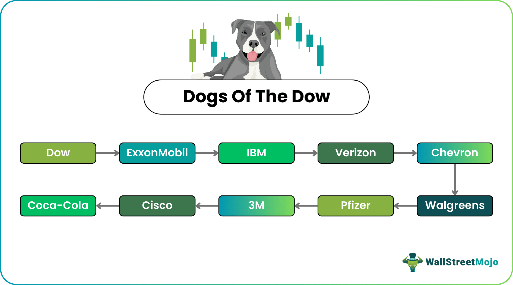

## Table of Contents

## What is the Dogs of the Dow strategy?

The Dogs of the Dow strategy is a simple way to invest in the stock market. It involves picking the ten companies from the Dow Jones Industrial Average that have the highest dividend yields at the end of each year. The idea is to buy these stocks and hold them for a year, then repeat the process. This strategy is based on the belief that these high-yield stocks are likely undervalued and will provide good returns.

This approach is popular because it is easy to follow and doesn't require a lot of research. It can be a good way for beginners to start investing. However, like any investment strategy, it has risks. The stocks might not perform as expected, and the overall market can affect the results. It's important for investors to understand these risks and consider their own financial goals before using this strategy.

## How does the Dogs of the Dow strategy work?

The Dogs of the Dow strategy is a way to pick stocks from the Dow Jones Industrial Average. At the end of each year, you look at the 30 companies in the Dow and find the ten that have the highest dividend yields. These are the "Dogs." The idea is that these companies might be undervalued, so their stock prices could go up in the future. You buy these ten stocks and keep them for a whole year.

After a year, you sell the stocks and start over. You look at the Dow Jones again and pick the new ten companies with the highest dividend yields. This way, you keep updating your list every year. The strategy is simple and doesn't need a lot of research, which makes it good for people new to investing. But remember, like any way of investing, it has risks. The stocks might not do well, and the market can change. It's important to think about these risks and your own money goals before you start.

## What are the benefits of using the Dogs of the Dow strategy?

One big benefit of using the Dogs of the Dow strategy is that it's easy to follow. You don't need to be a stock market expert to use it. All you do is look at the Dow Jones Industrial Average at the end of the year, find the ten companies with the highest dividend yields, and buy those stocks. This makes it a good choice for people who are new to investing or don't want to spend a lot of time researching stocks.

Another benefit is that the strategy can help you find undervalued stocks. The idea is that the companies with the highest dividend yields might be undervalued, so their stock prices could go up in the future. This can lead to good returns if the stocks perform well. Plus, by focusing on companies in the Dow Jones, you're investing in well-known and established businesses, which can make the strategy feel safer.

## What are the potential risks associated with the Dogs of the Dow strategy?

One risk of the Dogs of the Dow strategy is that it might not always work. Just because a company has a high dividend yield doesn't mean its stock price will go up. Sometimes, a high yield can mean the company is in trouble, and its stock price could go down instead. This means you could lose money if the stocks don't perform well.

Another risk is that the strategy depends a lot on the overall market. If the stock market goes down, even the Dogs of the Dow might not do well. This can affect your returns and make it harder to make money. It's important to think about how the market might change before you start using this strategy.

Also, the Dogs of the Dow strategy can be risky because it's not very flexible. You have to wait a whole year before you can change your investments. If something big happens in the market or with one of the companies, you might be stuck with stocks that are not doing well. This means you need to be patient and ready to hold onto your investments even if they go down for a while.

## How do you select the Dogs of the Dow each year?

To select the Dogs of the Dow each year, you start by looking at the 30 companies in the Dow Jones Industrial Average at the end of the year. You then find out the dividend yield for each company. The dividend yield is how much money a company pays out in dividends compared to its stock price. You pick the ten companies that have the highest dividend yields. These are the Dogs of the Dow for that year.

Once you have your list of the ten Dogs, you buy their stocks and hold onto them for the whole next year. At the end of that year, you sell those stocks and start the process all over again. You look at the Dow Jones again and find the new ten companies with the highest dividend yields. This way, you keep updating your list every year.

## Can you provide an example of the Dogs of the Dow for the current year?

At the end of 2022, the Dogs of the Dow were chosen based on their dividend yields. The ten companies with the highest yields were Verizon Communications, Dow Inc., Walgreens Boots Alliance, 3M Company, International Business Machines (IBM), Cisco Systems, Chevron Corporation, Amgen Inc., Coca-Cola Company, and JPMorgan Chase & Co. These companies had the highest dividend yields among the 30 companies in the Dow Jones Industrial Average.

You would buy stocks from these ten companies at the start of 2023 and hold them for the entire year. At the end of 2023, you would sell these stocks and look at the Dow Jones again to find the new ten companies with the highest dividend yields. This way, you keep updating your list of Dogs of the Dow every year.

## How does the Dogs of the Dow strategy compare to other investment strategies?

The Dogs of the Dow strategy is different from other investment strategies because it's very simple and easy to follow. You just need to look at the Dow Jones Industrial Average at the end of each year and pick the ten companies with the highest dividend yields. This makes it a good choice for people who are new to investing or don't want to spend a lot of time researching stocks. Other strategies, like value investing or growth investing, might need more research and understanding of the market. Value investing looks for stocks that are undervalued, while growth investing focuses on companies that are expected to grow quickly. These strategies can be more complex and might need more time and knowledge to use well.

Another way the Dogs of the Dow strategy is different is that it's not very flexible. You have to wait a whole year before you can change your investments. This can be a risk if the market changes a lot or if something happens to one of the companies you've invested in. Other strategies, like active trading or [momentum](/wiki/momentum) investing, let you buy and sell stocks more often. Active trading involves buying and selling stocks quickly to make money from short-term changes in the market. Momentum investing focuses on stocks that have been going up and are expected to keep going up. These strategies can be more flexible but also come with their own risks and need more time and attention.

## What historical performance data is available for the Dogs of the Dow?

The Dogs of the Dow strategy has been around for a long time, and people have looked at how well it has done in the past. From 1973 to 2022, the Dogs of the Dow had an average yearly return of about 9.5%. This is a bit better than the average return of the whole Dow Jones Industrial Average, which was about 8.5% over the same time. But remember, past results don't mean the strategy will do the same in the future. The stock market can change a lot, and what worked before might not work next time.

Looking at specific years can also help us understand the Dogs of the Dow better. For example, in 2008, during the big financial crisis, the Dogs of the Dow lost about 41%, which was worse than the Dow Jones's loss of about 34%. But in 2009, when the market started to recover, the Dogs of the Dow did much better, with a return of about 20% compared to the Dow Jones's 19%. These ups and downs show that the Dogs of the Dow can be risky, just like any other way of investing. It's important to think about these risks and your own money goals before you decide to use this strategy.

## How can the Dogs of the Dow strategy be implemented in a diversified investment portfolio?

The Dogs of the Dow strategy can be a good part of a diversified investment portfolio because it's easy to use and can help find undervalued stocks. To include it in your portfolio, you can set aside a certain amount of your money for this strategy. For example, if you have $10,000 to invest, you might decide to put $2,000 into the Dogs of the Dow. At the end of each year, you look at the Dow Jones Industrial Average and pick the ten companies with the highest dividend yields. You buy these stocks and hold them for the whole next year. This way, you're using the Dogs of the Dow to try to get good returns from undervalued stocks.

But it's important to remember that the Dogs of the Dow shouldn't be your only investment. To keep your portfolio diversified, you should also invest in other types of assets. This can include other stocks, bonds, real estate, or even mutual funds and ETFs. By spreading your money across different kinds of investments, you can lower your risk. If the Dogs of the Dow don't do well in a certain year, your other investments might help balance things out. This way, you're not putting all your eggs in one basket, and you're giving yourself a better chance to reach your financial goals.

## What are some common misconceptions about the Dogs of the Dow?

One common misconception about the Dogs of the Dow is that it's a foolproof way to make money. People might think that just because a company has a high dividend yield, it's a sure bet that its stock price will go up. But that's not always true. Sometimes, a high yield can mean the company is in trouble, and its stock price could go down instead. This means you could lose money if the stocks don't perform well.

Another misconception is that the Dogs of the Dow strategy is the best way to invest for everyone. It's true that it's simple and easy to follow, which can be good for beginners. But it's not the only way to invest, and it might not be the best choice for everyone. Other strategies, like value investing or growth investing, might be better depending on your goals and how much risk you're willing to take. It's important to think about your own financial situation and goals before deciding to use the Dogs of the Dow strategy.

## How have changes in the Dow Jones Industrial Average affected the Dogs of the Dow strategy over time?

Changes in the Dow Jones Industrial Average have had a big impact on the Dogs of the Dow strategy over time. The Dow Jones changes which companies it includes to keep up with the economy and big changes in the market. When a company is added or taken out of the Dow, it can change which companies are the Dogs of the Dow. For example, if a new company with a high dividend yield is added, it might become one of the Dogs. Or if a company with a high yield is removed, the list of Dogs could change a lot. These changes can make the strategy work differently from year to year.

Also, the way the Dow Jones changes can affect how well the Dogs of the Dow do. If the Dow adds more companies that are doing well and have lower yields, it might be harder to find good Dogs. On the other hand, if the Dow includes more companies that are struggling and have high yields, the Dogs might do better. Over time, these changes can make the Dogs of the Dow strategy more or less successful. It's important for people using this strategy to keep an eye on the Dow and understand how these changes might affect their investments.

## What advanced techniques can be used to optimize the Dogs of the Dow strategy?

One way to make the Dogs of the Dow strategy better is to look at more than just the dividend yield. You can also check the company's price-to-earnings ratio (P/E ratio). This tells you how much you're paying for each dollar of the company's earnings. If a company has a low P/E ratio and a high dividend yield, it might be a really good deal. Another thing you can do is to keep an eye on the company's financial health. Look at things like their debt levels and how much money they're making. If a company is doing well financially, it's more likely to keep paying good dividends.

Another advanced technique is to use a variation of the Dogs of the Dow called the "Small Dogs of the Dow." Instead of [picking](/wiki/asset-class-picking) the ten companies with the highest dividend yields, you pick the five companies with the lowest stock prices from the original ten Dogs. This can help you focus on even cheaper stocks that might have more room to grow. Also, you can think about rebalancing your portfolio more often than just once a year. Maybe you check and adjust your investments every six months or even every quarter. This can help you react to changes in the market faster and possibly make more money.

## What is the Dogs of the Dow Strategy?

The Dogs of the Dow strategy is a well-known investment approach that targets high-dividend-yield stocks within the Dow Jones Industrial Average (DJIA). Originally popularized by Michael B. O'Higgins in his 1991 book, "Beating the Dow," this strategy is appealing for its simplicity and consistent approach to dividend investing. It offers an accessible methodology for investors seeking to capitalize on dividend income, potentially identifying undervalued stocks within a major market index.

The fundamental premise of the Dogs of the Dow strategy involves selecting the ten stocks from the DJIA that have the highest dividend yield at the start of each year. Dividend yield is calculated by the formula:

$$
\text{Dividend Yield} = \frac{\text{Annual Dividend per Share}}{\text{Price per Share}}
$$

Stocks with a high dividend yield are typically perceived as undervalued by the market, thus offering both income generation and potential capital appreciation. This approach inherently focuses on larger, more established companies that are generally financially stable and capable of providing reliable dividend payments.

A key feature of the Dogs of the Dow is its annual portfolio rebalancing. At the beginning of each year, the investor reviews the dividend yields of DJIA stocks and reconstructs the portfolio by selecting the ten highest yielders once again. This rebalancing ensures the portfolio remains aligned with the original strategy metrics and adapts to any changes in the market conditions or individual stock performances throughout the previous year.

This straightforward strategy has garnered interest among individual and institutional investors due to its low trading costs, relatively passive management, and emphasis on high-dividend income. While the methodology does not guarantee outperformance relative to other investment strategies or indices, it is praised for its transparency and ease of implementation.

## References & Further Reading

[1]: O'Higgins, M. B., & Downes, J. (1991). ["Beating the Dow: A High-Return, Low-Risk Method for Investing in the Dow."](https://books.google.com/books/about/Beating_the_Dow.html?id=mxbA7H8r6zEC) HarperBusiness.

[2]: Brogaard, J., Hendershott, T., & Riordan, R. (2014). ["High-Frequency Trading and Price Discovery."](https://www.jstor.org/stable/24465658) The Review of Financial Studies, 27(8), 2267–2306.

[3]: James, G., Witten, D., Hastie, T., & Tibshirani, R. (2013). ["An Introduction to Statistical Learning with Applications in R."](https://link.springer.com/book/10.1007/978-1-0716-1418-1) Springer.

[4]: Narang, R. K. (2009). ["Inside the Black Box: The Simple Truth About Quantitative Trading."](https://onlinelibrary.wiley.com/doi/book/10.1002/9781118267738) John Wiley & Sons.

[5]: Chan, E. P. (2009). ["Quantitative Trading: How to Build Your Own Algorithmic Trading Business."](https://github.com/ftvision/quant_trading_echan_book) Wiley.