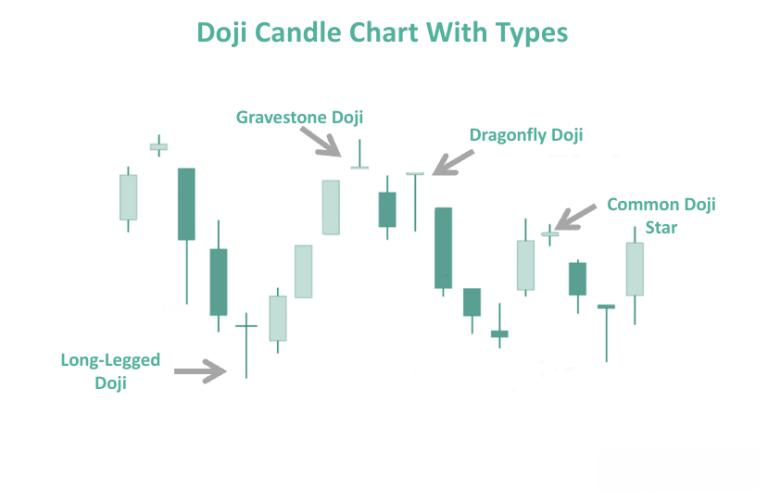

Financial markets are complex environments characterized by a myriad of patterns and trends that traders analyze to make informed decisions. Among the various techniques used in technical analysis, candlestick patterns hold a special place due to their ability to visually represent market data over specific time frames. One of the most intriguing candlestick patterns is the doji, which is especially notable for its ability to signal market indecision.

A doji pattern arises when a security's opening and closing prices are nearly identical, resulting in a candle that resembles a cross or plus sign. This pattern is unique among candlestick patterns because it indicates a balance between bullish and bearish forces, often leading to a period of uncertainty about future market direction. The significance of the doji lies in its potential to signal reversals or pauses in existing trends, making it a valuable tool for traders seeking to anticipate market movements.



Understanding candlestick patterns, including the doji, is an essential skill for traders participating in technical analysis. By interpreting these patterns, traders can enhance their trading efficiency, identifying opportunities to enter or exit positions with greater precision. The doji pattern comes in several variations, each providing different insights depending on their position on a price chart and the context of preceding market trends.

In this article, we will examine what the doji pattern signifies, explore its different types, and discuss how it can be applied in generating trading signals. Furthermore, we will highlight the role of doji patterns in algorithmic trading—a modern approach that leverages pre-set signals to automate trades. By integrating doji patterns into trading algorithms, traders can potentially identify entry and exit points with improved accuracy.

As traders seek to enhance their strategies, the doji candlestick pattern stands out as a versatile tool, useful in both manual and algorithmic trading. Understanding its significance, application, and limitations is crucial for anyone looking to navigate the complexities of financial markets effectively. Through careful analysis and integration with other technical indicators, the doji pattern can serve as a valuable component of a comprehensive trading strategy, enabling traders to make more informed decisions in a dynamic market landscape.

## Table of Contents

## Understanding the Doji Candlestick Pattern

A doji candlestick forms in the financial markets when the open and close prices of a security are nearly identical, resulting in a shape that resembles a cross or plus sign. This characteristic makes the doji a neutral pattern, frequently signifying market indecision. Typically, traders interpret this pattern as a point of equilibrium between buying and selling pressures, suggesting neither bulls nor bears have control.

Various types of doji patterns exist, each offering distinct insights depending on their placement on a chart and the current market context. The gravestone doji, for example, forms when the open, low, and close prices are virtually the same, with a long upper shadow. This pattern often appears near the top of uptrends, potentially indicating a bearish reversal due to the rejection of higher prices.

Conversely, the dragonfly doji occurs when the open, high, and close prices are approximately equal, with a long lower shadow. Often found at the bottom of downtrends, it may signal a bullish reversal as the demand at lower prices suggests potential upward movement.

The long-legged doji is characterized by both long upper and lower shadows. This pattern reflects significant market [volatility](/wiki/volatility-trading-strategies), where price movements above and below the opening price occur before closing near the same level. Traders should consider the preceding trend and overall [volume](/wiki/volume-trading-strategy) when interpreting a long-legged doji, as it signifies heightened uncertainty.

Doji patterns are valuable tools for traders, primarily because they can mark potential reversal points or consolidation periods. For instance, a doji appearing at the peak of an uptrend may indicate that bullish [momentum](/wiki/momentum) is waning, possibly foretelling a trend reversal. Similarly, when found amidst a period of price stagnation, dojis can signal an impending [breakout](/wiki/breakout-trading) in either direction.

Mathematically, the decision to consider a candlestick as a doji is based on a specific threshold percentage for the size of the body relative to its shadows. This threshold can vary among traders and tools, providing flexibility in how the pattern is identified and utilized in trading strategies.

## The Role of Doji Patterns in Technical Analysis

Technical analysis relies heavily on identifying patterns that can help predict future price movements, and the doji candlestick pattern is a significant part of this analytical process. A doji candlestick, with its characteristic shape where the open and close prices are nearly equal, often signifies market indecision and can be a precursor to major market movements such as reversals. 

The doji pattern is neutral by itself but gains significance when considered within the context of preceding trends and accompanying trading volumes. A doji appearing after a prolonged uptrend or downtrend might indicate a potential reversal, signaling that the trend may lose its momentum. Conversely, during sideways market conditions, a doji might suggest continued indecisiveness or periods of consolidation. Therefore, the doji's implication largely depends on the historical price movements leading up to its formation.

Investors often pair doji patterns with other technical indicators to enhance the accuracy of their predictions. Commonly used indicators include the Relative Strength Index (RSI), which measures the magnitude of recent price changes to evaluate overbought or oversold conditions, and moving averages, which smooth out price data to identify trends. For instance, if a doji is identified at a key support or resistance level and is accompanied by an RSI divergence, it might strengthen the signal of a possible reversal. Moving averages can also provide additional context; a doji appearing near a significant moving average line may offer insights into potential future price behavior.

Understanding the market context is crucial for effectively interpreting doji candlesticks. It requires a comprehensive assessment of the surrounding environment, including factors like market sentiment, economic events, and overall volatility levels. For example, if a doji forms in a market with high volatility and significant trading volume, it might signal strong indecisiveness and potential for a sharp price change. Conversely, in a low-volume, low-volatility environment, a doji might simply reflect a lack of trading activity rather than an impending reversal.

In conclusion, while the doji pattern plays a vital role in technical analysis, its effectiveness relies on context and complementary indicators. Proper interpretation demands a thorough understanding of market dynamics and a holistic approach integrating multiple analytical tools.

## Algorithmic Trading with Doji Patterns

Algorithmic trading employs pre-set signals based on technical indicators to automate the process of buying and selling securities. One such indicator is the doji candlestick pattern. By using doji patterns, traders can enhance their strategies to better identify potential entry and [exit](/wiki/exit-strategy) points.

Incorporating doji patterns into trading algorithms offers a structured approach to harnessing market signals. The doji pattern, with its characteristic shape indicating market indecision, can mark potential turning points. By coding these signals into an algorithm, traders can automate the recognition of doji patterns and act on those signals promptly, without the latency of human intervention.

Backtesting is a critical step in evaluating the efficacy of doji-based strategies. By applying historical data, traders are able to simulate trades and assess the performance of their algorithms under various market conditions. This process helps identify the profitability and risk levels of the strategies used. Python's rich ecosystem, featuring libraries such as `pandas` for data manipulation and `[backtrader](/wiki/backtrader)` for [backtesting](/wiki/backtesting), is well-suited for this task. An example of a simple backtesting structure in Python might look like:

```python
import backtrader as bt

class DojiStrategy(bt.Strategy):
    def __init__(self):
        self.dataclose = self.datas[0].close

    def next(self):
        if abs(self.dataopen[0] - self.dataclose[0]) < (self.datahigh[0] - self.datalow[0]) * 0.05:
            # Store the potential doji pattern
            print("Doji detected at:", self.data.datetime.date())

cerebro = bt.Cerebro()
cerebro.addstrategy(DojiStrategy)
data = bt.feeds.YahooFinanceData(dataname='AAPL', fromdate=dt.datetime(2020, 1, 1), todate=dt.datetime(2023, 1, 1))
cerebro.adddata(data)
cerebro.run()
```

Automated systems equipped with doji detection can monitor vast amounts of data, capturing fleeting market dynamics with precision that is impossible for manual trading. Additionally, combining doji signals with other technical patterns can greatly enhance predictive accuracy. For instance, pairing doji patterns with moving averages or Relative Strength Index (RSI) can filter out false signals and improve overall decision-making in trading algorithms.

Despite the potential benefits, it's crucial to remember that no single indicator, including the doji, guarantees market predictions. Traders should integrate doji patterns into comprehensive strategies that consider multiple indicators and include robust risk management practices. By doing so, traders can harness the strengths of doji patterns more effectively and improve their [algorithmic trading](/wiki/algorithmic-trading) success.

## Limitations and Considerations

Doji patterns, known for their ability to signal market indecision, are integral to many traders' toolkits but are not without limitations. Their infrequent occurrence is a primary limitation; doji patterns do not appear consistently across all trading sessions, making it risky to base an entire trading strategy solely on these patterns. Traders often find that relying exclusively on doji patterns might lead to missed trading opportunities when the pattern does not manifest during key price levels or trends.

The misinterpretation of doji signals is another significant concern. A doji pattern, by nature, is neutral, and its interpretation heavily depends on the context within which it appears, such as the preceding trend and market volume. Misjudging these contextual factors can lead to erroneous market predictions, potentially resulting in financial loss. A doji appearing after a sustained uptrend might suggest a reversal, but if paired incorrectly with low trading volume, it could be misleading.

To mitigate these risks, comprehensive trading strategies must incorporate multiple indicators beyond just doji patterns. Combining doji patterns with additional technical indicators such as Relative Strength Index (RSI), Moving Averages, or MACD (Moving Average Convergence Divergence) can enhance the reliability of trading signals. For example, a doji followed by bullish RSI divergence might offer stronger evidence of a potential reversal than the doji pattern alone.

Moreover, effective risk management practices are essential when incorporating doji patterns into trading strategies. Tools like stop-loss orders and take-profit levels can help manage potential losses and secure gains. Here is a simple Python example of how a trader might set a stop-loss order:

```python
def calculate_stop_loss(entry_price, risk_percent):
    # Assuming the risk_percent is given as a decimal (e.g., 0.02 for 2%)
    stop_loss = entry_price - (entry_price * risk_percent)
    return stop_loss

# Example usage
entry_price = 100  # Assume you enter a trade at $100
risk_percent = 0.02  # You are willing to risk 2% per trade

stop_loss_price = calculate_stop_loss(entry_price, risk_percent)
print(f"Stop-loss set at: ${stop_loss_price:.2f}")
```

This example underscores the importance of considering risk as an integral part of a trading setup. Traders are advised to remain cautious and not to over-rely on doji patterns without corroborating evidence from other analysis tools. A methodical approach that includes understanding the broader market conditions and applying a blend of technical indicators is crucial for making informed trading decisions and achieving long-term success.

## Conclusion

The doji candlestick pattern is an essential component for traders who wish to gain insights into market indecision. This pattern serves as a crucial indicator that can highlight potential turning points when properly integrated into algorithmic trading strategies. By providing traders with signals about market sentiment shifts, doji patterns can enhance decision-making processes and refine trading strategies, thus enabling more precision in timing entry and exit points.

However, it is essential to remain cognizant of the limitations associated with doji patterns. These often subtle indicators should not be used in isolation, as they do not guarantee market reversals. Instead, their effectiveness is maximized when incorporated into a broader analysis strategy. This includes using them with other complementary technical indicators, such as moving averages, RSI, and tools for risk management. By considering the surrounding market context and additional signals, traders can avoid misinterpretations and make more informed decisions.

Looking forward, the potential for integrating doji patterns with other technical analysis tools holds considerable promise for traders seeking to enhance their predictive capabilities. As these patterns continue to be researched and understood within varied market conditions, traders can expect to further refine and optimize trading systems. This ongoing exploration may facilitate the development of more sophisticated algorithms, improving the overall effectiveness of trading strategies.

## References & Further Reading

[1]: Nison, S. (1991). ["Japanese Candlestick Charting Techniques: A Contemporary Guide to the Ancient Investment Techniques of the Far East."](https://drive.google.com/file/d/0B_CADMk621uLNDEyZTEzZjYtMmZjOS00ZmUyLTlhYmYtN2E1YTViOWRiOTdi/view) Prentice Hall Press.

[2]: Bulkowski, T. (2008). ["Encyclopedia of Candlestick Charts."](https://onlinelibrary.wiley.com/doi/book/10.1002/9781119202288) Wiley.

[3]: Aronson, D. (2006). ["Evidence-Based Technical Analysis: Applying the Scientific Method and Statistical Inference to Trading Signals."](https://www.amazon.com/Evidence-Based-Technical-Analysis-Scientific-Statistical/dp/0470008741) Wiley.

[4]: Pring, M. J. (2014). ["Technical Analysis Explained: The Successful Investor's Guide to Spotting Investment Trends and Turning Points."](https://www.amazon.com/Technical-Analysis-Explained-Fifth-Successful/dp/0071825177) McGraw-Hill Education.

[5]: Chan, E. P. (2009). ["Quantitative Trading: How to Build Your Own Algorithmic Trading Business."](https://github.com/ftvision/quant_trading_echan_book) Wiley.

[6]: Jansen, S. (2020). ["Machine Learning for Algorithmic Trading: Predictive Models to Extract Signals from Market and Alternative Data for Systematic Trading Strategies with Python."](https://www.amazon.com/Machine-Learning-Algorithmic-Trading-alternative/dp/1839217715) Packt Publishing.

[7]: Lopez de Prado, M. (2018). ["Advances in Financial Machine Learning."](https://www.amazon.com/Advances-Financial-Machine-Learning-Marcos/dp/1119482089) Wiley.