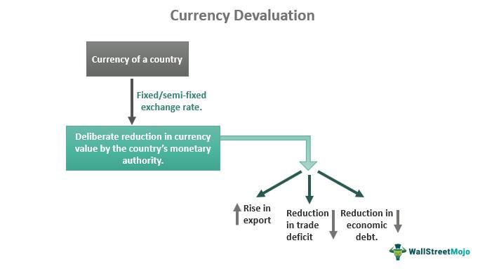

The Dollar Auction game, conceived by economist Martin Shubik, represents a key concept within game theory, challenging the conventional perceptions of rational choice theory. This game serves as an intriguing demonstration of how rational decision-making processes can paradoxically result in irrational outcomes. At its core, the Dollar Auction involves a bidding competition where two or more participants vie for a dollar bill, with the twist that both the highest bidder and the second-highest bidder must pay their bids, regardless of who wins the dollar. This unique setup exemplifies the irrational escalation of bids, often surpassing the dollar's face value, as players strive to avoid losses rather than optimize gains.

Understanding this paradoxical nature of the Dollar Auction can offer valuable insights for traders and investors aiming to fine-tune their decision-making frameworks. In the competitive and high-stakes landscape of financial markets, recognizing the potential for irrational bidding and investment behaviors is crucial. This is especially pertinent in the context of algorithmic trading strategies, where automated systems are designed to execute trades based on predefined criteria. Gaining an appreciation for the dynamics that lead to irrational outcomes enables traders to craft algorithms that preemptively mitigate such risks, enhancing the overall effectiveness and efficiency of their trading operations.



Exploring the implications of the Dollar Auction within game theory illuminates scenarios where rational actions, driven by self-interest, culminate in collective suboptimal results. Such insights can be leveraged to develop more robust trading strategies, informed by an understanding of human psychology and decision-making flaws. Our aim is to unravel how these rational decisions morph into irrational outcomes and how this understanding can be effectively applied within algorithmic trading environments, ultimately contributing to improved decision-making processes in complex financial scenarios.

## Table of Contents

## What is the Dollar Auction?

The Dollar Auction is an intriguing bidding game conceptualized by economist Martin Shubik to illustrate the irrational outcomes possible under rational choice theory. In this game, two participants compete to purchase a dollar bill through successive bidding. The rules dictate that the highest bidder wins the dollar, while both the winner and the loser must pay their respective bid amounts.

The paradoxical nature of the Dollar Auction emerges prominently when examined through the lens of game theory. Initially, participants engage in the auction with the rational goal of acquiring the dollar at a favorable price. However, as the auction progresses and bids escalate towards the dollar's face value, a shift occurs. Participants, driven by an urge to avoid losses rather than gain profits, continue to raise their bids even beyond the dollar's actual value. This shift from a profit-maximizing strategy to a loss-minimizing one exemplifies the potential for rational actors to engage in seemingly irrational actions.

To understand how rational decision-making can lead to economically counterintuitive outcomes, consider the auction dynamic: suppose the bids have reached $0.99 from one player and $1.00 from the other. The player who bid $0.99 faces the dilemma of either losing their bid or escalating further, essentially leading them to bid $1.01. This interplay often results in both participants continuing to raise their bids past the threshold, driven by the desire to recoup investments and avoid gratuitous losses. Consequently, the auction captures a scenario where rational choices, such as investing incrementally to avoid losses, collectively culminate in a counterproductive scenario where the total amount paid by the participants exceeds the value of the dollar being auctioned.

## Understanding the Mechanics of the Dollar Auction

In a typical Dollar Auction, the bidding process begins with participants offering small increments towards a dollar, often starting at just a few cents. This seemingly innocuous beginning is designed to lure bidders with the promise of acquiring a dollar for much less than its face value. However, as the auction progresses and bids approach the dollar mark, the nature of the game shifts dramatically.

Participants face a complex dilemma as they must choose between two unfavorable options: continue raising their bids to avoid the immediate loss of their prior investments or cease bidding and accept their financial losses. This decision matrix often results in a psychological struggle, as each player weighs the sunk costs against potential future expenditures. The critical turning point in a Dollar Auction occurs when the bids surpass the one-dollar value, forcing those involved to either cut their losses or escalate their commitments in hopes of a less detrimental outcome.

The Dollar Auction effectively demonstrates the phenomenon of 'escalation of commitment,' a situation where individuals or organizations persist in a losing [course](/wiki/best-algorithmic-trading-courses) of action due to the substantial resources they have already committed. This behavior is not limited to theoretical scenarios but is observable in real-life situations, such as business ventures and financial markets, where decision-makers might continue funding a faltering project simply because they cannot accept the prospect of incurring losses.

In financial terms, this behavior can be understood through the lens of sunk cost fallacy, where past investments unduly influence current decision-making despite their irrelevance to future outcomes. This scenario in the Dollar Auction can be modeled with game theory payoff matrices, illustrating why rational actors might behave contrary to their best interests due to the psychological biases introduced by sunk costs.

By recognizing and understanding these underlying mechanics, individuals can develop strategies to mitigate the effects of escalation of commitment, ensuring more rational decision-making processes in competitive environments like auctions and trading scenarios.

## Game Theory and the Dollar Auction

The Dollar Auction provides a vivid illustration of the complexities within game theory, particularly demonstrating how rational strategies can culminate in suboptimal outcomes. At its core, the Dollar Auction presents an ironic twist where rational actors, driven by logical calculations, become entrapped in a cycle of irrational bidding.

The parallels between the Dollar Auction and the well-known Prisoner's Dilemma are striking. In both scenarios, individuals act out of self-interest with the goal of maximizing personal gain. However, this self-interested behavior often precludes cooperative strategies that could lead to mutually beneficial outcomes. In the case of the Prisoner's Dilemma, two players acting independently may end up confessing, resulting in a worse outcome for both compared to mutual cooperation. Similarly, the Dollar Auction ensnares rational bidders into an escalating bidding war, ultimately leading to financial losses exceeding the value of the prize.

The auction effectively showcases the pitfalls of non-cooperative behavior. In game-theoretic terms, it exemplifies how Nash equilibria in certain games can lead to less than optimal outcomes for all parties involved. As each bidder strives to minimize personal losses, they inadvertently contribute to a scenario where collective disaster looms—a phenomenon recognized in economic theory as the "tragedy of the commons." Within the framework of the Dollar Auction, the drive to outbid opponents shifts focus from potential gain to loss avoidance, propelling participants into an irrational race of diminishing returns.

Martin Shubik introduced the Dollar Auction to shed light on the often counterintuitive nature of non-cooperative games. The game acts as a microcosm for economic and social interactions where individual rationality does not align with collective rationality. By dissecting such scenarios, game theorists can better understand decision-making processes under competitive conditions and inform strategies that avoid these pitfalls.

In conclusion, the Dollar Auction is a powerful tool in demonstrating the intricacies and occasional folly of rational economic behavior. It underscores the importance of recognizing when conventional logic leads to collective disadvantage, echoing the broader challenges faced in strategic decision-making across various domains.

## Implications for Algorithmic Trading Strategies

In [algorithmic trading](/wiki/algorithmic-trading), the principles of the Dollar Auction offer valuable lessons in mitigating irrational bidding and investment behaviors. The game exemplifies how seemingly rational decisions can lead to suboptimal outcomes due to the escalation of commitment—a critical consideration in the development of robust trading strategies.

To integrate these insights into algorithmic trading, traders can design algorithms that detect patterns indicative of escalation of commitment. This involves recognizing when traders or systems continue to invest in a losing proposition to recoup prior investments, a behavior that the Dollar Auction vividly illustrates. For instance, a trading algorithm can be programmed to identify and flag sequences of trades where an entity repeatedly increases its position in a declining market. By doing so, the algorithm can prompt a reassessment of the strategy, potentially averting significant losses.

Here is an example of how one might implement a simple detection mechanism in Python:

```python
def detect_escalation(trade_history):
    """
    Detects potential escalation of commitment in a series of trades.

    Args:
    trade_history (list of tuples): A list where each tuple represents a trade with
                                    (trade_number, price, position_size).

    Returns:
    bool: True if escalation of commitment is detected, False otherwise.
    """
    threshold = 3  # Define a threshold for consecutive negative trades
    consecutive_losses = 0

    for i in range(1, len(trade_history)):
        if trade_history[i][1] < trade_history[i-1][1]:  # Price has decreased
            consecutive_losses += 1
            if consecutive_losses >= threshold:
                return True
        else:
            consecutive_losses = 0

    return False

# Example usage:
trade_data = [
    (1, 100, 10),
    (2, 95, 20),
    (3, 90, 25),
    (4, 85, 30)
]

escalation_detected = detect_escalation(trade_data)
print("Escalation of commitment detected:" if escalation_detected else "Stable trading behavior.")
```

By incorporating game theory insights like those from the Dollar Auction, traders can enhance risk management and decision-making processes. Effective algorithms should be capable of triggering timely interventions, such as adjusting position sizes or halting trading, when signs of irrational escalation are detected. This proactive approach helps curb the tendency to enter a spiral of increasing investment in failing strategies.

Moreover, applying these principles can lead to improved trading performance by fostering discipline and strategic reconsideration in volatile markets. By relying on well-defined triggers and objective criteria, traders can minimize emotional biases and sustain a consistent approach to risk mitigation.

In summary, integrating the concepts illustrated by the Dollar Auction into algorithmic trading strategies can mitigate the escalation of commitment, leading to enhanced decision-making and more effective risk management in complex financial environments.

## Conclusion

The Dollar Auction exemplifies how seemingly rational decision-making can spiral into irrational outcomes, particularly in certain economic and trading scenarios. This paradox serves as a critical reminder of the potential pitfalls inherent in competitive environments where emotional decisions can override logical reasoning. In algorithmic trading, where decisions are driven by complex models and systems, understanding the principles behind the Dollar Auction is crucial. Algorithms that replicate human bidding behavior can fall into similar traps of escalating commitments, leading to suboptimal results.

By integrating insights from the Dollar Auction and game theory, traders can craft strategies that preemptively identify and mitigate the risks of irrational bidding behaviors. For instance, developing algorithms that detect the onset of escalating competition can enable early intervention, thereby curbing potential financial losses. This requires embedding rules within trading systems that trigger alerts or halt trading when certain thresholds are surpassed, akin to establishing stop-loss mechanisms.

Moreover, embracing game theory insights encourages the design of algorithms capable of adapting to dynamic market conditions. This adaptability helps prevent costly escalation by maintaining a balance between competitive strategies and risk mitigation. Consequently, traders enhance their decision-making processes and optimize performance, facing complex financial environments with robust, data-driven strategies.

In conclusion, lessons from the Dollar Auction are invaluable for developing algorithmic trading strategies that avoid irrational escalation, thus improving overall success rates. By leveraging these insights, traders can better navigate the intricate landscapes of financial markets, minimizing risks while maximizing potential returns.

## References & Further Reading

[1]: Shubik, M. (1971). ["The Dollar Auction Game: A Paradox in Noncooperative Behavior and Escalation."](https://journals.sagepub.com/doi/10.1177/002200277101500111) Management Science, 17(8), 488–497.

[2]: Pressman, S. (2006). ["Fifty Major Economists, Third Edition: A Reference Guide."](https://www.routledge.com/Fifty-Major-Economists/Pressman/p/book/9780415645096) Routledge.

[3]: Tversky, A., & Kahneman, D. (1974). ["Judgment under Uncertainty: Heuristics and Biases."](https://www2.psych.ubc.ca/~schaller/Psyc590Readings/TverskyKahneman1974.pdf) Science, 185(4157), 1124-1131.

[4]: Shiller, R. J. (1990). ["Market Volatility and Investor Behavior."](https://www.jstor.org/stable/pdf/2006543.pdf) The MIT Press.

[5]: Smith, J. M. (1982). ["Evolution and the Theory of Games."](https://www.cambridge.org/core/books/evolution-and-the-theory-of-games/A3BDF54AF5C6297E308AB15BBEF45E48) Cambridge University Press. 

[6]: Kahneman, D. (2011). ["Thinking, Fast and Slow."](https://link.springer.com/article/10.1007/s00362-013-0533-y) Farrar, Straus and Giroux.

[7]: Yudkowsky, E., & Vernor Vinge, V. (2008). ["The Intelligent Agent Foundations Forum."](https://www.academia.edu/81170306/Unpredictability_of_AI) Machine Intelligence Research Institute.