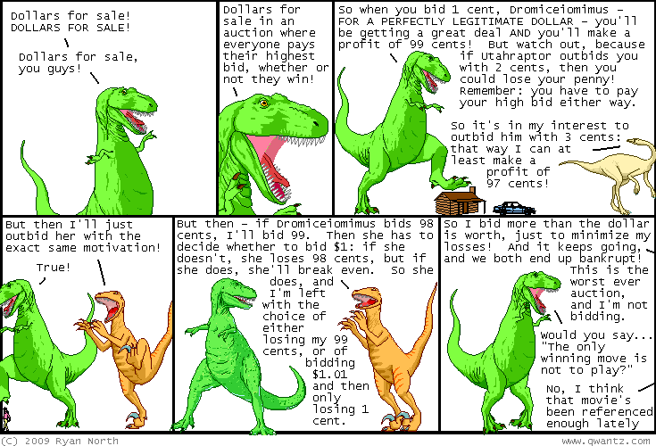

## Table of Contents

## What is a Dollar Auction?

A Dollar Auction is a fun game where people bid on a dollar bill. The twist is that both the highest bidder and the second-highest bidder have to pay their bids. The highest bidder gets the dollar, but the second-highest bidder gets nothing and still has to pay. This game can lead to some surprising results because people might keep bidding to avoid losing the money they already bid.

In the game, someone might start by bidding 1 cent for the dollar. Someone else might bid 2 cents, and so on. As the bidding goes up, the bidders start to think about how much they are willing to lose. They might keep bidding even if it goes over a dollar because they don't want to lose the money they already spent. This can lead to the final bid being much higher than a dollar, which is interesting and shows how people make decisions under pressure.

## How does the bidding process work in a Dollar Auction?

In a Dollar Auction, the bidding starts with someone offering a small amount, like 1 cent, for a dollar bill. Other people can then bid higher amounts, like 2 cents or 3 cents. The bidding continues as people try to outbid each other. The key rule is that both the highest bidder and the second-highest bidder have to pay their bids at the end. The highest bidder gets the dollar, but the second-highest bidder gets nothing and still has to pay.

As the bidding goes on, the amounts can get higher and higher. People might keep bidding even if it goes over a dollar because they don't want to lose the money they already bid. This can lead to some surprising results, where the final bid might be much more than a dollar. The game shows how people can get caught up in trying to avoid losing money, even if it means spending more than they planned.

## What are the rules of a Dollar Auction?

In a Dollar Auction, people bid on a dollar bill. The person who bids the highest amount wins the dollar, but there's a twist. Both the highest bidder and the second-highest bidder have to pay their bids at the end. So, if you bid the highest, you get the dollar but you still have to pay what you bid. If you're the second-highest bidder, you don't get the dollar, but you still have to pay your bid.

The bidding starts with someone offering a small amount, like 1 cent, for the dollar. Other people can then bid higher amounts, like 2 cents or 3 cents. The bidding keeps going as people try to outbid each other. Sometimes, people keep bidding even if it goes over a dollar because they don't want to lose the money they already bid. This can make the final bid much higher than a dollar, which is interesting to see.

## What is the typical starting bid in a Dollar Auction?

In a Dollar Auction, the typical starting bid is usually very small, like 1 cent. People begin by bidding a tiny amount because they want to get the dollar for as little as possible. It's a good way to start the game without spending much money right away.

As the bidding goes on, other people start to bid higher amounts, like 2 cents or 3 cents. They want to outbid the first person and win the dollar. The game can get exciting as the bids go up, and people keep bidding to avoid losing the money they already bid.

## Why might people continue bidding in a Dollar Auction even when it becomes unprofitable?

People might keep bidding in a Dollar Auction even when it becomes unprofitable because they don't want to lose the money they already bid. If someone bids 90 cents and someone else bids 91 cents, the first person might bid 92 cents to avoid losing 90 cents and getting nothing. This can make them keep bidding higher and higher, even if it goes over a dollar.

Another reason is that people can get caught up in the game and want to win. Even if it doesn't make sense to keep bidding, they might feel like they have to keep going to beat the other person. This can make the final bid much higher than a dollar, which is interesting to see.

## What is the concept of the 'escalation of commitment' in relation to Dollar Auctions?

The concept of 'escalation of commitment' in Dollar Auctions explains why people keep bidding even when it doesn't make sense. In a Dollar Auction, people bid on a dollar bill, and both the highest and second-highest bidders have to pay their bids. As the bidding goes on, people might bid more than a dollar because they don't want to lose the money they already bid. This is called escalation of commitment because people keep going even though it's not a good idea.

This happens because people feel like they have to keep bidding to avoid losing their money. If someone bids 90 cents and someone else bids 91 cents, the first person might bid 92 cents to avoid losing 90 cents and getting nothing. This can make them keep bidding higher and higher, even if it goes over a dollar. It's like they can't stop, even though it's not smart to keep going.

## Can you explain the economic theory behind the Dollar Auction?

The Dollar Auction is a game that shows how people can make choices that don't seem to make sense. In this game, people bid on a dollar bill, and both the highest and second-highest bidders have to pay their bids. The highest bidder gets the dollar, but the second-highest bidder gets nothing and still has to pay. This rule can make people keep bidding even when it's not smart, because they don't want to lose the money they already bid.

The economic theory behind the Dollar Auction is about something called 'escalation of commitment.' This means people keep doing something even if it's not a good idea, because they feel like they have to keep going. In the Dollar Auction, people might bid more than a dollar because they want to avoid losing the money they already spent. This can make the final bid much higher than a dollar, which shows how people can get caught up in trying to avoid losing money, even if it means spending more than they planned.

## What are some real-world applications or examples of Dollar Auctions?

The Dollar Auction can be seen in real life when people get caught up in bidding wars at auctions. For example, at a silent auction for a charity, people might bid on a prize like a fancy dinner. If someone bids $100, and someone else bids $105, the first person might bid $110 to avoid losing their money. This can keep going, and the final bid might be much more than the prize is worth. It's like the Dollar Auction because people keep bidding even if it's not smart, because they don't want to lose what they already spent.

Another example is in business, when companies spend a lot of money to win a project or a contract. Imagine two companies bidding to build a new road. One company bids $1 million, and the other bids $1.1 million. The first company might bid $1.2 million to avoid losing the money they already spent on the bid. This can make the final bid much higher than the project is worth. It's like the Dollar Auction because the companies keep bidding to avoid losing, even if it means spending more than they planned.

## How does the Dollar Auction relate to game theory?

The Dollar Auction is a fun game that shows how people make choices. In game theory, it's a way to see how people act when they're trying to win something. The game is set up so that both the highest bidder and the second-highest bidder have to pay their bids. This makes people keep bidding even if it goes over a dollar, because they don't want to lose the money they already bid. It's like a real-life example of something called 'escalation of commitment,' where people keep going even if it's not smart.

In game theory, the Dollar Auction shows how people can get caught up in trying to avoid losing money. They might bid more than a dollar because they want to win the dollar and not lose what they already spent. This can make the final bid much higher than a dollar, which is interesting to see. The game helps us understand how people make choices when they're under pressure, and how they might keep going even if it's not the best thing to do.

## What strategies can participants use to maximize their chances of winning a Dollar Auction?

In a Dollar Auction, one good strategy to win is to start bidding early with a small amount, like 1 cent. This can help you set the pace of the game and make other people think twice before they bid. If you can, try to bid just a little bit more than the other person each time. This way, you can keep control of the bidding and make it hard for others to outbid you without spending too much.

Another strategy is to be ready to stop bidding at the right time. If the bidding goes over a dollar, think about whether it's worth it to keep going. Sometimes, it's better to stop and let someone else win, even if you lose the money you already bid. This can help you avoid spending too much money and losing more than you planned. Remember, the goal is to win the dollar without spending more than you have to.

## What are the psychological factors that influence bidding behavior in Dollar Auctions?

In a Dollar Auction, people's bidding behavior is influenced by a few psychological factors. One big [factor](/wiki/factor-investing) is the fear of losing money. When someone bids, they don't want to lose the money they already spent. So, they might keep bidding even if it goes over a dollar, because they want to avoid losing what they already bid. This is called the 'escalation of commitment,' where people keep going even if it's not smart, because they feel like they have to keep going.

Another factor is the desire to win. People can get caught up in the game and want to beat the other person. Even if it doesn't make sense to keep bidding, they might feel like they have to keep going to win the dollar. This can make the final bid much higher than a dollar, which shows how people can get caught up in trying to avoid losing money, even if it means spending more than they planned.

## How can the outcomes of Dollar Auctions be analyzed using decision theory?

In a Dollar Auction, decision theory helps us understand why people keep bidding even when it doesn't make sense. People make choices based on what they think will happen next. In the game, if someone bids 90 cents and someone else bids 91 cents, the first person might think, "If I stop now, I'll lose 90 cents and get nothing." So, they might bid 92 cents to avoid losing their money. This shows how people can get caught up in trying to avoid losing money, even if it means spending more than they planned.

Decision theory also looks at how people weigh the costs and benefits of their choices. In a Dollar Auction, the cost of bidding keeps going up, but the benefit stays the same - it's just one dollar. People might keep bidding because they want to win the dollar and not lose what they already spent. This can make the final bid much higher than a dollar, which is interesting to see. The game helps us understand how people make choices when they're under pressure and how they might keep going even if it's not the best thing to do.

## References & Further Reading

[1]: Shubik, M. (1971). ["The Dollar Auction Game: A Paradox in Noncooperative Behavior and Escalation."](https://journals.sagepub.com/doi/10.1177/002200277101500111) Management Science, 17(8), 488–497.

[2]: Pressman, S. (2006). ["Fifty Major Economists, Third Edition: A Reference Guide."](https://www.routledge.com/Fifty-Major-Economists/Pressman/p/book/9780415645096) Routledge.

[3]: Tversky, A., & Kahneman, D. (1974). ["Judgment under Uncertainty: Heuristics and Biases."](https://www2.psych.ubc.ca/~schaller/Psyc590Readings/TverskyKahneman1974.pdf) Science, 185(4157), 1124-1131.

[4]: Shiller, R. J. (1990). ["Market Volatility and Investor Behavior."](https://www.jstor.org/stable/pdf/2006543.pdf) The MIT Press.

[5]: Smith, J. M. (1982). ["Evolution and the Theory of Games."](https://www.cambridge.org/core/books/evolution-and-the-theory-of-games/A3BDF54AF5C6297E308AB15BBEF45E48) Cambridge University Press. 

[6]: Kahneman, D. (2011). ["Thinking, Fast and Slow."](https://link.springer.com/article/10.1007/s00362-013-0533-y) Farrar, Straus and Giroux.

[7]: Yudkowsky, E., & Vernor Vinge, V. (2008). ["The Intelligent Agent Foundations Forum."](https://www.academia.edu/81170306/Unpredictability_of_AI) Machine Intelligence Research Institute.