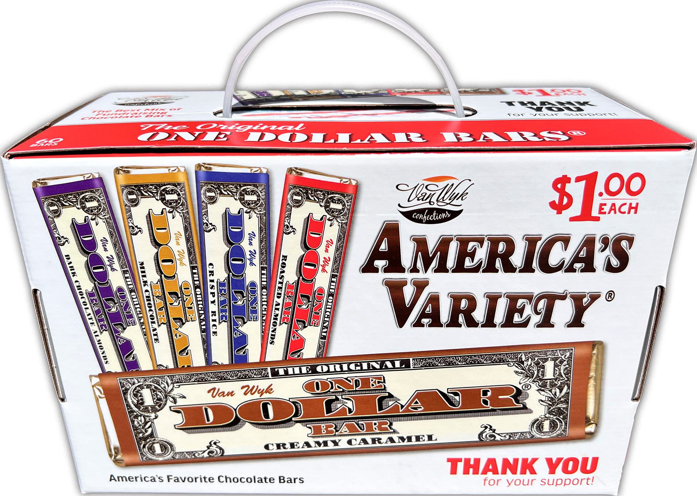

## Table of Contents

## What are dollar bars?

Dollar bars are a way to group financial data, like stock prices, based on the total dollar amount traded instead of time. Instead of looking at data every minute or hour, you look at it after a certain amount of money has been traded. For example, if you set a dollar bar at $10,000, you would group the data each time $10,000 worth of the stock is traded, no matter how long it takes.

This method can be useful because it focuses on when big trades happen, which can be more important than what happens at fixed times. It helps traders see patterns and trends based on the amount of money moving, rather than just the passage of time. This can lead to better decisions because it shows when there is a lot of activity in the market.

## How do dollar bars differ from time-based bars?

Dollar bars and time-based bars are two different ways to look at stock market data. Time-based bars group data by fixed time periods, like every minute or hour. So, if you're using a one-minute time bar, you'll see what happened in the market every minute, no matter how much money was traded during that time. This is good for seeing what's happening at regular times, but it might miss important changes if they don't happen to fall within those time slots.

On the other hand, dollar bars group data by the amount of money traded, not by time. If you set a dollar bar at $10,000, you'll see data every time $10,000 worth of stock is traded, which could take a few seconds or a few minutes. This way, you can see when there's a lot of activity in the market, which can be more important than what happens at fixed times. Dollar bars help you focus on big trades and can show you patterns that time-based bars might miss.

## What are the advantages of using dollar bars in trading?

Using dollar bars in trading can help traders see important market changes better. When you use dollar bars, you look at data based on how much money is traded, not just the time. This means you can see when big trades happen, which can be more important than what happens every minute or hour. For example, if a lot of money is traded quickly, it might mean something big is happening in the market, and dollar bars can help you see that.

Another advantage of dollar bars is that they can help you make better trading decisions. Because dollar bars show you when there's a lot of activity, you can use them to spot trends and patterns that might be hard to see with time-based bars. This can be really helpful for traders who want to understand the market better and make choices based on where the money is moving, not just what time it is.

## How can dollar bars be constructed?

To construct dollar bars, you start by setting a dollar amount that you want to use for each bar. For example, if you choose $10,000, you will group your data every time $10,000 worth of the stock is traded. You keep adding up the value of each trade until you reach or pass your chosen dollar amount. Once you hit that amount, you create a new bar and start counting again from zero.

This process means you might have bars that represent different amounts of time. One bar could be made up of trades that happened over a few seconds, while another might take several minutes. The key is to focus on the total dollar amount traded, not the time it takes. This way, you can see when big trades happen and understand the market better.

## What data is required to create dollar bars?

To create dollar bars, you need data about the price and the [volume](/wiki/volume-trading-strategy) of each trade. The price tells you how much each share of the stock costs, and the volume tells you how many shares were traded. By multiplying the price by the volume, you can find out the total dollar amount for each trade. You need to keep track of these trades and add up their total dollar amounts until you reach your chosen dollar bar size, like $10,000.

Once you have this data, you can start building your dollar bars. You keep adding up the dollar amounts of the trades until you hit or pass your chosen amount. When you do, you create a new bar and start counting again from zero. This way, you can see when big trades happen, which can help you understand the market better.

## Can dollar bars be used for any financial instrument?

Dollar bars can be used for many different financial instruments, like stocks, futures, and [forex](/wiki/forex-system). As long as you have data about the price and the number of trades, you can use dollar bars. This means you can use them for anything that is traded and has a price and volume.

The main thing you need is to know how much each trade is worth. You do this by multiplying the price of the trade by the number of shares or units traded. Once you have this information, you can start making dollar bars for any financial instrument you want to look at.

## How do dollar bars affect trading strategies?

Dollar bars can change the way traders make their plans because they focus on how much money is moving instead of just looking at the time. When traders use dollar bars, they can see when big trades are happening, which can be more important than what happens at fixed times. This can help traders spot trends and patterns that they might miss if they only look at time-based data. For example, if a lot of money is traded quickly, it might mean something big is happening in the market, and dollar bars can help traders see that.

Using dollar bars can also help traders make better decisions. Because dollar bars show when there's a lot of activity, traders can use them to understand the market better. This can be really helpful for traders who want to make choices based on where the money is moving, not just what time it is. By focusing on the total dollar amount traded, traders can create strategies that take advantage of big market moves and make more informed trades.

## What are the potential drawbacks of using dollar bars?

Using dollar bars can be tricky because they might not work well for all kinds of trading. If you trade something that doesn't have a lot of trades happening all the time, it could take a long time to reach your dollar bar size. This means you might not get enough data to make good decisions quickly. Also, if the market is quiet, you might wait a long time before you can see any new dollar bars, which can make it hard to keep up with what's happening.

Another problem with dollar bars is that they can be hard to use if you're used to looking at data by time. Many trading tools and charts are set up to show data every minute or hour, so switching to dollar bars might take some getting used to. It can also be confusing to mix dollar bars with other kinds of data, like time-based bars, because they show the market in different ways. This can make it harder to understand what's going on if you're not careful.

## How do dollar bars impact volatility analysis?

Dollar bars can help traders see how much the market is moving in a different way than time-based bars. When you use dollar bars, you look at the market every time a certain amount of money is traded, not every minute or hour. This can show you when big trades are happening, which can make the market move a lot. If a lot of money is traded quickly, it might mean the market is getting more active and could be more volatile. By focusing on the dollar amount, you can see these big moves and understand how the market might change.

But, dollar bars can also make it harder to see what's happening if the market is quiet. If not many trades are happening, it might take a long time to reach your dollar bar size. This means you might not get enough data to see how volatile the market is right now. Also, if you're used to looking at data by time, switching to dollar bars can be confusing. It's important to be careful when mixing dollar bars with other kinds of data because they show the market in different ways.

## What advanced techniques can be applied to optimize dollar bars?

To make dollar bars work better, traders can use a few smart tricks. One way is to change the size of the dollar bars based on how busy the market is. If the market is moving a lot, you might want to use smaller dollar bars to see more details. If it's quiet, bigger dollar bars can help you wait less time for new data. Another trick is to use different dollar bar sizes for different times of the day or different stocks. This can help you see more clearly what's happening when the market changes.

Another advanced technique is to mix dollar bars with other kinds of data, like time-based bars or tick bars. This can give you a fuller picture of what's going on in the market. For example, you might use dollar bars to spot big trades and time-based bars to see what's happening at regular times. By putting these together, you can make better guesses about where the market might go next. It's all about finding the right mix that works for you and helps you make smarter trades.

## How do dollar bars perform in different market conditions?

Dollar bars work differently depending on how busy the market is. In a busy market, where lots of trades are happening, dollar bars can help traders see important changes quickly. When a lot of money is traded fast, it might mean the market is moving a lot, and dollar bars can show this. Traders can use smaller dollar bars to see more details and understand what's happening right away. This can be really helpful for making quick decisions when the market is active.

In a quiet market, where not many trades are happening, dollar bars can take longer to fill up. This means traders might have to wait a while before they see new data. If it takes too long to reach the dollar bar size, traders might miss out on seeing what's happening in the market right now. So, in a quiet market, using bigger dollar bars can help, but it's still important to be patient and wait for enough trades to happen before making decisions.

## What are the best practices for integrating dollar bars into algorithmic trading systems?

When you want to use dollar bars in your trading computer programs, it's good to start by [picking](/wiki/asset-class-picking) the right size for your dollar bars. This depends on how busy the market is. If the market is moving a lot, smaller dollar bars can help you see more details quickly. But if the market is quiet, bigger dollar bars might be better because they fill up faster. It's also smart to change the size of your dollar bars during the day or for different stocks. This way, you can keep up with how the market changes and make better guesses about what might happen next.

Another important thing is to mix dollar bars with other kinds of data, like time-based bars or tick bars. This can give you a fuller picture of what's going on in the market. For example, you might use dollar bars to spot big trades and time-based bars to see what's happening at regular times. By putting these together, you can make smarter trades. It's all about finding the right mix that works for you and helps you make better decisions.

## What are the statistical properties of dollar bars?

Dollar bars in [algorithmic trading](/wiki/algorithmic-trading) provide a means of capturing market dynamics based on the fiat value exchanged during transactions, differing fundamentally from time-based and volume bars. Understanding their statistical properties, such as autocorrelation and normality of returns, can offer valuable insights and improvements in trading strategies.

### Autocorrelation of Returns

Autocorrelation measures the degree to which the current value of returns is related to past values. In trading, lower autocorrelation in return series indicates less predictability or less opportunity for lagged indicators. Dollar bars often show lower autocorrelation than time-based bars. This is because dollar bars are constructed to represent a consistent value of money transacted, thereby adapting to fluctuations in trading activity and capturing transactional value more effectively. Time-based bars, which are fixed to specific intervals, often contain periods of low activity leading to higher autocorrelation due to clustering of stale price movements.

Mathematically, autocorrelation for lag $k$ can be calculated as:

$$
\rho_k = \frac{\sum_{t=1}^{n-k} (r_t - \bar{r})(r_{t+k} - \bar{r})}{\sum_{t=1}^{n} (r_t - \bar{r})^2}
$$

where $r_t$ is the return at time $t$ and $\bar{r}$ is the mean return.

### Normality of Returns

Dollar bars often exhibit more normally distributed returns compared to volume and time-based bars. The construction method of dollar bars reduces the effect of [volatility](/wiki/volatility-trading-strategies) clustering and extreme outliers, common in financial data, which can distort the distribution. This is theoretically advantageous because many statistical tools and models assume normality in the returns distribution. More normal return distributions lead to more reliable application of statistical models, such as regression analysis and variance estimations, in strategy development.

A common way to test normality is using the Shapiro-Wilk test or visually using Q-Q plots. The simplicity of dollar bars in capturing 'value-transacted' helps in achieving distributions closer to normal.

### Comparisons

Comparing statistical properties of the different bars:

- **Time-Based Bars**: Fixed intervals lead to capturing varied market dynamics, often resulting in higher autocorrelation during low-activity periods. Return distributions can be heavily skewed by periods of high volatility or inactivity.

- **Volume Bars**: These adjust for the number of trades but can still reflect uneven market conditions when large trades skew data. This creates potential anomalies affecting their normality and predictability.

- **Dollar Bars**: Consistently adjust for both transaction size and price. By filtering out periods of low monetary activity, they tend to normalize return distributions while maintaining lower autocorrelation.

### Strategy Implications

The statistical attributes of dollar bars imply that trading strategies based on them can potentially be more robust and responsive to actual market conditions. Reduced autocorrelation suggests that lag-based indicators (e.g., moving averages) can perform more reliably since these bars reduce noise associated with market inactivity. Additionally, improvements in normality can lead to better performance of models reliant on distribution assumptions, such as GARCH models for volatility forecasting or the application of the Black-Scholes model for options pricing.

In conclusion, the use of dollar bars can lead to enhanced analytical precision in developing trading strategies by more accurately reflecting the market's economic transactions, thereby offering advantages over more traditional bar types in capturing true market sentiment and activity.

## References & Further Reading

[1]: Bergstra, J., Bardenet, R., Bengio, Y., & Kégl, B. (2011). ["Algorithms for Hyper-Parameter Optimization."](https://papers.nips.cc/paper/4443-algorithms-for-hyper-parameter-optimization) Advances in Neural Information Processing Systems 24.

[2]: ["Advances in Financial Machine Learning"](https://www.amazon.com/Advances-Financial-Machine-Learning-Marcos/dp/1119482089) by Marcos Lopez de Prado

[3]: ["Evidence-Based Technical Analysis: Applying the Scientific Method and Statistical Inference to Trading Signals"](https://www.amazon.com/Evidence-Based-Technical-Analysis-Scientific-Statistical/dp/0470008741) by David Aronson

[4]: ["Machine Learning for Algorithmic Trading"](https://github.com/stefan-jansen/machine-learning-for-trading) by Stefan Jansen

[5]: ["Quantitative Trading: How to Build Your Own Algorithmic Trading Business"](https://www.amazon.com/Quantitative-Trading-Build-Algorithmic-Business/dp/0470284889) by Ernest P. Chan