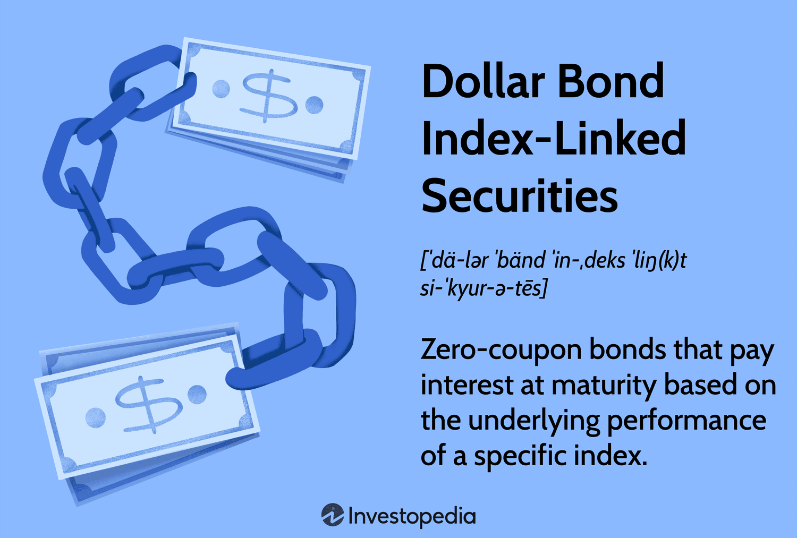

## Table of Contents

## What is a Dollar Bond?

A Dollar Bond is a bond that is issued in U.S. dollars by a company or government that is not based in the United States. This means that even though the bond is in dollars, the issuer is from another country. For example, a company in Japan might issue a bond in U.S. dollars to attract investors who want to invest in dollars.

These bonds are popular because they allow investors from around the world to invest in U.S. dollars without having to buy American bonds. They can be a good option for investors looking to diversify their investments or for companies looking to raise money in a different currency. However, they also come with risks, such as currency exchange rate fluctuations, which can affect the bond's value and the returns for investors.

## How does a Dollar Bond function?

A Dollar Bond works like any other bond but is issued in U.S. dollars by a company or government from outside the U.S. When you buy a Dollar Bond, you are lending money to the issuer. In return, the issuer promises to pay you back the amount you lent, called the principal, on a specific date. They also agree to pay you interest regularly, usually every six months, until the bond matures.

The [interest rate](/wiki/interest-rate-trading-strategies) on a Dollar Bond is set when the bond is issued and doesn't change. This rate can be higher or lower than what you might get from U.S. bonds, depending on the issuer's creditworthiness and other factors. Because the bond is in dollars, if you live in a country with a different currency, you need to think about how changes in exchange rates might affect your returns. If the dollar gets stronger compared to your local currency, you might earn more; if it gets weaker, you might earn less.

## What are the different types of Dollar Bonds?

Dollar Bonds come in different types, mainly based on who issues them and how they work. One common type is the sovereign Dollar Bond, which is issued by a foreign government. These bonds are often seen as safer because they are backed by the government. Another type is corporate Dollar Bonds, issued by companies outside the U.S. These can be riskier but might offer higher interest rates to attract investors.

There are also different ways Dollar Bonds can be structured. For example, some Dollar Bonds are fixed-rate, meaning the interest rate stays the same until the bond matures. Others might be floating-rate, where the interest rate changes based on a benchmark like LIBOR. Additionally, some Dollar Bonds might be convertible, allowing the bondholder to exchange the bond for a set number of the issuer's stocks.

Understanding these different types and structures can help investors choose the right Dollar Bond for their needs. Whether it's a safer government bond or a higher-yield corporate bond, and whether it's a fixed or floating rate, each type has its own benefits and risks.

## Who typically issues Dollar Bonds?

Dollar Bonds are usually issued by countries or companies that are not in the United States. These can be governments from places like Japan, Brazil, or Mexico. They issue Dollar Bonds to raise money from investors who want to invest in U.S. dollars. This can help the country or government manage their finances or fund big projects.

Companies from outside the U.S. also issue Dollar Bonds. These could be big businesses in Europe, Asia, or other parts of the world. They use Dollar Bonds to get money for growing their business, starting new projects, or paying off other debts. By issuing bonds in U.S. dollars, they can reach more investors around the world who are interested in dollar-based investments.

## What are the benefits of investing in Dollar Bonds?

Investing in Dollar Bonds can help you spread your money across different types of investments. When you buy Dollar Bonds, you are putting your money into bonds from countries or companies outside the U.S., which can make your investment portfolio more diverse. This means if one part of your investments goes down, the Dollar Bonds might help balance it out. Plus, because they are in U.S. dollars, they can be a good choice if you want to invest in dollars but don't want to buy U.S. bonds.

Another benefit is that Dollar Bonds can sometimes offer higher interest rates than similar U.S. bonds. This is because the companies or governments issuing them might need to attract investors, so they offer better returns. If you live in a country with a weaker currency, Dollar Bonds can also protect your money from losing value if the U.S. dollar gets stronger. Just remember, there are risks too, like the chance that the issuer might not be able to pay you back or that changes in exchange rates could affect your returns.

## What are the risks associated with Dollar Bonds?

One big risk with Dollar Bonds is that the company or government that issued them might not be able to pay you back. This can happen if they run into financial trouble. If they can't pay, you might lose the money you invested. Another risk is that the value of the bond can go up and down while you own it. If you need to sell the bond before it matures, you might get less money back than you paid for it.

Another thing to watch out for is changes in exchange rates. If you live in a country with a different currency and the U.S. dollar gets weaker, the money you get back from the bond might be worth less in your local currency. On the other hand, if the U.S. dollar gets stronger, it can be good for you. But you can't always predict what will happen with exchange rates, so it's a risk to think about.

Lastly, there's the risk of interest rate changes. If interest rates go up after you buy a Dollar Bond, new bonds might offer higher rates, making your bond less valuable. This can affect the price of your bond if you want to sell it before it matures. So, it's important to think about how interest rates might change when you decide to invest in Dollar Bonds.

## How do Dollar Bonds impact the global economy?

Dollar Bonds can have a big impact on the global economy. When countries and companies outside the U.S. issue these bonds, they are borrowing money in U.S. dollars. This means they need to have dollars to pay back the bondholders. If a lot of Dollar Bonds are issued, it can increase the demand for U.S. dollars around the world. This can make the U.S. dollar stronger compared to other currencies. A stronger dollar can affect trade because it might make U.S. exports more expensive and imports cheaper.

Also, Dollar Bonds can help countries and companies raise money to grow their economies. For example, a country might use the money from Dollar Bonds to build roads or schools. This can create jobs and help the economy grow. But if a country or company can't pay back the bonds, it can cause problems. It might make investors less willing to lend money in the future, which can slow down economic growth. So, while Dollar Bonds can help the global economy, they also come with risks that need to be managed carefully.

## What is the difference between a Yankee Bond and a Eurodollar Bond?

A Yankee Bond is a bond issued in the U.S. by a foreign company or government, but it's sold in U.S. dollars to American investors. This means the bond is subject to U.S. regulations and is aimed at investors in the U.S. Yankee Bonds help foreign issuers tap into the large U.S. market, but they have to follow strict rules set by the U.S. Securities and Exchange Commission (SEC).

On the other hand, a Eurodollar Bond is a bond issued in U.S. dollars, but it's sold outside of the U.S. and the issuer can be from any country, including the U.S. These bonds are not subject to U.S. regulations, which can make them easier for issuers to sell. Eurodollar Bonds are popular because they let issuers reach investors all over the world without having to deal with U.S. rules.

The main difference between the two is where they are sold and the regulations they follow. Yankee Bonds are sold in the U.S. and must follow U.S. rules, while Eurodollar Bonds are sold outside the U.S. and don't have to follow those rules. Both types of bonds are in U.S. dollars, but they cater to different markets and have different regulatory requirements.

## How do interest rates affect Dollar Bonds?

Interest rates have a big effect on Dollar Bonds. When interest rates go up, new bonds that are issued will have higher interest rates to attract investors. This makes the older Dollar Bonds, which have lower rates, less attractive. If you want to sell your Dollar Bond before it matures, you might have to sell it for less because people would rather buy the new bonds with higher rates. So, rising interest rates can make the value of your Dollar Bond go down.

On the other hand, when interest rates go down, new bonds will have lower interest rates. This makes your Dollar Bond, with its higher rate, more attractive to investors. If you decide to sell your bond before it matures, you might be able to sell it for more because people want the higher interest rate you're getting. So, falling interest rates can make the value of your Dollar Bond go up. It's important to think about how interest rates might change when you decide to invest in Dollar Bonds.

## What role do Dollar Bonds play in international finance?

Dollar Bonds are important in international finance because they help countries and companies from outside the U.S. raise money in U.S. dollars. When these countries or companies issue Dollar Bonds, they can reach a lot of investors around the world who want to invest in dollars. This can help them fund big projects or grow their businesses. For example, a country might use the money to build new roads or schools, which can create jobs and help the economy grow. 

But Dollar Bonds also have a big impact on the global economy. When many Dollar Bonds are issued, it increases the demand for U.S. dollars. This can make the dollar stronger compared to other currencies, which can affect trade. A stronger dollar might make U.S. exports more expensive and imports cheaper. If a country or company can't pay back the bonds, it can cause problems too. It might make investors less willing to lend money in the future, which can slow down economic growth. So, Dollar Bonds play a key role in moving money around the world and can have both good and bad effects on the global economy.

## How are Dollar Bonds rated and what does the rating signify?

Dollar Bonds are rated by special companies called credit rating agencies, like Standard & Poor's, Moody's, and Fitch. These agencies look at how likely the issuer of the bond is to pay back the money they borrowed. They give the bond a grade, kind of like a report card, using letters like AAA, AA, A, BBB, and so on. A high grade, like AAA, means the bond is very safe and the issuer is very likely to pay back the money. A lower grade, like BB or below, means the bond is riskier and there's a bigger chance the issuer might not pay back the money.

The rating of a Dollar Bond tells investors how safe their investment is. If a bond has a high rating, more people might want to buy it because it's seen as a safe investment. But these bonds might offer lower interest rates because they're less risky. On the other hand, if a bond has a low rating, fewer people might want to buy it because it's riskier. To attract investors, these bonds usually offer higher interest rates. So, the rating helps investors decide if the bond is right for them based on how much risk they're willing to take and the return they want.

## What are some advanced strategies for trading Dollar Bonds?

One advanced strategy for trading Dollar Bonds is to use interest rate swaps. This means you can trade the fixed interest payments you get from the bond for floating interest payments from someone else. This can be useful if you think interest rates are going to change a lot. If rates go up, you might get more money from the floating payments than from the fixed payments on your bond. But if rates go down, you might get less. Using swaps can help you manage the risk of interest rate changes and maybe even make more money.

Another strategy is to trade Dollar Bonds based on what you think will happen with exchange rates. If you think the U.S. dollar will get stronger compared to other currencies, you might want to buy Dollar Bonds. This is because if the dollar gets stronger, the money you get back from the bond will be worth more in your local currency. But if you think the dollar will get weaker, you might want to sell your Dollar Bonds before that happens. Trading based on exchange rates can be tricky, but if you get it right, it can help you make more money or protect your investment.

A third strategy is to use a bond ladder. This means you buy Dollar Bonds that mature at different times. For example, you might buy some bonds that mature in one year, some in two years, and some in three years. When a bond matures, you can use the money to buy a new bond that matures in three years. This way, you always have bonds maturing at different times. A bond ladder can help you manage risk because you're not putting all your money into bonds that mature at the same time. It also lets you take advantage of changes in interest rates by buying new bonds at different times.

## References & Further Reading

[1]: ["Dollar-denominated bonds issued by non-U.S. firms: what do we learn from market performance?"](https://www.investopedia.com/terms/d/dollarbond.asp) by Azar, S. A. (2013). Journal of International Financial Markets, Institutions and Money.

[2]: ["Bonds: An Introduction to the Core Concepts"](https://www.amazon.com/Bonds-Introduction-Concepts-Mark-Mobius/dp/0470821477) from Investopedia provides a comprehensive guide to understanding the basics of bonds.

[3]: Hull, J. C. (2018). ["Options, Futures, and Other Derivatives"](https://www.semanticscholar.org/paper/Options%2C-Futures%2C-and-Other-Derivatives-Hull/89bdee500c8623864fc9eb7a471546aa713acc44) (10th Edition). Pearson Education. A textbook that covers a wide range of financial instruments.

[4]: ["Algorithmic Trading and DMA: An introduction to direct access trading strategies"](https://www.amazon.com/Algorithmic-Trading-DMA-introduction-strategies/dp/0956399207) by Barry Johnson explains the application of algorithmic trading in various markets including fixed income.

[5]: ["Advances in Financial Machine Learning"](https://www.amazon.com/Advances-Financial-Machine-Learning-Marcos/dp/1119482089) by Marcos Lopez de Prado discusses the integration of machine learning techniques in financial markets.