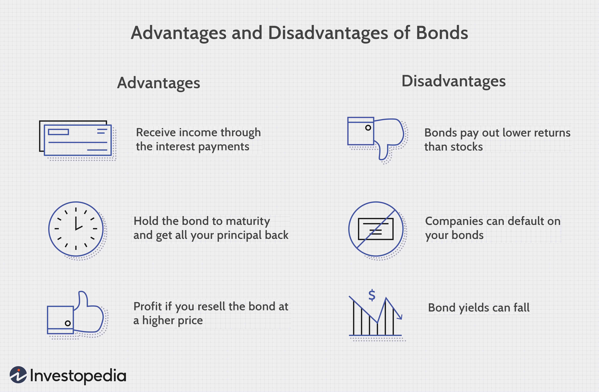

Financial markets today offer a diverse array of financial instruments that are specifically crafted to meet the varying needs of investors. Among these instruments, bonds hold a prominent position due to their stability and income-generating potential. Bonds, in essence, are loans made by investors to borrowers, typically governments or corporations, who promise to pay back the principal along with periodic interest payments known as coupons.

This article aims to explore the role of dollar bonds as a crucial element of the bond landscape. Dollar bonds are unique financial instruments that are issued outside the United States but are denominated in U.S. dollars. They serve the dual purpose of providing issuers with access to U.S. capital and offering investors the opportunity to invest without the currency risk typically associated with foreign securities. We will examine the specific characteristics of dollar bonds, understanding their appeal along with the types of risks involved, such as credit and inflation risk.



The discussion will also extend to cover the diverse types of bonds available in the market. Government bonds, corporate bonds, municipal bonds, and high-yield bonds each offer distinct characteristics and benefits, suited to different investment strategies and risk appetites. For instance, U.S. Treasury bonds are deemed virtually risk-free and are among the most popular type of government bonds, while corporate bonds offer higher yields in exchange for higher risk.

Furthermore, the article will address the rising trend of algorithmic trading within fixed-income markets. Algorithmic trading is increasingly reshaping the fixed-income landscape by providing speed, efficiency, and enhanced insights through data analysis. As technology continues to advance, algorithmic trading offers potential improvements in trading strategies and execution, enabling better market access and liquidity.

Through this exploration, readers will gain insights into how these instruments function and their strategic importance for diverse investment portfolios. Understanding the various dimensions of bonds and the transformative impact of algorithmic trading can empower investors to make informed decisions, optimize their portfolios, and manage risk effectively in a continuously evolving financial environment.

## Table of Contents

## Understanding Dollar Bonds

Dollar bonds are financial instruments issued by entities outside the United States and denominated in U.S. dollars. These bonds are attractive to both issuers and investors due to their distinct features. Foreign governments and corporations often opt for issuing dollar bonds to tap into the vast pool of U.S. dollar investors. Denominating bonds in a stable currency like the U.S. dollar can appealingly lower borrowing costs.

For U.S. investors, dollar bonds offer significant advantages, particularly the mitigation of currency risk. By having investments denominated in U.S. dollars, these investors avoid potential losses due to unfavorable currency fluctuations that would affect bonds denominated in a foreign currency. Moreover, dollar bonds often provide yields that can be more appealing compared to domestic alternatives, attracting investors seeking higher returns within a familiar currency context.

The interest and principal payments of dollar bonds are made in U.S. dollars, shielding U.S. investors from foreign exchange exposure. This aspect ensures a more predictable and stable income stream compared to foreign currency-denominated bonds, which can be subject to exchange rate [volatility](/wiki/volatility-trading-strategies).

Despite their advantages, issuers of dollar bonds face distinct challenges, primarily related to currency fluctuation and credit risk. Issuers must consider the potential impact of their home currency's depreciation, which could increase the relative cost of repaying the bond in U.S. dollars. Additionally, credit risk also plays a crucial role, as the bonds’ attractiveness largely depends on the issuer's financial health and ability to meet its debt obligations.

A notable example of a foreign entity utilizing dollar bonds is the Chinese e-commerce giant Alibaba. Alibaba has leveraged dollar bonds for foreign fundraising, benefiting from lower borrowing costs. By issuing these bonds, Alibaba taps into international investors’ appetite for dollar-denominated assets while effectively managing its capital generation strategy.

## Types of Bonds

The bond market presents a wide array of options for investors, each tailored to different investment goals and risk profiles. Understanding various bond types is essential for optimizing investment strategies effectively.

Government bonds are often considered the bedrock of conservative investment strategies. They include instruments like U.S. Treasury bonds and Treasury Inflation-Protected Securities (TIPS). Treasury bonds are regarded for their stability and are backed by the full faith and credit of the U.S. government. TIPS offer inflation protection as their principal value adjusts based on inflation rates, providing a safeguard against purchasing power erosion.

Corporate bonds are issued by companies and generally offer higher yields than government securities. However, these higher yields come with increased credit risk, which is contingent on the financial health and creditworthiness of the issuing corporation. Investors need to evaluate the credit ratings of corporate issuers to assess the risk-return profile effectively.

Municipal bonds, or "munis," are issued by states, municipalities, or counties and often provide tax-exempt interest income, which is particularly appealing to investors in higher tax brackets. While these bonds offer tax advantages, factors such as issuer credit risk and specific project risks associated with the fund's use warrant careful consideration.

High-yield bonds, colloquially known as "junk bonds," are characterized by higher returns due to their lower credit ratings. These bonds are issued by entities with higher default risks. While they offer the potential for substantial returns, they also come with increased risk and volatility, necessitating a rigorous assessment of the issuer's financial health and market conditions.

Overall, the diversity in bond types allows investors to tailor their portfolios to specific financial objectives, from seeking steady income and preserving capital to pursuing higher yields with associated risks.

## Algorithmic Trading in Bond Markets

Algorithmic trading, traditionally dominant in equity markets, is increasingly pivotal in bond markets, offering numerous advantages such as increased speed, efficiency, and data-driven insights. These advancements are fundamentally reshaping how bonds are traded and managed.

Technology facilitates the processing of substantial datasets in real time, enabling traders to identify and exploit fleeting market inefficiencies. This capability allows for enhanced decision-making processes and timely execution of trades, which are essential in capturing short-lived [arbitrage](/wiki/arbitrage) opportunities in bond markets.

Automation in trading processes minimizes human error and permits the implementation of complex strategies that can swiftly adjust to market fluctuations. Algorithms can be optimized to account for various factors such as interest rates, yield spreads, and credit ratings, enabling precise execution in various market conditions.

Despite these technological advances, the bond market faces several challenges. One of the primary issues is the lack of transparency and standardized data across different bonds, complicating automated trading strategies. Bonds, unlike equities, often trade over-the-counter (OTC), resulting in disparate pricing data and [liquidity](/wiki/liquidity-risk-premium) conditions.

Integrative approaches utilizing [artificial intelligence](/wiki/ai-artificial-intelligence) (AI) and [machine learning](/wiki/machine-learning) are anticipated to enhance access and analytical capabilities within the fixed-income sector. AI models can learn from vast amounts of historical and real-time data to predict bond price movements and detect patterns not immediately apparent to human traders. Machine learning algorithms, for instance, can be trained to recognize patterns and correlations in bond prices, interest rates, and economic indicators that may predict future market movements.

```
import numpy as np
from sklearn.ensemble import RandomForestRegressor

# Sample code to illustrate the use of machine learning in bond price prediction

# Features: interest rate, economic indicators, previous bond prices
X = np.array([[0.5, 3, 100],
              [0.6, 2.9, 101],
              [0.55, 3.1, 102]])

# Target: Future bond price
y = np.array([101.5, 102, 103])

# Initializing and training the Random Forest Regressor
model = RandomForestRegressor(n_estimators=10, random_state=42)
model.fit(X, y)

# Predicting future bond prices
future_X = np.array([[0.57, 3.0, 104]])
predicted_price = model.predict(future_X)

print("Predicted Future Bond Price:", predicted_price)
```

The continuous evolution and integration of AI and machine learning are poised to address existing challenges in algorithmic bond trading, enhancing the transparency and efficiency of these markets. As the landscape transforms, these technologies promise to offer significant improvements in transaction costs, liquidity, and overall market dynamics, paving the way for a new era in fixed-income trading.

## Challenges in Automating Fixed Income Trading

Fixed income trading automation presents a set of distinct challenges, primarily due to the inherent differences between bond markets and other financial markets such as equities. One of the primary obstacles is data fragmentation, which arises because many bonds are traded over-the-counter (OTC) rather than on centralized exchanges. This leads to sparse pricing data and fragmented markets, making it difficult for traders to obtain comprehensive and timely information about bond prices and liquidity.

To address this issue, bespoke models are often employed to assess specific bond characteristics, such as yield curves and liquidity premiums. These models require advanced analytics and specialized knowledge to account for the varying conditions and attributes of individual bonds. This complexity is compounded by the diversity of the bond market, which includes government, corporate, municipal, and high-yield bonds, each with distinct risk profiles and trading behaviors.

The lack of standardization across bond markets further complicates trading automation. Unlike equities, which benefit from uniform pricing and trading conventions, bonds have diverse issuance terms, varying interest payment schedules, and unique redemption features. This necessitates custom-built algorithms capable of adapting to these variations and accurately evaluating bond prices and risks.

Advancements in data aggregation and technology are key to overcoming these challenges. Improved data aggregation can provide more comprehensive insights into market conditions by consolidating information from multiple sources. Technological advancements can enhance computational capabilities, allowing for the processing of large datasets and complex models in real time. Machine learning and artificial intelligence (AI) techniques hold promise in refining predictive models for bond pricing and trading strategies.

As automation in fixed income trading continues to advance, existing models must evolve to incorporate nuanced information specific to varied fixed-income securities. For example, AI-driven sentiment analysis could be used to assess the impact of macroeconomic news on bond prices. Additionally, blockchain technology could offer a decentralized solution for reducing transaction costs and enhancing transparency across the bond trading ecosystem.

In summary, the automation of fixed income trading necessitates overcoming significant challenges related to data fragmentation, lack of standardization, and managing the inherent complexity of the bond market. By leveraging technological innovations and improving data management, market participants can enhance the efficiency and effectiveness of automated trading strategies in the fixed income sector.

## Future Prospects

The trajectory of fixed-income markets is increasingly aligned with technological innovations, notably the integration of algorithmic efficiencies and artificial intelligence (AI). As these technologies continue to evolve, they promise to transform the landscape of bond trading and management, offering substantial benefits in terms of process efficiency and market liquidity.

The adaptability of regulatory frameworks will be critical to unlocking these potential benefits. By evolving alongside technological innovations, these frameworks may enhance transparency and market access, supporting a more robust trading environment. A regulatory approach that encourages innovation while ensuring adequate oversight could facilitate a smoother integration of technology into fixed-income markets.

Investors and financial institutions have a strategic imperative to adopt and integrate these emerging tools. The potential for algorithms and AI to optimize investment outcomes is significant. Algorithmic trading can streamline processes, enable precise execution strategies, and process vast amounts of market data to uncover insights that can inform investment decisions. By embracing these technologies, institutions can enhance their operational efficiency and improve investment returns.

For firms operating in fixed-income markets, maintaining competitiveness necessitates continual innovation. This involves not only adopting new technologies but also fostering a culture of continuous education and learning. As markets evolve, balancing technological adoption with effective risk management becomes essential. Risk models and management strategies must adapt to handle the complexities introduced by automated trading systems and ensure resilience against potential technological failures.

Overall, the role of technology in reshaping how bonds are traded and managed is monumental. Enhanced liquidity and new opportunities are among the benefits, driven by improved trading mechanisms and data analytics. The ongoing evolution of these technologies holds the promise of significant advances in both the efficiency and effectiveness of fixed-income investments, offering investors the tools needed to thrive in a transforming financial ecosystem. 

In Python, for instance, investors could leverage machine learning algorithms to forecast bond price movements or assess credit risk. Here is a simple example of using Python's `scikit-learn` library for a linear regression model predicting bond returns:

```python
from sklearn.model_selection import train_test_split
from sklearn.linear_model import LinearRegression
from sklearn.metrics import mean_squared_error

# Example dataset: features (e.g., interest rates, inflation rate), target (bond returns)
X = # Dataframe of features
y = # Dataframe of target

# Splitting data into training and testing sets
X_train, X_test, y_train, y_test = train_test_split(X, y, test_size=0.2, random_state=42)

# Initializing and training the model
regressor = LinearRegression()
regressor.fit(X_train, y_train)

# Making predictions
y_pred = regressor.predict(X_test)

# Evaluating the model
mse = mean_squared_error(y_test, y_pred)
print(f"Mean Squared Error: {mse}")
```

By harnessing such models, investors can glean insights into potential market movements, thereby enhancing decision-making processes in fixed-income investing.

## Conclusion

Bonds remain a pivotal element within diversified portfolios, offering both stability and income generation in the face of financial market volatility. By comprehending the distinct features of dollar bonds and the diverse range of bond types available, investors can craft advanced strategies that align with their financial objectives. Dollar bonds, with their unique ability to mitigate currency risk while providing attractive yields, serve as a strategic tool for international investment, broadening the investor base and enhancing portfolio resilience.

The advent of [algorithmic trading](/wiki/algorithmic-trading) in the bond markets marks a significant shift towards increased efficiency and opportunity. These sophisticated trading methods allow for rapid analysis and execution, which can optimize returns. Despite the technological progress, challenges such as data fragmentation and standardization hurdles endure, emphasizing the need for continuous adaptation and improvement in trading strategies.

Investors who adeptly navigate the complexities associated with bonds and leverage technological advancements can enhance the performance of their fixed-income investments. By maintaining an understanding of market evolutions, investors will be better equipped to maximize potential returns and manage risks, thereby ensuring their portfolios respond effectively to the dynamic environment of financial instruments.

## References & Further Reading

[1]: ["Dollar-denominated bonds issued by non-U.S. firms: what do we learn from market performance?"](https://www.investopedia.com/terms/d/dollarbond.asp) by Azar, S. A. (2013). Journal of International Financial Markets, Institutions and Money.

[2]: ["Bonds: An Introduction to the Core Concepts"](https://www.amazon.com/Bonds-Introduction-Concepts-Mark-Mobius/dp/0470821477) from Investopedia provides a comprehensive guide to understanding the basics of bonds.

[3]: Hull, J. C. (2018). ["Options, Futures, and Other Derivatives"](https://www.semanticscholar.org/paper/Options%2C-Futures%2C-and-Other-Derivatives-Hull/89bdee500c8623864fc9eb7a471546aa713acc44) (10th Edition). Pearson Education. A textbook that covers a wide range of financial instruments.

[4]: ["Algorithmic Trading and DMA: An introduction to direct access trading strategies"](https://www.amazon.com/Algorithmic-Trading-DMA-introduction-strategies/dp/0956399207) by Barry Johnson explains the application of algorithmic trading in various markets including fixed income.

[5]: ["Advances in Financial Machine Learning"](https://www.amazon.com/Advances-Financial-Machine-Learning-Marcos/dp/1119482089) by Marcos Lopez de Prado discusses the integration of machine learning techniques in financial markets.