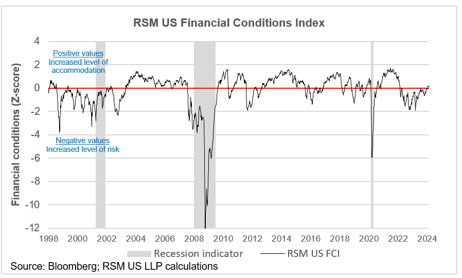

## Table of Contents

## What is a bull market?

A bull market is a time when the prices of stocks and other investments are going up. It's called a bull market because it's like a bull charging ahead, pushing prices higher. During a bull market, people feel good about the economy and are more likely to buy stocks, which helps keep the prices going up. This positive feeling can last for months or even years.

In a bull market, companies often do well because people are spending more money. This can lead to more jobs and higher wages, which makes people feel even better about the economy. When everyone is optimistic, it can create a cycle where the market keeps growing. However, bull markets don't last forever, and eventually, they can turn into bear markets when prices start to fall.

## How is the dollar's value determined in the forex market?

The value of the dollar in the forex market is determined by how much people want to buy or sell it compared to other currencies. If more people want to buy dollars than sell them, the value of the dollar goes up. This can happen for many reasons, like if the U.S. economy is doing well or if people think the dollar is a safe place to keep their money. On the other hand, if more people want to sell dollars, its value goes down. This might happen if the U.S. economy is not doing well or if there are better investment options in other countries.

The [forex](/wiki/forex-system) market is very big and works all the time, so the value of the dollar can change a lot from one moment to the next. Many things can affect the dollar's value, like interest rates set by the Federal Reserve, economic reports, and even news events. For example, if the Federal Reserve raises interest rates, it might make the dollar more attractive to investors because they can earn more from their savings. All these factors together decide how much a dollar is worth compared to other currencies.

## What are the signs of a dollar bull market?

A dollar bull market means the dollar is getting stronger compared to other currencies. One big sign of this is when the dollar's value goes up against other major currencies like the euro or the yen. This can happen if people think the U.S. economy is doing well or if the Federal Reserve raises interest rates, making the dollar a good place to keep money. Another sign is when more people and businesses want to buy dollars because they see it as a safe and stable currency, especially during times when other parts of the world are having economic problems.

You can also see a dollar bull market when U.S. stocks and bonds are doing well, attracting more foreign money into the country. This extra demand for dollars can push its value up. Another thing to watch is how much people are talking about the dollar in the news and on financial websites. If everyone is saying the dollar is strong and likely to keep getting stronger, it's a good sign that a bull market is happening. All these signs together show that the dollar is in a bull market, meaning its value is likely to keep going up for a while.

## What causes a bull market in the dollar?

A bull market in the dollar happens when more people want to buy dollars than sell them. This can start because the U.S. economy is doing well. When businesses are making more money and people have jobs, it makes the dollar look strong. Also, if the Federal Reserve raises interest rates, it can make the dollar more attractive. People from other countries might want to keep their money in dollars to get a better return on their savings. All these things together can make the demand for dollars go up, pushing its value higher.

Another reason for a dollar bull market is when other parts of the world are having economic problems. During these times, people might see the dollar as a safe place to keep their money. If other countries' currencies are losing value or their economies are not doing well, more people will want to buy dollars. This extra demand can help start and keep a bull market going. So, both good news about the U.S. economy and bad news about other economies can cause the dollar to enter a bull market.

## How does a strong dollar affect the U.S. economy?

A strong dollar can be good and bad for the U.S. economy. When the dollar is strong, it means it can buy more of other countries' money. This makes things cheaper for Americans when they travel or buy things from other countries. It also makes the U.S. a good place for people from other countries to invest their money. They can get more dollars for their money, which they can then use to buy American stocks or real estate.

However, a strong dollar can also hurt some parts of the U.S. economy. It can make it harder for American companies to sell their products in other countries because their prices go up when paid in other currencies. This can lead to fewer sales and might cause companies to lay off workers or cut back on new projects. So, while a strong dollar can make some things better for the U.S., it can also create problems for businesses that depend on selling things abroad.

## What are the implications of a dollar bull market for international trade?

A dollar bull market, where the dollar gets stronger, can change how countries trade with each other. When the dollar is strong, American things cost more for people in other countries. This means that other countries might buy less from the U.S. because it's too expensive. At the same time, things from other countries become cheaper for Americans. So, Americans might buy more from other places, which can make the U.S. import more and export less.

This change can hurt American companies that sell a lot to other countries. They might have to lower their prices or sell less, which can mean fewer jobs and less money coming into the U.S. On the other hand, it's good for American companies that need to buy things from other countries. They can get materials and products cheaper, which can help them make more money. So, a strong dollar has both good and bad effects on international trade, depending on whether a company is selling to or buying from other countries.

## How do interest rates influence the dollar's strength?

Interest rates set by the Federal Reserve can make the dollar stronger or weaker. When the Federal Reserve raises interest rates, it means people can earn more money by keeping their savings in dollars. This makes the dollar more attractive to people from other countries. They want to buy dollars so they can save or invest in the U.S. and get a better return on their money. More people wanting to buy dollars makes the dollar's value go up compared to other currencies.

On the other hand, when the Federal Reserve lowers interest rates, it can make the dollar weaker. Lower interest rates mean people earn less from their savings in dollars. This makes the dollar less attractive to people from other countries. They might decide to take their money out of the U.S. and put it in countries where they can earn more. When more people want to sell dollars, the dollar's value goes down compared to other currencies. So, the Federal Reserve's decisions on interest rates can have a big effect on how strong the dollar is.

## What role do economic indicators play in predicting a dollar bull market?

Economic indicators help people guess if the dollar will get stronger. Things like the unemployment rate, inflation, and how fast the economy is growing can tell us a lot. If the unemployment rate is low and the economy is growing fast, it usually means the U.S. is doing well. This can make people want to buy dollars because they think it's a good and safe place to keep their money. Also, if inflation is under control, it can make the dollar more attractive because people's money keeps its value better.

Another important indicator is interest rates set by the Federal Reserve. If the Federal Reserve raises interest rates, it can make the dollar stronger because people can earn more from their savings in dollars. This can attract more money from other countries into the U.S. On the other hand, if the economy is not doing well or if there are signs of trouble, like high inflation or a slowing economy, it might make people less interested in the dollar. So, by looking at these economic indicators, people can try to predict if the dollar will enter a bull market where its value goes up.

## How do global economic conditions impact the dollar's bull market?

Global economic conditions can have a big effect on whether the dollar goes into a bull market. If other countries are having a hard time with their economies, people might think the U.S. dollar is a safe place to keep their money. This can make more people want to buy dollars, pushing its value up. For example, if there's a crisis in Europe or Asia, investors might move their money to the U.S. because they think it's more stable. This extra demand for dollars can help start a bull market.

On the other hand, if other countries are doing really well, it might make the dollar less attractive. When other economies are growing fast and their currencies are getting stronger, people might want to invest their money there instead of in the U.S. This can make fewer people want to buy dollars, which can keep the dollar from going into a bull market. So, the health of the global economy plays a big role in whether the dollar will get stronger or not.

## What are the strategies investors use during a dollar bull market?

During a dollar bull market, investors often look for ways to take advantage of the dollar getting stronger. One common strategy is to invest in U.S. assets like stocks and bonds. When the dollar is strong, it can attract more money from other countries into the U.S., which can help these investments grow. Another strategy is to buy currencies that are likely to get weaker compared to the dollar. This can make money when those currencies lose value against the dollar.

Another approach is to focus on companies that do well when the dollar is strong. For example, companies that make most of their money in the U.S. and don't rely a lot on selling things to other countries can benefit. On the other hand, investors might avoid or sell stocks in companies that earn a lot from exports because their products become more expensive for foreign buyers when the dollar is strong. By choosing the right investments, investors can try to make the most of a dollar bull market.

## How can businesses hedge against the risks of a strong dollar?

Businesses can hedge against the risks of a strong dollar by using something called currency hedging. This means they can buy financial products that protect them if the dollar gets too strong. For example, if a business sells a lot of things to other countries, they can use a tool called a forward contract. This lets them agree on a price for their products in another currency now, even if they will get paid later. So, if the dollar gets stronger, they won't lose as much money because they already set the price.

Another way businesses can protect themselves is by diversifying where they sell their products. If a business only sells in the U.S., a strong dollar might not hurt them as much. But if they sell a lot to other countries, they might want to start selling more in the U.S. or find new places to sell that aren't affected as much by the dollar's strength. This can help balance out the risk and make sure they don't lose too much money if the dollar keeps getting stronger.

## What are the long-term implications of sustained dollar strength on global financial markets?

A strong dollar over a long time can change how the whole world does business and invests. When the dollar is strong, things made in the U.S. cost more for people in other countries. This can make other countries buy less from the U.S., which might hurt American companies that sell a lot overseas. At the same time, it makes things from other countries cheaper for Americans. So, the U.S. might buy more from other places, which can change how much money is moving around the world. This can also make other countries' currencies weaker compared to the dollar, which can cause problems in their economies.

In the world of investing, a strong dollar can make U.S. stocks and bonds more attractive to people from other countries. They might want to put their money in the U.S. because they can get more dollars for their money. This can push up the prices of U.S. investments. But it can also mean less money going into other countries' markets, which might make their stock markets go down. So, a strong dollar can shake up global financial markets, making some places do better while others struggle.

## References & Further Reading

[1]: Bergstra, J., Bardenet, R., Bengio, Y., & Kégl, B. (2011). ["Algorithms for Hyper-Parameter Optimization."](https://dl.acm.org/doi/10.5555/2986459.2986743) Advances in Neural Information Processing Systems 24.

[2]: ["Advances in Financial Machine Learning"](https://www.amazon.com/Advances-Financial-Machine-Learning-Marcos/dp/1119482089) by Marcos Lopez de Prado

[3]: ["Evidence-Based Technical Analysis: Applying the Scientific Method and Statistical Inference to Trading Signals"](https://www.amazon.com/Evidence-Based-Technical-Analysis-Scientific-Statistical/dp/0470008741) by David Aronson

[4]: ["Machine Learning for Algorithmic Trading"](https://github.com/stefan-jansen/machine-learning-for-trading) by Stefan Jansen

[5]: ["Quantitative Trading: How to Build Your Own Algorithmic Trading Business"](https://www.amazon.com/Quantitative-Trading-Build-Algorithmic-Business/dp/1119800064) by Ernest P. Chan