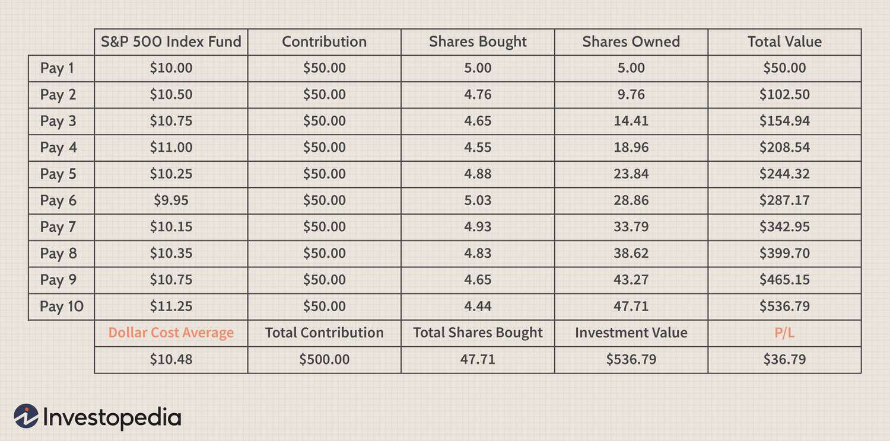

Investing in financial markets can be challenging due to the unpredictable nature of market movements. Market volatility is a common concern for investors, as prices can fluctuate widely based on varying economic, political, and global events. The dollar-cost averaging (DCA) strategy offers a systematic method for those seeking a structured approach to navigate this volatility. DCA involves investing a fixed dollar amount into a particular asset at consistent, regular intervals, regardless of its price at the time of purchase. This strategy minimizes the influence of timing on investment decisions, smoothing out the effects of market fluctuations and reducing the risk associated with attempting to 'time' the market.

By adhering to a set schedule of investing, DCA introduces discipline into investing practices. It encourages a routine that not only mitigates the impulse to react emotionally to market swings but also fosters regular wealth accumulation over time. This disciplined approach allows for purchasing more shares when prices are lower and fewer when prices are higher, ultimately leading to a lower average cost per share over the long term. 

In this article, we will explore the DCA strategy, helping investors understand its benefits and how it can be integrated with algorithmic trading to enhance investment outcomes further. Algorithmic trading, which automates and optimizes investment decisions through pre-set algorithms, can provide increased efficiency when applying the DCA strategy. Through this integration, investors can manage their portfolios more dynamically, adapting to market changes while maintaining consistent investment practices.

Understanding DCA and its potential will equip investors with a reliable tool for managing their portfolios effectively. By studying this strategy, investors can gain insights into how DCA not only offers a prudent method for dealing with the unpredictable nature of financial markets but also serves as a foundation for achieving long-term financial goals.

## Table of Contents

## What is Dollar-Cost Averaging?

Dollar-cost averaging (DCA) is an investment strategy that divides the total amount intended for investment into smaller, equal-sized purchases spread out over regular intervals. This systematic approach involves allocating a fixed dollar amount at regular intervals—be it weekly, monthly, or quarterly—to invest in a particular asset, regardless of its current market price.

The core objective of DCA is to mitigate the impact of market volatility on the investment. By investing consistently over time, the cost of obtaining the asset is averaged, as opposed to potentially risking a single large investment during a market peak. This process inherently counters the pitfalls of trying to time the market. During periods when asset prices drop, a fixed investment amount will purchase more shares, while during periods of rising prices, fewer shares will be acquired. This effect can be articulated mathematically as follows:

$$
\text{Average Cost} = \frac{\sum (\text{Investment Amount per Interval})}{\sum (\text{Units Purchased per Interval})}
$$

DCA offers a disciplined investment approach, often referred to as the constant dollar plan, capturing the essence of stability and consistency inherent in the strategy. The approach requires little speculation, making it particularly valuable for investors looking to minimize the influence of emotions on investment decisions, such as fear and greed, which often lead to poor timing in investment activities.

By adhering to a fixed schedule and sticking to a predetermined amount of money to invest, DCA provides a systematic method to accumulate wealth over time and navigate through the market's inherent ups and downs effectively. Through this steady, methodical process, investors can effectively build a position in a target asset class, influenced less by short-term market fluctuations and more by long-term investment goals.

## How Does Dollar-Cost Averaging Work?

Dollar-cost averaging (DCA) functions by systematizing the investment process through regular, recurring purchases of a selected financial asset. This strategy involves an investor identifying a specific asset or security, followed by the allocation of a predetermined fixed amount to invest at consistent intervals, such as monthly or quarterly. This methodical approach is exemplified in retirement savings mechanisms, like 401(k) plans, where contributions are seamlessly and frequently deducted from an individual's paycheck.

The DCA method offers versatility, as it can be applied across a broad spectrum of investment vehicles, including mutual funds, index funds, and Exchange-Traded Funds (ETFs). This inclusivity affords investors the opportunity to compile a diversified portfolio, aligning with varied financial goals and risk appetites. Consistent investment through DCA enables investors to average out their investment costs over time. This practice mitigates the impact of market [volatility](/wiki/volatility-trading-strategies) by allowing investors to procure more shares when asset prices are low and fewer shares when prices rise. 

Furthermore, by adhering to a fixed investment schedule, investors can eliminate emotional biases or impulsive reactions to market conditions. This automated approach promotes a steady accumulation of investments, reducing the stress associated with attempting to time the market, and offering a buffer against the erratic nature of market swings. Thus, DCA is a practical strategy for investors aiming to build wealth gradually while smoothing their exposure to market fluctuations.

## Benefits of Dollar-Cost Averaging

Dollar-cost averaging (DCA) offers substantial benefits to investors by creating a structured and disciplined approach, thereby reducing various investing risks. One of the primary advantages of DCA is its ability to reduce timing risk, effectively negating the necessity for investors to time their investments perfectly. By investing a fixed amount at regular intervals, investors are less likely to make large investments at market peaks, which can be costly if followed by a downturn. This systematic investment approach smoothens out the effects of market volatility, making the investing process less susceptible to market fluctuations.

Moreover, dollar-cost averaging encourages an investing discipline, fostering consistent contributions towards investment goals irrespective of market conditions. This disciplined approach is beneficial in cultivating long-term financial habits, where the regularity of investments takes precedence over the unpredictability of short-term market movements. This inherent discipline is crucial for many investors who might otherwise fall prey to irregular investment patterns influenced by transient market trends.

DCA also mitigates the influence of emotional decision-making on investment choices. Regularity in investments can reduce the psychological influences of fear and greed, which often lead to impulsive investing behaviors. By adhering to a predefined investment schedule, the emotional sway of significant market swings is diminished, promoting rational investment decisions. This is critical in maintaining focus on long-term financial objectives without being derailed by short-term market anomalies.

In terms of wealth building, DCA is an effective strategy for facilitating long-term accumulation of wealth. The regular investments made through DCA contribute to compounding growth over time, which is a fundamental principle in wealth accumulation. With DCA, the compounding effect is maximized as incremental returns are reinvested systematically, contributing to exponential growth of the investment portfolio.

Additionally, dollar-cost averaging accommodates varying market conditions by taking advantage of price discrepancies over time. When prices are low, the fixed investment amount purchases more shares, whereas fewer shares are acquired when prices are high. This automatic adjustment ensures that the average cost per share is optimized, ultimately leading to potential cost savings. This adaptability to market conditions allows investors to build a robust investment portfolio that aligns with long-term financial objectives regardless of short-term market cycles.

## Integrating Dollar-Cost Averaging with Algorithmic Trading

Algorithmic trading employs complex computer algorithms to automate and optimize trading processes, offering significant advantages when integrated with strategies like dollar-cost averaging (DCA). By leveraging [algorithmic trading](/wiki/algorithmic-trading), investors can enhance the precision and efficiency of DCA investments.

### Automating DCA with Algorithmic Trading

Utilizing algorithms allows investors to automate the key elements of the DCA strategy: timing, calculation, and execution. This automation removes the manual oversight typically required when implementing DCA, ensuring consistent investment practices are maintained. For example, investors can program algorithms to initiate investments on a fixed schedule, whether daily, weekly, or monthly, accurately reflecting the DCA principle of investing a fixed sum at regular intervals.

### Dynamic Portfolio Management

Automation through algorithms enables dynamic portfolio management, allowing investors to adapt to changing market conditions without deviating from the DCA strategy. Algorithms can analyze market data and adjust the frequency or timing of investments to optimize cost efficiency while maintaining the disciplined approach of DCA. This capacity to adjust in real-time empowers investors to respond to market volatility and align their investments with DCA objectives.

### Optimizing Transaction Costs

One of the potential challenges of DCA is the accrual of transaction costs due to frequent, smaller investments. Algorithms can mitigate this issue by optimizing the execution of trades. By using sophisticated trading techniques, such as order splitting and optimal execution strategies, algorithmic solutions can minimize transaction costs and enhance overall returns. Algorithms can evaluate multiple trading venues and times to execute trades at the most cost-effective rates.

### Ensuring Timely Execution

Algorithmic trading ensures precise execution of trades at desired intervals, a fundamental aspect of the DCA strategy. Algorithms can be programmed to execute orders at predetermined times or in response to specific market conditions, ensuring that DCA investments occur exactly as intended. This eliminates the risk of human error and enhances the reliability of the investment strategy.

By integrating DCA with algorithmic trading, investors can leverage the strengths of both approaches. Algorithms provide the necessary tools to automate and optimize DCA, ensuring disciplined, cost-effective, and timely investments. This integration allows for a more sophisticated investment strategy, potentially improving overall investment outcomes while maintaining the core principles of dollar-cost averaging.

## Considerations and Risks

Dollar-cost averaging (DCA) is a popular investment strategy, but it is not without its considerations and risks. One major consideration is the market conditions. In steadily rising markets, DCA might underperform compared to lump-sum investments. This is because investing a large sum at the beginning of a rising market will benefit more from the growth compared to periodic investments that buy fewer shares as prices increase. Conversely, in a steadily declining market, DCA can result in purchasing assets that continue to lose value, whereas a lump-sum investment made after prices have dropped might buy more shares at a lower cost.

Another important consideration is the potential for higher transaction costs. Regular, smaller investments mean more frequent trading, which can accumulate substantial transaction fees over time. Investors should evaluate whether the additional costs of frequent trades offset the benefits of DCA, especially in brokerage environments where trading costs are non-negligible.

DCA does not shield investors from the inherent risks of overall market declines. A comprehensive strategy incorporates market research and diversification to manage risk. While DCA smooths the cost of investment over time, it does not protect against significant market downturns that affect the entire portfolio. Hence, investors should complement DCA with other strategies, such as diversification across different asset classes, to mitigate risk.

In practice, understanding the transaction costs and fees associated with frequent trading is essential before adopting DCA. For instance, investors might use a formula like:

$$
\text{Total Cost} = \sum_{i=1}^{n} (\text{Investment Amount} + \text{Transaction Fee})
$$

where $n$ represents the number of transactions.

Finally, a thorough understanding of the asset and market conditions is crucial to optimizing DCA strategies. Investors should consider the historical performance, volatility, and current market trends of their chosen assets. This knowledge helps in determining whether DCA aligns with their financial goals and risk tolerance. Thus, while DCA offers a structured approach to investment, these factors should be carefully weighed to ensure its practicality and effectiveness in any given market scenario.

## Conclusion

Dollar-cost averaging (DCA) stands out as a prudent strategy for investors aiming for a disciplined and long-term investment approach. By systematically investing a fixed amount at regular intervals, DCA effectively counters the unpredictability of market fluctuations and the potential pitfalls of emotional decision-making. This consistent investing method allows investors to navigate market volatility, thus fostering rational and consistent investment choices over time.

The integration of DCA with algorithmic trading augments its efficacy by automating and optimizing the timing and execution of investments. Algorithmic systems provide precise execution, ensuring that investments are made in alignment with predetermined intervals, while also managing transaction costs efficiently. This automation not only saves time but also ensures a disciplined adherence to the DCA strategy, irrespective of market conditions.

Despite its many advantages, DCA is not universally suited for all investment scenarios. Investors must consider their specific financial goals and current market conditions when deciding to employ DCA. For instance, in a steady rising or falling market, a lump-sum investment might outperform a DCA strategy. Therefore, a careful assessment of one's financial position, market insight, and investment horizon is crucial before implementing DCA.

In conclusion, leveraging the strengths of dollar-cost averaging can serve as a powerful tool in constructing and managing a robust investment portfolio. When properly aligned with individual investment goals and fortified with algorithmic trading solutions, DCA offers resilience against market volatility, leading to potentially favorable long-term wealth accumulation.

## References & Further Reading

[1]: ["The Intelligent Investor: The Definitive Book on Value Investing"](https://www.amazon.com/Intelligent-Investor-3rd-Ed/dp/0063356724) by Benjamin Graham

[2]: Samuelson, P. A. (1963). "Proof that Properly Anticipated Prices Fluctuate Randomly". Industrial Management Review, 6(2).

[3]: ["A Random Walk Down Wall Street: The Time-Tested Strategy for Successful Investing"](https://yourknowledgedigest.org/wp-content/uploads/2020/04/a-random-walk-down-wall-street.pdf) by Burton G. Malkiel

[4]: Balch, T., Boehmke, B., Laplante, P., & Lopez de Prado, M. (2020). ["Machine Learning and Data Science Blueprints for Finance"](https://www.taylorfrancis.com/books/mono/10.1201/9780367816377/hands-machine-learning-brad-boehmke-brandon-greenwell)

[5]: Farrell, C. (1993). "The Low-Load Mutual Fund Advantage". John Wiley & Sons.

[6]: Perold, A. F., & Sharpe, W. F. (1988). "Dynamic Strategies for Asset Allocation". Financial Analysts Journal, 44(1), 16-27.