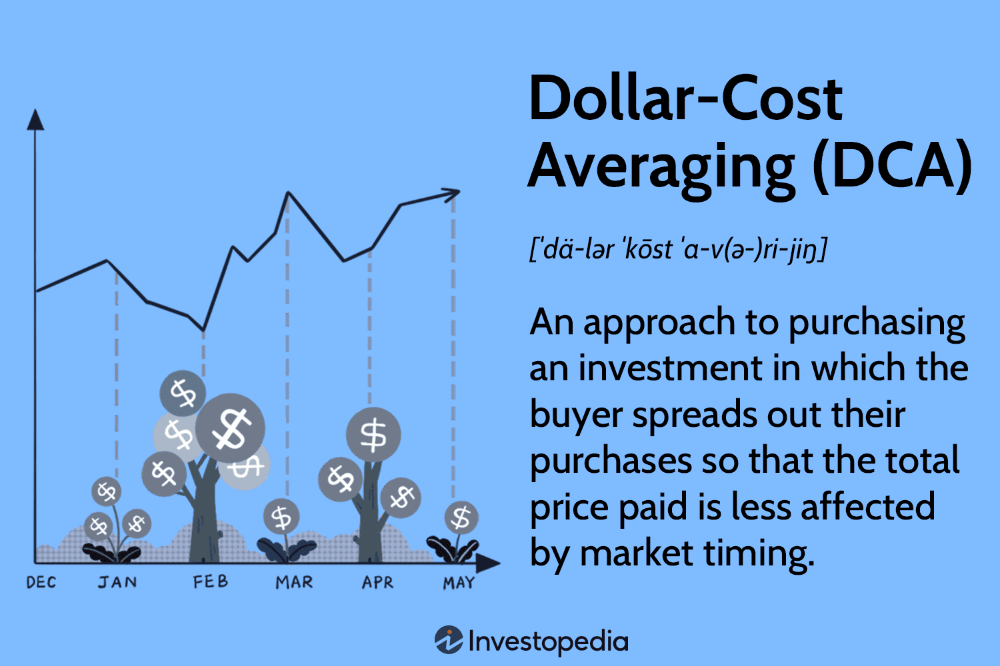

## Table of Contents

## What is dollar-cost averaging?

Dollar-cost averaging is a way to invest money over time instead of all at once. You put the same amount of money into an investment, like a stock or a fund, at regular times, like every month. This means you buy more shares when prices are low and fewer shares when prices are high. It helps reduce the risk of investing all your money when prices are at their highest.

This method is good for people who want to invest but don't want to worry about timing the market. It can help smooth out the ups and downs of the market because you're spreading out your investments. Over time, this can lead to a lower average cost per share and potentially better long-term results.

## How does dollar-cost averaging work?

Dollar-cost averaging works by spreading out your investments over time. Instead of putting all your money into an investment at once, you invest a fixed amount of money at regular intervals, like every month or every quarter. For example, if you decide to invest $100 every month, you'll buy shares of a stock or a fund with that $100 each month, no matter what the price is at that time.

This method helps you avoid the risk of investing all your money when the price is high. When the price is low, your $100 will buy more shares, and when the price is high, it will buy fewer shares. Over time, this averages out the cost of your investment. By doing this, you end up paying a lower average price per share than if you had invested all your money at one time. It's a simple way to invest without worrying about timing the market perfectly.

## What are the benefits of using dollar-cost averaging?

Dollar-cost averaging has several benefits. One big benefit is that it helps reduce the risk of investing all your money at a bad time. When you invest a fixed amount of money regularly, you buy more shares when prices are low and fewer shares when prices are high. This can lead to a lower average cost per share over time. It means you don't have to worry about trying to guess the best time to invest, which can be hard to do.

Another benefit is that dollar-cost averaging makes investing easier and less stressful. Instead of trying to figure out the perfect moment to put all your money into the market, you can set up a regular investment plan. This can help you stay disciplined and keep investing, even when the market goes up and down. Over the long term, this can lead to better results because you're consistently adding to your investment, no matter what the market is doing.

## Can you provide a simple example of dollar-cost averaging?

Let's say you want to invest $1200 in a stock, but instead of putting all that money in at once, you decide to use dollar-cost averaging. You choose to invest $100 every month for a year. In the first month, the stock price is $10 per share, so your $100 buys you 10 shares. In the second month, the stock price goes up to $20 per share, so your $100 only buys you 5 shares. 

By the end of the year, you've invested $100 each month and bought shares at different prices. Sometimes the price was low, and you bought more shares, and sometimes it was high, and you bought fewer. At the end of the year, you've spent your $1200, but because you bought shares at different prices, your average cost per share is lower than if you had bought all the shares at once when the price was high. This helps you save money and reduce the risk of investing at the wrong time.

## How does dollar-cost averaging help reduce the impact of volatility?

Dollar-cost averaging helps reduce the impact of [volatility](/wiki/volatility-trading-strategies) by spreading out your investments over time. When the market goes up and down, you're not putting all your money in at one time. Instead, you invest a little bit each month or each quarter. This means that when the price is low, your fixed amount of money buys more shares, and when the price is high, it buys fewer shares. Over time, this averages out the cost of your investment, so you're not as affected by big swings in the market.

By investing regularly, you're not trying to guess when the market will be at its highest or lowest. This takes away the stress of trying to time the market perfectly. Instead, you're slowly building up your investment, no matter what the market is doing. This steady approach can help you feel more confident and less worried about sudden changes in the market. Over the long run, it can lead to better results because you're consistently adding to your investment, smoothing out the ups and downs.

## What are the potential drawbacks of dollar-cost averaging?

One potential drawback of dollar-cost averaging is that it might not be the best strategy if the market keeps going up. If you put all your money in at once when the market is low, you could make more money than if you spread it out over time. By investing a little bit each month, you might miss out on some gains if the market rises quickly.

Another issue is that dollar-cost averaging can involve more fees. If you're buying investments regularly, you might have to pay transaction fees each time. These fees can add up over time and eat into your returns. It's important to check the fees and see if they make dollar-cost averaging less worthwhile for you.

## How often should investments be made when using dollar-cost averaging?

When using dollar-cost averaging, you can choose how often to make your investments based on what works best for you. Some people like to invest every month because it's easy to set up automatic payments from their bank account. This way, they don't have to think about it much and can keep investing without any hassle. Others might choose to invest every quarter, which means they put money in every three months. This can be a good choice if you get paid less often or if you want to spread out your investments a bit more.

The important thing is to pick a schedule that you can stick to and that fits with your financial situation. Whether you choose to invest weekly, monthly, or quarterly, the key is to be consistent. By putting money into your investments regularly, you can take advantage of the ups and downs of the market and help reduce the risk of investing all your money at the wrong time.

## Is dollar-cost averaging suitable for all types of investments?

Dollar-cost averaging can work well with many types of investments, like stocks, mutual funds, and exchange-traded funds (ETFs). These types of investments often go up and down in price, so putting money in regularly can help you buy more when prices are low and less when prices are high. This can be especially useful for people who want to invest in the stock market but don't want to worry about trying to guess the best time to buy.

However, dollar-cost averaging might not be the best choice for all investments. For example, if you're investing in something that doesn't change in price much, like a savings account or a bond with a fixed [interest rate](/wiki/interest-rate-trading-strategies), dollar-cost averaging won't give you the same benefits. Also, if you're investing in something that you think will go up a lot very quickly, it might be better to put all your money in at once instead of spreading it out over time.

## How does dollar-cost averaging compare to lump-sum investing?

Dollar-cost averaging and lump-sum investing are two different ways to put your money into investments. With dollar-cost averaging, you invest a little bit of money at regular times, like every month. This means you buy more shares when prices are low and fewer when prices are high. It helps you avoid the risk of putting all your money in when the price is at its highest. It's a good choice if you want to invest without worrying about timing the market perfectly.

Lump-sum investing, on the other hand, means you put all your money into an investment at one time. This can be a good choice if you think the market will go up soon after you invest. If you're right, you could make more money than if you spread your investments out over time. But if the market goes down right after you invest, you could lose more money than if you had used dollar-cost averaging. It's a bit riskier, but it can pay off if the timing is right.

Choosing between dollar-cost averaging and lump-sum investing depends on your comfort with risk and your view of the market. Dollar-cost averaging is safer and helps you avoid big losses if the market drops right after you start investing. Lump-sum investing can be better if you believe the market will rise quickly. Both methods have their pros and cons, so it's important to think about what fits best with your financial goals and how much risk you're willing to take.

## What are some advanced strategies for optimizing dollar-cost averaging?

One advanced strategy for optimizing dollar-cost averaging is to adjust the amount you invest based on market conditions. Instead of putting in the same amount every time, you could invest more when the market is down and less when it's up. This way, you take advantage of lower prices more aggressively. For example, if you usually invest $100 a month, you might decide to invest $150 when the market drops a lot. This can help you buy more shares at lower prices and potentially increase your returns over time.

Another strategy is to use dollar-cost averaging with different types of investments. Instead of just investing in one stock or fund, you could spread your money across several different investments. This is called diversification, and it can help reduce your risk even more. For example, you might invest in a mix of stocks, bonds, and real estate funds. By doing this, you're not only spreading out your investments over time but also across different types of assets. This can help smooth out the ups and downs of the market and lead to more stable returns in the long run.

## How can dollar-cost averaging be integrated into a broader investment strategy?

Dollar-cost averaging can be a key part of a bigger investment plan. It's a way to put money into investments slowly over time, which can help you avoid the risk of putting all your money in when prices are high. You can use dollar-cost averaging with other strategies, like diversification, where you spread your money across different types of investments. This means you're not just investing in one stock or fund, but maybe a mix of stocks, bonds, and other things. By doing this, you're not only spreading out your investments over time but also across different kinds of assets, which can help make your overall investment plan more stable and less risky.

Another way to use dollar-cost averaging in a bigger plan is to adjust how much you invest based on what's happening in the market. Instead of always putting in the same amount, you could invest more when prices are low and less when they're high. This can help you buy more shares when they're cheaper, which might lead to better returns over time. By combining dollar-cost averaging with other smart investment moves, you can build a strong plan that helps you reach your financial goals while keeping your risks under control.

## What are the tax implications of using dollar-cost averaging?

When you use dollar-cost averaging, the tax rules can be a bit different from if you put all your money in at once. Every time you buy shares, you're making a new investment. If you sell those shares later, you might have to pay taxes on any profit you make. The tax you pay depends on how long you held the shares before selling them. If you hold them for more than a year, you might pay a lower tax rate on your profit, which is called a long-term capital gain. If you hold them for less than a year, you'll pay a higher tax rate, known as a short-term capital gain.

Another thing to think about is if you're investing in something that gives you dividends, like some stocks or funds. These dividends can be taxed too, but the tax rate might be different from the tax on your profits when you sell. Some dividends are taxed at a lower rate, called qualified dividends, while others are taxed at your normal income tax rate. When you use dollar-cost averaging, you might get dividends at different times, so it's good to keep track of them to know what you owe in taxes. Talking to a tax advisor can help you understand how dollar-cost averaging fits into your overall tax situation.

## What is Dollar-Cost Averaging?

Dollar-cost averaging (DCA) is an investment strategy that divides the total amount intended for investment into smaller, equal-sized purchases spread out over regular intervals. This systematic approach involves allocating a fixed dollar amount at regular intervals—be it weekly, monthly, or quarterly—to invest in a particular asset, regardless of its current market price.

The core objective of DCA is to mitigate the impact of market volatility on the investment. By investing consistently over time, the cost of obtaining the asset is averaged, as opposed to potentially risking a single large investment during a market peak. This process inherently counters the pitfalls of trying to time the market. During periods when asset prices drop, a fixed investment amount will purchase more shares, while during periods of rising prices, fewer shares will be acquired. This effect can be articulated mathematically as follows:

$$
\text{Average Cost} = \frac{\sum (\text{Investment Amount per Interval})}{\sum (\text{Units Purchased per Interval})}
$$

DCA offers a disciplined investment approach, often referred to as the constant dollar plan, capturing the essence of stability and consistency inherent in the strategy. The approach requires little speculation, making it particularly valuable for investors looking to minimize the influence of emotions on investment decisions, such as fear and greed, which often lead to poor timing in investment activities.

By adhering to a fixed schedule and sticking to a predetermined amount of money to invest, DCA provides a systematic method to accumulate wealth over time and navigate through the market's inherent ups and downs effectively. Through this steady, methodical process, investors can effectively build a position in a target asset class, influenced less by short-term market fluctuations and more by long-term investment goals.

## What are the considerations and risks?

Dollar-cost averaging (DCA) is a popular investment strategy, but it is not without its considerations and risks. One major consideration is the market conditions. In steadily rising markets, DCA might underperform compared to lump-sum investments. This is because investing a large sum at the beginning of a rising market will benefit more from the growth compared to periodic investments that buy fewer shares as prices increase. Conversely, in a steadily declining market, DCA can result in purchasing assets that continue to lose value, whereas a lump-sum investment made after prices have dropped might buy more shares at a lower cost.

Another important consideration is the potential for higher transaction costs. Regular, smaller investments mean more frequent trading, which can accumulate substantial transaction fees over time. Investors should evaluate whether the additional costs of frequent trades offset the benefits of DCA, especially in brokerage environments where trading costs are non-negligible.

DCA does not shield investors from the inherent risks of overall market declines. A comprehensive strategy incorporates market research and diversification to manage risk. While DCA smooths the cost of investment over time, it does not protect against significant market downturns that affect the entire portfolio. Hence, investors should complement DCA with other strategies, such as diversification across different asset classes, to mitigate risk.

In practice, understanding the transaction costs and fees associated with frequent trading is essential before adopting DCA. For instance, investors might use a formula like:

$$
\text{Total Cost} = \sum_{i=1}^{n} (\text{Investment Amount} + \text{Transaction Fee})
$$

where $n$ represents the number of transactions.

Finally, a thorough understanding of the asset and market conditions is crucial to optimizing DCA strategies. Investors should consider the historical performance, volatility, and current market trends of their chosen assets. This knowledge helps in determining whether DCA aligns with their financial goals and risk tolerance. Thus, while DCA offers a structured approach to investment, these factors should be carefully weighed to ensure its practicality and effectiveness in any given market scenario.

## References & Further Reading

[1]: ["The Intelligent Investor: The Definitive Book on Value Investing"](https://www.amazon.com/Intelligent-Investor-3rd-Ed/dp/0063356724) by Benjamin Graham

[2]: Samuelson, P. A. (1963). "Proof that Properly Anticipated Prices Fluctuate Randomly". Industrial Management Review, 6(2).

[3]: ["A Random Walk Down Wall Street: The Time-Tested Strategy for Successful Investing"](https://yourknowledgedigest.org/wp-content/uploads/2020/04/a-random-walk-down-wall-street.pdf) by Burton G. Malkiel

[4]: Balch, T., Boehmke, B., Laplante, P., & Lopez de Prado, M. (2020). ["Machine Learning and Data Science Blueprints for Finance"](https://www.taylorfrancis.com/books/mono/10.1201/9780367816377/hands-machine-learning-brad-boehmke-brandon-greenwell)

[5]: Farrell, C. (1993). "The Low-Load Mutual Fund Advantage". John Wiley & Sons.

[6]: Perold, A. F., & Sharpe, W. F. (1988). "Dynamic Strategies for Asset Allocation". Financial Analysts Journal, 44(1), 16-27.