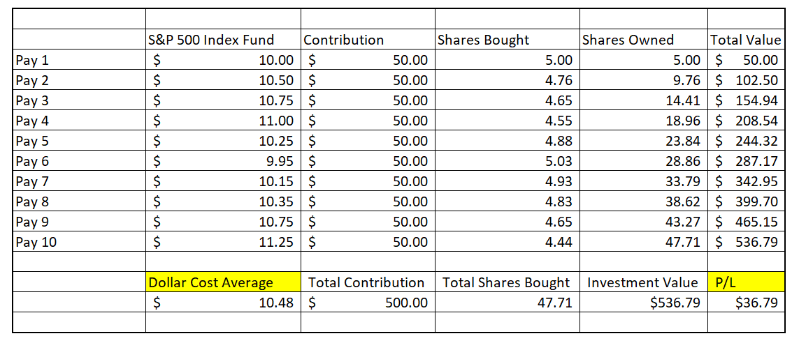

The modern investment landscape has evolved considerably, providing investors with a plethora of strategies to manage their portfolios effectively. Among these, Exchange-Traded Funds (ETFs), dollar-cost averaging (DCA), and algorithmic trading stand out as potent tools in an investor's toolkit. ETFs, with their diversification benefits, offer a flexible and cost-efficient way to gain exposure to various asset classes. Dollar-cost averaging, a disciplined investment strategy, mitigates the risks of market timing and reduces the emotional impact on investment decisions by investing a fixed amount at regular intervals. Algorithmic trading, harnessing the power of technology, employs sophisticated algorithms to enhance trading efficiency and execution.

The synergy between these strategies can significantly amplify an investor's potential to achieve favorable outcomes. By integrating the systematic approach of DCA with the diverse nature of ETFs, investors can minimize risks and stabilize returns over time. Additionally, the incorporation of algorithmic trading introduces a level of precision and discipline that enhances the effectiveness of these strategies, allowing for optimized decision-making and execution in volatile markets.



This article will explore how combining these strategies can lead to a more robust investment framework, optimizing the potential for both novice and seasoned investors to achieve their financial objectives.

## Table of Contents

## Understanding Dollar-Cost Averaging

Dollar-cost averaging (DCA) is a well-known investment strategy employed by individuals seeking to minimize the impact of volatility on large purchases of financial assets. This strategy entails regularly investing a fixed dollar amount in a particular asset, irrespective of its price. By spreading out the purchase, investors potentially reduce the risk of making a substantial investment at an inopportune time.

The primary advantage of DCA lies in its ability to mitigate market timing risk. Rather than attempting to time the market—a notoriously challenging task even for seasoned investors—DCA offers a more disciplined approach, smoothing out the effects of market fluctuations over time. This consistent investment process serves to alleviate emotion-driven financial decisions, which can often lead to counterproductive actions such as panic selling during downturns or impulsively buying during peaks.

When applied to Exchange-Traded Funds (ETFs), DCA maximizes the benefits of diversification inherent in ETFs while allowing for gradual accumulation of assets. ETFs, known for their liquidity and diverse holdings across various market sectors, are particularly suited for DCA as they provide a cost-effective way to gain broad market exposure with lower fees compared to mutual funds.

For smaller investors or those new to investing, DCA offers an accessible entry point. It allows individuals to start investing with minimal capital, steadily building their portfolio over time. This approach is beneficial in fostering a long-term investment habit without the pressure of making substantial financial commitments upfront. Moreover, since ETFs generally have lower expense ratios, the cost efficiency further enhances the attractiveness of integrating DCA into investment strategies.

As a practical illustration, consider an investor who allocates $100 monthly towards a broad-market [ETF](/wiki/etf-trading-strategies). The number of ETF shares purchased each month will vary based on the ETF’s market price, which allows for acquiring more shares when prices are low and fewer shares when prices are high. Over time, DCA can result in a lower average cost per share, if the market exhibits [volatility](/wiki/volatility-trading-strategies), enhancing the potential for capital appreciation as the market trends upward.

Overall, dollar-cost averaging offers a strategic framework for investors to systematically invest in ETFs. Through its structure, DCA reduces the risks associated with market timing and emotional decision-making, benefiting both novice investors and seasoned market participants alike.

## Why ETFs are Ideal Candidates for DCA

Exchange-Traded Funds (ETFs) have emerged as a popular investment vehicle, particularly well-suited for strategies like dollar-cost averaging (DCA). Their unique characteristics, including diversification and [liquidity](/wiki/liquidity-risk-premium), provide significant advantages to investors. ETFs are investment funds traded on stock exchanges, much like stocks. They aim to track the performance of a specific index, commodity, currency, or a combination thereof.

**Diversification and Liquidity**

ETFs offer built-in diversification, as each share represents a diverse portfolio of assets. This feature can significantly reduce individual stock risk compared to holding stocks in a single company. Diversification helps mitigate the impact of volatility in any one specific investment by spreading exposure across a broader market segment. Liquidity, another key feature of ETFs, refers to their ability to be bought and sold on the stock exchange with ease, often without major price fluctuations. High liquidity ensures that an investor can swiftly adjust their portfolio in response to market changes.

**Cost-Effectiveness and Lower Expense Ratios**

ETFs are typically more cost-effective than mutual funds due to their lower expense ratios. The expense ratio represents the fund's operating expenses expressed as a percentage of assets under management. While mutual funds can have expense ratios exceeding 1%, ETFs often maintain significantly lower ratios, sometimes below 0.1%. This cost efficiency aligns well with dollar-cost averaging, enabling investors to incrementally buy more shares with the same amount of money over time without eroding returns through high fees.

**Examples of Suitable ETFs for Dollar-Cost Averaging**

ETFs can cover broad markets or be specific to sectors. Examples of broad-market ETFs include the SPDR S&P 500 ETF Trust (SPY), which tracks the S&P 500 index, providing exposure to 500 leading U.S. companies. Another is the Vanguard Total Stock Market ETF (VTI), offering access to the entire U.S. stock market, encompassing small-, mid-, and large-cap growth and value stocks.

For those interested in specific sectors, the Technology Select Sector SPDR Fund (XLK) focuses on the technology industry, while the iShares MSCI Emerging Markets ETF (EEM) targets equities from emerging markets. These sector-specific ETFs allow investors to use dollar-cost averaging to capitalize on long-term growth potential in specific areas of interest while managing risk through diversification within the sector.

In conclusion, ETFs are ideal for DCA due to their unique combination of diversification, liquidity, and low costs. By carefully choosing ETFs that align with their investment goals, investors can effectively implement a DCA strategy.

## Algorithmic Trading: An Overview

Algorithmic trading refers to the use of computer systems to execute trades in financial markets based on pre-defined criteria and strategies. By incorporating advanced mathematical models and algorithms, [algorithmic trading](/wiki/algorithmic-trading) has become a cornerstone of modern finance, facilitating faster and more efficient transactions than those executed manually. Its implementation is particularly significant in markets with high liquidity and volatility, such as [forex](/wiki/forex-system), equities, and commodities.

The primary types of algorithms used in trading strategies include statistical [arbitrage](/wiki/arbitrage), [trend following](/wiki/trend-following), and [market making](/wiki/market-making). Statistical arbitrage focuses on exploiting price discrepancies between related financial instruments. For instance, if the price of a stock and its corresponding exchange-traded fund (ETF) diverge temporarily, a [statistical arbitrage](/wiki/statistical-arbitrage) algorithm might exploit this discrepancy for profit. Trend following algorithms, on the other hand, identify and capitalize on market [momentum](/wiki/momentum) by buying assets exhibiting upward trends and selling those in a downturn. Finally, market-making algorithms provide liquidity by simultaneously placing bid and offer orders, [earning](/wiki/earning-announcement) a profit from the bid-ask spread.

Big data and [artificial intelligence](/wiki/ai-artificial-intelligence) (AI) significantly enhance the capabilities of algorithmic trading. By analyzing vast datasets quickly and accurately, AI-driven algorithms can identify complex patterns and make predictions with a higher degree of confidence. Machine learning, a subset of AI, enables trading algorithms to learn from previous market data and adapt to new conditions without being explicitly programmed. For example, a [reinforcement learning](/wiki/reinforcement-learning) algorithm might optimize a trading strategy by evaluating the outcomes of past trades to make better future decisions.

Python, a popular language for developing algorithmic trading strategies, offers robust libraries for data analysis and [machine learning](/wiki/machine-learning). For instance, the `pandas` library simplifies data manipulation, while libraries such as `scikit-learn` and `TensorFlow` provide tools for implementing machine learning models. Below is a basic example of a moving average crossover strategy using Python:

```python
import pandas as pd

def moving_average_crossover(stock_data, short_window=40, long_window=100):
    signals = pd.DataFrame(index=stock_data.index)
    signals['price'] = stock_data['price']
    signals['short_mavg'] = stock_data['price'].rolling(window=short_window, min_periods=1).mean()
    signals['long_mavg'] = stock_data['price'].rolling(window=long_window, min_periods=1).mean()
    signals['signal'] = 0.0
    signals['signal'][short_window:] = \
        [1 if signals['short_mavg'][i] > signals['long_mavg'][i] else 0 for i in range(short_window, len(signals))]
    signals['positions'] = signals['signal'].diff()

    return signals

# Example usage
# stock_data is a DataFrame with a 'price' column
# signals = moving_average_crossover(stock_data)
```

As finance continues to evolve, algorithmic trading, driven by advancements in big data and AI, plays an increasingly integral role in shaping investment strategies. It enhances the speed, accuracy, and efficiency of trading operations, helping investors manage portfolios more effectively.

## Integrating DCA with Algorithmic Trading Strategies

Integrating dollar-cost averaging (DCA) with algorithmic trading strategies involves using algorithms to automatically execute periodic investments in a financial asset. This approach offers several advantages, including reducing emotional decision-making and improving the consistency of investment strategies. Algorithms are particularly effective in automating the timing and execution of trades, allowing investors to benefit from the systematic nature of DCA without having to manually execute trades.

### The Use of Algorithms to Automate DCA

Algorithms are designed to follow pre-determined rules, making them well-suited for executing systematic investment strategies such as dollar-cost averaging. By defining the frequency, amount, and specific assets for investment, an algorithm can consistently apply DCA over time. For example, an algorithm could be written to invest a fixed amount in a chosen ETF at regular intervals, regardless of the asset's current price. This systematic approach ensures disciplined investing, avoiding the pitfalls of market timing.

The Python programming language offers various libraries like NumPy and pandas that facilitate the development of these algorithms. A basic Python script to implement DCA through algorithmic trading might look like:

```python
import numpy as np
import pandas as pd

def execute_dca(funds, price_series):
    investment_amount = funds / len(price_series)
    shares_purchased = investment_amount / price_series
    total_shares = np.sum(shares_purchased)
    average_cost = funds / total_shares
    return total_shares, average_cost

prices = pd.Series([100, 105, 110, 95, 100])  # Example price series
funds = 500  # Total funds to invest

shares, avg_cost = execute_dca(funds, prices)
print(f"Total shares purchased: {shares}, Average cost per share: {avg_cost}")
```

### Benefits of Algorithmic Trading

Algorithmic trading minimizes emotional bias by adhering strictly to the predetermined strategy, thus eliminating subjective decision-making that often leads to detrimental investment choices. Automation ensures that trades are executed precisely based on the set parameters, enhancing the efficiency and speed of the process. This precise execution is crucial in volatile markets, where human traders might react impulsively.

Moreover, algorithms can manage multiple trades and large datasets with ease. This capability extends to real-time data analysis and decision-making, allowing for optimal strategy adjustments based on evolving market conditions.

### Challenges and Considerations

Despite its benefits, integrating DCA with algorithmic trading presents several challenges. Market volatility can still affect the performance of automated strategies, and technical issues or software bugs may result in execution errors. Furthermore, the development of effective trading algorithms requires a robust understanding of programming, finance, and data analysis.

A significant consideration is the balance between automation and oversight. While algorithms are advantageous in their consistency, human intervention may still be necessary to address unexpected market conditions or to refine algorithms based on performance evaluations.

Ensuring data integrity and security is also crucial, as the reliability of algorithmic trading significantly depends on the quality and timeliness of data. Investors must also be aware of trading costs associated with frequent transactions, which could erode the benefits of DCA if not properly managed.

In conclusion, the integration of DCA with algorithmic trading can optimize investment strategies by promoting consistency and reducing biases. However, this approach requires careful consideration of potential challenges and ongoing management to ensure its effectiveness.

## Comparing ETFs for Dollar-Cost Averaging in Algorithmic Trading

When selecting Exchange-Traded Funds (ETFs) for Dollar-Cost Averaging (DCA) with algorithmic trading, several critical factors come into play, each influencing the efficiency and success of the investment strategy.

**Liquidity**  
Liquidity is a paramount consideration in selecting ETFs for algorithmic trading. High liquidity ensures that buy and sell orders can be executed swiftly without causing significant price fluctuations. This is crucial in algorithmic strategies, where timing and pricing precision impact outcomes significantly. ETFs that track major indices, like the S&P 500 (e.g., SPDR S&P 500 ETF Trust - SPY), tend to offer high liquidity due to widespread investor participation.

**Asset Management**  
The quality of asset management is another essential [factor](/wiki/factor-investing). This involves assessing the ETF provider's reputation and the fund's historical performance in tracking its benchmark index. Efficient asset management ensures that the ETF closely follows the intended market segment with minimal tracking error, enhancing the predictability and reliability of algorithmic models used in DCA.

**Diversification**  
Diversification within an ETF is vital for spreading risk across various sectors or assets, thus minimizing the impact of any single underperformer. Broad-market ETFs, such as Vanguard Total Stock Market ETF (VTI), encompass a wide array of stocks, offering extensive diversification that benefits both DCA and algorithm-driven strategies by providing a balanced risk-reward profile.

**Expense Ratios**  
The expense ratio is a critical consideration as it directly affects net returns. Lower expense ratios mean lower costs for the investor, thereby improving the profitability of systematic investing approaches like DCA. ETFs typically offer lower expense ratios than mutual funds, making them an appealing choice for cost-conscious investors employing algorithmic trading methods.

### Case Study: Successful Integration of Strategies

A practical example of effective integration can be seen in the use of ETFs like the iShares MSCI Emerging Markets ETF (EEM) in algorithmic trading platforms. By leveraging EEM's exposure to diverse emerging markets, a trading algorithm can apply DCA with automated buy schedules. Python, with its robust libraries, can be used to execute the DCA strategy. Below is a simplified script demonstrating DCA using the `pandas` and `numpy` libraries:

```python
import pandas as pd
import numpy as np

# Example price data for the ETF
price_data = pd.Series([50, 48, 47, 49, 51, 52, 50, 49, 50])

# Amount to invest at each period
investment = 100

# Calculate the number of shares purchased at each period
shares_bought = investment / price_data

# Total shares accumulated
total_shares = np.sum(shares_bought)

# Calculate the average cost per share
average_cost = (investment * len(price_data)) / total_shares

print(f"Total shares bought: {total_shares:.2f}")
print(f"Average cost per share: ${average_cost:.2f}")
```

This code inclusively demonstrates how algorithmic systems can automate DCA, optimizing entry points and cost averages while mitigating the emotional biases often inherent in manual trading.

Overall, selecting appropriate ETFs for DCA in algorithmic trading involves a composite analysis of liquidity, asset management quality, diversification potential, and expense ratios. By meticulously evaluating these factors, investors can achieve a robust and balanced portfolio that harnesses the synergies between DCA and algorithmic trading.

## Potential Risks and Downsides

Understanding the potential risks and downsides associated with dollar-cost averaging (DCA), exchange-traded funds (ETFs), and algorithmic trading is crucial for effective investment management.

**Dollar-Cost Averaging Risks**

Dollar-cost averaging involves investing a fixed amount of money at regular intervals, regardless of market conditions. While this strategy reduces the emotional and timing risks associated with trying to buy at market lows, it has limitations:

1. **Missed Opportunities**: By regularly investing the same amount, investors might miss out on buying more shares during market lows. This could result in lower returns compared to strategies that capitalize on market timing.

2. **Inflation Impact**: Over long periods, inflation can erode purchasing power and investment returns. DCA does not specifically address inflation risks, which can be a concern for long-term investors.

**ETFs Risks**

ETFs are celebrated for their diversification and cost-effectiveness, but they also have inherent risks:

1. **Market Risk**: ETFs are subject to the overall market risk, often reflected in the movements of the benchmark they track. For example, a broad-market ETF will suffer if the overall market declines.

2. **Tracking Error**: ETFs might not perfectly mimic the performance of their underlying index due to expenses and other factors, leading to tracking errors.

3. **Liquidity Risk**: Although generally liquid, certain niche or low-volume ETFs may suffer from liquidity issues, affecting their purchase or sale without significant price impact.

**Algorithmic Trading Risks**

Algorithmic trading, which uses computer programs to execute trades, also presents specific challenges:

1. **Technological Failures**: Glitches or failures in the algorithmic systems can lead to significant financial losses if trades are executed incorrectly.

2. **Modeling Risk**: The efficacy of algorithmic strategies heavily depends on the accuracy of the underlying models and data. Poor model selection or overfitting can severely impair performance.

3. **Market Impact**: Large algorithmically executed trades can inadvertently impact market prices, especially in less liquid markets.

**Market Risks and External Factors**

All investment strategies, including DCA, ETFs, and algorithmic trading, are susceptible to broader market risks and external economic factors such as changes in interest rates, geopolitical events, and economic recessions. These factors can adversely affect investment returns regardless of the method employed.

**Mitigation Strategies**

Effective portfolio management can mitigate some of these risks:

1. **Diversification**: Spreading investments across different asset classes, sectors, and geographic regions can reduce specific risks associated with a single asset or market.

2. **Regular Review and Rebalancing**: Periodically reviewing and rebalancing the portfolio ensures alignment with investment goals and risk tolerance while reacting to market changes.

3. **Investment in High-Liquidity Assets**: Choosing ETFs with high liquidity can guard against significant price impacts upon buying or selling.

4. **Robust Algorithm Validation**: For algorithmic trading, ensuring thorough testing and validation of algorithms with historical and live data can prevent technical or model-related losses.

By understanding and addressing these risks, investors can better navigate the complexities of DCA, ETFs, and algorithmic trading, aiming for stable long-term investment outcomes.

## Conclusion

The combination of dollar-cost averaging (DCA), exchange-traded funds (ETFs), and algorithmic trading offers a robust framework for optimizing investment outcomes. DCA reduces the risks associated with timing the market by spreading investments over regular intervals, thus avoiding the pitfalls of emotional decision-making. When applied to ETFs, investors gain the advantage of diversified exposure combined with lower expense ratios compared to traditional mutual funds. The liquidity and broad range of available ETFs enhance the flexibility of implementing DCA strategies.

Algorithmic trading introduces precision and efficiency to this equation by automating the DCA process. Algorithms can be programmed to execute trades based on predefined rules and conditions, minimizing human bias and ensuring consistent strategy application. This automation also allows investors to capitalize on the rapid data processing capacities of algorithmic systems, which can be further refined with the integration of big data and artificial intelligence.

The synergistic effect of utilizing DCA with ETFs in an algorithmic framework lies in its ability to democratize sophisticated investment strategies. This combination mitigates market volatility impacts and aligns investments with long-term goals. However, it is crucial for investors to carefully evaluate their risk tolerance and financial objectives. Understanding personal risk tolerance helps tailor these strategies to individual investment profiles, ensuring that the benefits align appropriately with each investor's financial landscape.

In conclusion, leveraging the compounding benefits of DCA, the cost-effectiveness of ETFs, and the precision of algorithmic trading can lead to optimized investment outcomes. However, personal risk assessment remains paramount in determining the appropriate application of these strategies, ultimately guiding investors toward achieving their unique financial aspirations.

## FAQs

### FAQs

#### What is Dollar-Cost Averaging (DCA)?

Dollar-cost averaging (DCA) is an investment strategy where an investor consistently buys a fixed dollar amount of a particular investment on a regular schedule, regardless of price. By doing this, an investor purchases more shares when prices are low and fewer shares when prices are high, which can effectively reduce the average cost per share over time. This approach helps to mitigate the risks associated with market timing and emotional decision-making, making it a popular strategy for long-term investors.

#### Why are ETFs well-suited for DCA?

Exchange-Traded Funds (ETFs) are well-suited for dollar-cost averaging due to their diversified nature and relatively low expense ratios compared to mutual funds. ETFs cover a broad range of asset classes, allowing investors to build diversified portfolios with ease. Furthermore, their liquidity allows for efficient buying and selling on the market, fitting well with the periodic purchasing strategy of DCA.

#### What is algorithmic trading and how does it work?

Algorithmic trading involves using computer software to automate trading decisions based on predetermined criteria. Algorithms can quickly analyze vast amounts of data and execute trades at optimal times, effectively minimizing human error and emotional biases. These strategies often leverage quantitative models and big data analytics, incorporating complex algorithms to improve trading outcomes.

#### Can DCA be automated using algorithmic trading?

Yes, DCA can be automated through algorithmic trading by programming algorithms to invest fixed dollar amounts into ETFs at regular intervals. This automation ensures consistent execution of the strategy, reducing the likelihood of missing investment opportunities or trades due to emotional or psychological factors.

#### What are the risks involved with these strategies?

While DCA, ETFs, and algorithmic trading each offer benefits, they also [carry](/wiki/carry-trading) risks. DCA may result in suboptimal returns if the market enters a prolonged decline. ETFs carry market risk and can lose value in volatile markets. Algorithmic trading is susceptible to technical failures, algorithmic errors, and rapid market changes that can amplify risks. Proper risk management and continuous monitoring of the investment strategies are essential to mitigate these risks.

#### How can a beginner start with DCA, ETFs, and algorithmic trading?

Beginners should start by educating themselves on each strategy. For DCA, select a diversified ETF that aligns with your investment goals and determine a fixed investment schedule. Start with a simple, low-cost brokerage account that supports ETF trading. For algorithmic trading, it is advisable to begin with a basic understanding of coding languages such as Python. Utilize online simulation platforms and tutorials to practice before deploying real capital.

#### Where can I find additional resources?

- **Books**: "A Random Walk Down Wall Street" by Burton G. Malkiel provides insights into investment strategies, including DCA.
- **Websites**: Investopedia and the Financial Industry Regulatory Authority (FINRA) offer comprehensive articles and guides on ETFs and DCA.
- **Online Courses**: Coursera, Udacity, and edX provide beginner courses in algorithmic trading and programming.
- **Forums and Communities**: Platforms like Reddit's r/investing and Stack Exchange can be valuable for peer advice and knowledge sharing.

These resources can further aid in understanding and effectively implementing DCA, ETFs, and algorithmic trading in investment strategies.

## References & Further Reading

[1]: Bergstra, J., Bardenet, R., Bengio, Y., & Kégl, B. (2011). ["Algorithms for Hyper-Parameter Optimization."](https://papers.nips.cc/paper/4443-algorithms-for-hyper-parameter-optimization) Advances in Neural Information Processing Systems 24.

[2]: ["Advances in Financial Machine Learning"](https://www.amazon.com/Advances-Financial-Machine-Learning-Marcos/dp/1119482089) by Marcos Lopez de Prado

[3]: ["Evidence-Based Technical Analysis: Applying the Scientific Method and Statistical Inference to Trading Signals"](https://www.amazon.com/Evidence-Based-Technical-Analysis-Scientific-Statistical/dp/0470008741) by David Aronson

[4]: ["Machine Learning for Algorithmic Trading"](https://github.com/stefan-jansen/machine-learning-for-trading) by Stefan Jansen

[5]: ["Quantitative Trading: How to Build Your Own Algorithmic Trading Business"](https://www.amazon.com/Quantitative-Trading-Build-Algorithmic-Business/dp/1119800064) by Ernest P. Chan