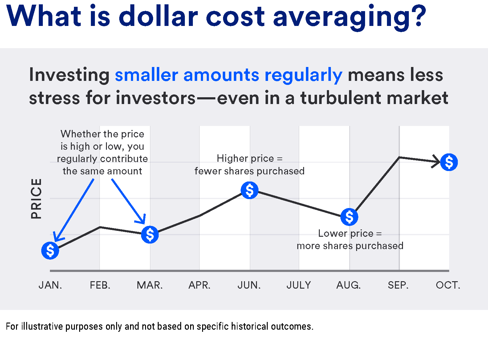

## Table of Contents

## What is dollar-cost averaging?

Dollar-cost averaging is a way of investing money over time, instead of all at once. You take a set amount of money and invest it at regular times, like every month. This means you buy more shares when prices are low and fewer shares when prices are high. It helps reduce the risk of investing all your money at a bad time, like when the market is at its peak.

This method can help you stay calm during ups and downs in the market. Instead of trying to guess the best time to invest, you just keep putting in the same amount regularly. Over time, this can lead to a lower average cost per share. It's a good strategy for people who want to invest without worrying too much about short-term changes in the market.

## How does dollar-cost averaging work?

Dollar-cost averaging works by spreading out your investments over time. Instead of putting all your money into the market at once, you invest a fixed amount of money at regular intervals, like every month or every paycheck. For example, if you decide to invest $100 every month, you'll buy shares of a stock or a fund with that $100, no matter what the price is at that time. This means you'll end up buying more shares when the price is low and fewer shares when the price is high.

This strategy helps reduce the risk of investing all your money at a time when the market might be at its peak. By investing regularly, you smooth out the ups and downs of the market. Over time, this can lead to a lower average cost per share because you're not trying to time the market perfectly. It's a simple way to invest without having to worry about when to buy or sell, making it easier for people to stick to their investment plan and build wealth over the long term.

## What are the benefits of using dollar-cost averaging for wealth accumulation?

Dollar-cost averaging helps you build wealth by letting you invest small amounts of money regularly. Instead of putting all your money into the market at once, you spread it out over time. This means you buy shares when the price is low and when it's high. Over time, this can lower the average cost of the shares you buy. It's like buying groceries on sale sometimes and at regular price other times, which can save you money in the long run.

Another benefit is that it takes away the stress of trying to guess the best time to invest. The stock market goes up and down, and it's hard to know when it will be at its highest or lowest. By investing the same amount every month or every paycheck, you don't have to worry about timing the market. This can help you stay calm and keep investing, even when the market is doing poorly. Over many years, this regular investing can help your money grow into a big nest egg.

## Can dollar-cost averaging reduce investment risk?

Dollar-cost averaging can help lower the risk of investing by spreading out your money over time. Instead of putting all your money into the market at one time, you invest a little bit regularly, like every month. This means you buy shares when the price is high and when it's low. By doing this, you avoid the risk of investing all your money when the market is at its peak and prices might drop soon.

This method also helps you avoid the stress of trying to guess the best time to invest. The stock market can be unpredictable, and it's hard to know when it will go up or down. By investing the same amount regularly, you don't have to worry about timing the market perfectly. This can help you stay calm and keep investing, even during tough times, which can lead to building wealth over the long term.

## How often should I invest using dollar-cost averaging?

When using dollar-cost averaging, you can choose how often you want to invest based on what works best for you. Many people find it easy to invest every month because it matches up with their monthly paychecks. This way, you can set aside a fixed amount of money each month to put into your investments without feeling a big hit to your budget.

Another option is to invest every time you get paid, whether that's weekly, bi-weekly, or on some other schedule. This can help you invest more often and might even out the ups and downs of the market even more. The most important thing is to pick a schedule that you can stick to, so you keep investing regularly over time.

## What types of investments are best suited for dollar-cost averaging?

Dollar-cost averaging works well with investments that you plan to hold for a long time, like stocks, mutual funds, and exchange-traded funds (ETFs). These types of investments can go up and down in value over time, but they tend to grow over many years. By investing a little bit regularly, you can buy more shares when the price is low and fewer when it's high. This can help lower your average cost per share and make your money grow over time.

You can use dollar-cost averaging with any investment that you can buy regularly. Many people use it with index funds, which are a type of mutual fund or [ETF](/wiki/etf-trading-strategies) that tracks a broad market index like the S&P 500. These funds are easy to invest in and can be a good way to build wealth over the long term. Dollar-cost averaging can also work well with target-date funds, which automatically adjust your investments as you get closer to a specific goal, like retirement.

## How does dollar-cost averaging compare to lump-sum investing?

Dollar-cost averaging and lump-sum investing are two different ways to put money into the market. With dollar-cost averaging, you invest a little bit of money regularly, like every month. This means you buy more shares when prices are low and fewer when prices are high. It helps spread out the risk because you're not putting all your money in at one time. This can be good if you're worried about the market going down right after you invest.

Lump-sum investing is when you put all your money into the market at once. This can be good if the market goes up right after you invest because you'll make more money. But it's riskier because if the market goes down right after you invest, you could lose a lot of money. Studies show that over the long term, lump-sum investing often does better than dollar-cost averaging because the market usually goes up over time. But it depends on your comfort with risk and how much you want to keep investing regularly.

## What are the potential drawbacks of dollar-cost averaging?

One potential drawback of dollar-cost averaging is that it might not give you the best returns over time. If you invest a little bit of money each month, you might miss out on the gains you could get if you put all your money in at once when the market is doing well. Studies show that, over the long term, putting all your money in at once, called lump-sum investing, often does better than dollar-cost averaging because the market usually goes up over time.

Another downside is that dollar-cost averaging can take more work. You need to keep investing regularly, which means you have to remember to put money in every month or every paycheck. This can be a hassle, especially if you forget or if your schedule changes. Also, if you're investing in something that charges fees every time you buy, like some mutual funds, you might end up paying more in fees than if you had just put all your money in at once.

## How can I start implementing dollar-cost averaging in my investment strategy?

To start using dollar-cost averaging, first decide how much money you can afford to invest regularly. This could be every month, every paycheck, or any other time that works for you. Once you know how much you can invest, choose an investment like a stock, mutual fund, or ETF that you want to buy. Many people choose index funds because they're easy to invest in and can help your money grow over time. Then, set up an automatic investment plan with your bank or investment account. This way, the money will be taken out of your account and invested without you having to remember to do it every time.

After you start, keep an eye on your investments to make sure they're doing what you want them to do. But remember, dollar-cost averaging is about investing for the long term, so don't worry too much about short-term ups and downs in the market. Just keep investing the same amount regularly, and over time, this can help lower your average cost per share and build your wealth. If your financial situation changes, you can always adjust how much you're investing, but the key is to keep it up as consistently as you can.

## What impact does market volatility have on dollar-cost averaging?

Market [volatility](/wiki/volatility-trading-strategies), or when the prices of investments go up and down a lot, can actually make dollar-cost averaging work better. When you use dollar-cost averaging, you invest the same amount of money regularly, no matter what the market is doing. So, when the market goes down and prices are low, your regular investment buys more shares. When the market goes up and prices are high, you buy fewer shares. This means that over time, you end up buying shares at different prices, which can help lower your average cost per share.

Even though the market can be unpredictable, dollar-cost averaging helps you stay calm and keep investing. You don't have to worry about trying to guess the best time to invest because you're putting in money regularly. This can be really helpful during times when the market is going through big ups and downs. By sticking to your plan and investing the same amount every time, you can build wealth over the long term, even when the market is volatile.

## How can dollar-cost averaging be optimized for different market conditions?

Dollar-cost averaging can be tweaked a bit depending on what the market is doing. If the market is going up a lot, you might want to put in a little more money each time you invest. This way, you can take advantage of the good times and buy more shares when prices are high. But if the market is going down, it's usually best to stick with your regular amount. This helps you buy more shares when they're cheaper, which can lower your average cost over time.

Another way to adjust dollar-cost averaging is by changing how often you invest. If the market is really jumpy, you might want to invest more often, like every paycheck instead of every month. This can help smooth out the ups and downs even more. The key is to keep investing regularly, no matter what the market is doing. By staying consistent and making small changes based on market conditions, you can make dollar-cost averaging work even better for you.

## What are advanced strategies for using dollar-cost averaging to maximize wealth accumulation?

To make the most of dollar-cost averaging, you can use a strategy called value averaging. Instead of putting in the same amount of money every time, you aim to increase the total value of your investment by a set amount each period. For example, if you want your investment to grow by $100 every month, you'll put in more money when the market is down and less when it's up. This can help you buy more shares when prices are low and fewer when prices are high, which might lead to better returns over time.

Another advanced strategy is to use dollar-cost averaging with a diversified portfolio. Instead of investing in just one stock or fund, you can spread your money across different types of investments, like stocks, bonds, and real estate. This way, you're not putting all your eggs in one basket, and you can still benefit from dollar-cost averaging in each part of your portfolio. By regularly investing in a mix of assets, you can reduce risk and potentially increase your wealth over the long term.

## What is Dollar-Cost Averaging and How Does it Work?

Dollar-cost averaging (DCA) is a prominent investment strategy designed to reduce the impact of market volatility by spreading out investment purchases over time rather than making a single lump-sum investment. This systematic approach involves investing a fixed amount of money at regular intervals, regardless of the asset's price. By adhering to this consistent investment schedule, an investor purchases more shares when prices are low and fewer shares when prices are high. This process can lead to a lower average cost per share over time, potentially leading to better overall returns.

The mathematical logic behind DCA can be understood through a simple illustration. Consider an investor who decides to invest a fixed amount, $A$, at regular intervals. Let's assume the price of the asset at intervals $n$ is represented by $P_n$. The number of shares purchased at each interval can be calculated as:

$$

\text{Shares Purchased} = \frac{A}{P_n} 
$$

Over several intervals, the average cost per share is determined by dividing the total amount of money invested by the total number of shares purchased. This approach can lead to a lower average purchase price, especially in volatile markets, since the investor buys more shares when prices are lower and fewer shares when prices are higher.

**Psychological and Emotional Advantages**

One of the significant benefits of dollar-cost averaging is its impact on investor psychology and behavior. The financial markets are notoriously unpredictable, and human emotions can lead to irrational decision-making, particularly during volatile market conditions. DCA helps mitigate emotional decision-making by removing the need to 'time the market'. Since investments are made systematically at set intervals, investors are not constantly trying to predict market highs and lows, which is often a challenging and risky endeavor.

Furthermore, dollar-cost averaging promotes discipline, requiring investors to commit to an investment schedule regardless of market conditions. This discipline can lead to more consistent investing habits, encouraging regular contributions towards investment goals, which is particularly beneficial for long-term wealth accumulation.

In summary, dollar-cost averaging simplifies the investment process and helps investors remain committed to their strategy without being swayed by short-term market fluctuations. By ensuring a consistent investment approach, DCA enables investors to potentially lower their average cost per share while fostering a disciplined and emotionally detached investment behavior.

## References & Further Reading

[1]: Benjamin Graham. ["The Intelligent Investor: The Definitive Book on Value Investing."](https://www.amazon.com/Intelligent-Investor-Definitive-Investing-Essentials/dp/0060555661) Collins Business Essentials.

[2]: Burton G. Malkiel. ["A Random Walk Down Wall Street: The Time-Tested Strategy for Successful Investing."](https://www.amazon.com/Random-Walk-Down-Wall-Street/dp/0393358380) W. W. Norton & Company.

[3]: Ernest P. Chan. ["Algorithmic Trading: Winning Strategies and Their Rationale."](https://www.wiley.com/en-us/Algorithmic+Trading%3A+Winning+Strategies+and+Their+Rationale-p-9781118460146) Wiley.

[4]: Dollar-Cost Averaging: A Technique for Investing Consistently Regardless of Market Conditions. [Investopedia's Article](https://www.investopedia.com/terms/d/dollarcostaveraging.asp).

[5]: Ernest P. Chan. ["Quantitative Trading: How to Build Your Own Algorithmic Trading Business."](https://www.amazon.com/Quantitative-Trading-Build-Algorithmic-Business/dp/0470284889) Wiley.