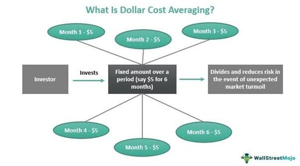

Dollar-cost averaging (DCA) is an investment strategy that involves allocating a fixed amount of capital at regular intervals into a particular asset or set of assets, regardless of the asset's price. This systematic approach lower the average cost per share over time as it allows investors to purchase more shares when prices are low and fewer shares when prices are high. Such a strategy is particularly important for building wealth as it minimizes the impact of market volatility. Over extended periods, consistent investment can lead to substantial growth, capitalizing on the concept of compounding returns.

Market volatility can pose significant challenges for investors, primarily due to the unpredictability of price movements. This fluctuation can lead to emotional decision-making, generally resulting in poor investment choices such as buying high and selling low. DCA helps in mitigating these risks by eliminating the need to time the market, an often daunting task even for seasoned investors. Instead, DCA facilitates a disciplined investment approach, promoting long-term financial growth regardless of short-term market conditions.



Integrating DCA with algorithmic trading presents an opportunity to further optimize investment strategies. Algorithmic trading, which employs computer programs to execute trades based on pre-determined criteria, can enhance the DCA approach by meticulously assessing market conditions and making precise investment decisions without human intervention. This integration allows for continuous and automatic investment, ensuring that DCA strategies are carried out with consistency and precision. Furthermore, algorithms can be programmed to adjust the frequency and size of investments based on market conditions, potentially increasing returns.

Incorporating technology into DCA strategies not only improves efficiency but also provides investors with a robust framework for managing their portfolios in an increasingly complex financial landscape. As such, the combination of DCA and algorithmic trading can greatly enhance the potential for achieving long-term investment goals.

## Table of Contents

## Understanding Dollar-Cost Averaging

Dollar-cost averaging (DCA) is a prominent investment strategy designed to reduce the impact of market volatility by spreading out investment purchases over time rather than making a single lump-sum investment. This systematic approach involves investing a fixed amount of money at regular intervals, regardless of the asset's price. By adhering to this consistent investment schedule, an investor purchases more shares when prices are low and fewer shares when prices are high. This process can lead to a lower average cost per share over time, potentially leading to better overall returns.

The mathematical logic behind DCA can be understood through a simple illustration. Consider an investor who decides to invest a fixed amount, $A$, at regular intervals. Let's assume the price of the asset at intervals $n$ is represented by $P_n$. The number of shares purchased at each interval can be calculated as:

$$

\text{Shares Purchased} = \frac{A}{P_n} 
$$

Over several intervals, the average cost per share is determined by dividing the total amount of money invested by the total number of shares purchased. This approach can lead to a lower average purchase price, especially in volatile markets, since the investor buys more shares when prices are lower and fewer shares when prices are higher.

**Psychological and Emotional Advantages**

One of the significant benefits of dollar-cost averaging is its impact on investor psychology and behavior. The financial markets are notoriously unpredictable, and human emotions can lead to irrational decision-making, particularly during volatile market conditions. DCA helps mitigate emotional decision-making by removing the need to 'time the market'. Since investments are made systematically at set intervals, investors are not constantly trying to predict market highs and lows, which is often a challenging and risky endeavor.

Furthermore, dollar-cost averaging promotes discipline, requiring investors to commit to an investment schedule regardless of market conditions. This discipline can lead to more consistent investing habits, encouraging regular contributions towards investment goals, which is particularly beneficial for long-term wealth accumulation.

In summary, dollar-cost averaging simplifies the investment process and helps investors remain committed to their strategy without being swayed by short-term market fluctuations. By ensuring a consistent investment approach, DCA enables investors to potentially lower their average cost per share while fostering a disciplined and emotionally detached investment behavior.

## Benefits and Limitations of Dollar-Cost Averaging

Dollar-cost averaging (DCA) is a financial strategy designed to reduce investment risk and stabilize returns. By consistently investing a fixed amount of money at regular intervals, regardless of market conditions, DCA minimizes the impact of [volatility](/wiki/volatility-trading-strategies) on the portfolio. This contrasts with lump-sum investing, where an investor deploys a significant sum at once, thus exposing themselves to greater risk if the market subsequently declines.

### Risk Reduction and Stable Returns

The main advantage of DCA is its ability to reduce the average cost per share over time. In markets characterized by fluctuation, this method allows investors to purchase more shares when prices are low and fewer when prices are high. As a result, the investment's overall purchase price is averaged out, potentially leading to lower volatility in the portfolio and reduced risk compared to timing the market with lump-sum investments.

#### Mathematical Explanation:

Consider an investor who wishes to invest $1200 over 4 months:

```python
investment_amount = 1200
monthly_months = 4
investment_per_month = investment_amount / monthly_months

prices = [10, 15, 8, 12]  # hypothetical monthly stock prices
total_shares = sum(investment_per_month / price for price in prices)

average_price_paid = investment_amount / total_shares

print(f"Average price paid per share: {average_price_paid}")
```

This script shows how an investor's average cost per share decreases, demonstrating DCA's ability to manage market fluctuations effectively.

### Long-term Benefits for Retirement Planning

When utilized for retirement planning, DCA facilitates disciplined saving, which is crucial for building wealth over time. By automating regular investments, individuals can accumulate assets steadily, benefitting from the compounding returns. This approach ensures continuous participation in the market, which can be advantageous in achieving financial goals such as retirement savings, even through various economic cycles.

### Criticisms and Limitations of DCA

Despite its advantages, DCA is not without criticisms. One primary limitation is its potential opportunity cost during rising markets. If an investor deploys funds gradually, rather than making a lump-sum investment when prices are low, they might miss out on potential gains. Critics argue that if the market is expected to rise consistently, investing the entire amount upfront could generate greater returns.

Furthermore, DCA does not completely eliminate market risk. While it manages short-term volatility, it does not protect against long-term downtrends or misallocation of assets.

### Conclusion

While dollar-cost averaging offers a strategy for mitigating risk and enhancing the stability of returns over time, it's essential to recognize its limitations. Investors must weigh the benefits of reduced volatility and disciplined investing against the possibility of lower returns in consistently rising markets.

## Integrating DCA with Algorithmic Trading

### Integrating Dollar-Cost Averaging (DCA) with Algorithmic Trading

Dollar-cost averaging can benefit significantly from [algorithmic trading](/wiki/algorithmic-trading) techniques, which automate investment decisions and streamline the execution process. Combining DCA with algorithmic trading involves using computational algorithms to systematically invest a fixed sum of money at regular intervals, thereby minimizing human error and enhancing timing precision.

**The Role of Technology**

Modern technology plays a pivotal role in managing and executing DCA strategies with precision and consistency. Algorithms can be programmed to adhere strictly to the predetermined investment schedule and amount, ensuring that emotions or market rumors do not influence decisions. For instance, investment platforms and robo-advisors use sophisticated algorithms to automate DCA, allowing for seamless contribution to an investment portfolio without manual intervention.

By utilizing technology to manage DCA cash flows, investors can focus on long-term goals without the distraction of daily market movements. Algorithms also allow for the seamless reinvestment of dividends and interest, compounding returns over time and enhancing the potential benefits of the DCA strategy.

**Enhancing Performance Through Algorithmic Trading**

Algorithmic trading enhances the performance of DCA by employing advanced data analytics and financial modeling. For example, algorithms can be designed to optimize the timing and frequency of investments based on historical market data and trends, thereby potentially increasing returns relative to traditional DCA approaches. Below is a basic Python code that illustrates a simple algorithm to execute a DCA strategy:

```python
import pandas as pd
import numpy as np

def dca_strategy(stock_prices, investment_per_period):
    num_shares = 0
    total_invested = 0

    for price in stock_prices:
        shares_bought = investment_per_period / price
        num_shares += shares_bought
        total_invested += investment_per_period

    average_cost_per_share = total_invested / num_shares
    return num_shares, average_cost_per_share

# Example usage
stock_prices = np.array([100, 95, 105, 110, 100])  # Imaginary stock prices
investment_per_period = 1000  # Investment amount per period

shares, avg_cost = dca_strategy(stock_prices, investment_per_period)
print(f"Total shares: {shares:.2f}, Average Cost per Share: {avg_cost:.2f}")
```

In this example, the algorithm calculates the number of shares purchased at each investment period and the average cost per share. Such algorithms can be expanded with additional features, including risk management metrics and adaptive strategies based on [machine learning](/wiki/machine-learning) models that can suggest modifications to the strategy given changes in volatility or market conditions.

Furthermore, connecting DCA strategies to algorithmic trading platforms enables real-time data integration and [backtesting](/wiki/backtesting). Investment firms and individual traders can compare DCA performance against historical data, providing valuable insights into potential future outcomes and refining strategies accordingly.

By leveraging algorithmic trading, investors can maximize the benefits of DCA, achieving lower transaction costs, improved efficiency, and more disciplined investment execution, thereby optimizing long-term investment success.

## Case Studies and Real-World Examples

### Case Studies Highlighting the Success of DCA

Dollar-cost averaging (DCA) has been a longstanding and effective investment strategy, particularly in navigating volatile market conditions. Historical analysis supports its ability to cushion against market downturns while capitalizing on subsequent recoveries. For instance, investors practicing DCA during the 2008 financial crisis were observed to accumulate assets at lower costs, setting the stage for substantial gains when the markets rebounded. 

A comprehensive study assessing the investment outcomes from 1970 to 2020 demonstrated DCA's effectiveness. By investing a fixed amount in the S&P 500 Index monthly, investors achieved a commendable average annual return with reduced volatility compared to lump-sum investments (source: Investopedia).

### Comparison with Other Investment Strategies

When stacking DCA against lump-sum investing, data from the same period (1970-2020) illustrated that while lump-sum investing often yielded higher returns in bullish markets, DCA excelled in scenarios marked by high volatility and bear markets. This demonstrates DCA's resilience as a strategy customized for risk-aversion and capital preservation.

A comparison study published in the Financial Analysts Journal evaluated DCA alongside value averaging, a more complex strategy requiring adjustments based on pre-set targets. While value averaging occasionally outperformed DCA under specific conditions, the latter's simplicity and ease of implementation made it a preferred choice for investors not seeking constant portfolio adjustments.

### Algorithmic Trading and DCA

The integration of algorithmic trading has automated and refined the DCA strategy further. Several platforms now provide algorithmic solutions that facilitate DCA by executing trades at fixed intervals without manual intervention. Algorithms can assess optimal intervals and amounts to align with an investor's risk preference, enhancing DCA's efficiency.

A real-world implementation of DCA through algorithmic trading was reported by a [hedge fund](/wiki/hedge-fund-trading-strategies) deploying it across multiple asset classes, including equities and cryptocurrencies. The usage of Python-based algo-trading scripts enabled precise timing and execution of trades, minimizing human error and biases. A sample Python snippet to automate DCA might look like this:

```python
import schedule
import time
import broker_api  # hypothetical broker API

def execute_trade():
    amount = 100  # fixed investment amount
    asset = 'SPY'  # S&P 500 ETF
    broker_api.buy(asset, amount)

schedule.every().month.at("10:00").do(execute_trade)

while True:
    schedule.run_pending()
    time.sleep(1)
```

This example highlights how integrating technology with DCA can streamline and enhance its application, thus maximizing potential returns while maintaining risk management through systematic investment.

### Conclusion

The case studies and data highlight how dollar-cost averaging, especially when supported by algorithmic trading, serves as an effective strategy for managing market volatility and enhancing long-term wealth accumulation. Its consistent application across diverse market conditions underscores its potential as a core mechanism in personal and institutional investment portfolios.

## Practical Implementation of DCA in Trading

To implement Dollar-Cost Averaging (DCA) in trading, investors can follow systematic steps to integrate this strategy effectively into their personal investment portfolios. This section outlines a structured approach, discusses automation tools, and provides tips for optimizing DCA strategies.

### Step-by-Step Guidance for Implementing DCA

1. **Define Investment Goals**: Determine the specific financial goals you aim to achieve through investing, such as retirement savings, wealth accumulation, or portfolio diversification. Clearly defined objectives will guide your investment choices and strategy.

2. **Choose the Investment Asset**: Select an asset or a group of assets, such as stocks, ETFs, mutual funds, or cryptocurrencies, to apply the DCA strategy. Consider factors like risk tolerance, market volatility, and potential returns.

3. **Determine Investment Amount and Frequency**: Decide on the fixed amount you are willing to invest at each interval and the frequency of these investments. Common intervals are weekly, bi-weekly, or monthly. The fixed amount and regularity are crucial to maintaining the discipline of DCA.

4. **Set Up the Investment Account**: Open a brokerage account if you don't have one already. Many online brokerage platforms allow investors to easily set up recurring investments, which is essential for executing a DCA strategy.

5. **Monitor and Adjust**: Regularly monitor the performance of your investments to ensure they align with your overall financial goals. While DCA mitigates the emotional impact of market fluctuations, it’s important to periodically review and adjust your strategy if necessary, such as rebalancing your portfolio.

### Tools, Platforms, and Resources for Automating DCA

To automate the DCA strategy, several tools and platforms are available that simplify and expedite the process:

- **Brokerage Platforms**: Many brokers offer automated investing features. For example, platforms like Vanguard, Fidelity, and TD Ameritrade allow investors to set up automatic transfers and investments, enabling a seamless DCA implementation.

- **Robo-Advisors**: Services like Betterment and Wealthfront provide robo-advisory features that automate investment management, including DCA strategies. These platforms manage portfolios according to predefined investment plans and risk profiles.

- **Fintech Apps**: Apps such as Acorns and Qapital offer micro-investing features, rounding up everyday purchases and investing the spare change automatically, thus facilitating a form of DCA.

### Optimizing DCA Strategies and Evaluating Performance

- **Cost Minimization**: To optimize a DCA strategy, investors should pay attention to transaction costs and fees. Selecting platforms with low fees or using commission-free trading options helps preserve returns over time.

- **Performance Tracking**: Utilize portfolio tracking tools to evaluate the performance of your investments. Tools like Personal Capital or Morningstar allow investors to analyze their portfolios against benchmarks and assess the efficacy of their DCA strategy.

- **Risk Management**: Although DCA helps in managing volatility, it’s crucial to diversify investments to spread risk across different asset classes. Diversification enhances the protective benefits of DCA.

- **Periodic Review**: Regularly review your strategy to ensure it reflects any changes in financial goals, market conditions, or personal circumstances. Annual or semi-annual reviews aid in maintaining alignment with your long-term objectives.

By following these steps and utilizing the appropriate tools, investors can effectively implement a Dollar-Cost Averaging strategy, automating their investments, and minimizing market timing risks. This disciplined approach can be a valuable part of a long-term investment strategy, especially when combined with modern financial technology resources.

## Conclusion

Dollar-cost averaging (DCA) presents itself as a robust and effective strategy for building wealth over time by mitigating the adverse effects of market volatility. As an investment approach, DCA involves the periodic investment of a fixed dollar amount, promoting disciplined savings and reducing emotional and psychological stress associated with investing. One of the primary benefits of this method is its ability to lower the average cost per share over time, as it results in purchasing more shares when prices are low and fewer when prices are high. This leads to a smoothing effect on price fluctuations, offering a more balanced risk exposure compared to lump-sum investments.

Investors are encouraged to incorporate DCA into their long-term financial strategies. This approach provides a systematic mechanism for entering the market and is particularly beneficial for those looking to maintain consistent investment habits without the pressure of timing the market. Historically, DCA has proven its merit by offering more stable returns over extended periods, assisting in retirement planning and wealth accumulation.

Moreover, the integration of DCA with algorithmic trading techniques can further enhance investment returns. By leveraging technology, investors can automate DCA processes, executing trades with precision and consistency that transcend human capabilities. Algorithmic trading systems can dynamically adjust investment schedules and amounts based on market data, optimizing the traditional DCA model. This synergy between DCA and algorithmic trading not only maximizes returns but also brings additional efficiency in managing investment portfolios.

In conclusion, the effectiveness of dollar-cost averaging in wealth building is underscored by its simplicity and strategic advantage amidst market volatility. Investors seeking a disciplined and less emotionally charged investment strategy should consider DCA for its long-term potential. Furthermore, coupling DCA with algorithmic trading can provide an enriched framework for maximizing returns, offering a modern approach to traditional strategies.

## Further Reading

For those interested in expanding their knowledge about Dollar-Cost Averaging (DCA) and algorithmic trading, a wealth of resources is available. Here are some recommended readings and courses:

1. **"The Intelligent Investor" by Benjamin Graham**: This classic book provides foundational investment strategies, including insights on disciplined investment approaches akin to DCA.

2. **"A Random Walk Down Wall Street" by Burton G. Malkiel**: Malkiel's book explores efficient market theories and offers guidance on utilizing strategies like DCA for effective investment.

3. **"Algorithmic Trading: Winning Strategies and Their Rationale" by Ernie Chan**: Chan’s book investigates into the specifics of algorithmic trading, offering insights into creating and optimizing automated trading strategies, including DCA.

4. **Academic Papers**:
    - "Does Dollar-Cost Averaging Work? Analyzing Returns, Fluctuations, and Investor Behavior": This paper examines the performance and risks associated with DCA in various market conditions.
    - "Algorithmic Trading and Its Implications on Market Efficiency": An academic discussion on the impact of algorithmic trading, detailing various strategies and their influence on market dynamics.

5. **Online Courses**:
    - **Coursera's "Investment Management" Specialization**: Offered by the University of Geneva, this course covers investment strategies and includes applications of DCA.
    - **Udacity's "AI for Trading" Nanodegree**: This program addresses the integration of machine learning and algorithmic trading strategies, providing practical applications relevant to DCA.

6. **Online Platforms and Forums**:
    - **Investopedia's Guide to Trading Strategies**: Provides detailed articles on different trading strategies, including DCA, with examples and case studies.
    - **Stack Exchange (Quantitative Finance)**: A community forum where individuals can ask complex questions and discuss algorithmic trading strategies, including automating DCA.

These resources will pave the way for a deeper understanding of DCA, its practical applications, and the transformative role of algorithmic trading in modern investing. Whether you're a novice investor or a seasoned trader, these materials offer valuable insights for enhancing your investment strategy.

## References & Further Reading

[1]: Benjamin Graham. ["The Intelligent Investor: The Definitive Book on Value Investing."](https://www.amazon.com/Intelligent-Investor-Definitive-Investing-Essentials/dp/0060555661) Collins Business Essentials.

[2]: Burton G. Malkiel. ["A Random Walk Down Wall Street: The Time-Tested Strategy for Successful Investing."](https://www.amazon.com/Random-Walk-Down-Wall-Street/dp/0393358380) W. W. Norton & Company.

[3]: Ernest P. Chan. ["Algorithmic Trading: Winning Strategies and Their Rationale."](https://www.wiley.com/en-us/Algorithmic+Trading%3A+Winning+Strategies+and+Their+Rationale-p-9781118460146) Wiley.

[4]: Dollar-Cost Averaging: A Technique for Investing Consistently Regardless of Market Conditions. [Investopedia's Article](https://www.investopedia.com/terms/d/dollarcostaveraging.asp).

[5]: Ernest P. Chan. ["Quantitative Trading: How to Build Your Own Algorithmic Trading Business."](https://www.amazon.com/Quantitative-Trading-Build-Algorithmic-Business/dp/0470284889) Wiley.