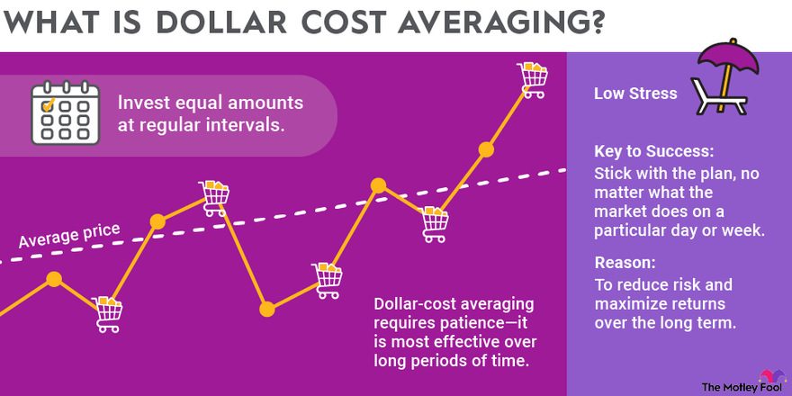

Dollar-cost averaging (DCA) is an investment strategy that involves investing a specific amount of money in a particular asset at regular intervals, irrespective of its current market price. This approach is designed to mitigate the effects of market volatility by spreading out investment purchases over time, thus potentially reducing the overall average cost per share. By purchasing more shares when prices are lower and fewer when prices are higher, investors can avoid the pitfalls of market timing. 

In addition to traditional investment settings, DCA presents significant opportunities within the domain of algorithmic trading. This fusion of strategy and technology enables automated systems to adhere to disciplined investment practices, devoid of emotional biases. Algorithmic trading systems can incorporate DCA by executing pre-programmed rules and schedules, thereby ensuring consistency and regularity in investments. The integration of DCA into algorithmic systems thus enhances the strategic management of assets, providing a systematic approach to investment that aligns with long-term financial goals.



This article aims to explore the benefits of DCA as well as the challenges it presents, particularly within the context of algorithmic trading systems. Through a structured analysis, the relevance of DCA in contemporary investment strategies will be discussed, highlighting its potential to foster disciplined investing practices amidst financial market fluctuations.

## Table of Contents

## What is Dollar-Cost Averaging?

Dollar-cost averaging (DCA) is an investment strategy where a predetermined amount is invested at regular intervals in a chosen asset, irrespective of its current price. This approach stands in contrast to trying to time the market, which is notoriously difficult even for seasoned investors. By regularly purchasing more shares when prices are low and fewer when prices are high, DCA aims to lower the average cost per share over time.

The fundamental advantage of DCA is its utility in volatile markets. In such environments, price fluctuations can lead to emotional decision-making, with investors prone to buying high during optimism and selling low during panic. DCA minimizes emotional reactions by promoting a consistent, systematic investment approach. By sticking to a regular investment schedule, investors are less likely to be swayed by short-term market turbulence, thus emphasizing a long-term perspective.

Here's a simple illustration in Python to demonstrate the concept of DCA:

```python
# Sample Python code to simulate DCA
investment_amount = 100  # Fixed investment amount per period
prices = [10, 12, 8, 11, 10]  # Example price list of asset over time
total_shares = 0
total_investment = 0

for price in prices:
    shares_bought = investment_amount / price
    total_shares += shares_bought
    total_investment += investment_amount

average_cost = total_investment / total_shares
print(f"Total Shares Acquired: {total_shares:.2f}")
print(f"Average Cost per Share: ${average_cost:.2f}")
```

The above code snippet simulates investing a constant amount in an asset over five periods with varying prices. It calculates the total shares acquired and the average cost per share. This gives a clear picture of how DCA can potentially reduce the average cost per unit over time.

Overall, dollar-cost averaging serves as a disciplined investment strategy that reduces the impact of price [volatility](/wiki/volatility-trading-strategies) on buying decisions. It not only encourages regular saving and investing habits but also helps in building wealth over time without the added pressure of timing market highs and lows.

## Pros of Dollar-Cost Averaging

Dollar-cost averaging (DCA) offers several advantages as an investment strategy, particularly for those seeking consistency and discipline in their financial endeavors. One of the primary benefits of DCA is its ability to minimize emotional reactions to market volatility. By committing to invest a fixed amount of money at regular intervals, investors can avoid the pitfalls of trying to time the market, which can be both challenging and risky. This approach helps eliminate the stress and emotional decision-making often associated with market fluctuations.

Another advantage of DCA is the potential to lower the average cost per share over time. Because investors purchase more shares when prices are low and fewer shares when prices are high, the overall cost basis can be reduced. This systematic approach to investing can result in cost savings, as the average purchase cost may be lower than if the entire investment were made at a single point in time when prices are high.

Mathematically, DCA leverages the law of averages, where the average cost per share is calculated as follows:

$$
\text{Average Cost per Share} = \frac{\sum (\text{Investment} \times \text{Price per Share})}{\sum (\text{Number of Shares Bought})}
$$

This equation highlights the benefit of spreading out purchases over various price points, potentially lowering the average cost per share.

Moreover, DCA aligns investment activities with long-term financial goals, supporting steady growth. By focusing on regular investments rather than short-term price movements, investors are encouraged to adopt a disciplined, long-term approach to wealth accumulation. This strategy is particularly beneficial for those with specific financial goals, such as retirement or education funding, as it promotes a consistent investment pattern that contributes to the achievement of these objectives.

Overall, dollar-cost averaging not only provides a practical means to manage market volatility but also fosters a disciplined approach to investing that is crucial for achieving long-term financial success.

## Cons of Dollar-Cost Averaging

Dollar-cost averaging (DCA) has its disadvantages, especially in specific market conditions. In a continuously rising market, DCA can lead to purchasing fewer shares compared to a lump-sum investment made at the onset. This occurs because the fixed amount used in each investment interval buys progressively fewer shares as prices increase. For example, if an investor allocates $100 monthly to purchase shares of a stock that consistently rises in price, the number of shares acquired each month diminishes, possibly leading to a higher overall average cost than a one-time investment made when prices were lower. 

Moreover, regular purchases associated with DCA incur transaction fees, which can accumulate over time. For investors making frequent, smaller investments, transaction costs can substantially reduce returns, negating the benefits of a lower average share cost. It's important for investors to [factor](/wiki/factor-investing) in these fees, particularly when operating with smaller sums, as they can erode the advantages offered by the strategy.

DCA does not shield investors from the risk tied to poor-performing assets. The strategy involves continued investment in a chosen asset, regardless of its performance. As a result, investors remain vulnerable to the asset's intrinsic risks unless they perform comprehensive research and due diligence before committing to a specific investment. An uninformed choice can lead to persistent, unmitigated losses, undermining the efficacy of DCA.

Finally, DCA demands patience and dedication from investors to maintain the [course](/wiki/best-algorithmic-trading-courses) during market downturns. Market fluctuations can be daunting, but the strategy's success hinges on consistent, unwavering investment. Those lacking the resolve to stay invested during adverse market conditions may find it challenging to realize the long-term benefits of DCA, potentially compromising their investment objectives.

## Incorporating DCA in Algorithmic Trading

Algorithmic trading automates trade execution through the use of sophisticated algorithms based on predefined strategies, allowing for efficient and systematic trading across various markets. When integrating Dollar-Cost Averaging (DCA) into [algorithmic trading](/wiki/algorithmic-trading) systems, it presents an opportunity to mitigate emotional biases and enhance disciplined investment strategies. 

Implementing DCA in algorithmic trading involves setting specific rules for investment schedules and asset selection to ensure consistency, regardless of market conditions. This approach aligns with the core principle of DCA—investing a fixed amount at regular intervals—to reduce the impact of market fluctuations on the investment process.

Python, with its robust ecosystem, offers powerful libraries such as NumPy and pandas that facilitate the development of DCA algorithms. For example, NumPy can handle array-based calculations efficiently, and pandas provides data structures and functions for data analysis. Here is a basic illustration of how DCA could be implemented in Python:

```python
import pandas as pd
import numpy as np

def dca_investment(prices, investment_amount):
    shares = investment_amount / prices
    cumulative_shares = shares.cumsum()
    average_cost = (investment_amount * np.arange(1, len(prices) + 1)) / cumulative_shares

    return average_cost, cumulative_shares

# Example price data for an asset
price_data = np.array([100, 95, 105, 110, 100, 95])

# Amount invested at each interval
investment_amount = 1000

# Calculate average cost and cumulative shares
avg_cost, cum_shares = dca_investment(price_data, investment_amount)

print("Average Cost per Share:", avg_cost)
print("Cumulative Shares Purchased:", cum_shares)
```

This code snippet demonstrates how to calculate the average cost per share and the cumulative shares purchased over different periods using a DCA strategy.

By automating DCA, investors can ensure disciplined and consistent investing. Automated systems eliminate the interference of human emotions, reduce the risk of poorly timed decisions, and allow the strategy to focus on long-term objectives, especially in volatile markets. This combination leverages the strengths of both DCA and algorithmic trading to reinforce a stable investment framework, adaptable to varying financial landscapes.

## Is Dollar-Cost Averaging Right for You?

Dollar-cost averaging (DCA) offers a strategic approach for investors focused on long-term growth, particularly those wary of market volatility. This method simplifies market entry, making it advantageous for novice investors who might be intimidated by the complexities of market timing and trading. By establishing a consistent investment schedule, DCA helps inculcate disciplined habits that can foster financial stability over time.

Evaluating an investor's financial goals, risk tolerance, and investment horizon is crucial when considering DCA. This strategy is most beneficial for individuals who are looking to accrue wealth steadily and can exercise patience in varied market conditions. It acts as a counterbalance to market fluctuations, reducing the pressure of making immediate, emotionally driven investment decisions.

A focal point for DCA's effectiveness lies in the investor's commitment to making regular investments, regardless of market activities. To illustrate the mechanics of DCA, consider an investor dedicating $100 monthly toward purchasing shares of a particular asset. If the asset's price in January is $10 per share, they acquire 10 shares. In February, if the price drops to $5 per share, they purchase 20 shares. Conversely, if the price rises to $20 per share in March, the purchase amounts to only 5 shares. Over time, this approach can lower the average cost per share compared to a lump-sum investment during a peak market price, as seen in the example:
$$
\text{Average Cost Per Share} = \frac{\text{Total Investment}}{\text{Total Number of Shares Purchased}}
$$

Here’s a simple Python script to demonstrate the calculation:

```python
investment_amounts = [100, 100, 100]  # Monthly investments
share_prices = [10, 5, 20]  # Share prices for each month
total_shares = sum(investment / price for investment, price in zip(investment_amounts, share_prices))
total_investment = sum(investment_amounts)

average_cost_per_share = total_investment / total_shares
print(f"Average Cost Per Share: ${average_cost_per_share:.2f}")
```

Incorporating DCA requires a commitment, especially during market downturns, where investment perseverance can significantly benefit long-term goals. For those ready to adopt a systematic investment method, DCA provides an opportunity to build a resilient financial portfolio.

## Conclusion

Dollar-cost averaging (DCA) serves as a versatile investment strategy particularly suited for managing market volatility. By spreading investments over time, it helps mitigate risks associated with market fluctuations, making it a structured approach that aligns well with a variety of financial objectives. The essence of DCA lies in its ability to facilitate a disciplined investment process, necessitating diligence in asset selection and a steadfast commitment to regular contributions in order to succeed over the long term.

For new investors, DCA offers a pathway to cultivating disciplined investment habits. The strategy provides an accessible means to engage with the market without the intimidation of precise market timing. By consistently investing fixed amounts, beginners can develop a systematic approach to investing, reducing the emotional impact often experienced during market uncertainty. This method contributes significantly to establishing a stable investment portfolio over time.

While DCA has its advantages, it is not without challenges. The approach requires investors to maintain regular investments despite potential unfavorable market conditions, thus demanding patience and perseverance. Despite these challenges, DCA remains an asset for those looking to construct steady, potentially profitable investment strategies. Its emphasis on continuous investment and cost mitigation makes it a valuable component of a well-rounded investment plan, offering both stability and growth potential in unpredictable markets.

## References & Further Reading

Bogle, J. C. (1999). *Common Sense on Mutual Funds: New Imperatives for the Intelligent Investor.* This seminal work by John C. Bogle lays the foundation for modern mutual fund investing, advocating for low-cost, long-term strategies to build wealth.

Malkiel, B. G. (2015). *A Random Walk Down Wall Street: The Time-Tested Strategy for Successful Investing.* This book introduces readers to the concept of efficient markets and supports diversified investing strategies, which are fundamental to dollar-cost averaging approaches.

Zweig, J. (2003). *Your Money and Your Brain: How the New Science of Neuroeconomics Can Help Make You Rich.* Zweig explores the psychological aspects of investment decisions, emphasizing the importance of disciplined strategies like dollar-cost averaging in mitigating emotional biases.

Sharpe, W. F. (1994). “The Sharpe Ratio.” *The Journal of Portfolio Management, 21*(1), 49-58. The paper details the Sharpe Ratio, a crucial measure for evaluating the risk-adjusted returns of an investment strategy, allowing investors to assess the performance of dollar-cost averaging against various benchmarks.

Thorpe, E. O. (1967). *Beat the Market: A Scientific Stock Market System.* Edward O. Thorp is recognized for his analytical approach to market investing. His work underscores the role of systematic strategies such as algorithmic trading in enhancing investment outcomes, an area where dollar-cost averaging can be effectively applied.

