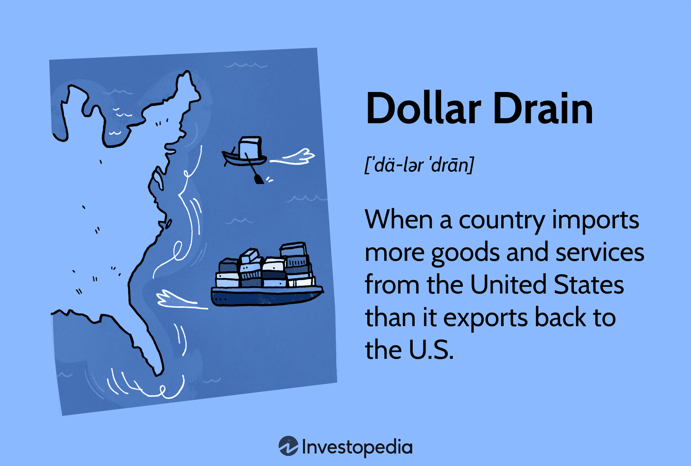

## Table of Contents

## What is a dollar drain?

A dollar drain is when money slowly leaves your bank account over time. It often happens without you noticing because the amounts are small, but over time, these small amounts can add up to a lot of money.

Common examples of dollar drains include subscription services that you forget about, bank fees, or small, frequent purchases like daily coffee. To stop a dollar drain, you need to keep track of your spending and cancel any subscriptions or habits that you don't need.

## How does a dollar drain mechanism work?

A dollar drain happens when small amounts of money keep leaving your account over time. It's like a slow leak in a bucket. You might not notice it at first because the amounts are tiny, but if you don't fix it, you'll end up losing a lot of money. This can happen with things like monthly subscriptions for apps or services that you forget about, or even small daily purchases like buying a coffee every day.

These small expenses can add up quickly. For example, if you spend $3 on coffee every day, that's about $90 a month and over $1,000 a year. It's the same with subscriptions. If you're paying $10 a month for a service you don't use, that's $120 a year going down the drain. To stop a dollar drain, you need to look at your bank statements and see where your money is going. Then, you can cancel subscriptions you don't need and cut back on small, unnecessary purchases.

## Can you provide a simple example of a dollar drain?

Imagine you sign up for a streaming service that costs $5 a month. You enjoy it for a few months, but then you stop watching it. You forget to cancel the subscription, so you keep paying $5 every month. That's a dollar drain because you're losing money without even using the service.

Over a year, that's $60 you've spent on something you don't use. It might not seem like a lot, but if you have a few of these small subscriptions, they can add up to a big amount. That's why it's important to check your bank statements regularly and cancel any subscriptions you don't need.

## What are the common causes of dollar drains in businesses?

In businesses, dollar drains often happen because of small, regular expenses that add up over time. For example, a business might subscribe to multiple software services, each costing a small monthly fee. If the business doesn't use all these services, the money spent on them is wasted. Another common cause is inefficient processes that lead to higher operational costs, like using too much electricity or paper.

Sometimes, dollar drains in businesses come from small, unnoticed losses. For instance, if a store has a lot of shoplifting or if products get damaged and can't be sold, the business loses money little by little. Also, if employees spend too much time on tasks that don't add value, like unnecessary meetings, this can be a drain on the business's resources. Keeping an eye on these small losses and fixing them can help a business save a lot of money.

## How can individuals identify a dollar drain in their personal finances?

To find a dollar drain in your personal finances, you need to look at where your money goes every month. Start by going through your bank statements and receipts. See if there are any regular payments, like subscriptions for apps or services, that you don't use anymore. These small amounts can add up and drain your money without you noticing.

Also, think about your daily spending habits. Do you buy a coffee every day or eat out a lot? These small purchases can also be a dollar drain. To spot them, keep track of your spending for a month. Write down everything you spend money on, no matter how small. This will help you see where your money is going and find any dollar drains you can stop.

## What are the economic impacts of dollar drains on a national scale?

Dollar drains can have a big impact on a country's economy. When people and businesses lose money to small, unnoticed expenses, they have less money to spend on other things. This means less money going into the economy. For example, if a lot of people are paying for subscriptions they don't use, that money isn't being spent on goods and services that could help businesses grow. This can slow down economic growth because businesses might not have enough customers to expand or hire more workers.

On a national scale, dollar drains can also affect how much money the government collects in taxes. If people and businesses are losing money to dollar drains, they might have less income to pay taxes on. This means less money for the government to spend on things like roads, schools, and healthcare. Over time, this can lead to slower economic development and fewer opportunities for people in the country. Keeping an eye on dollar drains and fixing them can help keep more money in the economy and support growth.

## How do companies implement strategies to prevent dollar drains?

Companies use different ways to stop dollar drains. They start by looking at their spending carefully. They check their bills and see if they are paying for things they don't need, like subscriptions for software they don't use. They also look at their daily costs, like how much they spend on electricity or paper. By finding these small costs, they can cut them out and save money.

Another way companies prevent dollar drains is by making their work processes better. They try to use less time on things that don't help the business grow, like long meetings that don't lead to any action. They also keep an eye on things like shoplifting or damaged goods that can slowly take money away from the business. By fixing these problems, companies can keep more money and use it to grow their business or improve what they offer to customers.

## What role do financial technologies play in detecting and managing dollar drains?

Financial technologies, or fintech, help people and businesses find and stop dollar drains. They do this by making it easier to see where money is going. For example, apps and software can connect to your bank account and show you all your spending in one place. This makes it easy to spot small, regular payments like subscriptions that you might forget about. By seeing these payments clearly, you can cancel the ones you don't need and save money.

Fintech also helps businesses by giving them tools to watch their spending closely. These tools can track costs in real-time and send alerts if there are any unusual expenses. This helps businesses find and fix small problems before they turn into big dollar drains. For example, a business might use software to see if they are paying for too many services or if they are wasting money on things like electricity. By using fintech, businesses can manage their money better and stop losing money to dollar drains.

## Can you explain the difference between a dollar drain and a financial leak?

A dollar drain and a financial leak are similar because they both mean money is slowly leaving your account. But they are a bit different. A dollar drain is when you lose money because of small, regular expenses that you might not notice. For example, if you keep paying for a subscription you don't use, that's a dollar drain. These small amounts add up over time and can take a lot of money out of your account without you realizing it.

On the other hand, a financial leak is more about bigger problems that cause money to go away. It could be because of things like fraud, where someone steals your money, or because of big mistakes in how a business manages its money. A financial leak can be harder to spot because it might not happen every month, but when it does happen, it can take away a lot of money at once. Both dollar drains and financial leaks need to be fixed, but they come from different kinds of problems.

## How do international trade policies influence dollar drains?

International trade policies can affect dollar drains by changing how much things cost and how businesses spend their money. When a country puts tariffs or taxes on goods from other countries, it can make those goods more expensive. If businesses in that country have to buy these expensive goods, it can slowly drain their money. For example, if a business needs to import materials for their products and the price goes up because of new trade policies, they might lose money little by little every time they buy those materials.

Also, trade policies can change how businesses do things. If new rules make it harder to trade with other countries, businesses might have to find new ways to get what they need. This can lead to more costs, like spending money on new suppliers or dealing with more paperwork. These extra costs can be small at first, but over time, they can add up and become a dollar drain. So, international trade policies can influence dollar drains by making things more expensive and causing businesses to spend more money in different ways.

## What advanced analytical tools are used by experts to predict and mitigate dollar drains?

Experts use advanced analytical tools like data analytics and [machine learning](/wiki/machine-learning) to predict and stop dollar drains. These tools help by looking at a lot of financial data quickly. They can find small, regular expenses that might be hard to see just by looking at bank statements. For example, these tools can spot subscriptions that people or businesses are paying for but not using. By finding these dollar drains early, experts can help stop the money from being wasted.

Another tool experts use is predictive analytics. This tool looks at past spending to guess what might happen in the future. It can tell if a small expense might grow into a big problem over time. By using predictive analytics, experts can warn people and businesses about possible dollar drains before they get too bad. This helps everyone save money and use it better.

## How can policy makers use data on dollar drains to improve economic policies?

Policy makers can use data on dollar drains to make better economic policies by understanding where money is being wasted in the economy. When they see that people and businesses are losing money to small, regular expenses, they can create policies to help stop these dollar drains. For example, they might make rules that make it easier for people to cancel subscriptions they don't need. By doing this, more money stays in people's pockets and can be spent on other things, helping the economy grow.

Also, policy makers can use this data to find out why dollar drains happen and fix the big problems that cause them. If they see that high fees or tariffs are making things more expensive and causing dollar drains, they might change these policies to lower costs. This can help businesses save money and use it to grow, which can lead to more jobs and a stronger economy. By using data on dollar drains, policy makers can make smart choices that help everyone keep more money and use it in ways that help the economy.

## References & Further Reading

1. **Dollarization and Its Discontents** by Steve H. Hanke and Kurt Schuler. This book provides a thorough analysis of dollarization and its economic impacts on different countries ([Johns Hopkins University](https://sites.krieger.jhu.edu/iae/files/2018/10/Hanke-Schuler-Doll-Discon-1999.pdf)).

2. **International Finance: Theory into Practice** by Piet Sercu. This textbook covers a broad range of topics including currency flows and their implications on international trade and finance.

3. **The Asian Financial Crisis: Causes, Cures, and Systemic Implications** by Morris Goldstein. A detailed examination of the Asian Financial Crisis, offering insights into how dollar drain contributed to the economic turmoil during this period ([Peterson Institute for International Economics](https://piie.com/publications/analyses/asian-financial-crisis-causes-cures-and-systemic-implications)).

4. **Algorithmic Trading and DMA: An Introduction to Direct Access Trading Strategies** by Barry Johnson. This book introduces the principles and strategies behind algorithmic trading, highlighting its transformative role in modern financial markets.

5. **Flash Boys: A Wall Street Revolt** by Michael Lewis. A narrative exploring the rise of high-frequency trading and its broader implications on the financial markets.

6. **The Dollar Trap: How the U.S. Dollar Tightened Its Grip on Global Finance** by Eswar S. Prasad. Offers an in-depth analysis of the dollar's dominance in global finance and its complex implications.

7. **Investopedia's Dollar Drain** - An online article explaining the concept of dollar drain and its economic effects ([Investopedia](https://www.investopedia.com/terms/d/dollardrain.asp)).

8. **Journal of Financial Markets** – A peer-reviewed journal offering articles and research papers on algorithmic trading, market dynamics, and currency flows.

Exploring these resources will provide readers with a deeper understanding of dollarization, dollar drain, and the role of [algorithmic trading](/wiki/algorithmic-trading) in today’s global economy.

