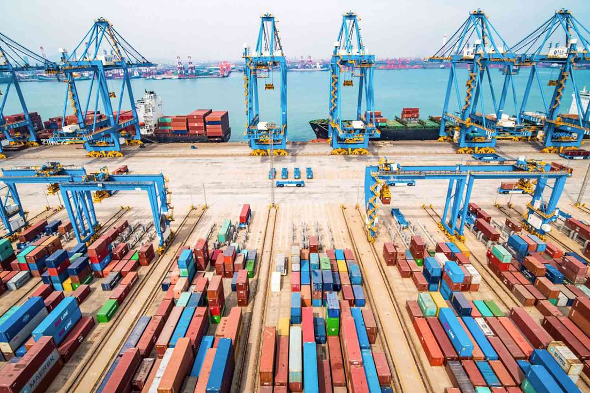

In today's global economy, understanding the flow of currencies and their impact is crucial for grasping economic dynamics. Currency movements, particularly those involving the U.S. dollar, play a significant role in shaping global trade and financial systems. The U.S. dollar serves as the primary reserve currency worldwide, underpinning international transactions and influencing exchange rates and trade balances across nations.

This article focuses on currency outflow, specifically the phenomenon known as 'Dollar Drain,' and its implications on economies. Dollar Drain occurs when countries experience an outflow of U.S. dollars, often due to trade deficits with the United States. Such an outflow can deplete national reserves, making it challenging for countries to manage their monetary policies effectively. As a result, economies facing a Dollar Drain may encounter difficulties in stabilizing their currency and sustaining economic growth.



Additionally, we explore how advanced trading technologies like algorithmic trading intersect with these economic trends. Algorithmic trading, which employs computer algorithms to execute trades at high speeds, has transformed the financial landscape. Its influence extends to currency markets, where rapid trades can amplify currency movements and affect national economies. This article examines the intersection of algorithmic trading with Dollar Drain dynamics, shedding light on its role in financial markets and potential consequences for economic stability.

The aim is to unpack the complexities of these topics and their combined effects on national economies and global markets. Understanding how Dollar Drain interacts with algorithmic trading offers insights into the challenges and opportunities present in the modern financial system. By doing so, this article seeks to highlight the need for effective economic strategies that can harness the benefits of technological advancements while mitigating associated risks in pursuit of global economic stability.

## Table of Contents

## Understanding Dollar Drain

Dollar Drain occurs when a nation's import expenditures from the United States surpass the value of its exports to the U.S., resulting in a trade deficit. This trade imbalance can lead to a depletion of the country's dollar reserves. Dollar reserves are foreign exchange holdings in U.S. dollars, which are crucial for a country's ability to engage in international trade and maintain monetary stability. As these reserves dwindle, the affected country may find its monetary policy capabilities constrained, weakening its control over inflation and interest rates.

Several factors contribute to Dollar Drain. One primary cause is the competitive edge of American goods and services, which might lead other nations to import more than they export. Changes in consumer preferences, the strength of the U.S. dollar, and economic policies also play significant roles. Nations heavily reliant on importing essential goods or services that are predominantly priced in dollars—such as oil—are particularly vulnerable.

Historically, many countries have faced Dollar Drain incidents. For example, during the 1960s and 1970s, the United Kingdom experienced significant Dollar Drain due to its heavy reliance on imports while its export levels stagnated. This led to successive devaluations of the British pound and necessitated interventions by the International Monetary Fund. Brazil in the late 1990s also encountered a similar situation, where persistent trade deficits and capital flight resulted in severe reductions in their dollar reserves, compelling the government to implement strict monetary measures.

Understanding the factors leading to Dollar Drain, including trade practices, currency exchange rates, and international economic policies, is essential for recognizing the complexities of global trade dynamics and the implications on national economies. Effective management and strategic adjustments in trade and fiscal policies are critical to mitigating the adverse effects of Dollar Drain.

## Economic Impact of Dollar Drain

Dollar Drain has significant economic implications for countries experiencing it. When a country's dollar reserves decrease due to a trade deficit with the United States, its central bank faces constraints on monetary policy. This situation limits the central bank's ability to manage the money supply, affecting various policy decisions such as [interest rate](/wiki/interest-rate-trading-strategies) adjustments, currency stabilization, and inflation control.

In simple terms, when a nation runs a persistent trade deficit with the United States, it spends more dollars on imports than it earns through exports. This imbalance requires the country to draw upon its dollar reserves to finance the deficit, which can eventually deplete these reserves. The reduction in dollar reserves hampers the central bank's capacity to intervene in the foreign exchange market to stabilize its currency. Without adequate dollar reserves, the central bank cannot effectively purchase or sell its own currency to influence exchange rates.

Trade deficits resulting from Dollar Drain can lead to currency valuation fluctuations. As dollar reserves dwindle, the affected country might experience a depreciation of its own currency. A weaker currency raises the cost of imports, contributing to inflationary pressures. This scenario complicates monetary policy, as an increase in inflation may necessitate higher interest rates to contain price levels, which can further slow economic growth.

Economic instability can arise as the country's currency value fluctuates. Investors may lose confidence in the market, leading to capital flight and further devaluation pressures. Moreover, a weakening currency makes it more expensive to service foreign-denominated debt, exacerbating the country's financial strain.

A historical example that illuminates the risks associated with Dollar Drain is the Asian Financial Crisis of 1997-1998. The crisis was partly triggered by a loss of confidence and speculative attacks on currencies. Several Asian economies faced massive capital outflows, leading to a sharp decline in foreign reserves. The situation was exacerbated by existing trade deficits, causing severe currency depreciation and economic turmoil. Countries like Thailand, Indonesia, and South Korea struggled with the sudden loss of capital and found themselves unable to stabilize their currencies promptly.

This historical context underscores the vulnerabilities that arise from Dollar Drain. Countries that heavily rely on dollar reserves for economic stability must implement strategies to mitigate trade deficits and manage foreign exchange reserves prudently. Balancing trade flows and maintaining adequate reserve levels can help countries navigate the complexities of global markets and maintain economic stability.

## Role of Algorithmic Trading in Today's Economy

Algorithmic trading, often abbreviated as algo-trading, has ushered in a new era in the financial markets, characterized by speed, efficiency, and precision. By utilizing complex algorithms and vast data sets, traders can execute orders at lightning-fast speeds, capitalizing on minuscule price discrepancies that arise within milliseconds. This capability has not only enhanced the efficiency of trades but has also reshaped market dynamics, presenting both opportunities and challenges.

**Efficiency in Execution and Its Impact**

The primary advantage of [algorithmic trading](/wiki/algorithmic-trading) is its unparalleled execution speed, which is achieved through automation and real-time data processing. This allows traders to exploit [arbitrage](/wiki/arbitrage) opportunities and implement sophisticated trading strategies that would be impossible manually. For example, high-frequency trading ([HFT](/wiki/high-frequency-trading-strategies)), a subset of algorithmic trading, can process thousands of orders in a second. The ability to execute trades at such velocities significantly reduces transaction costs and slippage, directly benefiting portfolio performance.

However, this advantage comes with its set of challenges. The reliance on technology makes the system vulnerable to technical glitches and “flash crashes,” where rapid sell-offs occur due to algorithmic misfires. An infamous incident was the 2010 Flash Crash, when the Dow Jones Industrial Average plummeted nearly 1,000 points in minutes, driven largely by automated trading systems.

**Interaction with a Dollarized Financial System**

In a dollarized financial system, where the U.S. dollar is widely used beyond the United States for international trade and as a global reserve currency, algorithmic trading has profound implications. The stability and global acceptance of the dollar make it a popular currency in algo-trading strategies, particularly in [forex](/wiki/forex-system) markets. The [liquidity](/wiki/liquidity-risk-premium) associated with the dollar allows algorithms to function optimally, taking advantage of the tight spreads and significant market depth.

Moreover, algorithmic trading is essential in managing currency risk in a dollar-driven system. Traders use algorithms to hedge against currency fluctuations, ensuring that exposure to volatile currency movements is minimized. This is particularly important for multinational corporations and investors with portfolios spanning multiple currencies.

**Python Example: Basic Algorithmic Trading Strategy**

To illustrate the practical application, consider a simple moving average crossover strategy, implemented in Python:

```python
import pandas as pd
import numpy as np

# Load historical price data
data = pd.read_csv('market_data.csv')
data['SMA50'] = data['Close'].rolling(window=50).mean()
data['SMA200'] = data['Close'].rolling(window=200).mean()

# Generate signals
data['Signal'] = np.where(data['SMA50'] > data['SMA200'], 1, 0)

# Calculate returns
data['Returns'] = data['Close'].pct_change()

# Calculate strategy returns
data['Strategy_Returns'] = data['Signal'].shift(1) * data['Returns']

# Display cumulative returns
cumulative_returns = (1 + data['Strategy_Returns']).cumprod()
print(f"Cumulative Returns: {cumulative_returns[-1]:.2f}")
```

This script outlines a straightforward strategy, demonstrating how an algorithm can identify buy or sell signals based on moving average crossovers. Although simplistic, this example highlights the basic building blocks of an algorithmic trading system.

In conclusion, algorithmic trading has fundamentally transformed financial markets, offering enhanced execution capabilities and risk management solutions within a dollarized economic framework. However, the inherent risks, including technological vulnerabilities and market impacts, necessitate vigilant oversight and robust risk management practices.

## Synergies and Conflicts Between Dollar Drain and Algorithmic Trading

Algorithmic trading, characterized by the use of complex algorithms to automate trading decisions, has transformed financial markets by allowing rapid execution of trades based on real-time data analysis. This technological advancement intersects significantly with currency flows, particularly in the context of Dollar Drain—a situation where countries experience a depletion of dollar reserves due to sustained trade deficits with the United States.

### Algorithmic Trading's Exacerbating Effects on Dollar Drain
Algorithmic trading can exacerbate Dollar Drain in several ways:

1. **Increased Market Volatility:**
   High-frequency trading (HFT), a subset of algorithmic trading, can lead to increased [volatility](/wiki/volatility-trading-strategies) in financial markets. This volatility can amplify the adverse effects of Dollar Drain by causing rapid fluctuations in currency exchange rates. For countries with trade deficits in U.S. dollars, such fluctuations can complicate efforts to stabilize their currencies and maintain adequate dollar reserves.

2. **Speculative Pressure:**
   Algorithms designed for speculative trading can significantly increase demand for the U.S. dollar during periods of Dollar Drain. This heightened demand can further strain countries’ dollar reserves, forcing central banks to intervene, often at the cost of depleting their foreign exchange reserves.

### Algorithmic Trading as a Mitigating Force
Conversely, algorithmic trading can also play a mitigating role in managing the effects of Dollar Drain:

1. **Enhanced Liquidity Provision:**
   Algorithmic trading can enhance liquidity in foreign exchange markets by facilitating faster trade execution and narrowing bid-ask spreads. This improved liquidity can stabilize exchange rates by making currency markets more efficient, thereby mitigating some of the adverse impacts of Dollar Drain on exchange rate stability.

2. **Arbitrage Opportunities:**
   Algorithms can efficiently exploit arbitrage opportunities across different currency markets, potentially offsetting some destabilizing effects of Dollar Drain. By aligning currency values more closely with underlying economic fundamentals, algorithmic trading helps maintain equilibrium in exchange rates.

### The Stabilizing Role of the U.S. Dollar
The U.S. dollar's status as a stable and dominant reserve currency makes it a central pillar in global finance. Algorithmic trading environments thrive in stable currency systems where exchange rate predictability allows for more accurate modeling and execution of trading strategies.

1. **Risk Hedging:**
   The U.S. dollar's stability enables algorithmic trading strategies that hedge against currency risk. This hedging capability can provide a buffer for economies experiencing Dollar Drain, allowing them to better manage foreign currency exposures and protect their reserves.

2. **International Diversification:**
   Portfolio diversification facilitated by algorithmic trading can distribute risk across multiple currencies and markets. By integrating diversification strategies, traders can reduce reliance on any single currency, including the U.S. dollar, lessening the impact of Dollar Drain on national reserves.

### Evaluating Algorithmic Trading's Buffer Against Economic Shocks
Algorithmic trading systems have the potential to absorb economic shocks caused by Dollar Drain through their inherent capabilities:

- **Automated Risk Management:**
  Advanced algorithms incorporate sophisticated risk management tools that can dynamically adjust trading positions in response to changing market conditions, thus cushioning the effects of sudden economic shocks.

- **Predictive Analytics:**
  Algorithms equipped with [machine learning](/wiki/machine-learning) and AI can predict market trends with high accuracy. This predictive capability allows for proactive strategies that preemptively mitigate the impact of unforeseeable economic disruptions due to Dollar Drain.

In summary, while algorithmic trading strategies can both exacerbate and mitigate the effects of Dollar Drain, their ultimate impact largely depends on how these technologies are implemented within the broader financial ecosystem. Balancing the benefits of liquidity and efficiency with the risks of volatility and speculation is crucial in leveraging algorithmic trading to support economic stability amidst the challenges posed by Dollar Drain.

## Conclusion

In concluding our examination of the interplay between currency flows, trading technologies, and global economic stability, it is evident that the implications of Dollar Drain and the advancements in algorithmic trading are far-reaching. The depletion of dollar reserves through Dollar Drain significantly constrains monetary policy options, emphasizing the urgent need for adaptive economic strategies. These strategies should aim to harness the benefits presented by digital trading technologies while mitigating the inherent risks associated with currency fluctuations and trade deficits.

Algorithmic trading, with its capacity for high-speed and data-driven decision-making, offers great promise but also presents challenges in volatile economic conditions. The stability of currencies, particularly the U.S. dollar, plays a critical role in algorithmic trading environments, affecting everything from trade execution to market liquidity. Thus, robust financial policies are essential to ensuring that these technologies enhance rather than destabilize economic environments.

Looking ahead, the integration of digital trading technologies into financial systems must be accompanied by policies that promote stability and resilience. Economies must develop frameworks that enable them to respond effectively to economic shocks, whether stemming from currency drains or technological disruptions in the financial markets. This approach could involve the use of tools like currency swaps, diversification of reserves, and continuous improvements in market regulations.

The intersection of currency dynamics and trading technologies suggests a future where adaptive economic strategies and the continued integration of digital infrastructures will be vital. These strategies will need to be continually refined to ensure global economic stability and sustainable growth. By proactively addressing the complexities of these phenomena, nations can better position themselves to capitalize on technological advancements while safeguarding their economic interests.

## References & Further Reading

1. **Dollarization and Its Discontents** by Steve H. Hanke and Kurt Schuler. This book provides a thorough analysis of dollarization and its economic impacts on different countries ([Johns Hopkins University](https://sites.krieger.jhu.edu/iae/files/2018/10/Hanke-Schuler-Doll-Discon-1999.pdf)).

2. **International Finance: Theory into Practice** by Piet Sercu. This textbook covers a broad range of topics including currency flows and their implications on international trade and finance.

3. **The Asian Financial Crisis: Causes, Cures, and Systemic Implications** by Morris Goldstein. A detailed examination of the Asian Financial Crisis, offering insights into how dollar drain contributed to the economic turmoil during this period ([Peterson Institute for International Economics](https://piie.com/publications/analyses/asian-financial-crisis-causes-cures-and-systemic-implications)).

4. **Algorithmic Trading and DMA: An Introduction to Direct Access Trading Strategies** by Barry Johnson. This book introduces the principles and strategies behind algorithmic trading, highlighting its transformative role in modern financial markets.

5. **Flash Boys: A Wall Street Revolt** by Michael Lewis. A narrative exploring the rise of high-frequency trading and its broader implications on the financial markets.

6. **The Dollar Trap: How the U.S. Dollar Tightened Its Grip on Global Finance** by Eswar S. Prasad. Offers an in-depth analysis of the dollar's dominance in global finance and its complex implications.

7. **Investopedia's Dollar Drain** - An online article explaining the concept of dollar drain and its economic effects ([Investopedia](https://www.investopedia.com/terms/d/dollardrain.asp)).

8. **Journal of Financial Markets** – A peer-reviewed journal offering articles and research papers on algorithmic trading, market dynamics, and currency flows.

Exploring these resources will provide readers with a deeper understanding of dollarization, dollar drain, and the role of algorithmic trading in today’s global economy.