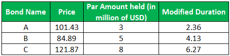

## Table of Contents

## What is Dollar Duration?

Dollar Duration is a measure used in finance to understand how much the value of a bond or a portfolio of bonds will change if interest rates change. It tells you how many dollars you can expect to lose or gain for every one percent change in interest rates. This is useful for investors because it helps them understand the risk of their bond investments. If a bond has a high dollar duration, its price will be more sensitive to changes in interest rates.

For example, if a bond has a dollar duration of $10,000, it means that if interest rates go up by 1%, the value of the bond will drop by $10,000. On the other hand, if interest rates go down by 1%, the value of the bond will increase by $10,000. This measure is particularly important for bond portfolio managers who need to manage the interest rate risk of their portfolios effectively.

## Why is Dollar Duration important in finance?

Dollar Duration is important in finance because it helps people who invest in bonds understand how much money they might lose or gain if interest rates change. Imagine you own a bond. If interest rates go up, the price of your bond might go down. Dollar Duration tells you exactly how much the price will change for every 1% change in interest rates. This helps investors make smarter choices about which bonds to buy or sell.

For people who manage big groups of bonds, like in a bond fund, knowing the Dollar Duration is really helpful. It lets them see how the whole group of bonds will react to changes in interest rates. This way, they can try to keep the risk low and make sure the bond fund stays safe and profitable. So, Dollar Duration is a key tool for managing money in the bond market.

## How is Dollar Duration different from Duration?

Dollar Duration and Duration are both used to measure how sensitive a bond is to changes in interest rates, but they give different kinds of information. Duration tells you how long it will take for you to get back the money you invested in a bond, considering both the bond's price and the interest payments you get. It's usually given as a number of years. If a bond has a duration of 5 years, it means that if interest rates change by 1%, the bond's price will change by about 5%.

Dollar Duration, on the other hand, tells you how much money you will lose or gain in dollars for every 1% change in interest rates. It's more direct and easier to understand in terms of actual money. For example, if a bond has a Dollar Duration of $10,000, you know that if interest rates go up by 1%, you'll lose $10,000, and if they go down by 1%, you'll gain $10,000. So, while Duration gives you a time-based measure, Dollar Duration gives you a dollar-based measure, making it more straightforward for understanding financial impact.

## What is the formula for calculating Dollar Duration?

To calculate Dollar Duration, you start with the bond's Duration and its current price. The formula is simple: Dollar Duration equals the bond's Duration multiplied by its current price, then divided by 100. This gives you the amount of money the bond's value will change for every 1% change in interest rates.

For example, if a bond has a Duration of 5 years and its current price is $1,000, you would calculate the Dollar Duration like this: Dollar Duration = (5 * $1,000) / 100 = $50. This means that if interest rates go up by 1%, the bond's value will drop by $50, and if interest rates go down by 1%, the bond's value will increase by $50.

## Can you explain each component of the Dollar Duration formula?

The Dollar Duration formula has three main parts: the bond's Duration, its current price, and the number 100. The bond's Duration tells you how long it takes to get back the money you invested in the bond, considering both the bond's price and the interest payments you receive. It's a measure of how sensitive the bond's price is to changes in interest rates, usually given in years. For example, a Duration of 5 years means the bond's price will change by about 5% for every 1% change in interest rates.

The current price of the bond is just how much the bond is worth right now in the market. This is important because the Dollar Duration tells you how much money you will lose or gain in actual dollars, not just in percentages. The number 100 in the formula is there to convert the percentage change in interest rates into a dollar amount. So, you multiply the Duration by the current price and then divide by 100 to get the Dollar Duration. This way, you know exactly how many dollars the bond's value will change for every 1% change in interest rates.

## How do you apply the Dollar Duration formula in a real-world scenario?

Imagine you're a bond investor and you own a bond worth $1,000 right now. This bond has a Duration of 6 years. To find out how much money you'll lose or gain if interest rates change, you use the Dollar Duration formula. You multiply the Duration (6 years) by the bond's current price ($1,000), and then divide by 100. So, Dollar Duration = (6 * $1,000) / 100 = $60. This means if interest rates go up by 1%, you'll lose $60. If interest rates go down by 1%, you'll gain $60.

In a real-world scenario, knowing the Dollar Duration helps you make better investment decisions. For example, if you think interest rates are going to rise soon, you might want to sell bonds with high Dollar Durations to avoid big losses. On the other hand, if you believe interest rates will fall, you might choose to hold onto or buy more bonds with high Dollar Durations to benefit from the price increase. By understanding the Dollar Duration, you can manage your bond investments more effectively and protect your money from interest rate changes.

## What are the steps to calculate Dollar Duration for a bond portfolio?

To calculate Dollar Duration for a bond portfolio, you first need to know the Dollar Duration of each individual bond in the portfolio. Start by finding the Duration and the current price for each bond. Then, use the formula Dollar Duration = (Duration * Current Price) / 100 for each bond. This will give you the Dollar Duration for each bond, showing how much the value of each bond will change for every 1% change in interest rates.

Next, add up all the Dollar Durations of the individual bonds to get the total Dollar Duration for the entire portfolio. This sum will tell you how much the total value of your bond portfolio will change if interest rates move by 1%. For example, if you have three bonds with Dollar Durations of $50, $30, and $20, the total Dollar Duration for your portfolio would be $50 + $30 + $20 = $100. This means that if interest rates increase by 1%, your portfolio's value will decrease by $100, and if interest rates decrease by 1%, your portfolio's value will increase by $100.

## What are the common misconceptions about Dollar Duration?

A common misconception about Dollar Duration is that it tells you how long you have to hold a bond before you get your money back. But that's not right. Dollar Duration actually tells you how much money you'll lose or gain if interest rates change by 1%. It's about the money you could lose or gain, not about time. Another mistake people make is thinking that Dollar Duration is the same as Duration. While they're related, Duration is about time and tells you how sensitive a bond's price is to interest rate changes in terms of years. Dollar Duration, on the other hand, gives you that sensitivity in dollars.

Some people also think that Dollar Duration is only useful for single bonds and not for a whole portfolio. But that's not true. You can add up the Dollar Durations of all the bonds in your portfolio to see how the whole thing will react to interest rate changes. This helps you manage the risk of your entire bond collection. By understanding these differences and uses, you can make better decisions about your investments and avoid these common misunderstandings.

## What are the limitations of using Dollar Duration in risk management?

Dollar Duration is a useful tool for understanding how much money you might lose or gain if interest rates change. But it has some limits. One big limit is that it only works well for small changes in interest rates. If rates change a lot, Dollar Duration might not give you a very accurate picture of what will happen to your bond's value. It's like using a map for a short trip but not for a long journey where things might change a lot along the way.

Another limit is that Dollar Duration doesn't tell you about other risks that can affect your bond's value. Things like the chance that the company issuing the bond might not pay you back, or changes in the overall economy, can also change the value of your bond. Dollar Duration just looks at interest rate risk and ignores these other factors. So, while it's helpful, it's not the only thing you should look at when managing the risks of your investments.

## How does Dollar Duration relate to interest rate risk?

Dollar Duration is all about how much money you might lose or gain if interest rates change. It's a way to measure how sensitive your bond is to changes in interest rates. If you know the Dollar Duration of your bond, you can figure out how much money you'll lose if interest rates go up, or how much you'll gain if they go down. For example, if a bond has a Dollar Duration of $100, that means if interest rates go up by 1%, you'll lose $100. If they go down by 1%, you'll gain $100.

This makes Dollar Duration really important for understanding interest rate risk. Interest rate risk is the chance that changes in interest rates will hurt the value of your bond. If you're worried about interest rates going up and making your bond worth less, Dollar Duration helps you see how much money you might lose. It's a key tool for investors who want to manage their bond investments wisely and protect themselves from big losses caused by changes in interest rates.

## How can Dollar Duration be used to compare different investment options?

Dollar Duration helps you compare different bonds or bond funds by showing how much money you might lose or gain if interest rates change. Imagine you're looking at two bonds. One bond has a Dollar Duration of $50, and the other has a Dollar Duration of $100. This means if interest rates go up by 1%, you'll lose $50 on the first bond and $100 on the second bond. If you think interest rates are going to rise, you might choose the bond with the lower Dollar Duration to lose less money. On the other hand, if you think rates will go down, you might pick the bond with the higher Dollar Duration to gain more money.

Using Dollar Duration also helps you see which bond or bond fund is more sensitive to interest rate changes. If you're trying to decide between different investment options, knowing the Dollar Duration can help you understand the risk of each one. For example, if you're comparing a bond fund with a Dollar Duration of $1,000 to another with a Dollar Duration of $500, the first fund will lose or gain twice as much money for every 1% change in interest rates. This information can guide you in choosing investments that match your comfort with risk and your predictions about where interest rates are headed.

## What advanced techniques can enhance the accuracy of Dollar Duration calculations?

To make Dollar Duration calculations more accurate, you can use a method called "convexity." Convexity helps you see how a bond's price changes when interest rates move a lot. Dollar Duration works well for small changes in interest rates, but when rates change a lot, it might not be as accurate. By adding convexity to your calculations, you can get a better idea of how your bond's value will change with big interest rate swings. It's like adding a fine-tuning knob to your tool, making it more precise for different situations.

Another way to improve Dollar Duration is by using a technique called "stress testing." Stress testing involves looking at how your bond or portfolio would do under different interest rate scenarios, not just a simple 1% change. This helps you see how your investments might react to big or unusual changes in the market. By running these tests, you can better understand the risks and make more informed decisions about your investments. It's like checking your car's performance in different weather conditions to be ready for anything.

## What is Bond Risk Assessment and Dollar Duration?

Bond risk assessment is a critical component in the management of fixed income portfolios. It encompasses different types of risks with [interest rate](/wiki/interest-rate-trading-strategies) risk, credit risk, and [liquidity](/wiki/liquidity-risk-premium) risk being the most prevalent. Of these, interest rate changes typically pose the most significant threat, as they directly impact the valuation and yield of bonds.

Interest rate risk refers to the sensitivity of a bond's price to changes in interest rates. As interest rates fluctuate, the present value of future cash flows—comprising periodic interest payments and the bond's maturity value—changes, causing an inverse relationship between bond prices and interest rates. This relationship is fundamental to understanding how interest rate movements can affect bond portfolios and underscores the need for effective interest rate risk management techniques.

Dollar duration is a pivotal metric for quantifying interest rate risk. It measures the change in a bond's price resulting from a one basis point (0.01%) change in interest rates. Mathematically, dollar duration can be expressed as:

$$
\text{Dollar Duration} = \text{Modified Duration} \times \text{Bond Price}
$$

Where modified duration itself is derived from Macaulay duration, adjusted for the bond's yield to maturity. Modified duration yields a percentage price change per one percentage point change in yield, and when multiplied by the bond price, it results in dollar duration, representing the actual monetary change in the bond's price.

To compute dollar duration, follow these steps:

1. Calculate the bond's Macaulay duration, which considers the present value of its cash flows.
2. Convert Macaulay duration to modified duration using the formula:
$$
\text{Modified Duration} = \frac{\text{Macaulay Duration}}{1 + \frac{y}{n}}
$$

   Here, $y$ is the bond's yield to maturity, and $n$ is the number of compounding periods per year.

3. Finally, compute dollar duration as illustrated above.

In practice, dollar duration is indispensable for managing bond portfolios as it aids in assessing potential price fluctuations due to interest rate changes. Portfolio managers leverage this metric to make informed decisions when rejigging bond allocations to mitigate interest rate exposure. For example, in anticipation of rising rates, a manager might reduce a portfolio's overall dollar duration to minimize potential losses.

Nevertheless, while dollar duration is a powerful tool, it has limitations. It assumes linear price changes with respect to interest rate movements, which may not hold true for larger interest rate shifts. This limitation, known as convexity, needs consideration, as it accounts for the curvature in the price-yield relationship. Therefore, dollar duration is often used in conjunction with other risk measures, such as convexity, to provide a more holistic risk assessment.

In summary, understanding dollar duration is crucial for interest rate risk management in bond portfolios. By quantifying the price change sensitivity to interest rate fluctuations, investors can make strategic adjustments, balance risk, and optimize returns. Mastery of these concepts equips investors with the ability to navigate diverse market scenarios effectively.

## References & Further Reading

- Fabozzi, F. J. (2000). *Fixed Income Analysis*. This book provides a comprehensive overview of fixed income markets, essential concepts, and investment strategies. It is a foundational resource for understanding the major characteristics, benefits, and risks associated with fixed income instruments.

- Hull, J. (2015). *Options, Futures, and Other Derivatives*. This book offers a detailed exploration of derivatives and their applications in risk management, including how they relate to fixed income securities. Hull's insights are valuable for understanding the complex interactions between different financial instruments.

- Investopedia articles on duration, bond valuation, and algorithmic trading techniques offer accessible explanations of key concepts for both novice and experienced investors. They include practical information on calculating bond duration, assessing bond value, and employing algorithmic trading strategies effectively.

- Academic journals and online resources provide further insights into recent innovations in fixed income markets and emerging quantitative strategies. Researchers and scholars frequently publish updated studies on topics such as algorithmic trading, interest rate modeling, and advancements in financial technology, serving as valuable resources for continuous learning in this field.

