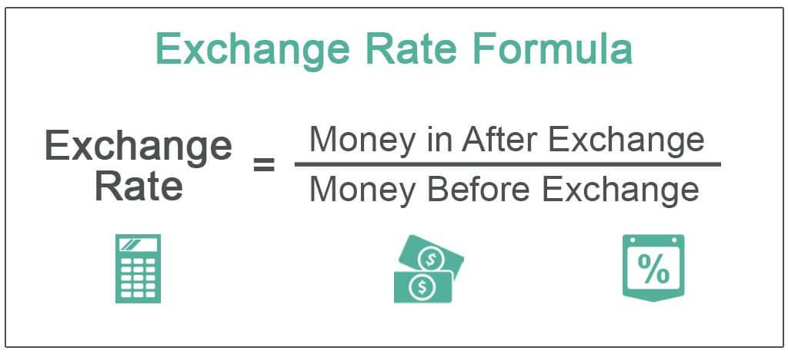

In today's global economy, understanding the dynamics of currency exchange rates is crucial, as they affect international trade, investment, and economic stability. Exchange rates determine how much one currency is worth in terms of another, influencing the global flow of goods, services, and capital. This article explores the key aspects of the dollar value exchange rate and its significance in algorithmic trading, where technology plays a vital role in enhancing trading accuracy and efficiency.

The dollar, as the world's primary reserve currency, exerts a considerable influence on global financial markets. Its exchange rate against other currencies affects economic decision-making for businesses, investors, and policymakers worldwide. Consequently, fluctuations in the dollar's value can have widespread and profound impacts on global economic conditions.



Algorithmic trading is revolutionizing foreign exchange by using computer algorithms to execute trades at lightning speed and with high precision. This method leverages real-time data analysis to identify profitable trading opportunities and execute transactions automatically without human intervention. The adoption of algorithmic trading has resulted in greater liquidity and narrower spreads in currency markets, making forex trading more efficient and accessible.

Moreover, algorithmic trading aids in managing the complexities of currency conversion. By analyzing market sentiment and economic conditions, it provides accurate and up-to-date currency valuations, facilitating effective trading strategies. In the context of currency conversion, platforms like 3Commas offer tools that enable traders to access live currency rates and execute trades seamlessly, illustrating the transformative role of technology in modern currency markets.

Understanding the intricacies of the dollar value exchange rate and the innovative role of algorithmic trading is essential for anyone participating in the foreign exchange market. As technology continues to advance, staying informed about these developments can give traders a competitive edge, ensuring they are well-equipped to navigate the ever-evolving global economy.

## Table of Contents

## Understanding Dollar Value and Exchange Rates

The dollar rate is fundamentally the comparison of a currency's exchange value to the U.S. dollar, often serving as a benchmark for gauging the relative strength of global currencies. Exchange rates are dynamic and influenced by a multitude of factors, including supply and demand dynamics, international investor activities, and government policies.

Supply and demand for a currency are crucial determinants of exchange rates. When a currency is in high demand, its value increases relative to other currencies. Conversely, if there is an oversupply, its value decreases. This relationship is dictated by the economic principle of scarcity, where the limited availability of a currency relative to its demand enhances its value.

International investors play a significant role in currency fluctuations. Large-scale cross-border investments or divestments can lead to significant shifts in the exchange rate. For instance, if foreign investors buy significant quantities of U.S. dollars to purchase U.S. assets, the demand for dollars increases, potentially increasing its value.

Government policies, particularly monetary policies enacted by central banks, can have profound impacts on the exchange rate. Central banks may adjust the supply of their currency in the market through various mechanisms, such as open market operations or changing interest rates. For example, by increasing interest rates, a central bank can attract foreign capital, thereby increasing demand for its currency and potentially enhancing its exchange rate. Conversely, lowering interest rates may lead to a depreciation of the currency due to reduced investor interest.

A formula often used to express the exchange rate can be denoted as:

$$
E = \frac{D}{S}
$$

where $E$ represents the exchange rate, $D$ is the demand for the currency, and $S$ is the supply of the currency.

The interplay of these factors makes exchange rate prediction a complex task, often requiring sophisticated models and tools in financial practices such as [algorithmic trading](/wiki/algorithmic-trading). Understanding these dynamics is essential for policymakers and traders alike in managing economic stability and optimizing trading strategies.

## Currency Conversion Mechanisms

Currency conversion involves exchanging one currency for another at a specified exchange rate. This rate is primarily influenced by economic conditions and market sentiment. The dynamics of these conversions are critical in global trade as they determine the amount of one currency that must be exchanged to obtain another.

The exchange rate itself is the price at which one currency can be exchanged for another and is typically expressed as a ratio. If $\text{USD/EUR} = 0.85$, it means that 1 U.S. dollar is equivalent to 0.85 euros. Exchange rates fluctuate based on multiple factors such as inflation rates, interest rates, political stability, economic performance, and speculative activities in the [forex](/wiki/forex-system) market.

A critical component of currency conversion is the role played by financial platforms in facilitating these transactions. Platforms like 3Commas offer live currency conversion features, enabling users to monitor and execute conversions with real-time data. The precision accorded by such platforms ensures that traders and investors can make informed decisions based on the latest market conditions.

Moreover, automated tools and algorithms play a significant role in currency conversion, especially in the context of forex trading. These tools rely on complex algorithms to predict currency trends, ensuring that conversions are executed at favorable rates. Python, a favored language in financial software development, can be used to create such algorithms. Below is a basic example for getting live exchange rates using Python:

```python
import requests

def get_exchange_rate(base_currency, target_currency):
    api_url = f"https://api.exchangerate-api.com/v4/latest/{base_currency}"
    response = requests.get(api_url)
    data = response.json()
    rate = data["rates"].get(target_currency)
    return rate

# Example usage
base_currency = "USD"
target_currency = "EUR"
rate = get_exchange_rate(base_currency, target_currency)
print(f"1 {base_currency} is equal to {rate} {target_currency}")
```

This script fetches live exchange rates from an API, providing users with up-to-date conversion rates for making informed financial decisions. The ability to fetch and utilize real-time data is a testament to how technology enhances the accuracy and reliability of currency conversions, thus underscoring the importance of both economic acumen and technological adaptation in today's financial landscape.

## Algorithmic Trading in Currency Markets

Algorithmic trading employs sophisticated algorithms to automate trading decisions utilizing real-time market data. This approach is particularly impactful in the foreign exchange (forex) markets, where timely identification of profitable opportunities is crucial. By leveraging algorithmic trading, traders can systematically analyze exchange rate fluctuations, thereby enhancing their ability to make informed trading decisions.

Forex markets exhibit high [volatility](/wiki/volatility-trading-strategies) with exchange rates being influenced by numerous factors such as economic indicators and geopolitical events. Algorithmic trading systems are designed to evaluate these variables rapidly and execute trades based on predefined criteria. These algorithms can process vast amounts of data at speeds unattainable by human traders, allowing for the identification of even the most subtle market trends. 

Python, commonly used in algorithmic trading, provides libraries like NumPy and pandas for data analysis, and tools such as the `statsmodels` library for statistical modeling. For instance, a basic moving average crossover strategy can be implemented as a simple algorithm to signal trading decisions when short-term and long-term moving averages intersect.

```python
import pandas as pd

def moving_average_crossover(data, short_window, long_window):
    data['short_mavg'] = data['price'].rolling(window=short_window, min_periods=1, center=False).mean()
    data['long_mavg'] = data['price'].rolling(window=long_window, min_periods=1, center=False).mean()

    data['signal'] = 0.0
    data['signal'][short_window:] = np.where(data['short_mavg'][short_window:] 
                                              > data['long_mavg'][short_window:], 1.0, 0.0)
    data['positions'] = data['signal'].diff()
    return data
```

Platforms like 3Commas provide tools including trading bots to facilitate algorithmic trading. These bots can execute algorithms continuously, monitor multiple currency pairs concurrently, and automate repetitive trading tasks, thus saving time and reducing errors associated with manual trading. By offering customizable features, 3Commas enables users to build and test their own trading strategies or adopt pre-configured options to enhance their trading operations.

In sum, algorithmic trading in currency markets empowers traders with the ability to execute rapid and precise trades, capitalizing on fleeting opportunities in an ever-shifting forex landscape.

## Benefits of Algo Trading in Forex

Algorithmic trading, often referred to as algo trading, has transformed the landscape of foreign exchange (forex) markets by leveraging computer algorithms to execute trades. This transformation provides several critical advantages that sharpen trading precision and efficiency.

One of the primary benefits of algo trading is the ability to execute orders at optimal prices. By using pre-programmed instructions based on price, timing, and [volume](/wiki/volume-trading-strategy), algorithms eliminate the influence of human emotions and errors. This precision ensures that trades are executed at the most favorable prices as quickly as market conditions allow. For instance, algorithms can instantly capitalize on [arbitrage](/wiki/arbitrage) opportunities that involve minute price differences in currency pairs across different platforms, which would be imperceptible to a human trader.

Risk management is another significant benefit facilitated by algo trading. Through the automation of stop-loss and take-profit orders, traders can effectively manage their risk exposure in volatile forex markets. These orders are executed automatically when certain conditions are met, safeguarding investments against rapid market shifts. For example, a stop-loss order can be set to sell a currency pair when it reaches a specific price, thereby limiting the potential loss. The Python snippet below demonstrates a basic implementation of such a function:

```python
def execute_trade(current_price, stop_loss, take_profit):
    if current_price <= stop_loss:
        return "Sell to prevent loss"
    elif current_price >= take_profit:
        return "Sell to take profit"
    else:
        return "Hold"

# Example usage
trade_action = execute_trade(current_price=1.105, stop_loss=1.100, take_profit=1.110)
print(trade_action)  # Output will vary based on current price
```

High-speed processing is intrinsic to algorithmic trading, facilitating rapid execution and settlement of trades. The ability to process extensive market data, analyze trends, and execute trades in fractions of a second offers a competitive advantage in the fast-paced forex environment. This immediacy is crucial for capturing transient market opportunities and reducing the market impact costs associated with considerable trade volumes. 

Moreover, the use of advanced computational methods, such as [machine learning](/wiki/machine-learning) techniques in algorithmic trading, enhances predictive accuracy. Algorithms can analyze historical data to predict future price movements, allowing traders to devise more sophisticated strategies. However, successful algorithm-based systems require continuous testing and adaptation to changing market conditions to optimize performance and maintain profitability. 

In summary, algorithmic trading in forex markets delivers numerous benefits that include optimal pricing, enhanced risk management, and robust processing capabilities, all of which contribute to more effective and efficient trading practices.

## Factors Influencing Dollar Rate and Forex Trading

The dollar exchange rate is subject to a variety of influences that can cause significant fluctuations in value. Key among these influences are economic indicators, geopolitical tensions, and market speculation.

Economic indicators such as inflation rates, unemployment figures, and gross domestic product (GDP) growth are critical in determining a country's economic health and, consequently, its currency value. For example, higher inflation in a country leads to a depreciation of its currency relative to others, including the U.S. dollar, as it erodes purchasing power. Interest rates also play a pivotal role; currencies from countries with higher interest rates tend to have higher values, as they offer better returns on investments denominated in that currency.

Geopolitical tensions can lead to increased volatility in currency markets. Political instability, conflicts, or changes in government policies can undermine investor confidence, prompting capital flight to safer assets such as the U.S. dollar. These situations can lead to abrupt shifts in exchange rates as traders seek to mitigate risk. 

Market speculation, driven by traders' expectations of future movements in exchange rates, can create short-term imbalances in currency values. Speculators analyze economic data releases and central bank announcements to predict rate changes. Their activities can lead to self-fulfilling prophecies if a large number of traders act on similar expectations. 

For algorithmic traders, these factors must be carefully considered when developing and optimizing trading strategies. Algorithms can be programmed to respond to certain economic indicators or news events, automating decision-making and execution processes. However, the dynamic nature of forex markets means that continuous analysis and adjustment of algorithms are vital. 

Traders can implement models that incorporate these variables to forecast future movements accurately. Python, popular in financial analysis, can be utilized to backtest trading strategies against historical data, ensuring robustness under different market conditions. Here's a brief example of using Python to analyze currency movements:

```python
import pandas as pd
import numpy as np
import statsmodels.api as sm

# Load historical exchange rate data
data = pd.read_csv('forex_data.csv')

# Economic indicators
indicators = data[['interest_rate', 'inflation_rate', 'gdp_growth']]

# Add a constant to the model (intercept)
indicators = sm.add_constant(indicators)

# Log currency returns as the dependent variable
log_returns = np.log(data['exchange_rate']).diff().dropna()

# Fit regression model
model = sm.OLS(log_returns, indicators[:-1]).fit()
print(model.summary())
```

This code snippet demonstrates how traders might statistically tie exchange rate movements to economic indicators, providing a foundation for developing more sophisticated trading algorithms. Such continuous refinement is necessary to maintain a competitive edge and trading success amidst evolving market dynamics.

## Conclusion

Understanding the dollar value exchange rate is crucial for both currency conversion and algo trading strategies. The exchange rate serves as a critical metric for assessing the relative value of one currency against the U.S. dollar. Fluctuations in this rate impact the cost of trading goods and services internationally, and they consequently influence global economic stability. 

Algorithmic trading, a prominent technological advance, is revolutionizing the forex market by enhancing precision and efficiency in trading operations. Algorithms can process vast datasets quickly, identifying patterns and executing trades faster than humanly possible. This technology enables traders to make more informed decisions based on real-time market trends, thus optimizing their trading strategies. For example, sophisticated algorithms can be programmed to respond to specific market signals, executing trades automatically when certain conditions are met.

Staying informed about market conditions, including economic indicators and geopolitical events, is essential for maximizing the benefits of algorithmic trading in forex. The integration of advanced technologies like machine learning and [artificial intelligence](/wiki/ai-artificial-intelligence) further enhances the capability of algorithms to adjust trading strategies in response to market dynamics. By continuously refining algorithms based on current data, traders can maintain a competitive edge and improve the probability of successful trades.

In conclusion, the synergy between understanding the dollar exchange rate and leveraging technological advancements in algorithmic trading is pivotal for success in the forex market. The ability to quickly adapt to market shifts and refine trading models is an invaluable asset in achieving long-term profitability. Embracing these tools and staying abreast of technological progress enables traders to navigate the complexities of the forex market effectively.

## References & Further Reading

[1]: Bergstra, J., Bardenet, R., Bengio, Y., & Kégl, B. (2011). ["Algorithms for Hyper-Parameter Optimization."](https://dl.acm.org/doi/10.5555/2986459.2986743) Advances in Neural Information Processing Systems 24.

[2]: ["Advances in Financial Machine Learning"](https://www.amazon.com/Advances-Financial-Machine-Learning-Marcos/dp/1119482089) by Marcos Lopez de Prado

[3]: ["Evidence-Based Technical Analysis: Applying the Scientific Method and Statistical Inference to Trading Signals"](https://www.amazon.com/Evidence-Based-Technical-Analysis-Scientific-Statistical/dp/0470008741) by David Aronson

[4]: ["Machine Learning for Algorithmic Trading"](https://github.com/stefan-jansen/machine-learning-for-trading) by Stefan Jansen

[5]: ["Quantitative Trading: How to Build Your Own Algorithmic Trading Business"](https://www.amazon.com/Quantitative-Trading-Build-Algorithmic-Business/dp/1119800064) by Ernest P. Chan